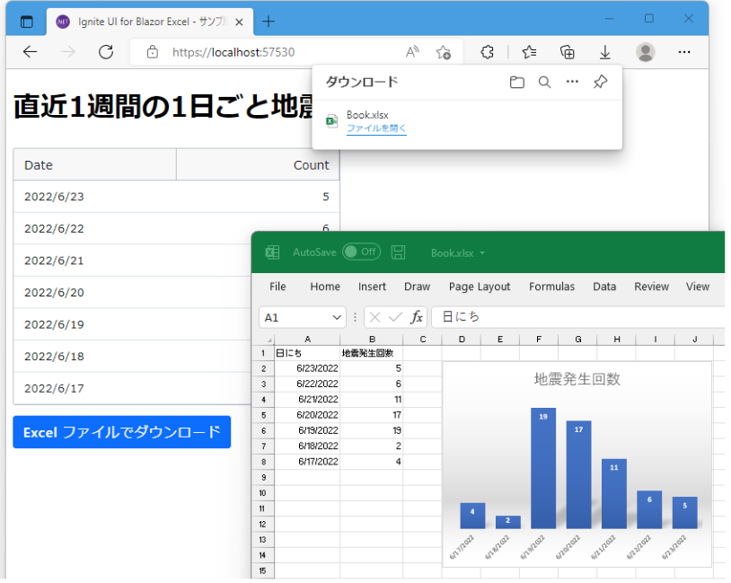

# Blazor Webassembly: How To Read & Write Excel Files To Reduce Server Load

The [Infragistics Blazor Excel Library](https://www.infragistics.com/products/ignite-ui-blazor/blazor/components/excel-library) makes it easy to handle Blazor export to Excel and represent your app data in an Excel spreadsheet, transfer data from Excel to your app, and manage spreadsheet data with Microsoft® Excel-like spreadsheet features and objects like Workbook, Worksheet, Cell, Formula, and so on.

When you use the Infragistics Blazor Excel library on your [Blazor WebAssembly application](https://www.infragistics.com/products/ignite-ui-blazor/blazor/components/general-getting-started-blazor-client), it allows you to generate and download Excel-formatted files (.xlsx) on your web browser with ease. Generating an Excel file this way ensures the load of the Excel generation process is not concentrated on the web server side. Instead, the processing happens on the web browser.

This article will guide you through the easiest ways to implement Blazor Excel library and will demonstrate how it all works by creating a sample application. 

Topics to be covered:
* What is Blazor?
* Creating a Blazor WebAssembly sample app
* Implementation steps and project structure overview
    - Adding NuGet package
    - Adding a reference to a JavaScript file
    - Workbook.InProcessRuntime - setting static property
    - Reading and writing Excel files using the Workbook class
* What to do if the process takes too long
* How does "lazy loading of assembly" improve the initial app speed
* Summary

## Blazor in a Nutshell: Understanding WebAssembly and Blazor Server

In short, [Blazor](https://www.infragistics.com/products/ignite-ui-blazor/blazor/components/general-getting-started) is an open source, cross-platform UI framework developed by Microsoft. It is used for building single-page web apps with .NET and C# instead of JavaScript. There are two ways to host web applications: [Blazor Server and Blazor WebAssembly](https://www.infragistics.com/community/blogs/b/jason_beres/posts/blazor-server-vs-blazor-webassembly).

Blazor WebAssembly, also known as WASM, is a standard developed by the [W3C](https://www.computerhope.com/jargon/w/w3c.htm) for creating software that runs in the web browser. It is compiled software that runs at near-native speeds on your CPU.

Blazor Server, on the other hand, runs the client logic on the server, using a standard ASP.NET Core application. This app communicates with the browser through a constant connection using SignalR.

## How To Create a Blazor WebAssembly App With Ignite UI for Blazor

To demonstrate how it all works, we will create a Blazor WebAssembly application that will obtain data from the [Japan Meteorological Agency in an XML format](https://www-data-go-jp.translate.goog/data/dataset/mlit_20170902_0034/resource/de72cea0-a658-4c64-987c-38effeca3eb8?_x_tr_sl=ja&_x_tr_tl=en&_x_tr_hl=ja&_x_tr_pto=wapp). For the purpose of this article, we included a bar chart in the downloaded Excel file, containing the number of daily earthquakes that occurred in the course of 7 days.



The source code of this sample application is published on [this GitHub repository](https://github-com.translate.goog/igjp-sample/IgbExcelDemo?_x_tr_sl=ja&_x_tr_tl=en&_x_tr_hl=ja&_x_tr_pto=wapp).

## Implementation Steps and Project Structure Overview

Due to the Cross-Origin Resource Sharing (CORS), we use the Blazor WebAssembly project hosted on the ASP.NET Core server to acquire the whole data, instead of the standalone Blazor WebAssembly project.

However, as mentioned at the beginning, the Excel file generation is completed and processed in the web browser. The ASP.NET Core server side is only required to obtain and process the JMA disaster prevention information XML and provide the data in JSON format to the Blazor WebAssembly program running on the web browser.
Also, there is no need to generate a completely new Excel file in the code - simply place an Excel file (.xlsx) on the web server. It will be used as a "template" with a bar chart configured in advance. Then, use the HttpClient on the Blazor WebAssembly app and fill each cell in the Excel file with the date and number of earthquakes. 

After implementing the number of daily earthquake occurrences for the last 7 days, all the data will be displayed in the Ignite UI for Blazor grid. Next, follow the steps below to proceed with the Excel file generation.

### Adding NuGet Package

In order to use the Blazor excel library, you need to add the following @using statement:

```razor
@using Infragistics.Documents.Excel
```

If you are using Visual Studio, you can add the NuGet "IgniteUI.Blazor.Documents.Excel" package to your Blazor WebAssembly project through the NuGet package manager.

To simplify the namespace description in the code described later, we will open the Infragistics.Documents.Excel namespace of the Infragistics Blazor Excel library in _Imports.razor in advance.

```razor
@ * _Imports.razor * @
@ using System.Net.Http
@ using Infragistics.Documents.Excel @ * 👈 Add this line * @
```

### Adding a Reference to a JavaScript File

Next, the JavaScript files provided by the NuGet "IgniteUI.Blazor.Documents.Excel" package must be loaded on the web page so that the Infragistics Blazor Excel library can work with Excel files on Blazor WebAssembly.

In the wwwroot/index.html file (the fallback page in the Blazor WebAssembly project) we add a `<script>` tag as follows:

```razor
....
<script src = "_content/IgniteUI.Blazor/app.bundle.js"></script>
<!-👇 Add this line->
<script src = "_content/IgniteUI.Blazor.Documents.Excel/excel.js"></script>
<script src = "_framework/blazor.webassembly.js"></script> </body></ html>
```

### Workbook.inprocessruntime - Setting Static Property

You are now ready to use the Infragistics Blazor Excel library. Use the Workbook class in the Infragistics.Documents.Excel namespace to read and write Excel files. Keep in mind that before you can process an Excel file using the Workbook class on Blazor WebAssembly, you must set the Workbook.InProcessRuntime static property to a JavaScript runtime object with the IJSInProcessRuntime interface.

This can be done by using the following code:

```razor
@inject IJSRuntime JSRuntime
...
@code {
    ...
    // ⚠️ Note-To use the Excel library on Blazor WebAssembly,
    // you need to initialize the Workbook.InProcessRuntime static property.
    if (Workbook.InProcessRuntime == null )
    Workbook.InProcessRuntime = this .JSRuntime as IJSInProcessRuntime;
    ...
```

### Reading and Writing Excel Files Using the Workbook Class

Once you're ready, you can use the Workbook class's Load() static method to load the Excel file and use the returned Workbook object to reference sheet and cell objects and fill them with values. After creating the Excel table, you can finally write the content as an Excel file using the object's methods. Use the Workbook object's Save() method to write the content of the Excel file to a Stream. Write the content to a .NET MemoryStream to obtain a byte array, which can then be downloaded through the browser.

Note that the download triggering process on Blazor applications used an MIT-licensed OSS library.

```razor
@inject HttpClient HttpClient
@inject IJSRuntime JSRuntime
...
@code
{
    ...
    private IEnumerable <EarthquakeCountParDay>? _EarthquakeCountParDays;
    ...
    // <summary>
    // Called when the [Download] button is clicked, the data of the number of earthquake occurrences per day in the last week is stored in an Excel file and downloaded.
    // </summary>  
    private async Task OnClickedDownloadAsync()
    {
        // ⚠️ Note-To use the Excel library on Blazor WebAssembly, you need to initialize the Workbook.InProcessRuntime static property.
        if (Workbook.InProcessRuntime == null) Workbook.InProcessRuntime = this .JSRuntime as IJSInProcessRuntime;

        // Get the template Excel file from the server and load it into the Workbook object.
        await using var templateStream = await this .HttpClient.GetStreamAsync ("./TemplateBook.xlsx");

        var workBook = Workbook.Load(templateStream);
        await templateStream.DisposeAsync();

        // Post the date and number of earthquakes to the contents (cells) of the sheet.
        var sheet = workBook.Worksheets[0];
        var row = 2;
        foreach (var item in this._EarthquakeCountParDays)
        {
            sheet.GetCell ($"A{row}").Value = item.Date;
            sheet.GetCell ($"B{row}").Value = item.Count;
            row++;
        }

        // Export the completed Workbook object to a .xlsx file format and have it downloaded by your browser.
        await using var memStream = new MemoryStream();
        workBook.Save (memStream);
        await this.JSRuntime.InvokeDownloadAsync("Book.xlsx", "application / octet-stream" ,memStream.ToArray());
    }
    ...
```

As you can see, the entire processing of the Excel file is performed on the Web browser and nothing happens on the Web server side.  Therefore, even if several clients execute the Excel file generation at the same time, the load on the Web server side will not increase rapidly.

## What To Do if the Process Takes Too Long?

Processing an Excel file may take a considerable amount of time depending on:

* the content
* the scale of the data you want to handle
* the number of cells and so on

In terms of Blazor WebAssembly applications where .NET code is processed in an interpreted manner, the processing performance is significantly degraded. Here are some useful ways to help you improve the processing speed in such cases.

### Tips and Tricks #1 - Pause the automatic calculation of formulas

Тhe Infragistics Blazor Excel library lets you pause the automatic calculation of formulas in order to improve the processing speed when browsing or rewriting cells in an Excel file on a Blazor WebAssembly application. For more information, please refer to the INFRAGISTICS Knowledge Base (link below).

### Tips and Tricks #2 - Use Ahead-Of-Time (AOT) compilation

Starting with .NET 6, you can use a technique called "Ahead-Of-Time (AOT) compilation" to build Blazor WebAssembly apps. This technique allows you to speed up the processing by compiling .NET code directly into WebAssembly when you publish your Blazor app. For more information on AOT compilation, please refer to the official Microsoft documentation site linked below.

### Tips and Tricks #3 - Run on the server side

Unlike Blazor WebAssembly, where .NET code is processed sequentially in an interpreted manner, the Infragistics Blazor Excel library runs on a Blazor Server or ASP.NET Core server at CPU-native speed with the Just-in-time (JIT) compiler. This ensures a significant improvement in the processing speed. 

Of course, you can rewrite the entire application from Blazor WebAssembly to Blazor Server, or you can do it by replacing only the Excel file generation processing part with the Web API of the ASP.NET Core server, while keeping the Blazor WebAssembly application as is.

## The Ways “Lazy Loading of Assembly” Improves Initial Speed of Application

The assembly file (.dll) provided by the Infragistics Blazor Excel library is approximately 5 MB in size. If the content size increases at the first launch, it may lead to a slowdown in the content loading time and the initial speed time until the Blazor WebAssembly application starts operating.


That’s why we suggest using the "delayed loading of assembly" technique (in .NET 5 or following versions). You will be able to improve the Blazor WebAssembly application launch performance by waiting for the application assembly to load until it is needed. This is called "lazy loading".

## Setting Up Lazy Loading

### Specify the assembly to be lazy loaded in the project file

First, in the Blazor WebAssembly project file (.csproj), arrange the <BlazorWebAssemblyLazyLoad> elements inside the <ItemGroup> elements and list the names of the assembly files (.dll) that you want to lazy load.

```razor
<!-Blazor WebAssembly project file (.csproj)->
<Project Sdk = "Microsoft.NET.Sdk.BlazorWebAssembly" >
  ...
  <!-Specify the file name of the assembly file (.dll) that you want to lazy load in the BlazorWebAssemblyLazyLoad element. ->  
  <ItemGroup>
    <BlazorWebAssemblyLazyLoad Include = "IgniteUI.Blazor.Documents.Core.dll" /> 
    <BlazorWebAssemblyLazyLoad Include = "IgniteUI.Blazor.Documents.Excel.dll" />
  </ItemGroup>
  ...
</ Project>
```

### Load the assembly using LazyAssemblyLoader

Next, implement the assembly specified as "lazy loading" so that it will be loaded automatically when there’s a need for it. To load the assembly, inject the service of the class that comes standard with Blazor WebAssembly LazyAssemblyLoader from the DI container and call its LoadAssembliesAsync() [asynchronous method](https://www.infragistics.com/community/blogs/b/infragistics/posts/angular-async-await).


In this sample application, the assembly file of the Infragistics Blazor Excel library is loaded when the download button of the Excel file is clicked.

```razor
@ using Microsoft.AspNetCore.Components.WebAssembly.Services
...
@inject LazyAssemblyLoader AssemblyLoader
@code {
    ... 
    // <summary>  
    // Called when the [Download] button is clicked, the data of the number of earthquake occurrences per day in the last week is stored in an Excel    file and downloaded.  
    // </summary>  
    private async Task OnClickedDownloadAsync() 
    {
        // The assembly file (.dll) for which lazy loading was specified in the project file (IgbExcelDemo.Client.csproj) is now loaded using AssemblyLoader.  
        // (Supplement: It's okay to call it over and over again, only .dlls that haven't been loaded yet will be loaded)  
        await this.AssemblyLoader.LoadAssembliesAsync(new [])
        {
            "IgniteUI.Blazor.Documents.Core.dll",
            "IgniteUI.Blazor.Documents.Excel.dll" 
        });
    ...
```

### Separate the processing of the lazy loaded assembly into another scope

Now, if you try running this sample application as it is, you can see that the assembly file of the Infragistics Blazor Excel library is not loaded as expected when the page is displayed for the first time. Also, the content size is reduced by about 5MB.


However, when clicking the download button, we get a "System.IO.FileNotFoundException: Could not load file or assembly" exception.

This exception occurs when a method that references a type that exists in the assembly being lazy-loaded is attempting to resolve a type in the scope of the same method that is doing the lazy-loading, but the assembly has not yet been loaded. To work around this issue, the processing that references a type which exists in the assembly being lazy-loaded (such as the Workbook class in this sample application) should be cut out into a separate, independent method and then called (see below). See below:

```razor
...
@code {
    ... 
    // <summary>  
    // Called when the [Download] button is clicked, the data of the number of earthquake occurrences per day in the last week is stored in an Excel file and downloaded.
    // </summary>  
    private async Task OnClickedDownloadAsync() 
    {
        ...
        await this .AssemblyLoader.LoadAssembliesAsync ( new [] ) 
        {
            "IgniteUI.Blazor.Documents.Core.dll", 
            "IgniteUI.Blazor.Documents.Excel.dll"
        });
        // Lazy load the assembly, then call the method that uses the features in the lazy loaded assembly.
        // (If you refer to a function in a lazy-loaded assembly directly in a method that lazy-loads an assembly,
        // System.IO.FileNotFoundException: Could not load file or assembly exception will occur.)
        Await this.DownloadAsExcelAsync(); 
    }
    // <summary>  
    // Cut out the code that uses the Excel library into a separate method to enable lazy loading of the assembly.
    // </summary>  
    private async ValueTask DownloadAsExcelAsync ()
    {
        // Read and write Excel files using the Workbook class in this method
    }
    ...
```

## Summary and Key Article Takeaways

Using the Infragistics Blazor Excel library on your Blazor WebAssembly application is the easiest and simplest way to read and write Excel files completely on the web browser. But what’s even better, we managed to show you how to reduce the load time on your web server with it.

This article also included several options for improving the processing speed by:

* Pausing the automatic calculation of formulas.
* Using Ahead-Of-Time (AOT) compilation.
* Running on the server side.
* Specifying “lazy loading of assembly."