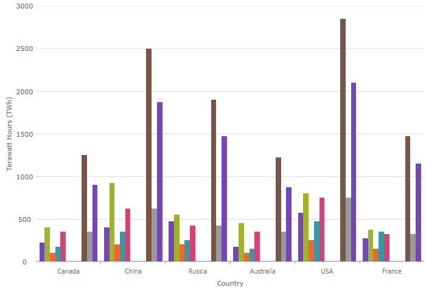

# $PlatformShort$ Chart

The $PlatformShort$ category chart component make it easy to organize and visualize category data . The $PlatformShort$ control simplifies the complexities of the data visualization domain into manageable API.

## Demo

<div class="sample-container loading" style="height: 500px">
    <iframe id="category-chart-overview-iframe" src='{environment:dvDemosBaseUrl}/charts/category-chart-overview' width="100%" height="100%" seamless frameBorder="0" onload="onXPlatSampleIframeContentLoaded(this);"></iframe>
</div>

<div>
    <button data-localize="stackblitz" disabled class="stackblitz-btn"   data-iframe-id="category-chart-overview-iframe" data-demos-base-url="{environment:dvDemosBaseUrl}">View on StackBlitz
    </button>
<sample-button src="charts/category-chart/overview"></sample-button>

</div>

<div class="divider--half"></div>

 A user can bind a collection of data, a group of collections, and a data property and let the charting control do the rest. The $PlatformShort$ component will analyze the data and automatically choose the best chart type to represent the data.

By using a smart Data Adapter, the data is analyzed and the appropriate visualization is rendered. For example, if the `ChartType` property is set to `Auto`, the control will use a column chart for a small data sets or a line chart for larger data sets.

However, you can also explicitly specify the chart type by setting the `ChartType` to:

- `Line`
- `Area`
- `Column`
- `Point`
- `Spline`
- `SplineArea`
- `StepArea`
- `StepLine`
- `Waterfall`

Another example of the intuitive behavior of the $PlatformShort$ category chart component is that you do not need to explicitly set the labels. The category chart will use the first appropriate string property that it finds within the data you provided and will use that for the labels.

<!-- Angular, React, WebComponents -->
## Dependencies
When installing the $PlatformShort$ chart package, the core package must also be installed.

<pre style="background:#141414;color:white;display:inline-block;padding:16x;margin-top:10px;font-family:'Consolas';border-radius:5px;width:100%">
npm install --save {PackageCore}
npm install --save {PackageCharts}
</pre>
<!-- end: Angular, React, WebComponents -->

## Required Modules

<!-- Blazor -->
The `CategoryChart` requires the following modules<!-- Angular, React, WebComponents -->.<!-- end: Angular, React, WebComponents --><!-- Blazor --> to be registered in the AddIgniteUIBlazor extension method in your application entry point:

* CategoryChartModule

<!-- end: Blazor -->

<!-- Angular, React, WebComponents -->
```ts
// app.module.ts
import { IgxCategoryChartModule } from 'igniteui-angular-charts';

@NgModule({
    imports: [
        // ...
        IgxCategoryChartModule,
        // ...
    ]
})
export class AppModule {}
```

```ts
import { IgrCategoryChartModule } from 'igniteui-react-charts';

IgrCategoryChartModule.register();
```

```ts
import { ModuleManager } from 'igniteui-webcomponents-core';
import { IgcCategoryChartModule } from 'igniteui-webcomponents-charts';

ModuleManager.register(
    IgcCategoryChartModule
    );
```
<!-- end: Angular, React, WebComponents -->

It's also possible to load a more minimal configuration of category chart whereby it can only load a subset of the possible series, and exclude other optional features by instead loading the `Ig$CategoryChartCoreModule`, and the dynamic module for the series in question, e.g. `Ig$LineSeriesDynamicModule`. If the `ChartType` is `Auto`, it wil make sure to select a series type that has been loaded.

<div class="divider--half"></div>

## Usage
Now that the category chart module is imported, next step is to bind it to data.

In order to create $PlatformShort$ category chart component, you must first have data to bind it to. The following code snippet demonstrates how to create a simple data source.

```ts
var data = [
 { "CountryName": "China", "Pop1995": 1216, "Pop2005": 1297, "Pop2015": 1361, "Pop2025": 1394 },
 { "CountryName": "India", "Pop1995": 920, "Pop2005": 1090, "Pop2015": 1251, "Pop2025": 1396 },
 { "CountryName": "United States", "Pop1995": 266, "Pop2005": 295, "Pop2015": 322, "Pop2025": 351 },
 { "CountryName": "Indonesia", "Pop1995": 197, "Pop2005": 229, "Pop2015": 256, "Pop2025": 277 },
 { "CountryName": "Brazil", "Pop1995": 161, "Pop2005": 186, "Pop2015": 204, "Pop2025": 218 }
];

```

```razor
public class Country
{
    public string CountryName { get; set; }
    public int Pop1995 { get; set; }
    public int Pop2005 { get; set; }
    public int Pop2015 { get; set; }
    public int Pop2025 { get; set; }
}

public static class CountryData
{
    public static List<Country> Create()
    {
        var countries = new List<Country>();
        Country china = new Country
        {
            CountryName = "China",
            Pop1995 = 1216,
            Pop2005 = 1297,
            Pop2015 = 1361,
            Pop2025 = 1394
        };
        Country india = new Country
        {
            CountryName = "India",
            Pop1995 = 920,
            Pop2005 = 1090,
            Pop2015 = 1251,
            Pop2025 = 1396
        };
        Country usa = new Country
        {
            CountryName = "United States",
            Pop1995 = 266,
            Pop2005 = 295,
            Pop2015 = 322,
            Pop2025 = 351
        };
        Country indonesia = new Country
        {
            CountryName = "Indonesia",
            Pop1995 = 197,
            Pop2005 = 229,
            Pop2015 = 256,
            Pop2025 = 277
        };
        Country brazil = new Country
        {
            CountryName = "Brazil",
            Pop1995 = 161,
            Pop2005 = 186,
            Pop2015 = 204,
            Pop2025 = 218
        };
        countries.Add(china);
        countries.Add(india);
        countries.Add(usa);
        countries.Add(indonesia);
        countries.Add(brazil);
        return countries;
    }
}
```

The following code demonstrates how to bind the category chart to the above data.

```razor

<CategoryChart DataSource="@DataSource"
    Width="700px"
    Height="500px"/>

@code {
    private List<Country> DataSource;

    protected override void OnInitialized()
    {
        base.OnInitialized();

        CategoryChartModule.Register(IgniteUIBlazor);
        this.DataSource = CountryData.Create();
    }
}
```

```html
 <igx-category-chart [dataSource]="data"
                     width="700px"
                     height="500px">
 </igx-category-chart>
```

```tsx
 <IgrCategoryChart dataSource={this.state.data}
                   width="700px"
                   height="500px" />
```

```html
 <igc-category-chart id="chart"
                     width="700px"
                     height="500px">
 </igc-category-chart>
```

```ts
let chart = (document.getElementById("chart") as IgcCategoryChartComponent);
chart.dataSource = data;
```

<div class="divider--half"></div>

## Chart Types
You can override the default behavior of the category chart and set which type of chart should be displayed. This is done by setting the `ChartType` property.
Below are listed all of the types that the $PlatformShort$ category chart supports.

> [!NOTE]
> Special case is the `Auto` setting of that property. If `Auto` is used the chart will analyze assigned data and will assign the most suitable chart type.

## Supported Chart Types
Type|Description and Preview
---|---
`Auto`|Specifies automatic selection of chart type based on suggestions from built-in data adapter that analyzes data source bound to the chart.
`Line`|Specifies category line chart with markers at each data point. 
`Area`|Specifies category area chart. 
`Column`|Specifies category column chart with vertical rectangles at each data point. 
`Point`|Specifies category point chart with markers at each data point. 
`StepLine`|Specifies category step line chart. 
`StepArea`|Specifies category step area chart. 
`Spline`|Specifies category spline line chart with markers at each data point. 
`SplineArea`|Specifies category spline area chart. 
`Waterfall`|Specifies category waterfall chart. 

