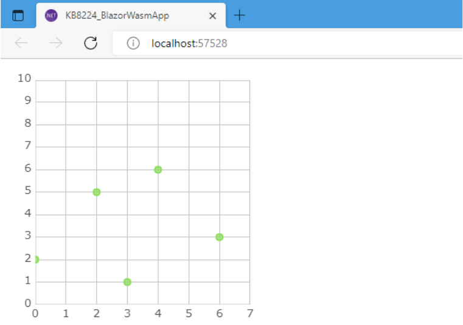
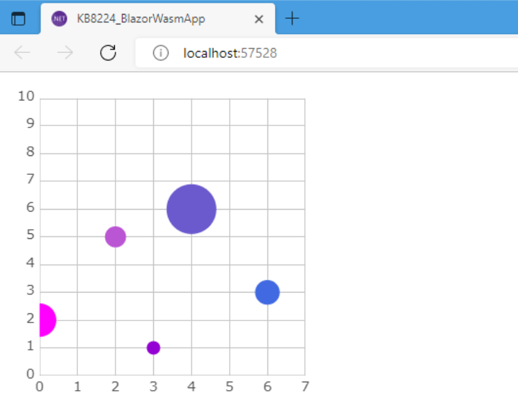

# How To Customize Marker Display in Blazor Charts

In this quick how-to article, we will explain how to use the marker display customization function with Ignite UI for Blazor to display a scatter plot with markers of different sizes and fill colors depending on the properties of the bound items. For demonstration purposes, we will first create a sample Blazor app.

Contents of this article:

* [Customizing the display (drawing) of markers](#creating-a-sample-blazor-app-and-blazor-chart)
* [Creating a sample app with Blazor Chart](#creating-a-sample-blazor-app-and-blazor-chart)
* [Defining a factory function that returns a custom drawing object](#defining-a-factory-function-that-returns-a-custom-drawing-object-for-the-marker)
* [Implementing a measure method](#implementing-a-measure-method-for-the-markers-custom-drawing-object-in-the-blazor-chart)
* [Implementing a custom rendering object render method](#implementing-a-render-method-for-the-markers-custom-rendering-object)
* [Registering a factory function in Ignite UI](#registering-a-factory-function-in-the-ignite-ui-that-returns-a-custom-drawing-object-for-the-marker)
* [Specifying the "script name" in the series parameters](#specifying-the-script-name-in-the-series-parameters)
* [Conclusion – why Blazor is such a great framework](#in-conclusion)

Let’s get started with the customization of the marker display in Blazor Charts and Graphs.

## Creating a Sample Blazor App and Blazor Chart

To customize the display (drawing) of a marker based on the properties of the bound item, we create a JavaScript program that draws the marker, and specify the properties of the series that the marker should be drawn using this JavaScript program. A 2D context object of an HTML Canvas element is passed from the series to the JavaScript program responsible for drawing the marker.

Keep in mind that prior knowledge about drawing on JavaScript and HTML Canvas is required in order to customize the display (drawing) of the marker.

First, the type of sample data to be bound is the following record type. In addition to having properties such as XValue and YValue as the values ​​for the X-axis and Y-axis in the [Blazor Chart](https://www.infragistics.com/products/ignite-ui-blazor/blazor/components/charts/chart-overview), which are generally used in [Blazor Scatter chart type](https://www.infragistics.com/products/ignite-ui-blazor/blazor/components/charts/types/scatter-chart), we will also add:

* a "Double" type Volume property
* a "Color" property

The Volume property value of the Blazor Chart will be used as the size of the marker and the Color property value as the fill color of the marker.

```razor
public record SampleDataType (
    string Name,
    double XValue,
    double YValue,
    double Volume, // Set Shape 👈this property to the size of the marker,
    System.Drawing.Color // Shape 👈Refer to this property as the fill color
);
```

Using the above SampleDataType record type, prepare the sample data accordingly as shown below:

```razor
// In the @code block in the sample Razor component (.razor)
public IEnumerable <SampleDataType> DataSource { get ; } = new SampleDataType []
{
    new ( Name: "item1" , XValue: 0 , YValue: 2 , Volume: 5.7 , Color: System.Drawing.Color.Fuchsia ),
    new ( Name: "item2" , XValue: 2 , YValue: 5 , Volume: 3.6 , Color: System.Drawing.Color.MediumOrchid ),
    new ( Name: "item3" , XValue: 3 , YValue: 1 , Volume: 2.3 , Color: System.Drawing.Color.DarkViolet ),
    new ( Name: "item4" , XValue: 4 , YValue: 6 , Volume: 8.5 , Color: System.Drawing.Color.SlateBlue ),
    new ( Name: "item5" , XValue: 6 , YValue: 3 , Volume: 4.2 , Color: System.Drawing.Color.RoyalBlue ),
};
```

Then, bind the sample data to the IgbScatterSeries data source, provided in the separately prepared IgbDataChart.

```razor
@* In the markup in the sample Razor component (.razor) *@

<IgbDataChart Height="320px" Width="320px">
    <IgbNumericXAxis Name="xAxis" MinimumValue="0" MaximumValue="7"/>
    <IgbNumericYAxis Name="yAxis" MinimumValue="0" MaximumValue="10"/>
    <IgbScatterSeries DataSource="@DataSource"
        XMemberPath="XValue"
        YMemberPath="YValue"
        XAxisName="xAxis"
        YAxisName="yAxis"/>
</IgbDataChart>
```

Below you can see how the scatter plot is displayed.



Moving on to customization now. Let’s tweak the display of the markers to show the size and fill color based on the properties of the bound item (Volume and Color this time).

## Defining a Factory Function that Returns a Custom Drawing Object for the Marker

We must define a factory function that returns a JavaScript object with two methods - measure and render. This function is called from the Ignite UI toolbox each time a marker is drawn.

```razor
// in /wwwroot/customMarkerTemplateFunc.js
function customMarkerTemplateFunc() {
    return {
        measure: function (measureInfo) {},
        render: function (renderInfo) {}
   }
}
```

## Implementing a measure Method for the Marker’s Custom Drawing Object in the Blazor Chart
Ignite UI automatically calls this measure method every time the marker size is needed. At that time, the argument in the call to this measure method contains the JavaScript side representation of the data to be drawn in the .data.item field of the argument object.

In other words, the value of each property of the SampleDataType record type can be referenced from the argument when calling the measure method. This way, the size of the marker is calculated based on the specific value and the call from the Ignite UI is answered.

As a result, when calling this method the width and height of the marker (both in px) are set in the width and height fields of the argument.

```razor
// in /wwwroot/customMarkerTemplateFunc.js

function customMarkerTemplateFunc() {
    return {
        measure: function ( measureInfo ) {
           // In this example, based on the Volume property value of the data to draw
           // 3 times that radius (so the diameter is 2 times that) Circle as a marker
           // Width and height are calculated and set for drawing.
           const item = measureInfo.data.item;
           const size = item.Volume * 3 * 2;
           measureInfo.width = size;
           measureInfo.height = size;
       }
   }
}
```

## Implementing a render Method for the Marker's Custom Rendering Object

Next, we continue by implementing the render method. This method is called from the Ignite UI side every time a marker needs to be rendered.
During that time, the JavaScript-side representation of the data to be rendered will be included in the .data.item field of the argument object when this render method is called (similarly to the measure method).

Therefore, when calling the render method, the data to be drawn can be referenced as a marker drawing parameter via its JavaScript-side representation.
You will see that the method draws a marker on the 2D context object of the HTML Canvas element passed via that argument.

```razor
// in /wwwroot/customMarkerTemplateFunc.js

function customMarkerTemplateFunc() {
    return {
        // ...
        render: function ( renderInfo ) {
            // Since the renderInfo passed as an argument is packed with coordinate-related information for drawing,
            // Take this out
            const cx = renderInfo.xPosition;
            const cy = renderInfo.yPosition;
            const halfWidth = renderInfo.availableWidth / 2.0;
            const halfHeight = renderInfo.availableHeight / 2.0;
            // For the marker fill color, use the Color property value of the data to be drawn.
            // (By the way, the default marker fill color is
            // stored in renderInfo.data.actualItemBrush.fill)
            const color = renderInfo.data.item .Color;
            // Draw a marker against the 2D context of the HTML Canvas element
            // (Draw a perfect circle marker with the size calculated by the measure method)
            const ctx = renderInfo.context ;
            ctx.beginPath();
            ctx.fillStyle = `rgba (${color.R} , ${color.G} , ${color.B} , ${color.A})`;
            ctx.ellipse (cx, cy, halfWidth, halfHeight, 0 , 0 , 360 * Math.PI / 180);
            ctx.fill();
        }
    }
}
```
Note you can implement any custom drawing with the HTML Canvas 2D context.

However, since the render method is responsible for rendering the markers, it is necessary to implement all the processing required to display the markers by yourself. Therefore, prior knowledge of 2D rendering to the HTML Canvas element is required.

## Registering a Factory Function in the Ignite UI That Returns a Custom Drawing Object for the Marker

Once the measure and render methods are implemented, call the igRegisterScript function provided by Ignite UI. This will register the function that returns an object with two methods - measure and render. Then, specify the "script name" character string in the first argument of the igRegisterScript function.

With Ignite UI, it is identified by the “script name” specified in this first argument, regardless of the name of the actual JavaScript function.

```razor
// in /wwwroot/customMarkerTemplateFunc.js

function customMarkerTemplateFunc() {
    // ...
}

// Register the factory function implemented above in the Ignite UI.
// (* The "script" name specified in the first argument of this registration is used
// regardless of the JavaScript name of the factory function.
igRegisterScript("customMarkerTemplateFunc", customMarkerTemplateFunc);
```

The above JavaScript program is loaded into the browser. However, in order to avoid global pollution, when the above script registration is executed, the JavaScript program up to this point is wrapped in an anonymous function that is immediately executed.

```razor
// in /wwwroot/customMarkerTemplateFunc.js

(function() {
    function customMarkerTemplateFunc() {
        // ...
    }
    igRegisterScript("customMarkerTemplateFunc", customMarkerTemplateFunc);
}) ();
```
This completes the implementation on the JavaScript side.

The created JavaScript program file (.js) should be included in the fallback page (wwwroot/index.html, Pages/_Layout.cshtml、Pages/_Host.cshtml) as a script element so that it can be loaded from the browser.

Mind the arrangement order of the script elements in order to ensure it will be loaded after the JavaScript runtime of Ignite UI for Blazor.

```razor
<script src="_content / IgniteUI.Blazor / app.bundle.js"> </script>

<!-After JavaScript in Ignite UI for Blazor,
Load a custom drawing JavaScript program for marker display->

<script src="customMarkerTemplateFunc.js"></script>
```

## Specifying the “Script Name” in the Series Parameters

Finally, specify the "script name" in the series parameter to use the JavaScript program for custom rendering of markers created up to this point.

There is a string parameter called MarkerTemplateScript, where you specify the script name of the JavaScript program that will perform the custom drawing of the marker. It is identified by the character string specified in the first argument when registering with the igRegisterScript function.

```razor
@* In the markup in the sample Razor component (.razor) *@
<IgbDataChart Height="320px" Width="320px">
    @*...*@
    <IgbScatterSeries MarkerTemplateScript="customMarkerTemplateFunc"/>
    @*...*@
</IgbDataChart>
```
The scatter plot is now displayed with markers of size and fill color according to the properties of the bound item.



## In Conclusion

We find Blazor a great choice for .NET developers who want to build high-end web applications, manage data visualizations, and improve the default look and feel of Data Charts without dealing with the complexity of popular [frameworks like Angular](https://www.infragistics.com/community/blogs/b/jason_beres/posts/blazor-vs-angular).

Doing this, however, takes more than just tweaking colors, margins, and paddings. Knowing that it’s critical to have a data visualization toolset that can handle voluminous, real-time data loads, while simultaneously providing beautiful and interactive experience, we invested efforts and time in improving all data visualization capabilities and data charts in Ignite UI for Blazor in [the latest Ultimate 22.1 Product Release](https://www.infragistics.com/community/blogs/b/jason_beres/posts/product-release-whats-new-in-infragistics-ultimate-22-1).

Some of the most recent add-ons to Ignite UI for Blazor include: Auto-Label Rotation, Style Events, Properties for Label Gaps, Positioning in Callout Layers, Highlighting Series Modes, Horizontal & Vertical Scrollbars, Margin Angle Modes and [Blazor grids](https://www.youtube.com/watch?v=1dWR_N4teDs) and components such as Data Legend and Data Tooltip.
