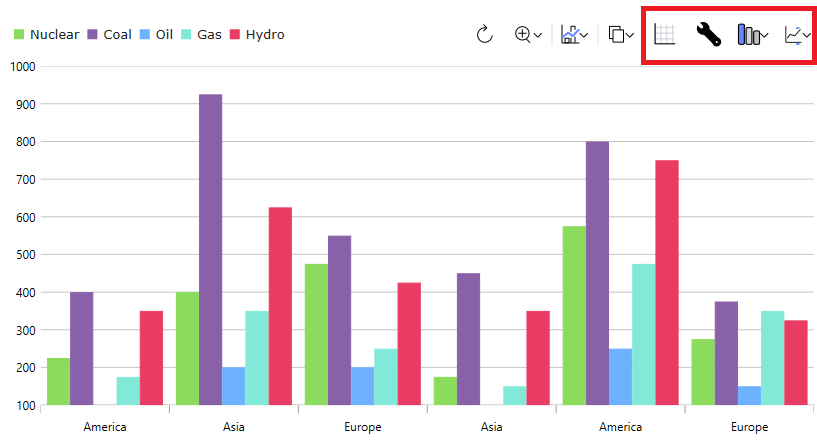

# {Platform} Dashboard Tile Overview

The {Platform} Dashboard Tile is a automatic data visualization component which determines via analysis of a DataSource collection/array or single data point what would be the most appropriate visualization to display. It then also provides a further suite of tools in its embedded `Toolbar` that let you alter the visualization that is presented in a variety of ways. 

A wide variety of visualizations may be selected for display depending on the shape of the provided data including, but not limited to: Category Charts, Radial and Polar Charts, Scatter Charts, Geographic Maps, Radial and Linear Gauges, Financial Charts and Stacked Charts.

Interacting with the chart type menu in the toolbar will allow for selecting a different visualization among the list of likely candidates.

## {Platform} Dashboard Tile Example

`sample="/charts/dashboard-tile/local-data-source-dashboard", height="600", alt="{Platform} Dashboard Tile Example"`

## Dependencies

<!-- Angular, WebComponents, React -->
Install the following packages in the {ProductName} toolset:

```cmd
npm install {PackageCharts}
npm install {PackageCore}
npm install {PackageDashboards}
npm install {PackageGauges}
npm install {PackageDataGrids}
npm install {PackageInputs}
npm install {PackageLayouts}
npm install {PackageMaps}
```

The following modules are suggested when using the Dashboard Tile component:

```ts
import { IgxDashboardTileModule, IgxDataChartDashboardTileModule, IgxRadialGaugeDashboardTileModule,
         IgxLinearGaugeDashboardTileModule, IgxGeographicMapDashboardTileModule,
         IgxPieChartDashboardTileModule } from "igniteui-angular-dashboards";

@NgModule({
    imports: [
        IgxDataChartDashboardTileModule,
        IgxRadialGaugeDashboardTileModule,
        IgxLinearGaugeDashboardTileModule,
        IgxGeographicMapDashboardTileModule,
        IgxPieChartDashboardTileModule,
        IgxDashboardTileModule
    ]
})
export class AppModule {}
```

```ts
import { IgrDashboardTileModule, IgrDataChartDashboardTileModule, IgrRadialGaugeDashboardTileModule,
         IgrLinearGaugeDashboardTileModule, IgrGeographicMapDashboardTileModule,
         IgrPieChartDashboardTileModule } from "igniteui-react-dashboards";

IgrDataChartDashboardTileModule.register();
IgrRadialGaugeDashboardTileModule.register();
IgrLinearGaugeDashboardTileModule.register();
IgrGeographicMapDashboardTileModule.register();
IgrPieChartDashboardTileModule.register();
IgrDashboardTileModule.register();
```

```ts
import { IgcDashboardTileModule, IgcDataChartDashboardTileModule, IgcRadialGaugeDashboardTileModule,
         IgcLinearGaugeDashboardTileModule, IgcGeographicMapDashboardTileModule,
         IgcPieChartDashboardTileModule } from "igniteui-angular-dashboards";

ModuleManager.register(
    IgcDataChartDashboardTileModule,
    IgcRadialGaugeDashboardTileModule,
    IgcLinearGaugeDashboardTileModule,
    IgcGeographicMapDashboardTileModule,
    IgcPieChartDashboardTileModule,
    IgcDashboardTileModule
);
```

<!-- end:Angular, WebComponents, React -->

<!-- Blazor -->

Add the **IgniteUI.Blazor.Controls** namespace in the **_Imports.razor** file:

```razor
@using IgniteUI.Blazor.Controls
```

The following modules are suggested when using the Dashboard Tile component:

```razor
// in Program.cs file

builder.Services.AddIgniteUIBlazor(
    typeof(IgbDataChartDashboardTileModule),
    typeof(IgbRadialGaugeDashboardTileModule),
    typeof(IgbLinearGaugeDashboardTileModule),
    typeof(IgbGeographicMapDashboardTileModule),
    typeof(IgbPieChartDashboardTileModule),
    typeof(IgbDashboardTileModule)
);
```

<!-- end: Blazor -->

## Usage

Depending on what you bind the Dashboard Tile's `DataSource` property to will determine which visualization you see by default, as the control will evaluate the data you bind and then choose a visualization from the {ProductName} toolset to show. The data visualization controls that are included to be shown in the Dashboard Tile are the following:

* [{IgPrefix}CategoryChart](charts/chart-overview.md)
* [{IgPrefix}DataChart](charts/chart-overview.md)
* [{IgPrefix}DataPieChart](charts/types/data-pie-chart.md)
* [{IgPrefix}GeographicMap](geo-map.md)
* [{IgPrefix}Linear Gauge](linear-gauge.md)
* [{IgPrefix}RadialGauge](radial-gauge.md)

The data visualization that is chosen by default is mainly dependent on the schema and the count of the `DataSource` that you have bound. For example, if you bind a single numeric value, you will get a `XamRadialGauge`, but if you bind a collection of value-label pairs that are easy to distinguish from each other, you will likely get a `XamDataPieChart`. If you bind an `DataSource` that has more value paths, you will receive a `XamDataChart` with multiple column series or line series, depending mainly on the count of the collection bound. You can also bind to a `ShapeDataSource` or data the appears to contain geographic points to receive a `XamGeographicMap`.

You are not locked into a single visualization when you bind the `DataSource`, and you can tell the control that you want to see a particular visualization by setting its `VisualizationType` property. For example, if you specifically wanted to see a line chart, you could define the Dashboard Tile like so:

<!-- TODO SAMPLE -->

`sample="/charts/dashboard-tile/gauge-dashboard", height="600", alt="{Platform} Dashboard Tile Gauge Example"`

The visualization or properties of the visualization are also configurable using the `Toolbar` at the top of the control. This `Toolbar` has the default tools for the current visualization with the addition of four Dashboard Tile specific ones, highlighted below:



From left to right:

- The first tool will show a data grid with the `DataSource` provided to the control. This is a toggle tool, so if you click it again after showing the grid, it will revert to the visualization.
- The second tool allows you to configure the settings of the current data visualization.
- The third tool allows you to change the current visualization, allowing you to plot a different series type or show a different type of visualization altogether. This can be set on the control by setting the `VisualizationType` property, mentioned above.
- The last tool allows you to configure which properties on your underlying data item are included for the control. You can configure this by setting the `IncludedProperties` or `ExcludedProperties` collection on the control.

This demo demonstrates dashboard tile integration with the {Platform} Pie Chart. The toolbar options at the top right provides access to styling and changing the data visualization.

`sample="/charts/dashboard-tile/pie-dashboard", height="600", alt="{Platform} Dashboard Tile Pie Example"`

This demo demonstrates dashboard tile integration with the {Platform} Geographic Map. The toolbar options at the top right provides access to styling and changing the data visualization.

`sample="/charts/dashboard-tile/map-dashboard", height="600", alt="{Platform} Dashboard Tile Map Example"`


## API References

 - `Toolbar`
 - `CategoryChart`
 - `XamDataChart`
 - `DataPieChart`
 - `XamGeographicMap`
 - `XamLinearGauge`
 - `XamRadialGauge`

## Additional Resources

* [{ProductName} **Forums**]({ForumsLink})
* [{ProductName} **GitHub**]({GithubLink})
