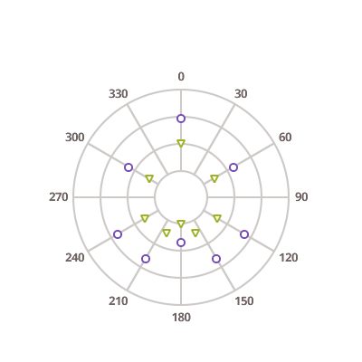

# $Platform$ Point Charts

The $ProductName$ provides the following types of point charts:

<section class="feature__container">
    
    <body>
        

            

                
Point Chart

                
            

        

        

            

                
Scatter Marker Chart

                
            

        

        

            

                
Scatter Bubble Chart

                
            

        

        

            

                
Polar Scatter Chart

                
            

        

        <!-- 

            

                
Scatter High Density Chart

                
            

        
 -->
    </body>
</section>
