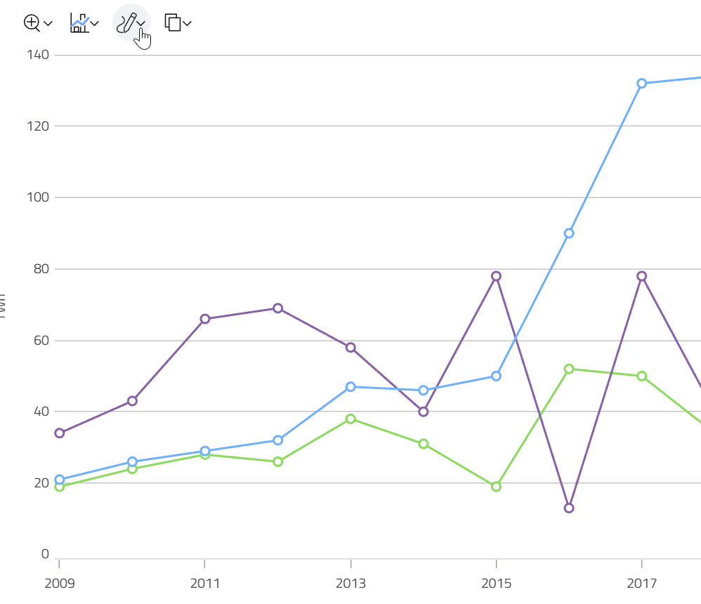
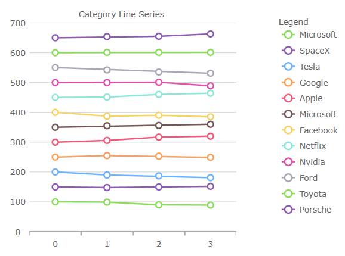
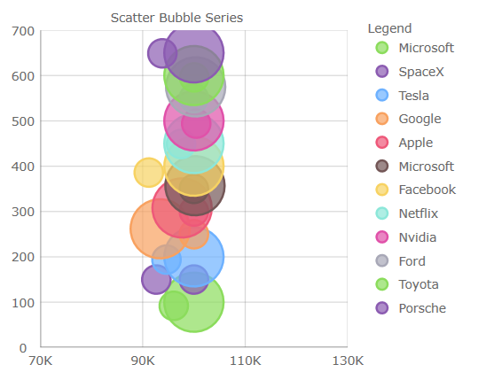
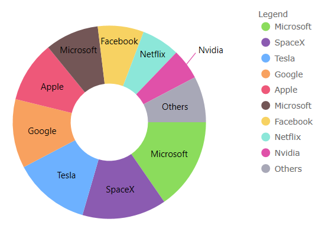
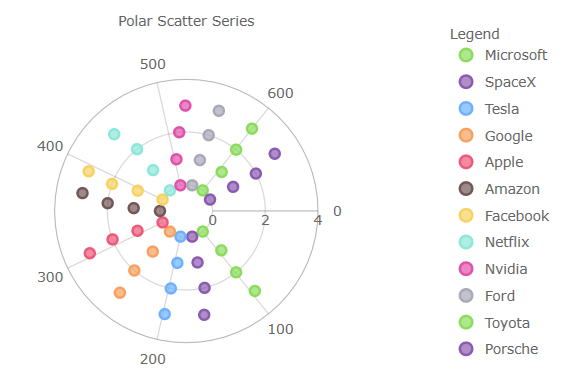

# {ProductName} Changelog

<!-- markdownlint-disable MD003 MD007 MD031 MD046 -->

All notable changes for each version of {ProductName} are documented on this page.

## **{PackageVerLatest}**
### Bug Fixes

| Bug Number | Control | Description |
|------------|---------|-------------|
|33808|IgbDataChart|The scale set for IntervalType Ticks in TimeAxisInterval is not displayed|
|34255|IgbDataChart|0.00001 scale tick marks are displayed overlapping each other|
|38510|IgbDataChart|AssigningCategoryStyle event support for Stacked Series|
|41050|IgbDataChart|Axis is not being populated in IgbAxisMouseEventArgs|

#### Charts

- Added LabelFormatOverride event to TimeXAxisLabelFormat so you can now override the formatting with an event at all time-formatting levels on the TimeXAxis.

- Adjusted the schema generation to account for more items to make it more likely to find valid values for properties.

## **{PackageVerChanges-25-2-NOV}**
### {PackageCharts} (Charts)

#### <label>PREVIEW</label> User Annotations

In {ProductName}, you can now annotate the `XamDataChart` with slice, strip, and point annotations at runtime using the new user annotations feature. This allows the end user to add more details to the plot such as calling out single important events such as company quarter reports by using the slice annotation or events that have a duration by using the strip annotation. You can also call out individual points on the plotted series by using the point annotation or any combination of these three.

This is directly integrated with the available tools of the `Toolbar`.



#### <label>PREVIEW</label> Collision Detection for Axis Annotations

Ability for axis annotations to automatically detect collisions and truncate to fit better. To enable this feature you must set the following properties:

- `ShouldAvoidAnnotationCollisions`
- `ShouldAutoTruncateAnnotations`

### {PackageMaps} (Geographic Map)

- Azure Map Imagery is now RTM.

## **{PackageVerChanges-25-1-SEP}**
### {PackageMaps} (Geographic Map)

**Breaking Changes**

- `AzureMapsMapImagery` was renamed to `AzureMapsImagery`
- `AzureMapsImageryStyle.Imagery` was renamed to `AzureMapsImageryStyle.Satellite`
- The following `AzureMapsImageryStyle` enum values were renamed to include the Overlay suffix:
  - `TerraOverlay`,
  - `LabelsRoadOverlay`
  - `LabelsDarkGreyOverlay`
  - `HybridRoadOverlay`
  - `HybridDarkGreyOverlay`
  - `WeatherRadarOverlay`
  - `WeatherInfraredOverlay`
  - `TrafficAbsoluteOverlay`
  - `TrafficRelativeOverlay`
  - `TrafficRelativeDarkOverlay`
  - `TrafficDelayOverlay`
  - `TrafficReducedOverlay`

### {PackageCharts} (Charts)

#### <label>PREVIEW</label> New Axis Label Events

The following events have been added to the `IgbDataChart` to allow you to detect different operations on the axis labels:

- `LabelMouseDown`
- `LabelMouseUp`
- `LabelMouseEnter`
- `LabelMouseLeave`
- `LabelMouseMove`
- `LabelMouseClick`

#### <label>PREVIEW</label> Companion Axis

Added `CompanionAxis` properties to the X and Y axis that allow you to quickly create a clone of an existing axis. When enabled using the `CompanionAxisEnabled` property, this will default the cloned axis to the opposite position of the chart and you can then configure that axes' properties.

#### <label>PREVIEW</label> RadialPieSeries Inset Outlines

There is a new property called `UseInsetOutlines` to control how outlines on the `RadialPieSeries` are rendered. Setting this value to **true** will inset the outlines within the slice shape, whereas a **false** (default) value will place the outlines half-in half-out along the edge of the slice shape.

**Breaking Changes**

- A fix was made due to an issue where the `PlotAreaPosition` and `ChartPosition` properties on `ChartMouseEventArgs` class were reversed. This will change the values that `PlotAreaPosition` and `ChartPosition` return.

### Bug Fixes

| Bug Number | Control | Description      |
|------------|---------|------------------|
|31624 | `IgbCategoryChart` | Resizing the containing window of the `IgbCategoryChart` causes the chart to fail to render the series|
|37930 | `IgbDataChart` | Data Annotation Overlay Text Color not working|
|27304 | `IgbDataChart` | Zoom rectangle is not positioned the same as the background rectangle|
|30600 | `IgbDoughnutChart` | No textStyle property for either the chart or series (pie chart has this)|

#### IgbBulletGraph

- <label>PREVIEW</label> Added new `LabelsVisible` property

#### Charts

- New properties added to the DataToolTipLayer, ItemToolTipLayer, and CategoryToolTipLayer to aid in styling: `ToolTipBackground`, `ToolTipBorderBrush`, and `ToolTipBorderThickness`

- New properties added to the DataLegend to aid in styling: `ContentBackground`, `ContentBorderBrush`, and `ContentBorderThickness`. The `ContentBorderBrush` and `ContentBorderThickness` default to transparent and 0 respectively, so in order to see these borders, you will need to set these properties.

- Added a new property to `ChartMouseEventArgs` called `WorldPosition` that provides the world relative position of the mouse. This position will be a value between 0 and 1 for both the X and Y axis within the axis space.

- Added `HighlightingFadeOpacity` to `SeriesViewer` and `DomainChart`. This allows you to configure the opacity applied to highlighted series.

#### IgbLinearGauge

- <label>PREVIEW</label> Added new `LabelsVisible` property


## **{PackageVerChanges-25-1-AUG}**
### {PackageMaps} (Geographic Map)

#### <label>PREVIEW</label> Azure Map Imagery Support

The `IgbGeographicMap` now supports Azure-based map imagery, allowing developers to display detailed, dynamic maps across multiple application types. You can combine multiple map layers, visualize geographic data, and create interactive mapping experiences with ease.

Note: Support for Bing Maps imagery is being phased out. Existing enterprise keys can still be used to access Bing Maps, ensuring your current applications continue to function while you transition to Azure maps.

Explore some of the publicly available [Azure maps here](https://azure.microsoft.com/en-us/products/azure-maps).


## **{PackageVerChanges-25-1-JULY}**
### Bug Fixes

| Bug Number | Control | Description      |
|------------|---------|------------------|
|36448 | `IgbRadialGauge` | Radial label format properties do not work. (eg. Title, SubTitles)|

### {PackageCharts} (Charts)

- Added <label>NEW</label> `MaximumExtent` and `MaximumExtentPercentage` properties for use with axis labels.

## **{PackageVerChanges-25-1-JUNE}**
### {PackageMaps} (Geographic Map)

> [!Note]
> As of June 30, 2025 all Microsoft Bing Maps for Enterprise Basic (Free) accounts will be retired. If you're still using an unpaid Basic Account and key, now is the time to act to avoid service disruptions. Bing Maps for Enterprise license holders can continue to use Bing Maps in their applications until June 30,2028.
> For more details please visit:

[Microsoft Bing Blogs](https://blogs.bing.com/maps/2025-06/Bing-Maps-for-Enterprise-Basic-Account-shutdown-June-30,2025)

### {PackageCharts} (Charts)

- Added <label>PREVIEW</label> [Chart Data Annotations](charts/features/chart-data-annotations.md) layers:
  - Data Annotation Band Layer
  - Data Annotation Line Layer
  - Data Annotation Rect Layer
  - Data Annotation Slice Layer
  - Data Annotation Strip Layer

- The [Data Tooltip](charts/features/chart-data-tooltip.md) and [Data Legend](charts/features/chart-data-legend.md) expose <label>PREVIEW</label> `LayoutMode` property that you can use to layout the contents of the tooltip or legend in a table or vertical layout structure.

- <label>PREVIEW</label> The `DefaultInteraction` property of the charts has been updated to include a new enumeration - `DragSelect` in which the dragged preview Rect will select the points contained within.

- <label>PREVIEW</label> The [ValueOverlay and ValueLayer](charts/features/chart-overlays.md), in addition to the <label>PREVIEW</label> [Chart Data Annotations](charts/features/chart-data-annotations.md) listed above now expose an `OverlayText` property that can be used to overlay additional annotation text in the plot area. These appearance of these annotations can be configured by using the many OverlayText-prefixed properties. For example, the `OverlayTextBrush` property will configure the color of the overlay text.

- <label>NEW</label> [Trendline Layer](charts/features/chart-trendlines.md) series type that allows you to apply a single trend line per trend line layer to a particular series. This allows the usage of multiple trend lines on a single series since you can have multiple [TrendlineLayer](charts/features/chart-overlays.md) series types in the chart.

### General
- <label>NEW</label> `Tooltip` component provides a way to display a tooltip for a specific element. To use, set content as desired and link via the `Anchor` property to the target element's id:
    ```razor
    <IgbButton id="target-button">Hover me</IgbButton>
    <IgbTooltip Anchor="target-button">
        You've hovered the button! 🎉
    </IgbTooltip>
    ```
    The tooltip can be further customized with `Show/HideDelay`, `Placement` around the target and customizable `Show/HideTriggers` events.

### Changes

- A number of enumerations have been renamed and/or merged with others. Renames (with affected components):
  - `BaseAlertLikePosition` (`Snackbar` and `Toast`) has been renamed to `AbsolutePosition`
  - `ButtonGroupAlignment` (`ButtonGroup`), `CalendarOrientation` (`Calendar`), `CardActionsOrientation` (`CardActions`), `DatePickerOrientation` (`DatePicker`), `RadioGroupAlignment` (`RadioGroup`) have been merged and renamed to `ContentOrientation`
  - `CalendarBaseSelection` (`Calendar`) has been renamed to `CalendarSelection`
  - `CarouselAnimationType` (`Carousel`) and `StepperHorizontalAnimation` (`Stepper`) have been merged and renamed to `HorizontalTransitionAnimation`
  - `CheckboxBaseLabelPosition` (`Checkbox` and `Switch`) and `RadioLabelPosition` (`Radio`) have been merged and renamed to `ToggleLabelPosition`
  - `DatePickerMode` (`DatePicker`) has been renamed to `PickerMode`
  - `DatePickerHeaderOrientation` (`DatePicker`) has been renamed to/merged with `CalendarHeaderOrientation`
  - `DropdownPlacement` (`Dropdown` and `Select`) has been renamed to `PopoverPlacement`
  - `DropdownScrollStrategy` (`Dropdown`) and `SelectScrollStrategy` (`Select`) have been merged and renamed to `PopoverScrollStrategy`
  - `SliderBaseTickOrientation` (`Slider` and `RangeSlider`) has been renamed to `SliderTickOrientation`
  - `TickLabelRotation` (`Slider` and `RangeSlider`) has been renamed to `SliderTickLabelRotation`
- `Tabs`

  Simplified configuration by removing the need to define separate panel and linking the panel and tab header. The `Panel` property and the `IgbTabPanel` itself have been removed. Content can be now assigned directly to the `Tab` and header text can be set conveniently via the new `Label` property or by projecting an element to `slot="label"` for more involved customization.
    Before:
    ```razor
    <IgbTabs Alignment=@TabAlignment>
        <IgbTab Panel="basics">Basics</IgbTab>
        <IgbTab Panel="details">Details</IgbTab>
        <IgbTab Panel="favorite">
            <IgbIcon IconName="favorite" Collection="material"/>
        </IgbTab>
        <IgbTab Panel="disabled" Disabled=true>Disabled</IgbTab>
        <IgbTabPanel id="basics">Basics tab content</IgbTabPanel>
        <IgbTabPanel id="details">Details tab content</IgbTabPanel>
        <IgbTabPanel id="favorite">Favorite tab content</IgbTabPanel>
        <IgbTabPanel id="disabled">Disabled tab content will not be displayed</IgbTabPanel>
    </IgbTabs>
    ```
    After:
    ```razor
    <IgbTabs Alignment=@TabAlignment>
        <IgbTab Label="Basics">
            Basics tab content
        </IgbTab>
        <IgbTab Label="Details">
            Details tab content
        </IgbTab>
        <IgbTab>
            <IgbIcon slot="label" IconName="favorite" Collection="material"/>
            Favorite tab content
        </IgbTab>
        <IgbTab Disabled="true" Label="Disabled">
            Disabled tab content will not be displayed
        </IgbTab>
    </IgbTabs>
    ```
- `Input`
  - `Min` & `Max` are now `double` instead of `string`
- `Stepper`
  - `ActiveStepChangingArgsEventArgs` has been renamed to `ActiveStepChangingEventArgs`
  - `ActiveStepChangedArgsEventArgs` has been renamed to `ActiveStepChangedEventArgs`
  - `StepperTitlePosition` now defaults to `Auto` to correctly reflect the default behavior
- `Tree`
  - `TreeSelectionChangeEventArgs` has been renamed to `TreeSelectionEventArgs`
- `Textarea`
  - `Autocapitalize` & `InputMode` are now `string` properties instead of explicit enums

### {PackageDashboards} (Dashboards)

- The `IgbDashboardTile` now supports propagating the aggregations from its DataGrid view to the chart visualization such as sorting, grouping, filtering and selection. This is currently supported by binding the `DataSource` of the `IgbDashboardTile` to an instance of `IgbLocalDataSource`.

#### Toolbar
- Value layers added from the toolbar now appear on the legend.
- The zoom reset tool has been moved to the zoom drop-down.

#### Data Pie Chart
- The chart now exposes a `GetOthersContext()` method. This will return the contents of the "others" slice.

### Bug Fixes

| Bug Number | Control | Description      |
|------------|---------|------------------|
|37023 | `IgbDataChart` | Tooltips are cut-off/offscreen if overflow hidden is set.|

## **{PackageVerChanges-24-2-MAY}**
### Bug Fixes

| Bug Number | Control | Description      |
|------------|---------|------------------|
|37681 | `IgbDataChart` | Category Chart - values labels are should appear above columns when there is adequate space|

## **{PackageVerChanges-24-2-FEB}**
#### Toolbar

- Added new `GroupHeaderTextStyle` property to `Toolbar` and `ToolPanel`. If set, it will apply to all `ToolActionGroupHeader` actions.
- Added new property on `ToolAction` called `TitleHorizontalAlignment` which controls the horizontal alignment of the title text.
- Added new property on `ToolActionSubPanel` called `ItemSpacing` which controls the spacing between items inside the panel.

### Bug Fixes

The following table lists the bug fixes made for the {ProductName} toolset for this release:

| Bug Number | Control | Description      |
|------------|---------|------------------|
|30286 | `IgbDataChart` | Bubble Series tooltip content is switched to that of nearby bubble data in clicking a bubble|
|34776 | `IgbDataChart` | Repeatedly showing and hiding the IgbDataChart causes memory leakage in JS Heap|
|32906 | `IgbDataChart` | IgbDataChart is showing two xAxis on the top|
|33605 | `IgbDataChart` | ScatterLineSeries is not showing the color of the line correctly in the legend|
|35498 | `IgbDataChart` | Tooltips for the series specified in IncludedSeries are not displayed|
|34053 | `IgbRadialGauge` | The position of the scale label is shifted|


## **{PackageVerChanges-24-2-DEC}**
### {PackageCharts} (Charts)

- <label>PREVIEW</label> [Dashboard Tile](dashboard-tile.md) component is a container control that analyzes and visualizes a bound ItemsSource collection or single point and returns an appropriate data visualization based on the schema and count of the data. This control utilizes a built-in [Toolbar](menus/toolbar.md) component to allow you to make changes to the visualization at runtime, allowing you to see many different visualizations of your data with minimal code.

### {PackageCharts} (Inputs)

- <label>PREVIEW</label> [Color Editor](inputs/color-editor.md) can be used as a standalone color picker and is now integrated into <label>PREVIEW</label> ToolAction of [Toolbar](menus/toolbar.md) component to update visualizations at runtime.

**Breaking Changes**

- With the release of version 2024.2 and per the [Microsoft .NET lifecycle](https://dotnet.microsoft.com/en-us/platform/support/policy/dotnet-core), we no longer support .NET 3.1, .NET 5, or .NET 7.
## **{PackageVerChanges-24-1-SEP}**
### {PackageCharts} (Charts)

- New [Data Pie Chart](charts/types/data-pie-chart.md) - The `DataPieChart` is a new component that renders a pie chart. This component works similarly to the `CategoryChart`, in that it will automatically detect the properties on your underlying data model while allowing selection, highlighting, animation and legend support via the ItemLegend component.

- New [Proportional Category Angle Axis](charts/types/radial-chart.md) - New axes for the Radial Pie Series in the `XamDataChart`, to plot slices similar to a pie chart, a type of data visualization where data points are represented as segments within a circular graph.

- `Toolbar`

  - New ToolActionCheckboxList
        A new CheckboxList ToolAction that displays a collection of items with checkboxes for selecting. A grid inside ToolAction CheckboxList grows in height up to 5 items, then a scrollbar is displayed.
        Requires IgbCheckboxListModule to be registered.

  - New Filtering Support

  - Axis Field Changes
        New default IconMenu in Toolbar when targeting CategoryChart.
        Label fields are mapped to the X-axis and Value fields are mapped to the Y-axis.
        Target chart reacts in realtime to changes made. IconMenu is hidden when chart has no ItemsSource set.

### General

- New [Banner](notifications/banner.md) component.
- New [DatePicker](scheduling/date-picker.md) component.
- New `Divider` component.
- `Icon`
  - Added `SetIconRef` method. This allows to register and replace icons by SVG files.
  - All components now use icons by reference internally so that it's easy to replace them without explicitly providing custom templates.
- `Combo`, `DatePicker`, `Dialog`, `Dropdown`,  `ExpansionPanel`, `NavDrawer`, `Toast`, `Snackbar`, **IgbSelectComponent**
  - Toggle methods `Show`, `Hide`, `Toggle` methods return **true** now on success. Otherwise **false**.
- `RadioGroup`
  - Added `Name` and `Value` properties. `Value` also supports two-way binding.

**Breaking Changes**

- Renamed old **IgbDatePicker** to **IgbXDatePicker**.
- Removed `Form` component. Use native form instead.
- Removed `size` property in favor of the `--ig-size` CSS custom property for the following components:
  - `Avatar`, `Button`,`IconButton`, `Calendar`, `Chip`, `Dropdown`, `Icon`, `Input`, `List`, `Rating`, `Snackbar`, `Tabs`, `Tree`
- `Badge`, `Chip`, `LinearProgress`, `CircularProgress`
  - Renamed `Variant` property type to `StyleVariant`.
- `Calendar`
  - Renamed `WeekStart` property type to `WeekDays`.
- `Checkbox`, `Switch`
  - Changed `Change` event argument type from `ComponentBoolValueChangedEventArgs` to `CheckboxChangeEventArgs`.
- `Combo`
  - The `IgbCombo` is now of generic type and the `Value` type is now of type `T[]`. This means that either you need to specify `T` or it will be inferred by the assigned `Value` type.
  - Removed `PositionStrategy`, `Flip`, `SameWidth` properties.
- **IgbSelectComponent**
  - Removed `PositionStrategy`, `Flip`, `SameWidth` properties.
- `DateTimeInput`
  - Removed `MaxValue` and `MinValue` properties. Use `Max` and `Min` instead.
- `Dropdown`
  - Removed `PositionStrategy` property.
- `Input`
  - Removed old named `Maxlength` and `Minlength` properties. Use `MaxLength` and `MinLength`.
  - Removed old named `Readonly` and `Inputmode` properties. Use `ReadOnly` and `InputMode`.
  - Changed `InputMode` type also to `string`.
- `Radio`
  - Changed `Change` event argument type from `ComponentBoolValueChangedEventArgs` to `RadioChangeEventArgs`.
- `RangeSlider`
  - Removed `AriaThumbLower` and `AriaThumbUpper` properties. Use `ThumbLabelLower` and `ThumbLabelUpper` instead.
- `Rating`
  - Renamed `Readonly` property to `ReadOnly`.

## **{PackageVerChanges-24-1-JUN}**
### {PackageCharts} (Charts)

- [Data Legend Grouping](charts/features/chart-data-legend.md#{PlatformLower}-data-legend-grouping) & [Data Tooltip Grouping](charts/features/chart-data-tooltip.md#{PlatformLower}-data-tooltip-grouping-for-data-chart) - New grouping feature added. The property `GroupRowVisible` toggles grouping with each series opting in can assign group text via the `DataLegendGroup` property. If the same value is applied to more than one series then they will appear grouped. Useful for large datasets that need to be categorized and organized for all users.

- [Chart Selection](charts/features/chart-data-selection.md) - New series selection styling. This is adopted broadly across all category, financial and radial series for `CategoryChart` and `XamDataChart`. Series can be clicked and shown a different color, brightened or faded, and focus outlines. Manage which items are effected through individual series or entire data item. Multiple series and markers are supported. Useful for illustrating various differences or similarities between values of a particular data item. Also  `SelectedSeriesItemsChanged` event and `SelectedSeriesItems` are available for additional help to build out robust business requirements surrounding other actions that can take place within an application such as a popup or other screen with data analysis based on the selection.

- [Proportional Category Angle Axis](charts/types/radial-chart.md) - New axes for the Radial Pie Series in the `XamDataChart`, to enable creating pie charts in the allowing robust visualizations using all the added power of the data chart.


- [Treemap Highlighting](charts/types/treemap-chart.md#{PlatformLower}-treemap-highlighting) - Now exposes a `HighlightingMode` property that allows you to configure the mouse-over highlighting of the items in the tree map. This property takes two options: `Brighten` where the highlight will apply to the item that you hover the mouse over only, and `FadeOthers` where the highlight of the hovered item will remain the same, but everything else will fade out. This highlight is animated, and can be controlled using the `HighlightingTransitionDuration` property.

- [Treemap Percent-based Highlighting](charts/types/treemap-chart.md#{PlatformLower}-treemap-percent-based-highlighting) - New percent-based highlighting, allowing nodes to represent progress or subset of a collection. The appearance is shown as a fill-in of its backcolor up to a specific value either by a member on your data item or by supplying a new `HighlightedItemsSource`. Can be toggled via `HighlightedValuesDisplayMode` and styled via `FillBrushes`.

- `Toolbar` - New `IsHighlighted` option for ToolAction for outlining a border around specific tools of choice.

### {PackageGauges} (Gauges)

- `XamRadialGauge`
  - New label for the highlight needle. `HighlightLabelText` and `HighlightLabelSnapsToNeedlePivot` and many other styling related properties for the HighlightLabel were added.

## **{PackageVerChanges-23-2-APR2}**
### {PackageCharts} (Charts)

Data Filtering via the `InitialFilter` property. Apply filter expressions to filter the chart data to a subset of records. Can be used for drill down large data.

- `XamBulletGraph`
  - The Performance bar will now reflect a difference between the value and new `HighlightValue` when the `HighlightValueDisplayMode` is applied to the 'Overlay' setting. The highlight value will show a filtered/subset measured percentage as a filled in color while the remaining bar's appearance will appear faded to the assigned value, illustrating the performance in real-time.
- `XamLinearGauge`
  - New highlight needle was added. `HighlightValue` and `HighlightValueDisplayMode` when both are provided a value and 'Overlay' setting, this will make the main needle to appear faded and a new needle will appear.
- `XamRadialGauge`
  - New highlight needle was added. `HighlightValue` and `HighlightValueDisplayMode` when both are provided a value and 'Overlay' setting, this will make the main needle to appear faded and a new needle will appear.

## **{PackageVerChanges-23-2-MAR}**

### New Components

- [Hierarchical Grid](grids/hierarchical-grid/overview.md) component
- [Text Area](inputs/text-area.md) component
- [Button Group](inputs/button-group.md) component

### New Features

- `DockManager`
  - New `ProximityDock` property. If enabled, docking indicators are not visible and the end user can dock the dragged pane by dragging it close to the target pane edges.
  - New `ContainedInBoundaries` property. Determines whether the floating panes are kept inside the Dock Manager boundaries. Defaults to `false`.
  - New `ShowPaneHeaders` property. Determines whether pane headers are only shown on hover or always visible. Defaults to `always`.
- `Tree`
  - Added `toggleNodeOnClick` property that determines whether clicking over a node will change its expanded state or not. Defaults to `false`.
- `Rating`
  - `allowReset` added. When enabled selecting the same value will reset the component. **Behavioral change** - In previous releases this was the default behavior of the rating component. Make sure to set `allowReset` if you need to keep this behavior in your application.
- `Select`, `Dropdown`
  - exposed `selectedItem`, `items` and `groups` getters
- `XamRadialGauge`
  - New title/subtitle properties. `TitleText`, `SubtitleText` will appear near the bottom the gauge. In addition, the various title/subtitle font properties were added such as `TitleFontSize`, `TitleFontFamily`, `TitleFontStyle`, `TitleFontWeight` and `TitleExtent`. Finally, the new `TitleDisplaysValue` will allow the value to correspond with the needle's position.
  - New `OpticalScalingEnabled` and `OpticalScalingSize` properties for the `XamRadialGauge`. This new feature will manage the size at which labels, titles, and subtitles of the gauge have 100% optical scaling. You can read more about this new feature in this [topic](radial-gauge.md#optical-scaling)
  - New highlight needle was added. `HighlightValue` and `HighlightValueDisplayMode` when both are provided a value and 'Overlay' setting, this will make the main needle to appear faded and a new needle will appear.
- `XamRadialChart`
  - New Label Mode
        The `CategoryAngleAxis` for the now exposes a `LabelMode` property that allows you to further configure the location of the labels. This allows you to toggle between the default mode by selecting the `Center` enum, or use the new mode, `ClosestPoint`, which will bring the labels closer to the circular plot area.

### General

- `Input`, `MaskInput`, `DateTimeInput`, `Rating`
  - `Readonly` has been renamed to `ReadOnly`
- `Input`
  - `Maxlength` has been renamed to `MaxLength`
  - `Minlength` has been renamed to `MinLength`

### Deprecations

- The `size` property and attribute have been deprecated for all components. Use the `--ig-size` CSS custom property instead. The following example sets the size of the avatar component to small:
    ```css
    .avatar {
        --ig-size: var(--ig-size-small);
    }
    ```
- `DateTimeInput`
  - `MinValue` and `MaxValue` properties have been deprecated. Please, use `Min` and `Max` instead.
- `RangeSlider`
  - `AriaLabelLower` and `AriaLabelUpper` properties have been deprecated. Please, use `ThumbLabelLower` and `ThumbLabelUpper` instead.

### Removed

- Removed our own `dir` attribute which shadowed the default one. This is a non-breaking change.
- `Slider` - `ariaLabel` shadowed property. This is a non-breaking change.
- `Checkbox` - `ariaLabelledBy` shadowed attribute. This is a non-breaking change.
- `Switch` - `ariaLabelledBy` shadowed attribute. This is a non-breaking change.
- `Radio` - `ariaLabelledBy` shadowed attribute. This is a non-breaking change.

## **{PackageVerChanges-23-2-JAN}**
### {PackageCharts} (Charts)

- [Chart Highlight Filter](charts/features/chart-highlight-filter.md) - The `CategoryChart` and `XamDataChart` now expose a way to highlight and animate in and out of a subset of data. The display of this highlight depends on the series type. For column and area series, the subset will be shown on top of the total set of data where the subset will be colored by the actual brush of the series, and the total set will have a reduced opacity. For line series, the subset will be shown as a dotted line.

## **{PackageVerChanges-23-1}**

### New Components

- <label>PREVIEW</label> [Toolbar](menus/toolbar.md) - component is a companion container for UI operations to be used primarily with our charting components. The toolbar will dynamically update with a preset of properties and tools when linked to our `XamDataChart` or `CategoryChart` components, but it also gives you the ability to create custom tools for your project.

### {PackageCharts} (Charts)

- [ValueLayer](charts/features/chart-overlays.md#{PlatformLower}-value-layer) - A new series type named the `ValueLayer` is now exposed which can allow you to render an overlay for different focal points of the plotted data such as Maximum, Minimum, and Average. This is applied to the `CategoryChart` and `FinancialChart` by adding to the new `ValueLines` collection.

- It is now possible to apply a **dash array** to the different parts of the series of the `XamDataChart`. You can apply this to the [series](charts/types/line-chart.md#{PlatformLower}-styling-line-chart) plotted in the chart, the [gridlines](charts/features/chart-axis-gridlines.md#{PlatformLower}-axis-gridlines-properties) of the chart, and the [trendlines](charts/features/chart-trendlines.md#{PlatformLower}-chart-trendlines-dash-array-example) of the series plotted in the chart.

## **{PackageVerChanges-22-2}**
### {PackageCharts} (Charts)

Added significant improvements to default behaviors, and refined the Category Chart API to make it easier to use. These new chart improvements include:

- Responsive layouts for horizontal label rotation based on browser / screen size.
- Enhanced rendering for rounded labels on all platforms.
- Added marker properties to StackedFragmentSeries.
- Added `ShouldPanOnMaximumZoom` property.
- New Category Axis Properties:
  - ZoomMaximumCategoryRange
  - ZoomMaximumItemSpan
  - ZoomToCategoryRange
  - ZoomToItemSpan
- New [Chart Aggregation](charts/features/chart-data-aggregations.md) API for Grouping, Sorting and Summarizing Category string and numeric values, eliminating the need to pre-aggregate or calculate chart data:
  - InitialSortDescriptions
  - InitialSorts
  - SortDescriptions
  - InitialGroups
  - InitialGroupDescriptions
  - GroupDescriptions
  - InitialSummaries
  - InitialSummaryDescriptions
  - SummaryDescriptions
  - InitialGroupSortDescriptions
  - GroupSorts
  - GroupSortDescriptions

> [!Note]
[Chart Aggregation](charts/features/chart-data-aggregations.md) will not work when using `IncludedProperties` | `ExcludedProperties`. These properties on the chart are meant for non-aggregated data. Once you attempt to aggregate data these properties should no longer be used. The reason it does not work is because aggregation replaces the collection that is passed to the chart for render.  The include/exclude properties are designed to filter in/out properties of that data and those properties no longer exist in the new aggregated collection.

## **{PackageVerChanges-22-1}**
### {PackageCharts} (Charts)

- Added the highly-configurable [DataLegend](charts/features/chart-data-legend.md) component, which works much like the `Legend`, but it shows values of series and provides many configuration properties for filtering series rows and values columns, styling and formatting values.
- Added the highly-configurable [DataToolTip](charts/features/chart-data-tooltip.md) which displays values and titles of series as well as legend badges of series in a tooltip. This is now the default tooltip for all chart types.
- Added animation and transition-in support for Stacked Series. Animations can be enabled by setting the `IsTransitionInEnabled` property to true. From there, you can set the `TransitionInDuration` property to determine how long your animation should take to complete and the `TransitionInMode` to determine the type of animation that takes place.
- Added `AssigningCategoryStyle` event, is now available to all series in `XamDataChart`. This event is handled when you want to conditionally configure aspects of the series items such as `Fill` background-color and highlighting.
- New `AllowedPositions` enumeration for CalloutLayer. Used to limit where the callouts are to be placed within the chart. By default, the callouts are intelligently placed in the best place but this used to force for example `TopLeft`, `TopRight`, `BottomLeft` or `BottomRight`.
- New corner radius properties added for Annotation Layers; used to round-out the corners of each of the callouts. Note, a corner radius has now been added by default.
  - `CalloutCornerRadius` for CalloutLayer
  - `AxisAnnotationBackgroundCornerRadius` for FinalValueLayer
  - `XAxisAnnotationBackgroundCornerRadius` and `YAxisAnnotationBackgroundCornerRadius` for CrosshairLayer
- New `HorizontalViewScrollbarMode` and `VerticalViewScrollbarMode` enumeration to enable scrollbars in various ways. When paired with `IsVerticalZoomEnabled` or `IsHorizontalZoomEnabled`, you'll be able to persist or fade-in and out the scrollbars along the axes to navigate the chart.
- New `FavorLabellingScaleEnd`, determines whether the axis should favor emitting a label at the end of the scale. Only compatible with numeric axes (e.g. `NumericXAxis`, `NumericYAxis`, `PercentChangeAxis`).
- New `IsSplineShapePartOfRange` determines whether to include the spline shape in the axis range requested of the axis.
- New `XAxisMaximumGap`, determines the maximum allowed value for the plotted series when using `XAxisGap`. The gap determines the amount of space between columns or bars of plotted series.
- New `XAxisMinimumGapSize`, determines the minimum allowed pixel-based value for the plotted series when using `XAxisGap` to ensure there is always some spacing between each category.

## **{PackageVerChanges-21-2}**

> [!Note]
> The **Igb** prefix is now required for the {ProductName} components and nested elements within each component. This API change was necessary to avoid ambiguity between Infragistics controls and 3rd party controls.
>
> For example, ``` <IgbCategoryChart/> ``` instead of ``` <CategoryChart/> ```

### New Components

- [Avatar](layouts/avatar.md)
- [Badge](inputs/badge.md)
- [Button & Icon Button](inputs/button.md)
- [Card](layouts/card.md)
- [Checkbox](inputs/checkbox.md)
- Form
- [Icon](layouts/icon.md)
- [List](grids/list.md)
- [Navigation Bar](menus/navbar.md)
- [Navigation Drawer](menus/navigation-drawer.md)
- [Radio & Radio Group](inputs/radio.md)
- [Ripple](inputs/ripple.md)
- [Switch](inputs/switch.md)

### Chart and Map Improvements

This release introduces a few improvements and simplifications to visual design and configuration options for the geographic map and all chart components.

- Changed `YAxisLabelLocation` property's type to **YAxisLabelLocation** from **AxisLabelLocation** in `FinancialChart` and `CategoryChart`
- Changed `XAxisLabelLocation` property's type to **XAxisLabelLocation** from **AxisLabelLocation** in `FinancialChart`
- Added `XAxisLabelLocation` property to `CategoryChart`
- Added support for representing geographic series of `XamGeographicMap` in a legend
- Added crosshair lines by default in `FinancialChart` and `CategoryChart`
- Added crosshair annotations by default in `FinancialChart` and `CategoryChart`
- Added final value annotation by default in `FinancialChart`
- Added new properties in Category Chart and Financial Chart:
  - `CrosshairsLineThickness` and other properties for customizing crosshairs lines
  - `CrosshairsAnnotationXAxisBackground` and other properties for customizing crosshairs annotations
  - `FinalValueAnnotationsBackground` and other properties for customizing final value annotations
  - `AreaFillOpacity` that allow changing opacity of series fill (e.g. Area chart)
  - `MarkerThickness` that allows changing thickness of markers
- Added new properties in Category Chart, Financial Chart, Data Chart, and Geographic Map:
  - `MarkerAutomaticBehavior` that allows which marker type is assigned to multiple series in the same chart
  - `LegendItemBadgeShape` for setting badge shape of all series represented in a legend
  - `LegendItemBadgeMode` for setting badge complexity on all series in a legend
- Added new properties in Series in Data Chart and Geographic Map:
  - `LegendItemBadgeShape` for setting badge shape on specific series represented in a legend
  - `LegendItemBadgeMode` for setting badge complexity on specific series in a legend
- Changed default vertical crosshair line stroke from <span style="color:#000000">#000000</span> to <span style="color:#BBBBBB">#BBBBBB</span> in category chart and series
- Changed shape of markers to circle for all series plotted in the same chart. This can be reverted by setting chart's `MarkerAutomaticBehavior` property to `SmartIndexed` enum value
- Simplified shapes of series in chart's legend to display only circle, line, or square. This can be reverted by setting chart's `LegendItemBadgeMode` property to `MatchSeries` enum value
- Changed color palette of series and markers displayed in all charts to improve accessibility

| Old brushes/outlines | New outline/brushes |
| -------------------- | ------------------- |
| <span style="color:#8BDC5C">#8BDC5C</span> <br><span style="color:#8B5BB1">#8B5BB1</span> <br><span style="color:#6DB1FF">#6DB1FF</span> <br><span style="color:#F8A15F">#F8A15F</span> <br><span style="color:#EE5879">#EE5879</span> <br><span style="color:#735656">#735656</span> <br><span style="color:#F7D262">#F7D262</span> <br><span style="color:#8CE7D9">#8CE7D9</span> <br><span style="color:#E051A9">#E051A9</span> <br><span style="color:#A8A8B7">#A8A8B7</span> | <span style="color:#8BDC5C">#8BDC5C</span> <br><span style="color:#8961A9">#8961A9</span> <br><span style="color:#6DB1FF">#6DB1FF</span> <br><span style="color:#82E9D9">#82E9D9</span> <br><span style="color:#EA3C63">#EA3C63</span> <br><span style="color:#735656">#735656</span> <br><span style="color:#F8CE4F">#F8CE4F</span> <br><span style="color:#A8A8B7">#A8A8B7</span> <br><span style="color:#E051A9">#E051A9</span> <br><span style="color:#FF903B">#FF903B</span> <br> |

## **{PackageVerChanges-21-1}**
### New Visual Designs

#### Charts & Maps

This release introduces several new and improved visual design and configuration options for all of the chart components, e.g. `XamDataChart`, `CategoryChart`, and `FinancialChart`.

- Changed Bar/Column/Waterfall series to have square corners instead of rounded corners
- Changed Scatter High Density series’ colors for heat min property from <span style="color:#8a5bb1">#8a5bb1</span> to <span style="color:#000000">#000000</span>
- Changed Scatter High Density series’ colors for heat max property from <span style="color:#ee5879">#ee5879</span> to <span style="color:#ee5879">#ee5879</span>
- Changed Financial/Waterfall series’ `NegativeBrush` and `NegativeOutline` properties from <span style="color:#C62828">#C62828</span> to <span style="color:#ee5879">#ee5879</span>
- Changed marker's thickness to 2px from 1px
- Changed marker's fill to match the marker's outline for `PointSeries`, `BubbleSeries`, `ScatterSeries`, `PolarScatterSeries`. You can use set `MarkerFillMode` property to Normal to undo this change
- Compressed labelling for the `TimeXAxis` and `OrdinalTimeXAxis`
- New Marker Properties:
  - series.`MarkerFillMode` - Can be set to `MatchMarkerOutline` so the marker depends on the outline
  - series.`MarkerFillOpacity` - Can be set to a value 0 to 1
  - series.`MarkerOutlineMode` - Can be set to `MatchMarkerBrush` so the marker's outline depends on the fill brush color
- New Series Property:
  - series.`OutlineMode` - Can be set to toggle the series outline visibility. Note, for Data Chart, the property is on the series
- New chart properties that define bleed over area introduced into the viewport when the chart is at the default zoom level. A common use case is to provide space between the axes and first/last data points. Note, the `ComputedPlotAreaMarginMode`, listed below, will automatically set the margin when markers are enabled. The others are designed to specify a `Double` to represent the thickness, where PlotAreaMarginLeft etc. adjusts the space to all four sides of the chart:
  - chart.`PlotAreaMarginLeft`
  - chart.`PlotAreaMarginTop`
  - chart.`PlotAreaMarginRight`
  - chart.`PlotAreaMarginBottom`
  - chart.`ComputedPlotAreaMarginMode`
- New Highlighting Properties
  - chart.`HighlightingMode` - Sets whether hovered or non-hovered series to fade, brighten
  - chart.`HighlightingBehavior` - Sets whether the series highlights depending on mouse position e.g. directly over or nearest item
  - Note, in previous releases the highlighting was limited to fade on hover.
- Added Highlighting Stacked, Scatter, Polar, Radial, and Shape series:
- Added Annotation layers to Stacked, Scatter, Polar, Radial, and Shape series:
- Added support for overriding the data source of individual stack fragments within a stacked series
- Added custom style events to Stacked, Scatter, Range, Polar, Radial, and Shape series
- Added support to automatically sync the vertical zoom to the series content
- Added support to automatically expanding the horizontal margins of the chart based on the initial labels displayed
- Redesigned color palette of series and markers:

| Old brushes/outlines | New outline/brushes |
| -------------------- | ------------------- |
| <span style="color:#7446B9">#7446B9</span> <br><span style="color:#9FB328">#9FB328</span> <br><span style="color:#F96232">#F96232</span> <br><span style="color:#2E9CA6">#2E9CA6</span> <br><span style="color:#DC3F76">#DC3F76</span> <br><span style="color:#FF9800">#FF9800</span> <br><span style="color:#3F51B5">#3F51B5</span> <br><span style="color:#439C47">#439C47</span> <br><span style="color:#795548">#795548</span> <br><span style="color:#9A9A9A">#9A9A9A</span> | <span style="color:#8bdc5c">#8bdc5c</span> <br><span style="color:#8b5bb1">#8b5bb1</span> <br><span style="color:#6db1ff">#6db1ff</span> <br><span style="color:#f8a15f">#f8a15f</span> <br><span style="color:#ee5879">#ee5879</span> <br><span style="color:#735656">#735656</span> <br><span style="color:#f7d262">#f7d262</span> <br><span style="color:#8ce7d9">#8ce7d9</span> <br><span style="color:#e051a9">#e051a9</span> <br><span style="color:#a8a8b7">#a8a8b7</span> <br> |

for example:

|   |   |
|---|---|
|  |  |
|  |  |

#### Chart Legend

- Added horizontal `Orientation` property to ItemLegend that can be used with Bubble, Donut, and Pie Chart
- Added `LegendHighlightingMode` property - Enables series highlighting when hovering over legend items

#### Geographic Map

> [!Note]
> These features are CTP

- Added support for wrap around display of the map (scroll infinitely horizontally)
- Added support for shifting display of some map series while wrapping around the coordinate origin
- Added support for highlighting of the shape series
- Added support for some annotation layers for the shape series

