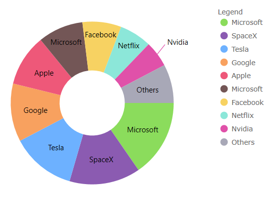

# {ProductName} Changelog

All notable changes for each version of {ProductName} are documented on this page.

## **{PackageVerChanges-23-1}**

### New Components

* [Toolbar](menus/toolbar.md) - Beta. This component is a companion container for UI operations to be used primarily with our charting components. The toolbar will dynamically update with a preset of properties and tool items when linked to our `XamDataChart` or `CategoryChart` components. You'll be able to create custom tools for your project allowing end users to provide changes, offering an endless amount of customization.

### {PackageCharts} Charts

* [ValueLayer](charts/features/chart-overlays.md#{PlatformLower}-value-layer) - A new series type named the `ValueLayer` is now exposed which can allow you to render an overlay for different focal points of the plotted data such as Maximum, Minimum, and Average. This is applied to the `CategoryChart` and `FinancialChart` by adding to the new `ValueLines` collection.

* It is now possible to apply a **dash array** to the different parts of the series of the `XamDataChart`. You can apply this to the [series](charts/types/line-chart.md#{PlatformLower}-styling-line-chart) plotted in the chart, the [gridlines](charts/features/chart-axis-gridlines.md#{PlatformLower}-axis-gridlines-properties) of the chart, and the [trendlines](charts/features/chart-trendlines.md#{PlatformLower}-chart-trendlines-dash-array-example) of the series plotted in the chart.

## **{PackageVerChanges-22-2}**

Added significant improvements to default behaviors, and refined the Category Chart API to make it easier to use.

These new chart improvements include:

* Responsive layouts for horizontal label rotation based on browser / screen size.
* Enhanced rendering for rounded labels on all platforms.
* Added marker properties to StackedFragmentSeries.
* Added `ShouldPanOnMaximumZoom` property.
* New Category Axis Properties:
    - ZoomMaximumCategoryRange
    - ZoomMaximumItemSpan
    - ZoomToCategoryRange
    - ZoomToItemSpan
* New [Chart Aggregation](charts/features/chart-data-aggregations.md) API for Grouping, Sorting and Summarizing Category string and numeric values, eliminating the need to pre-aggregate or calculate chart data:
  - InitialSortDescriptions
  - InitialSorts
  - SortDescriptions
  - InitialGroups
  - InitialGroupDescriptions
  - GroupDescriptions
  - InitialSummaries
  - InitialSummaryDescriptions
  - SummaryDescriptions
  - InitialGroupSortDescriptions
  - GroupSorts
  - GroupSortDescriptions

> [!Note]
[Chart Aggregation](charts/features/chart-data-aggregations.md) will not work when using `IncludedProperties` | `ExcludedProperties`. These properties on the chart are meant for non-aggregated data. Once you attempt to aggregate data these properties should no longer be used. The reason it does not work is because aggregation replaces the collection that is passed to the chart for render.  The include/exclude properties are designed to filter in/out properties of that data and those properties no longer exist in the new aggregated collection.

### {PackageGrids} (Data Grid)

* Changed `Column` to `DataGridColumn`
* Changed `GridCellEventArgs` to `DataGridCellEventArgs`
* Changed `GridSelectionMode` to `DataGridSelectionMode`
* Changed `SummaryOperand` to `DataSourceSummaryOperand`

## **{PackageVerChanges-22-1}**
### {PackageCharts} (Charts)

* Added the highly-configurable [DataLegend](charts/features/chart-data-legend.md) component, which works much like the `Legend`, but it shows values of series and provides many configuration properties for filtering series rows and values columns, styling and formatting values.
* Added the highly-configurable [DataToolTip](charts/features/chart-data-tooltip.md) which displays values and titles of series as well as legend badges of series in a tooltip. This is now the default tooltip for all chart types.
* Added animation and transition-in support for Stacked Series. Animations can be enabled by setting the `IsTransitionInEnabled` property to true. From there, you can set the `TransitionInDuration` property to determine how long your animation should take to complete and the `TransitionInMode` to determine the type of animation that takes place.
* Added `AssigningCategoryStyle` event, is now available to all series in `DataChart`. This event is handled when you want to conditionally configure aspects of the series items such as `Fill` background-color and highlighting.
* New `AllowedPositions` enumeration for CalloutLayer. Used to limit where the callouts are to be placed within the chart. By default, the callouts are intelligently placed in the best place but this used to force for example `TopLeft`, `TopRight`, `BottomLeft` or `BottomRight`.
* New corner radius properties added for Annotation Layers; used to round-out the corners of each of the callouts. Note, a corner radius has now been added by default.
    - `CalloutCornerRadius` for CalloutLayer
    - `AxisAnnotationBackgroundCornerRadius` for FinalValueLayer
    - `XAxisAnnotationBackgroundCornerRadius` and `YAxisAnnotationBackgroundCornerRadius` for CrosshairLayer
* New `HorizontalViewScrollbarMode` and `VerticalViewScrollbarMode` enumeration to enable scrollbars in various ways. When paired with `IsVerticalZoomEnabled` or `IsHorizontalZoomEnabled`, you'll be able to persist or fade-in and out the scrollbars along the axes to navigate the chart.
* New `FavorLabellingScaleEnd`, determines whether the axis should favor emitting a label at the end of the scale. Only compatible with numeric axes (e.g. `NumericXAxis`, `NumericYAxis`, `PercentChangeAxis`).
* New `IsSplineShapePartOfRange` determines whether to include the spline shape in the axis range requested of the axis.
* New `XAxisMaximumGap`, determines the maximum allowed value for the plotted series when using `XAxisGap`. The gap determines the amount of space between columns or bars of plotted series.
* New `XAxisMinimumGapSize`, determines the minimum allowed pixel-based value for the plotted series when using `XAxisGap` to ensure there is always some spacing between each category.

### {PackageGrids} (Data Grid)

* New Feature Added:
- [Row Paging](grids/data-grid/row-paging.md)

Pagination is used to split a large set of data into a sequence of pages that have similar content. With pagination, data can be displayed in a set number of rows, letting users “scroll” through their data, without needing a scroll bar. The UI for table pagination usually includes things like the current page, total pages, and clickable Previous and Next arrows/buttons that let users flip through the pages of data.

## **{PackageVerChanges-21-2.1}**

### {PackageGrids} (Data Grid)

#### Data Grid
- Added `ValueMultiField`, of type string[], in the `ComboBoxColumn` to be used when your items in the drop down contain a key that consists of multiple fields.

> [!Note]
> The following breaking changes were introduced

- Changed `ValueField` property from type string[] to string.

### {PackageInputs} (Inputs)

#### Date Picker
- Changed ValueChanged event to `SelectedValueChanged`.

#### Multi-Column ComboBox
- Changed `TextChanged` event to `TextValueChanged`.
- Changed `ValueChanged` event to `SelectedValueChanged`.

<div class="divider--half"></div>

## **{PackageVerChanges-21-2}**

> [!Note]
> Please ensure package "lit-html": "^2.0.0" or newer is added to your project for optimal compatibility.

### {PackageCharts} (Charts)

This release introduces a few improvements and simplifications to visual design and configuration options for the geographic map and all chart components.

* Changed `YAxisLabelLocation` property's type to **YAxisLabelLocation** from **AxisLabelLocation** in `FinancialChart` and `CategoryChart`
* Changed `XAxisLabelLocation` property's type to **XAxisLabelLocation** from **AxisLabelLocation** in `FinancialChart`
* Added `XAxisLabelLocation` property to `CategoryChart`
* Added support for representing geographic series of `XamGeographicMap` in a legend
* Added crosshair lines by default in `FinancialChart` and `CategoryChart`
* Added crosshair annotations by default in `FinancialChart` and `CategoryChart`
* Added final value annotation by default in `FinancialChart`
* Added new properties in Category Chart and Financial Chart:
   - `CrosshairsLineThickness` and other properties for customizing crosshairs lines
   - `CrosshairsAnnotationXAxisBackground` and other properties for customizing crosshairs annotations
   - `FinalValueAnnotationsBackground` and other properties for customizing final value annotations
   - `AreaFillOpacity` that allow changing opacity of series fill (e.g. Area chart)
   - `MarkerThickness` that allows changing thickness of markers
* Added new properties in Category Chart, Financial Chart, Data Chart, and Geographic Map:
   - `MarkerAutomaticBehavior` that allows which marker type is assigned to multiple series in the same chart
   - `LegendItemBadgeShape` for setting badge shape of all series represented in a legend
   - `LegendItemBadgeMode` for setting badge complexity on all series in a legend
* Added new properties in Series in Data Chart and Geographic Map:
   - `LegendItemBadgeShape` for setting badge shape on specific series represented in a legend
   - `LegendItemBadgeMode` for setting badge complexity on specific series in a legend
* Changed default vertical crosshair line stroke from <span style="color:#000000">#000000</span> to <span style="color:#BBBBBB">#BBBBBB</span> in category chart and series
* Changed shape of markers to circle for all series plotted in the same chart. This can be reverted by setting chart's `MarkerAutomaticBehavior` property to `SmartIndexed` enum value
* Simplified shapes of series in chart's legend to display only circle, line, or square. This can be reverted by setting chart's `LegendItemBadgeMode` property to `MatchSeries` enum value
* Changed color palette of series and markers displayed in all charts to improve accessibility

| Old brushes/outlines | New outline/brushes |
| -------------------- | ------------------- |
| <span style="color:#8BDC5C">#8BDC5C</span> <br><span style="color:#8B5BB1">#8B5BB1</span> <br><span style="color:#6DB1FF">#6DB1FF</span> <br><span style="color:#F8A15F">#F8A15F</span> <br><span style="color:#EE5879">#EE5879</span> <br><span style="color:#735656">#735656</span> <br><span style="color:#F7D262">#F7D262</span> <br><span style="color:#8CE7D9">#8CE7D9</span> <br><span style="color:#E051A9">#E051A9</span> <br><span style="color:#A8A8B7">#A8A8B7</span> | <span style="color:#8BDC5C">#8BDC5C</span> <br><span style="color:#8961A9">#8961A9</span> <br><span style="color:#6DB1FF">#6DB1FF</span> <br><span style="color:#82E9D9">#82E9D9</span> <br><span style="color:#EA3C63">#EA3C63</span> <br><span style="color:#735656">#735656</span> <br><span style="color:#F8CE4F">#F8CE4F</span> <br><span style="color:#A8A8B7">#A8A8B7</span> <br><span style="color:#E051A9">#E051A9</span> <br><span style="color:#FF903B">#FF903B</span> <br> |

<div class="divider--half"></div>

### {PackageGrids} (Data Grid)

* New Features Added:
    - [Filter Row](grids/data-grid/column-filtering.md)
    - [Load/Save Layout Customizations](grids/data-grid/load-save-layout.md)
    - [GroupBy Area for column grouping](grids/data-grid/row-grouping.md)
    - [Cell Merging](grids/data-grid/cell-merging.md)
* New API:
    - Added `SelectionChanged` event. Used to detect changes on selection interactions
     e.g. Multiple row selection.
* Breaking Changes:
    - Changed grid's SummaryScope property's type to SummaryScope from `DataSourceSummaryScope`
    - Changed GroupHeaderDisplayMode property's type to GroupHeaderDisplayMode from `DataSourceSectionHeaderDisplayMode`

<div class="divider--half"></div>

## **{PackageVerChanges-21-1}**
### {PackageCharts} (Charts)

This release introduces several new and improved visual design and configuration options for all of the chart components, e.g. `DataChart`, `CategoryChart`, and `FinancialChart`.

* Changed Bar/Column/Waterfall series to have square corners instead of rounded corners
* Changed Scatter High Density series’ colors for heat min property from <span style="color:#8a5bb1">#8a5bb1</span> to <span style="color:#000000">#000000</span>
* Changed Scatter High Density series’ colors for heat max property from <span style="color:#ee5879">#ee5879</span> to <span style="color:#ee5879">#ee5879</span>
* Changed Financial/Waterfall series’ `NegativeBrush` and `NegativeOutline` properties from <span style="color:#C62828">#C62828</span> to <span style="color:#ee5879">#ee5879</span>
* Changed marker's thickness to 2px from 1px
* Changed marker's fill to match the marker's outline for `PointSeries`, `BubbleSeries`, `ScatterSeries`, `PolarScatterSeries`. You can use set `MarkerFillMode` property to Normal to undo this change
* Compressed labelling for the `TimeXAxis` and `OrdinalTimeXAxis`
* New Marker Properties:
    - series.`MarkerFillMode` - Can be set to `MatchMarkerOutline` so the marker depends on the outline
    - series.`MarkerFillOpacity` - Can be set to a value 0 to 1
    - series.`MarkerOutlineMode` - Can be set to `MatchMarkerBrush` so the marker's outline depends on the fill brush color
* New Series Property:
    - series.`OutlineMode` - Can be set to toggle the series outline visibility. Note, for Data Chart, the property is on the series
* New chart properties that define bleed over area introduced into the viewport when the chart is at the default zoom level. A common use case is to provide space between the axes and first/last data points. Note, the `ComputedPlotAreaMarginMode`, listed below, will automatically set the margin when markers are enabled. The others are designed to specify a `Double` to represent the thickness, where PlotAreaMarginLeft etc. adjusts the space to all four sides of the chart:
    - chart.`PlotAreaMarginLeft`
    - chart.`PlotAreaMarginTop`
    - chart.`PlotAreaMarginRight`
    - chart.`PlotAreaMarginBottom`
    - chart.`ComputedPlotAreaMarginMode`
* New Highlighting Properties
    - chart.`HighlightingMode` - Sets whether hovered or non-hovered series to fade, brighten
    - chart.`HighlightingBehavior` - Sets whether the series highlights depending on mouse position e.g. directly over or nearest item
    - Note, in previous releases the highlighting was limited to fade on hover.
* Added Highlighting Stacked, Scatter, Polar, Radial, and Shape series:
* Added Annotation layers to Stacked, Scatter, Polar, Radial, and Shape series:
* Added support for overriding the data source of individual stack fragments within a stacked series
* Added custom style events to Stacked, Scatter, Range, Polar, Radial, and Shape series
* Added support to automatically sync the vertical zoom to the series content
* Added support to automatically expanding the horizontal margins of the chart based on the initial labels displayed
* Redesigned color palette of series and markers:

| Old brushes/outlines | New outline/brushes |
| -------------------- | ------------------- |
| <span style="color:#7446B9">#7446B9</span> <br><span style="color:#9FB328">#9FB328</span> <br><span style="color:#F96232">#F96232</span> <br><span style="color:#2E9CA6">#2E9CA6</span> <br><span style="color:#DC3F76">#DC3F76</span> <br><span style="color:#FF9800">#FF9800</span> <br><span style="color:#3F51B5">#3F51B5</span> <br><span style="color:#439C47">#439C47</span> <br><span style="color:#795548">#795548</span> <br><span style="color:#9A9A9A">#9A9A9A</span> | <span style="color:#8bdc5c">#8bdc5c</span> <br><span style="color:#8b5bb1">#8b5bb1</span> <br><span style="color:#6db1ff">#6db1ff</span> <br><span style="color:#f8a15f">#f8a15f</span> <br><span style="color:#ee5879">#ee5879</span> <br><span style="color:#735656">#735656</span> <br><span style="color:#f7d262">#f7d262</span> <br><span style="color:#8ce7d9">#8ce7d9</span> <br><span style="color:#e051a9">#e051a9</span> <br><span style="color:#a8a8b7">#a8a8b7</span> <br> |

for example:

|   |   |
|---|---|
|  |  |
|  |  |

#### Chart Legend

* Added horizontal `Orientation` property to ItemLegend that can be used with Bubble, Donut, and Pie Chart
* Added `LegendHighlightingMode` property - Enables series highlighting when hovering over legend items

### {PackageMaps} (GeoMap)

> [!Note]
> These features are CTP

* Added support for wrap around display of the map (scroll infinitely horizontally)
* Added support for shifting display of some map series while wrapping around the coordinate origin
* Added support for highlighting of the shape series
* Added support for some annotation layers for the shape series

<div class="divider--half"></div>

### {PackageGrids} (Data Grid)

* Added `EditOnKeyPress` aka Excel-style Editing, instantly begin editing when typing.
* Added `EditModeClickAction` property - By default double-clicking is required to enter edit mode. This can be set to `SingleClick` to allow for edit mode to occur when selecting a new cell.
* Added `EnterKeyBehaviors` property - aka Excel-style Navigation (Enter Behavior) – controls the behavior of the enter key, e.g. Options are (none, edit, move up, down, left, right)
* Added `EnterKeyBehaviorAfterEdit` property - While in edit-mode, this property controls when enter is pressed, e.g. Options are (moves to the cell below, above, right, left)
* Added `SelectAllRows` - method.
* Added Row Range Selection - With `GridSelectionMode` property set to MultipleRow the following new functionality is now included:
    - Click and drag to select rows
    - Shift and click to select multiple rows.
    - Shift and press the up/down arrow keys to select multiple rows.
* Pressing space bar toggles selection of active row via `GridSelectionMode` property set to MultipleRow or SingleRow
* Added Column Summaries to Column Options Dialog.

### {PackageInputs} (Inputs)

#### Date Picker

* `ShowTodayButton` - Toggles Today button visibility
* `Label` - Adds a label above the date value
* `Placeholder` property - adds custom text when no value is selected
* `FormatString` - Customize input date string e.g. (`yyyy-MM-dd`)
* `DateFormat` - Specifies whether to display selected dates as LongDate or ShortDate
* `FirstDayOfWeek` - Specifies first day of week
* `FirstWeekOfYear` - Specifies when to display first week of the year, e.g. (First Full Week, First Four day Week)
* `ShowWeekNumbers` - Toggles Week number visibility
* `MinDate` & `MaxDate` - Date limits, specifying a range of available selectable dates.
* Added Accessibility

<div class="divider--half"></div>

## **{PackageVerChangedFields}**

### {PackageGrids} (Data Grid)

> [!Note]
> These breaking changes were introduce in the grid package.

- Changed name of PropertyPath

The data grid component property `propertyPath` has been renamed to `field`. This applies to all Column types, GroupDescription, SortDescription & SummaryDescription.

```tsx
 <IgrTextColumn field="Name"/>
```

```ts
import { IgrColumnSummaryDescription, IgrColumnSortDescription, IgrColumnGroupDescription } from 'igniteui-react-grids'
const productCount = new IgrColumnSummaryDescription();
productCount.field = "ProductName";
const colSortDesc = new IgrColumnSortDescription();
colSortDesc.field = "UnitsInStock";
const income = new IgrColumnGroupDescription();
income.field = "Income";
```

## **{PackageVerRenamedGrid}**

### {PackageGrids} (Data Grid)

- Changed Name of Live Grid

The data grid component and it's corresponding module's names have changed from "LiveGrid" to "DataGrid".

> [!Note]
> These breaking changes were introduce in these packages and components only:

The new code for importing the grid and it's corresponding module is:

```ts
import { IgrDataGrid } from "igniteui-react-grids";
import { IgrDataGridModule } from 'igniteui-react-grids';
```

- Required Peer Dependency for Data Grid

The data grid component requires the "inputs" package.

```ts
**npm install --save {PackageInputs}**
```

<div class="divider--half"></div>

## **{PackageVerChangedImports}**

- Changed Import Statements

Import statements have been simplified to use just package names instead of full paths to API classes and enums.

> [!Note]
> These breaking changes were introduce in these packages and components only:

| Affected Packages | Affected Components |
| ------------------|---------------------|
| <a href="{PackageWebsite}{PackageExcel}/v/{PackageVerChangedImports}" target="_blank">{PackageExcel}</a> | [Excel Library](excel-library.md)  |
| <a href="{PackageWebsite}{PackageSpreadsheet}/v/{PackageVerChangedImports}" target="_blank">{PackageSpreadsheet}</a> | [Spreadsheet](spreadsheet-overview.md) |
| <a href="{PackageWebsite}{PackageMaps}/v/{PackageVerChangedImports}" target="_blank">{PackageMaps}</a> | [Geo Map](geo-map.md), [Treemap](charts/types/treemap-chart.md)  |
| <a href="{PackageWebsite}{PackageGauges}/v/{PackageVerChangedImports}" target="_blank">{PackageGauges}</a> |  [Bullet Graph](bullet-graph.md), [Linear Gauge](linear-gauge.md), [Radial Gauge](radial-gauge.md)   |
| <a href="{PackageWebsite}{PackageCharts}/v/{PackageVerChangedImports}" target="_blank">{PackageCharts}</a>| Category Chart, Data Chart, Donut Chart, Financial Chart], Pie Chart, [Zoom Slider](zoomslider-overview.md)  |
| <a href="{PackageWebsite}{PackageCore}/v/{PackageVerChangedImports}" target="_blank">{PackageCore}</a> | all classes and enums  |
| <a href="{PackageWebsite}{PackageGrids}/v/{PackageVerChangedImports}" target="_blank">{PackageGrids}</a> | [Data Grid](grids/data-grid/overview.md) |

- Code After Changes

Now, you need to use just package names instead of full paths to API classes and enums.

Please also note that the name of the Data Grid component and its corresponding modules have also changed.

```ts
// gauges:
import { IgrLinearGauge } from "igniteui-react-gauges";
import { IgrLinearGaugeModule } from "igniteui-react-gauges";
import { IgrLinearGraphRange } from "igniteui-react-gauges";
import { IgrRadialGauge } from 'igniteui-react-gauges';
import { IgrRadialGaugeModule } from 'igniteui-react-gauges';
import { IgrRadialGaugeRange } from 'igniteui-react-gauges';
import { SweepDirection } from 'igniteui-react-core';
// charts:
import { IgrFinancialChart } from 'igniteui-react-charts';
import { IgrFinancialChartModule } from 'igniteui-react-charts';
import { IgrDataChart } from 'igniteui-react-charts';
import { IgrDataChartCoreModule } from 'igniteui-react-charts';
// maps:
import { IgrGeographicMap } from "igniteui-react-maps";
import { IgrGeographicMapModule } from "igniteui-react-maps";
// grids:
import { IgrLiveGrid } from "igniteui-react-grids";
import { IgrLiveGridModule } from 'igniteui-react-grids';
```

- Code Before Changes

Before, you had to import using full paths to API classes and enums:

```ts
// gauges:
import { IgrLinearGauge } from "igniteui-react-gauges/ES5/igr-linear-gauge";
import { IgrLinearGaugeModule } from "igniteui-react-gauges/ES5/igr-linear-gauge-module";
import { IgrLinearGraphRange } from "igniteui-react-gauges/ES5/igr-linear-graph-range";

import { IgrRadialGauge } from "igniteui-react-gauges/ES5/igr-radial-gauge";
import { IgrRadialGaugeModule } from "igniteui-react-gauges/ES5/igr-radial-gauge-module";
import { IgrRadialGaugeRange } from "igniteui-react-gauges/ES5/igr-radial-gauge-range";
import { SweepDirection } from "igniteui-react-core/ES5/SweepDirection";

// charts:
import { IgrFinancialChart } from "igniteui-react-charts/ES5/igr-financial-chart";
import { IgrFinancialChartModule } from "igniteui-react-charts/ES5/igr-financial-chart-module";
import { IgrDataChart } from "igniteui-react-charts/ES5/igr-data-chart";
import { IgrDataChartCoreModule } from "igniteui-react-charts/ES5/igr-data-chart-core-module";

// maps:
import { IgrGeographicMap } from "igniteui-react-maps/ES5/igr-geographic-map";
import { IgrGeographicMapModule } from "igniteui-react-maps/ES5/igr-geographic-map-module";

// grids:
import { IgrLiveGrid } from "igniteui-react-grids/ES5/igr-live-grid";
import { IgrLiveGridModule } from 'igniteui-react-grids/ES5/igr-live-grid-module';
```
