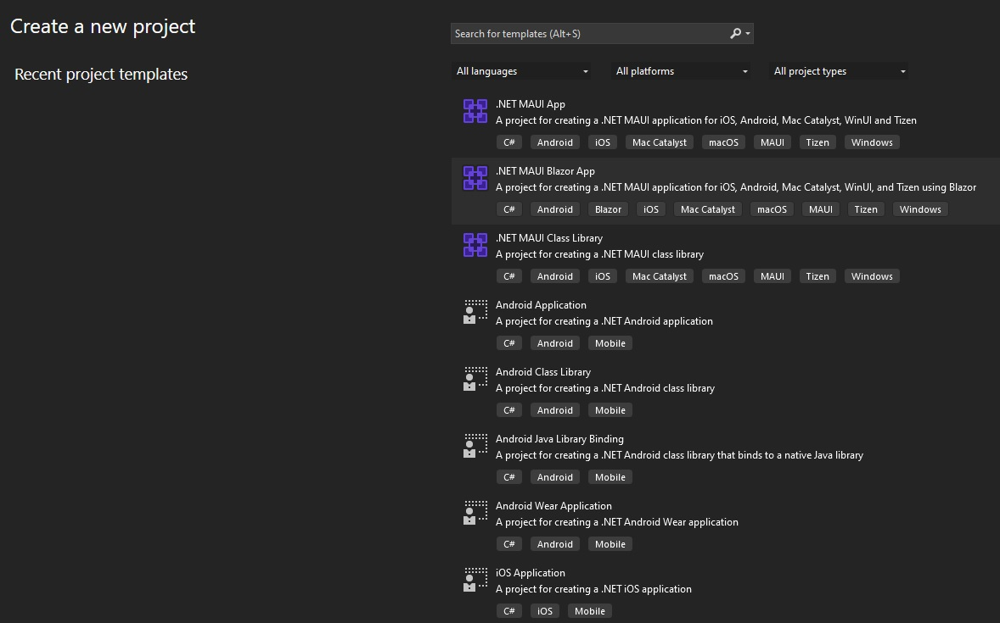

# Getting Started with Ignite UI for Blazor .NET MAUI

This topic provides step-by-step instructions for creating .NET MAUI Blazor applications with Ignite UI for Blazor using Visual Studio 2022 Preview.

> [!NOTE]
> .NET Multi-platform App UI (.NET MAUI) is currently in preview. This content relates to a pre-release product that may be substantially modified before it's released. Infragistics makes no warranties, express or implied, with respect to the information provided here.

## Prerequisites

* .NET SDK 6.0.101 or above
* Visual Studio 2022 Preview 17.1 or above, with the following workloads:
    - Mobile development with .NET
    - ASP.NET and Web Development

## Create a New .NET MAUI Blazor Project
The steps below describe how to create a new .NET MAUI Blazor project. If you want to add Ignite UI for Blazor to an existing application, go to the [**Install Ignite UI for Blazor Package**](#install-ignite-ui-for-blazor) section.

Start Visual Studio 2022 Preview and click **Create a new project** on the start page, select the **.NET MAUI Blazor App (Preview)** template, and click **Next**.



Provide a project name and location, and click **Create**


## Install Ignite UI for Blazor

Ignite UI for Blazor is delivered via NuGet packages. To use the Ignite UI for Blazor components in your Blazor applications, you must first install the appropriate NuGet packages.

In Visual Studio, open the NuGet package manager by selecting **Tools** → **NuGet Package Manager** → **Manage NuGet Packages for Solution**. Search for and install the **IgniteUI.Blazor** NuGet package.

For more information on installing Ignite UI for Blazor using NuGet, read the [Installing Ignite UI for Blazor](general-installing-blazor.md) topic.

## Register Ignite UI for Blazor

1 - Open the **MauiProgram.cs** file and register the Ignite UI for Blazor Service by calling **builder.Services.AddIgniteUIBlazor()**:

```
public static class MauiProgram
{
	public static MauiApp CreateMauiApp()
	{
		var builder = MauiApp.CreateBuilder();
		builder
			.UseMauiApp<App>()
			.ConfigureFonts(fonts =>
			{
				fonts.AddFont("OpenSans-Regular.ttf", "OpenSansRegular");
			});

		builder.Services.AddMauiBlazorWebView();
#if DEBUG
		builder.Services.AddBlazorWebViewDeveloperTools();
#endif

        //register IgniteUI for Blazor
		builder.Services.AddIgniteUIBlazor();

		return builder.Build();
	}
}
```

2 - Add the **IgniteUI.Blazor.Controls** namespace in the **_Imports.razor** file:

```razor
@using IgniteUI.Blazor.Controls
```

3 - Add the Style Sheet in the **<head\>** element of the **wwwroot/index.html** file:

```razor
<head>
    ...
    <link href="_content/IgniteUI.Blazor/themes/light/bootstrap.css" rel="stylesheet" />
</head>
```

4 - Add Script Reference to the **wwwroot/index.html** file:

```razor
	<script src="_content/IgniteUI.Blazor/app.bundle.js"></script>
	<script src="_framework/blazor.webview.js" autostart="false"></script>
```

## Add Ignite UI for Blazor Component

Add an Ignite UI for Blazor component to your razor page:

```razor
<IgbCard style="width:350px">
    <IgbCardMedia>
        
    </IgbCardMedia>
    <IgbCardHeader>
        <h4>Jane Doe</h4>
        <h6>Professional Photographer</h6>
    </IgbCardHeader>
    <IgbCardContent>Hi! I'm Jane, photographer and filmmaker.
        Photography is a way of feeling, of touching,
        of loving. What you have caught on film is captured forever...
        it remembers little things, long after you have
        forgotten everything.</IgbCardContent>
    <IgbCardActions>
        <IgbButton>More Info</IgbButton>
    </IgbCardActions>
</IgbCard>
```

Build and run the .NET MAUI Blazor app for Windows.


> [!NOTE]
> For more information about building corss platform applications with .NET MAUI, visit the [Microsoft Documentation](https://docs.microsoft.com/en-us/dotnet/maui/get-started/first-app?pivots=devices-android).