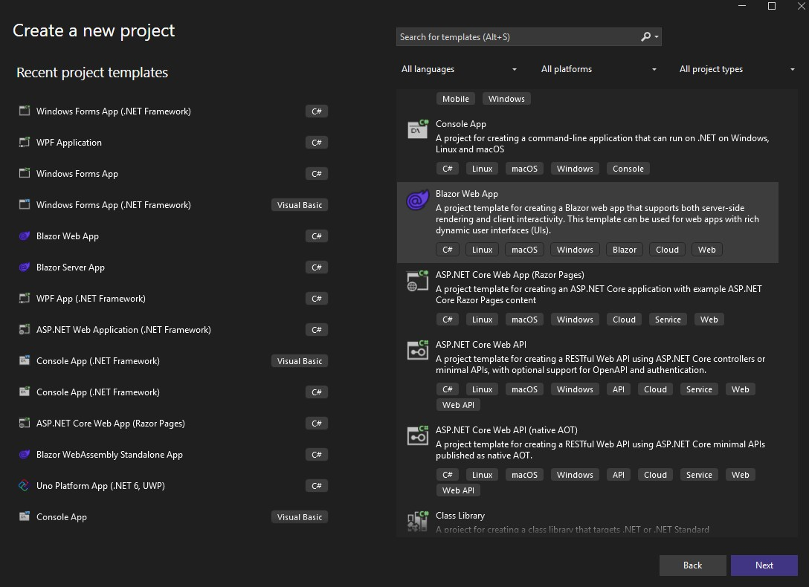
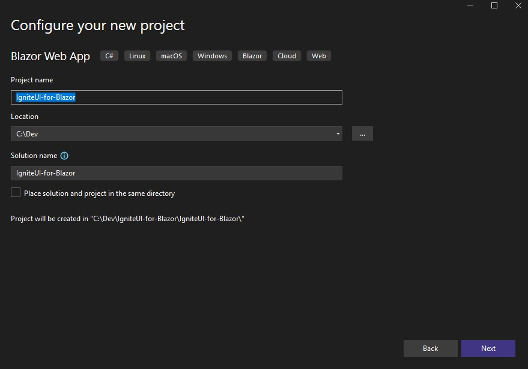

# Getting Started with Ignite UI for Blazor Web App

This topic provides step-by-step instructions for creating Blazor Web App applications with Ignite UI for Blazor using Visual Studio.

## Create a New Blazor Web App Project
The steps below describe how to create a new Blazor Web App project. If you want to add Ignite UI for Blazor to an existing application, go to the [**Install Ignite UI for Blazor Package**](#install-ignite-ui-for-blazor) section.

Start Visual Studio 2022 and click **Create a new project** on the start page, select the **Blazor Web App** template, and click **Next**.



Provide a project name and location, and click **Next**



In the next step, keep note of the optional Interactivty location setup, as it defaults to per-page, within the Client project. eg. @rendermode InteractiveAuto. The other option, Global, moves the Interactivty rendermode setup to App.razor, in one location, within the shared Blazor project. eg. <Routes @rendermode="InteractiveAuto"/>

Specify additional project options, and click **Create**


## Install Ignite UI for Blazor

Ignite UI for Blazor is delivered via NuGet packages. To use the Ignite UI for Blazor components in your Blazor applications, you must first install the appropriate NuGet packages.

In Visual Studio, open the NuGet package manager by selecting **Tools** → **NuGet Package Manager** → **Manage NuGet Packages for Solution**. Search for and install the **IgniteUI.Blazor** NuGet package.

For more information on installing Ignite UI for Blazor using NuGet, read the [Installing Ignite UI for Blazor](general-installing-blazor.md) topic.

## Register Ignite UI for Blazor

### .NET 8 and Later Applications

1 - Open the server's **Program.cs** file and register the Ignite UI for Blazor Service by calling **builder.Services.AddIgniteUIBlazor** function:

```razor
var builder = WebApplication.CreateBuilder(args);

// Add services to the container.
builder.Services.AddRazorComponents()
    .AddInteractiveServerComponents()
    .AddInteractiveWebAssemblyComponents();

builder.Services.AddIgniteUIBlazor();

var app = builder.Build();
```

Open the Client's **Program.cs** and add the same service.

```razor
var builder = WebAssemblyHostBuilder.CreateDefault(args);

builder.Services.AddIgniteUIBlazor();

await builder.Build().RunAsync();
```

2 - Add the **IgniteUI.Blazor.Controls** namespace in the **_Imports.razor** files in both the client and server projects:

```razor
@using IgniteUI.Blazor.Controls
```

3 - Add the Style Sheet in the **<head\>** element of the **wwwroot/index.html** file:

```razor
<head>
    <link href="_content/IgniteUI.Blazor/themes/light/bootstrap.css" rel="stylesheet" />
</head>
```

4 - Add Script Reference to the **wwwroot/index.html** file:

```razor
<script src="_content/IgniteUI.Blazor/app.bundle.js"></script>
<script src="_framework/blazor.web.js"></script>
```

## Add Ignite UI for Blazor Component

Add an Ignite UI for Blazor component to your razor page (Please note that Ignite UI for Blazor components require interactive render modes like **InteractiveServer**, **InteractiveWebAssembly**, or **InteractiveAuto**. For "Per page/component" interactivity, ensure interactive render mode is specified on pages using Ignite UI components.):

```razor
<IgbCard style="width:350px">
    <IgbCardMedia>
        
    </IgbCardMedia>
    <IgbCardHeader>
        <h4>Jane Doe</h4>
        <h6>Professional Photographer</h6>
    </IgbCardHeader>
    <IgbCardContent>Hi! I'm Jane, photographer and filmmaker.
        Photography is a way of feeling, of touching,
        of loving. What you have caught on film is captured forever...
        it remembers little things, long after you have
        forgotten everything.</IgbCardContent>
    <IgbCardActions>
        <IgbButton>More Info</IgbButton>
    </IgbCardActions>
</IgbCard>
```

Build and run the Blazor app.


