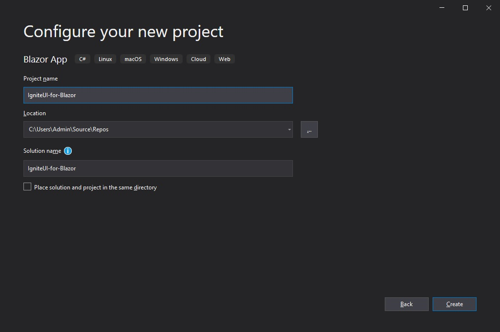
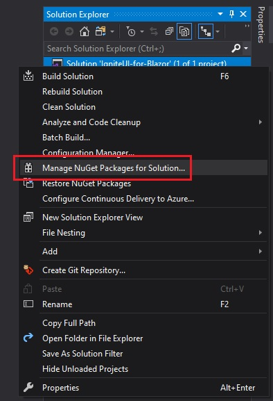
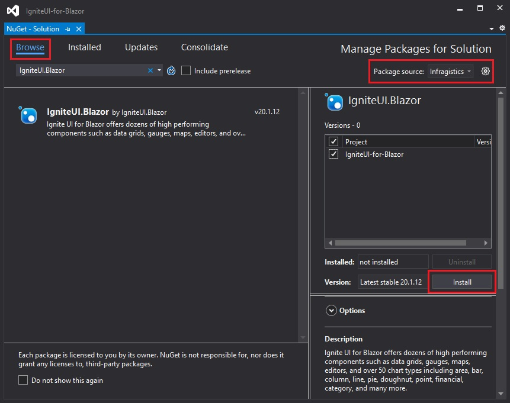

# Getting Started With $ProductName$

The $ProductName$ is a complete set of $PlatformShort$ components designed to enable developers to build the most modern, high-performance HTML5 & TypeScript apps for modern desktop browsers.

<!-- Angular, React, WebComponents -->

## Setting Up Computer

Before you can run $ProductName$, there are 2 steps to get everything on your machine set up to run any $PlatformShort$ app, including $ProductName$, and to build $PlatformShort$ apps. To get started, you must install both NodeJS and Visual Studio Code on your machine. Modern web development with $PlatformShort$ requires NodeJS, it’s sort of like an ASP.NET app running in the browser and requires ASP.NET runtime deployed on the server. For development, there is nothing better than Visual Studio Code to build $PlatformShort$ apps. Getting started is easy, just download and install both Node.js and Visual Studio Code.

<div style="display:block;width:100%;margin:50px;">
    <div style="display:inline-block;width:45%;text-align:center;">
      
      <a target="_blank" href="https://nodejs.org/en/download/"
         style="color:white;background-color:#09f;text-decoration:none;font-weight:700;font-size:16px;padding: 5px 25px 5px 15px;">
        DOWNLOAD NODE JS
      </a>
    </div>
    <div style="display:inline-block;width:45%;text-align:center;">
      
      <a target="_blank" href="https://code.visualstudio.com/download"
         style="color:white;background-color:#09f;text-decoration:none;font-weight:700;font-size:16px;padding: 5px 25px 5px 15px;">
        DOWNLOAD VS CODE
      </a>
    </div>
</div>

<!-- using a note because there is no other way to build flag content for specific platform. -->
> [!NOTE]
> For React:
> Now that we have everything we need, we can create a new React application.  <br>
> Open **VS Code**, select **Terminal** menu, **New Terminal** option and type this command in terminal window: <br>
> **npx create-react-app my-app-name --typescript**
> <br> or <br>
> **yarn create react-app my-app-name --typescript**
> <br> Refer to this <a href="https://facebook.github.io/create-react-app/docs/adding-typescript" target="_blank">website</a> for more information on above commands.

<!-- end: Angular, React, WebComponents -->

<!-- commented out because this section is present in the "Updating Existing App"
You need to open $PlatformShort$ app in **VS Code** and install the following packages for $ProductName$ using these commands:

- **npm install --save {PackageCharts} {PackageCore}**
- **npm install --save {PackageExcel} {PackageCore}**
- **npm install --save {PackageGauges} {PackageCore}**
- **npm install --save {PackageGrids} {PackageCore}**
- **npm install --save {PackageMaps} {PackageCore}**
- **npm install --save {PackageSpreadsheet} {PackageCore}**

Or

- **yarn add {PackageCharts} {PackageCore}**
- **yarn add {PackageExcel} {PackageCore}**
- **yarn add {PackageGauges} {PackageCore}**
- **yarn add {PackageGrids} {PackageCore}**
- **yarn add {PackageMaps} {PackageCore}**
- **yarn add {PackageSpreadsheet} {PackageCore}**

Lastly,  -->

<!-- WebComponents -->
## Step 1 - Create the Web Component Project

1 - Open a command line and create a directory named **wc-html**
<pre style="background:#141414;color:white;display:inline-block;padding:16x;margin-top:10px;font-family:'Consolas';border-radius:5px;width:100%">
> mkdir wc-html
</pre>

2 - Change the command line path to the newly created directory
<pre style="background:#141414;color:white;display:inline-block;padding:16x;margin-top:10px;font-family:'Consolas';border-radius:5px;width:100%">
> cd wc-html
</pre>

3 - Initialize **npm** in the dirctory
<pre style="background:#141414;color:white;display:inline-block;padding:16x;margin-top:10px;font-family:'Consolas';border-radius:5px;width:100%">
> npm init -y
</pre>

4 - Install the **webpack** bundler and the **webpack cli** as a developer dependency
<pre style="background:#141414;color:white;display:inline-block;padding:16x;margin-top:10px;font-family:'Consolas';border-radius:5px;width:100%">
> npm install webpack webpack-cli --save-dev
</pre>

> [!Note]
> Webpack is a module bundler. Its main purpose is to bundle JavaScript files for usage in a browser, yet it is also capable of transforming, bundling, or packaging just about any resource or asset.

5 - Open the project in **VS Code**
<pre style="background:#141414;color:white;display:inline-block;padding:16x;margin-top:10px;font-family:'Consolas';border-radius:5px;width:100%">
> code .
</pre>
6 - Create a new file named **index.html**

```
<html>
    <head>
        <title>Getting Started with Ignite UI for Web Components</title>
    </head>
    <body>
        
    </body>
</html>
```

7 - Create a new folder named **src**, and within that folder create a new file named **index.js**. Your project structure should look like this:


8 - Update the **package.config** file to include a build script using **webpack**

```
  "scripts": {
    "build": "webpack src/index.js -o dist/index.bundle.js"
  },
```

> [!Note]
> This script will use webpack to bundle the **index.js** file into another file called **index.bundle.js** and place it into a folder name **dist**.

## Step 2 - Install Polyfills

1 - Open a terminal in **VS Code** (View -> Terminal, or CTRL+`) and install the web component polyfills package using npm
<pre style="background:#141414;color:white;display:inline-block;padding:16x;margin-top:10px;font-family:'Consolas';border-radius:5px;width:100%">
> npm install @webcomponents/custom-elements
</pre>

2 - Import the web component polyfills into **index.js**
```tsx
import '@webcomponents/custom-elements/custom-elements.min';
import '@webcomponents/custom-elements/src/native-shim.js';
```

## Step 3 - Install Ignite UI for Web Components

1. Install the Ignite UI for Web Component using **npm** ********** todo update this*******. In this example, we will install the Spreadsheet web component.
<pre style="background:#141414;color:white;display:inline-block;padding:16x;margin-top:10px;font-family:'Consolas';border-radius:5px;width:100%">
> npm install igniteui-webcomponents-core
> npm install igniteui-webcomponents-excel
> npm install igniteui-webcomponents-spreadsheet
</pre>

2. Import the **ModuleManager** and the web component modules into **index.js**
```
// module manager for registering the modules
import { ModuleManager } from 'igniteui-webcomponents-core';

// spreadsheet modules
import { IgcExcelModule } from 'igniteui-webcomponents-excel';
import { IgcSpreadsheetModule } from 'igniteui-webcomponents-spreadsheet';
```

3. Register the web component modules with the **ModuleManager**
```
// register the modules
ModuleManager.register(
    IgcExcelModule,
    IgcSpreadsheetModule
);
```

4. Add the `igc-spreadsheet` web component to the body of **index.html**
```
<body>
    <igc-spreadsheet id="spreadsheet" height="500px" width="100%">
    </igc-spreadsheet>
</body>
```

## Step 3 - Build and Run the Web Component Project

1. Open a terminal in **VS Code** and execute the **build** script
<pre style="background:#141414;color:white;display:inline-block;padding:16x;margin-top:10px;font-family:'Consolas';border-radius:5px;width:100%">
> npm run build
</pre>

> [!Note]
> This command will run the build script we created earlier. The build script will generate a file named **index.bundle.js** in a folder named **dist**

2. Add the **index.bundle.js** script to the body of **index.html** after the `igc-spreadsheet`.
```
<body>
    <igc-spreadsheet id="spreadsheet" height="500px" width="100%">
    </igc-spreadsheet>

    <script src="dist/index.bundle.js"></script>
</body>
```

3. To run the project, launch a local development server. In this example, we are using Live Server. Right-click within the editor of **index.html** and select **Open with Live Server**


> [!Note]
> Live Server is an extension to Visual Studio Code that allows you to launch a local development server with live reload feature for static & dynamic pages. This extension can be installed via the Visual Studio Code Extensions tab, or by downloading it from the [Visual Studio Marketplace](https://marketplace.visualstudio.com/items?itemName=ritwickdey.LiveServer).

4. Navigate to the **index.html** using a web browser on your local server, and the Ignite UI for Web Components spreadsheet should now be rendered in your browser.


<!-- end: WebComponents -->

<!-- Angular, React -->
## Updating Existing App

If you want to use $ProductName$ in an existing $PlatformShort$ CLI project (one that you have from before). We have you covered! All you have to do is execute these commands:

<pre style="background:#141414;color:white;display:inline-block;padding:16x;margin-top:10px;font-family:'Consolas';border-radius:5px;width:100%">
npm install --save {PackageCharts} {PackageCore}
npm install --save {PackageExcel} {PackageCore}
npm install --save {PackageGauges} {PackageCore}
npm install --save {PackageGrids} {PackageCore}
npm install --save {PackageMaps} {PackageCore}
npm install --save {PackageSpreadsheet} {PackageCore}
</pre>

Or

<pre style="background:#141414;color:white;display:inline-block;padding:16x;margin-top:10px;font-family:'Consolas';border-radius:5px;width:100%">
yarn add {PackageCharts} {PackageCore}
yarn add {PackageExcel} {PackageCore}
yarn add {PackageGauges} {PackageCore}
yarn add {PackageGrids} {PackageCore}
yarn add {PackageMaps} {PackageCore}
yarn add {PackageSpreadsheet} {PackageCore}
</pre>

This will automatically install packages for $ProductName$, along with all of their dependencies, font imports and styles references to the existing project.

## Importing Modules

First we have to import the required modules of the components we want to use. We will go ahead and do this for the [**GeographicMap**](geo-map.md) component.

* GeographicMapModule
* DataChartInteractivityModule

```ts
import { IgrGeographicMapModule } from 'igniteui-react-maps';
import { IgrGeographicMap } from 'igniteui-react-maps';
import { IgrDataChartInteractivityModule } from 'igniteui-react-charts';

IgrGeographicMapModule.register();
IgrDataChartInteractivityModule.register();
```

```ts
import { IgcGeographicMapModule } from 'igniteui-webcomponents-maps';
import { IgcGeographicMapComponent } from 'igniteui-webcomponents-maps';
import { IgcDataChartInteractivityModule } from 'igniteui-webcomponents-charts';
import { ModuleManager } from 'igniteui-webcomponents-core';

ModuleManager.register(
    IgcGeographicMapModule,
    IgcDataChartInteractivityModule
);

```

## Using Components

We are now ready to use the $ProductName$ map component in our markup! Let's go ahead and define it:

```tsx
// App.txs
render() {
    return (
        <div style={{height: "100%", width: "100%" }}>
            <IgrGeographicMap
            width="800px"
            height="500px"
            zoomable="true" />
        </div>
    );
}
```

```html
<div style="height: 100%, width: 100%">
    <igc-geographic-map
      width="800px"
      height="500px"
      zoomable="true">
    </igc-geographic-map>
</div>
```

## Running Application

Finally, we can run our new application by using one of the following commands:

<pre style="background:#141414;color:white;display:inline-block;padding:16x;margin-top:10px;font-family:'Consolas';border-radius:5px;width:100%">
npm run-script start
</pre>

After executing this command, your project will be built and served locally on your computer. It will automatically open in your default browser and you will be able to use $ProductName$ components in your project.

The final result should look something like this screenshot:


<!-- end: Angular, React -->

<!-- Blazor -->

The $ProductName$ is a complete set of $PlatformShort$ components designed to enable developers to build the most modern, high-performance apps for modern desktop browsers.

## Step 1 - Create a New Blazor Project
The steps below describe how to create a new Blazor project. If you want to add Ignite UI for Blazor components to an existing application, go to [**Step 2**](#step-2---install-the-ignite-ui-for-blazor-nuget-package).

1 - Start Visual Studio 2019 and click **Create a new project** on the start page, select the **Blazor App** template, and click **Next**.


2 - Provide a project name and description, and click **Create**



3 - Choose which Blazor template you'd like to use. Server or Web Assembly (WASM)


## Step 2 - Install the Ignite UI for Blazor NuGet package

1 - Right click the Solution, or Project, and select **Manage NuGet Packages for Solution**.
   


2 - In the package manager dialog, open the **Browse** tab, select the **Infragistics** package source, and install the **IgniteUI.Blazor** NuGet package into the project.
   


> [!Note]
> If you are a trial user, you can install the `IgniteUI.Blazor` trial NuGet package found on [NuGet.org](https://www.nuget.org/packages/IgniteUI.Blazor/20.1.15-trial).

> [!Note]
> If you do not have an Infragistics package source available, learn how to add it by reading the [Infragistics NuGet feed topic](./nuget-feed.md).

## Step 3 - Register Ignite UI for Blazor

1 - Link the static files. Add the `_content/IgniteUI.Blazor/app.bundle.js` script to the project just above the default Blazor script.

*Web Assembly - wwwroot/index.html*
```razor
<script src="_content/IgniteUI.Blazor/app.bundle.js"></script>
<script src="_framework/blazor.webassembly.js"></script>
```
*Server - Pages/_Host.cshtml*

```razor
<script src="_content/IgniteUI.Blazor/app.bundle.js"></script>
<script src="_framework/blazor.server.js"></script>
```

2 - Register services and components modules

*Web Assembly* - Call the `AddIgniteUIBlazor` method in the `Program.cs` file in the `Main` method 

```razor
public static async Task Main(string[] args)
{
    // ...

    builder.Services.AddIgniteUIBlazor(
        typeof(DataGridModule)
    );
}
```
*Server* - Call the `AddIgniteUIBlazor` method in the `Startup.cs` file in the `ConfigureServices` method
```razor
public void ConfigureServices(IServiceCollection services)
{
    // ...

    services.AddIgniteUIBlazor(
        typeof(DataGridModule)
    );
}
```
> [!Note]
> In this example, we are registering the `DataGridModule` for use in our Blazor application. Ignite UI for Blazor components, and their features, must have their respective modules registered in order to work properly in your Blazor applications. Please see each component's documentation for more information.

3 - Add the `IgniteUI.Blazor.Controls` namespace in `_Imports.razor`

```razor
@using IgniteUI.Blazor.Controls;
```

4 - Add Ignite UI for Blazor Components

```razor
<DataGrid DataSource="data" />
</Datagrid>
```
> [!Note]
> Ignite UI for Blazor components, and their features, must have their respective modules registered in the `AddIgniteUIBlazor` method. Please see each component's documentation for more information.

<!-- end: Blazor -->