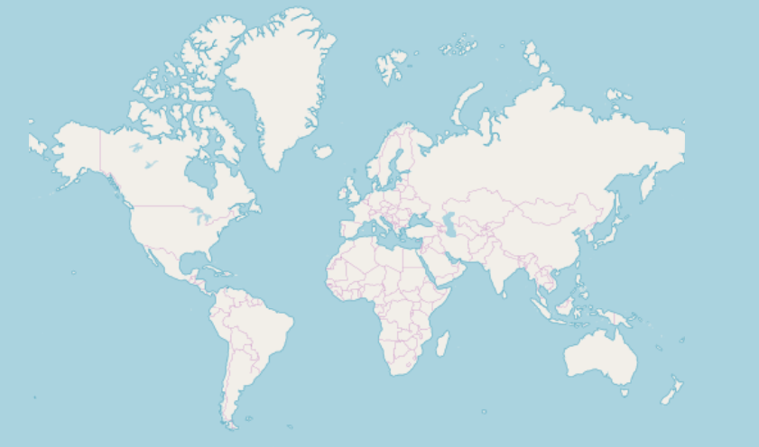

<!-- React -->
# Getting Started With {ProductName}

This topic provides step-by-step instructions for creating React applications with Ignite UI for React

## Prerequisites

1. Install NodeJS.
2. Install Visual Studio Code.

<div>
    <div style="display:inline-block;width:45%;text-align:center;">
      
      <a target="_blank" href="https://nodejs.org/en/download/" class="no-external-icon"
         style="color:white;background-color:#09f;text-decoration:none;font-weight:700;font-size:16px;padding: 5px 15px 5px 15px;">
        DOWNLOAD NODE
      </a>
    </div>
    <div style="display:inline-block;width:45%;text-align:center;">
      
      <a target="_blank" href="https://code.visualstudio.com/download" class="no-external-icon"
         style="color:white;background-color:#09f;text-decoration:none;font-weight:700;font-size:16px;padding: 5px 15px 5px 15px;">
        DOWNLOAD VS CODE
      </a>
    </div>
</div>

## Creating New React Project

With above prerequisites installed, we can create a new React application.

1 - Open **VS Code**, select **Terminal** menu and then **New Terminal** option.

2 - Type one of these commands in terminal window:

```cmd
npx create-react-app MyAppName --typescript
```
```cmd
yarn create react-app MyAppName --typescript
```

Depending on the approach `npx` or `yarn` will be required. Refer to this <a href="https://facebook.github.io/create-react-app/docs/adding-typescript" target="_blank">website</a> for more information on above commands.

```cmd
cd MyAppName
```

<!-- end: React -->

<!-- WebComponents -->
# {ProductName} Packages Overview

{ProductName} is a complete set of UI widgets, components, UI kits for design tools and supporting services for Web Components. Designed to enable developers to build the most modern, high-performance HTML5 & JavaScript apps for modern desktop browsers, mobile experiences and progressive web apps (PWA’s) targeting the browsers web components APIs.

## Charts & Graphs
{ProductName} contains a library of [Charts & Graphs](charts/chart-overview.md) that lets you visualize any type of data through its 65+ types of chart series and combinations into stunning and interactive charts and dashboards. Built for speed and beauty, designed to work on every modern browser and with complete touch and interactivity, you can quickly build responsive visuals on any device.

## Gauges
{ProductName} provides [Radial Gauge](radial-gauge.md), [Linear Gauge](linear-gauge.md), and [Bullet Graph](bullet-graph.md) components used to illustrate data in an easy and intuitive way. The [Radial Gauge](radial-gauge.md) has a variety of customization options in order to create a predefined shape and scale. The [Linear Gauge](linear-gauge.md) provides a simple view of a value compared against a scale and one or more ranges. It supports one scale, one set of tick marks and one set of labels. The [Bullet Graph](bullet-graph.md) component that lets you create data visualizations, replacing meters and gauges that are used on dashboards with simple bar charts.

## Maps
{ProductName} [Geographic Maps](geo-map.md) brings the ability to visualize geographic data in your application. It can render data sets consisting of many geographic locations in shapes of markers, lines, polygons, or even interactive bitmaps. It allows you to overlay multiple map layers with geographic data, mark specific geographic locations and display information using custom markers and colors.

## Grids & Inputs
{ProductName} provides several [Grids](grids/grids-header.md) components that allows you to bind and display data with little configuration in form of [Data Grid](grids/data-grid.md), [List](grids/list.md), [Tree](grids/tree.md), and even [Spreadsheet](spreadsheet-overview.md). It also provides features such as filtering, sorting, grouping, pinning and more.
                                                                                                          
## Buttons, Inputs, Layouts & Menus  
{ProductName} provides various types of [Buttons](inputs/button.md), [Inputs](inputs/input.md), [Menus](menus/navbar.md), and [Layouts](layouts/tabs.md) that give you the ability to build modern web applications using encapsulation and the concept of reusable components in a dependency-free approach. See the [Storybook Here](https://igniteui.github.io/igniteui-webcomponents). These components are based on the [Indigo Design System](https://www.infragistics.com/products/appbuilder/ui-toolkit), are fully supported by [App Builder](https://appbuilder.indigo.design/) and are backed by ready-to-use UI kits for Sketch, Adobe XD and Figma.

# Getting Started With {ProductName}

This section provides step-by-step instructions for creating Web Components application with Ignite UI for Web Components.


## Install IgniteUI CLI

To create an application from scratch and configure it to use the Ignite UI Web Components you can use the Ignite UI CLI. The first step is to install the respective package globally as follows:

```cmd
npm install -g igniteui-cli
```

If you want to get a guided experience through the available options, you can initialize the step by step mode that will help you create and setup your new application. To start the guide, simply run the `ig` command:

```cmd
ig
```

Then choose Web Components as framework, select `Base` project template, add a specific component/view or select `Complete & Run`.
Additionally, you can read more about the Ignite UI CLI [here](general-cli-overview.md).

## Install Polyfills

Run this command to install the web component polyfills:

```bash
npm install @webcomponents/custom-elements
```

Then import the web component polyfills into index.js:

```ts
import '@webcomponents/custom-elements/custom-elements.min';
import '@webcomponents/custom-elements/src/native-shim.js';
```

## Install Ignite UI for Web Components
In order to use the Ignite UI Web Components in your application you should install the `igniteui-webcomponents` package:

```cmd
npm install igniteui-webcomponents
```

Next you will need to import the components that you want to use in your `index.ts` file. You could import one or more components using the `defineComponents` function like this:

```ts
import { defineComponents, IgcAvatarComponent, IgcBadgeComponent } from 'igniteui-webcomponents';

defineComponents(IgcAvatarComponent, IgcBadgeComponent);
```

You could also import all of the components using the `defineAllComponents` function:

```ts
import { defineAllComponents } from 'igniteui-webcomponents';

defineAllComponents();
```

> [!Note]
> Importing all of the components will increase the bundle size of your application. That's why we recommend you to import only the components that you are actually using.

The last step is to import the necessary CSS for our components so that they are styled properly:

```ts
import 'igniteui-webcomponents/themes/light/bootstrap.css';
```

After the components are imported you can use them in your html:

```html
<igc-avatar initials="AZ"></igc-avatar>
<igc-badge></igc-badge>
```

## Install Charts and Map Packages

### Step 1 - Create the Web Component Project

1 - Open a command line and create a directory named **wc-html**
```cmd
mkdir wc-html
```

2 - Change the command line path to the newly created directory
```cmd
cd wc-html
```

3 - Initialize **npm** in the directory
```cmd
npm init -y
```

4 - Install the **webpack** bundler and the **webpack cli** as a developer dependency
```cmd
npm install webpack webpack-cli --save-dev
```

> [!Note]
> Webpack is a module bundler. Its main purpose is to bundle JavaScript files for usage in a browser, yet it is also capable of transforming, bundling, or packaging just about any resource or asset.

5 - Open the project in **VS Code**
```cmd
code .
```

6 - Create a new file named **index.html** with this code:

```html
<html>
    <head>
        <title>Getting Started with Ignite UI for Web Components</title>
    </head>
    <body>

    </body>
</html>
```

7 - Create a new folder named **src**, and within that folder create a new file named **index.js**. Your project structure should look like this:


8 - Update the **package.json** file to include a build script using **webpack**

```json
  "scripts": {
    "build": "webpack ./src/index.js -o ./dist/ --output-filename index.bundle.js"
  },
```

> [!Note]
> This script will use webpack to bundle the **index.js** file into another file called **index.bundle.js** and place it into a folder named **dist**.
>
> If a **javaScript heap out of memory** issue occurs while building you can increase the heap size by using this build command instead:

```json
"scripts": {
    "build": "node --max_old_space_size=8192 node_modules/webpack/bin/webpack src/index.js -o dist/index.bundle.js"
},
```

### Step 2 - Install Polyfills

1 - Open a terminal in **VS Code** (**View** -> **Terminal** menu or press <kbd>CTRL</kbd> + <kbd>`</kbd> keys)

2 - Type this command to install the web component polyfills:

```cmd
npm install @webcomponents/custom-elements
```

3 - Import the web component polyfills into **index.js**
```ts
import '@webcomponents/custom-elements/custom-elements.min';
import '@webcomponents/custom-elements/src/native-shim.js';
```

### Step 3 - Install Ignite UI for Web Components and lit-html

1 - Install the Ignite UI for Web Component using **npm**. In this example, we will install the Map web component:

```cmd
npm install --save {PackageCore}
npm install --save {PackageCharts}
npm install --save {PackageMaps}
npm install lit-html
```

2 - Import the Geographic Map modules and **ModuleManager** in **index.js** file:

```ts
import { IgcGeographicMapModule } from 'igniteui-webcomponents-maps';
import { IgcDataChartInteractivityModule } from 'igniteui-webcomponents-charts';
// module manager for registering the modules
import { ModuleManager } from 'igniteui-webcomponents-core';
```

3 - Register the Geographic Map modules using the **ModuleManager**

```ts
ModuleManager.register(
    IgcGeographicMapModule,
    IgcDataChartInteractivityModule
);
```

4 - Add the Geographic Map web component to the body of **index.html** file

```html
<body>
    <igc-geographic-map id="map" height="500px" width="100%">
    </igc-geographic-map>
</body>
```

### Step 4 - Build and Run the Web Component Project

1 - Open a terminal in **VS Code** and execute the **build** script

```cmd
npm run build
```

> [!Note]
> This command will run the build script we created earlier. The build script will generate a file named **index.bundle.js** in a folder named **dist**

2 - Add the **index.bundle.js** script to the end of **body** element in **index.html** file.

```html
<body>
    <igc-geographic-map id="map" height="500px" width="100%">
    </igc-geographic-map>

    <script src="dist/index.bundle.js"></script>
</body>
```

3 - To run the project, launch a local development server. In this example, we are using Live Server. Right-click within the editor of **index.html** and select **Open with Live Server**

<!--  -->

> [!Note]
> Live Server is an extension to Visual Studio Code that allows you to launch a local development server with live reload feature for static & dynamic pages. This extension can be installed via the Visual Studio Code Extensions tab, or by downloading it from the [Visual Studio Marketplace](https://marketplace.visualstudio.com/items?itemName=ritwickdey.LiveServer).

4 - Navigate to the **index.html** using a web browser on your local server. The final result should show interactive map of the world:

<!--  -->

`sample="/maps/geo-map/display-osm-imagery", height="750", alt="{Platform} Overview Example"`


<!-- end: WebComponents -->

<!-- Angular, React -->

## Updating Existing App

If you want to use {ProductName} in an existing {Platform} CLI project (one that you have from before). We have you covered! All you have to do is execute these commands:

```cmd
npm install --save {PackageCommon}
npm install --save {PackageCharts} {PackageCore}
npm install --save {PackageExcel} {PackageCore}
npm install --save {PackageGauges} {PackageCore}
npm install --save {PackageGrids} {PackageCore}
npm install --save {PackageMaps} {PackageCore}
npm install --save {PackageSpreadsheet} {PackageCore}
```

Or

```cmd
yarn add {PackageCharts} {PackageCore}
yarn add {PackageExcel} {PackageCore}
yarn add {PackageGauges} {PackageCore}
yarn add {PackageGrids} {PackageCore}
yarn add {PackageMaps} {PackageCore}
yarn add {PackageSpreadsheet} {PackageCore}
```

This will automatically install packages for {ProductName}, along with all of their dependencies, font imports and styles references to the existing project.

## Importing Component Modules

First we have to import the required modules of the components we want to use. We will go ahead and do this for the [**GeographicMap**](geo-map.md) component.


```razor
builder.Services.AddIgniteUIBlazor(
    typeof(IgbGeographicMapModule),
    typeof(IgbDataChartInteractivityModule)
);
```

```ts
import { IgrGeographicMapModule, IgrGeographicMap } from 'igniteui-react-maps';
import { IgrDataChartInteractivityModule } from 'igniteui-react-charts';

IgrGeographicMapModule.register();
IgrDataChartInteractivityModule.register();
```

```ts
import { IgcGeographicMapModule } from 'igniteui-webcomponents-maps';
import { IgcGeographicMapComponent } from 'igniteui-webcomponents-maps';
import { IgcDataChartInteractivityModule } from 'igniteui-webcomponents-charts';
import { ModuleManager } from 'igniteui-webcomponents-core';

ModuleManager.register(
    IgcGeographicMapModule,
    IgcDataChartInteractivityModule
);
```

## Using Components

We are now ready to use the {ProductName} map component in our markup! Let's go ahead and define it:

```tsx
// App.txs
function App() {
  return (
    <div style={{ height: "100%", width: "100%" }}>
      <IgrGeographicMap
        width="800px"
        height="500px"
        zoomable="true" />
    </div>
  );
}
```

```html
<div style="height: 100%, width: 100%">
    <igc-geographic-map
      width="800px"
      height="500px"
      zoomable="true">
    </igc-geographic-map>
</div>
```

## Running Application

Finally, we can run our new application by using one of the following commands:

```cmd
npm run-script start
```

After executing this command, your project will be built and served locally on your computer. It will automatically open in your default browser and you will be able to use {ProductName} components in your project. The final result should show interactive map of the world:

<!--  -->

`sample="/maps/geo-map/display-osm-imagery", height="750", alt="{Platform} Overview Example"`

<!-- end: Angular, React -->

<!-- Blazor -->
# Getting Started With {ProductName}

This topic provides step-by-step instructions for creating Blazor Server applications with Ignite UI for Blazor using Visual Studio.

## Create a New Blazor Server Project
The steps below describe how to create a new Blazor Server project. If you want to add Ignite UI for Blazor to an existing application, go to the [**Install Ignite UI for Blazor Package**](#install-ignite-ui-for-blazor) section.

Start Visual Studio 2022 and click **Create a new project** on the start page, select the **Blazor Server App** template, and click **Next**.


Provide a project name and location, and click **Next**


Specify additional project options, and click **Create**


## Install Ignite UI for Blazor

Ignite UI for Blazor is delivered via NuGet packages. To use the Ignite UI for Blazor components in your Blazor applications, you must first install the appropriate NuGet packages.

In Visual Studio, open the NuGet package manager by selecting **Tools** → **NuGet Package Manager** → **Manage NuGet Packages for Solution**. Search for and install the **IgniteUI.Blazor** NuGet package.

For more information on installing Ignite UI for Blazor using NuGet, read the [Installing Ignite UI for Blazor](general-installing-blazor.md) topic.

## Register Ignite UI for Blazor

### .NET 6 and Later Applications

1 - Open the **Program.cs** file and register the Ignite UI for Blazor Service by calling **builder.Services.AddIgniteUIBlazor** function:

```razor
var builder = WebApplication.CreateBuilder(args);

// Add services to the container.
builder.Services.AddRazorPages();
builder.Services.AddServerSideBlazor();

builder.Services.AddIgniteUIBlazor();

var app = builder.Build();
```

2 - Add the **IgniteUI.Blazor.Controls** namespace in the **_Imports.razor** file:

```razor
@using IgniteUI.Blazor.Controls
```

3 - Add the Style Sheet in the **<head\>** element of the **Pages/_Layout.cshtml** file:

```razor
<head>
    <link href="_content/IgniteUI.Blazor/themes/light/bootstrap.css" rel="stylesheet" />
</head>
```

4 - Add Script Reference to the **Pages/_Host.cshtml** file:

```razor
<script src="_content/IgniteUI.Blazor/app.bundle.js"></script>
<script src="_framework/blazor.server.js"></script>
```

### .NET 5 Applications

1 - Open the **Startup.cs** file and register the Ignite UI for Blazor Service by calling **services.AddIgniteUIBlazor()**:

```razor
public void ConfigureServices(IServiceCollection services)
{
    // ...
    services.AddIgniteUIBlazor();
}
```

2 - Add the **IgniteUI.Blazor.Controls** namespace in the **_Imports.razor** file:

```razor
@using IgniteUI.Blazor.Controls
```

3 - Add the Style Sheet in the **<head\>** element of the **Pages/_Host.cshtml** file:

```razor
<head>
    <link href="_content/IgniteUI.Blazor/themes/light/bootstrap.css" rel="stylesheet" />
</head>
```

4 - Add Script Reference to the **Pages/_Host.cshtml** file:

```razor
<script src="_content/IgniteUI.Blazor/app.bundle.js"></script>
<script src="_framework/blazor.server.js"></script>
```

## Add Ignite UI for Blazor Component

Add an Ignite UI for Blazor component to your razor page:

```razor
<IgbCard style="width:350px">
    <IgbCardMedia>
        
    </IgbCardMedia>
    <IgbCardHeader>
        <h4>Jane Doe</h4>
        <h6>Professional Photographer</h6>
    </IgbCardHeader>
    <IgbCardContent>Hi! I'm Jane, photographer and filmmaker.
        Photography is a way of feeling, of touching,
        of loving. What you have caught on film is captured forever...
        it remembers little things, long after you have
        forgotten everything.</IgbCardContent>
    <IgbCardActions>
        <IgbButton>More Info</IgbButton>
    </IgbCardActions>
</IgbCard>
```

Build and run the Blazor app.


<!-- end: Blazor -->