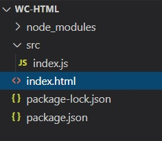

# Getting Started With $ProductName$

The $ProductName$ is a complete set of $Platform$ components designed to enable developers to build the most modern, high-performance HTML5 & TypeScript apps for modern desktop browsers.

> [!NOTE]
> You can get an example of $Platform$ projects with $ProductName$ from this [GitHub]({RepoSamples}) repository or you can follow the following instructions on how to create a new $Platform$ project.

<!-- Angular, React, WebComponents -->

## Setting Up Computer

Before you can run $ProductName$, there are 2 steps to get everything on your machine set up to run any $Platform$ app, including $ProductName$, and to build $Platform$ apps. To get started, you must install both NodeJS and Visual Studio Code on your machine. Modern web development with $Platform$ requires NodeJS, it’s sort of like an ASP.NET app running in the browser and requires ASP.NET runtime deployed on the server. For development, there is nothing better than Visual Studio Code to build $Platform$ apps. Getting started is easy, just download and install both Node.js and Visual Studio Code.

<div style="display:block;width:100%;margin:50px;">
    <div style="display:inline-block;width:45%;text-align:center;">
      
      <a target="_blank" href="https://nodejs.org/en/download/"
         style="color:white;background-color:#09f;text-decoration:none;font-weight:700;font-size:16px;padding: 5px 25px 5px 15px;">
        DOWNLOAD NODE JS
      </a>
    </div>
    <div style="display:inline-block;width:45%;text-align:center;">
      
      <a target="_blank" href="https://code.visualstudio.com/download"
         style="color:white;background-color:#09f;text-decoration:none;font-weight:700;font-size:16px;padding: 5px 25px 5px 15px;">
        DOWNLOAD VS CODE
      </a>
    </div>
</div>

<!-- React -->

## Creating New React Project

With above prerequisites installed, we can create a new React application.

1 - Open **VS Code**, select **Terminal** menu and then **New Terminal** option.

2 - Type one of these commands in terminal window:

<pre style="background:#141414;color:white;display:inline-block;padding:16x;margin-top:10px;font-family:'Consolas';border-radius:5px;width:100%">
npx create-react-app my-app-name --typescript
</pre>
<pre style="background:#141414;color:white;display:inline-block;padding:16x;margin-top:10px;font-family:'Consolas';border-radius:5px;width:100%">
yarn create react-app my-app-name --typescript
</pre>

Refer to this <a href="https://facebook.github.io/create-react-app/docs/adding-typescript" target="_blank">website</a> for more information on above commands.

<!-- end: React -->

<!-- commented out because this section is present in the "Updating Existing App"
You need to open $Platform$ app in **VS Code** and install the following packages for $ProductName$ using these commands:

- **npm install --save {PackageCharts} {PackageCore}**
- **npm install --save {PackageExcel} {PackageCore}**
- **npm install --save {PackageGauges} {PackageCore}**
- **npm install --save {PackageGrids} {PackageCore}**
- **npm install --save {PackageMaps} {PackageCore}**
- **npm install --save {PackageSpreadsheet} {PackageCore}**

Or

- **yarn add {PackageCharts} {PackageCore}**
- **yarn add {PackageExcel} {PackageCore}**
- **yarn add {PackageGauges} {PackageCore}**
- **yarn add {PackageGrids} {PackageCore}**
- **yarn add {PackageMaps} {PackageCore}**
- **yarn add {PackageSpreadsheet} {PackageCore}**

Lastly,  -->

<!-- WebComponents -->
## Step 1 - Create the Web Component Project

1 - Open a command line and create a directory named **wc-html**
<pre style="background:#141414;color:white;display:inline-block;padding:16x;margin-top:10px;font-family:'Consolas';border-radius:5px;width:100%">
mkdir wc-html
</pre>

2 - Change the command line path to the newly created directory
<pre style="background:#141414;color:white;display:inline-block;padding:16x;margin-top:10px;font-family:'Consolas';border-radius:5px;width:100%">
cd wc-html
</pre>

3 - Initialize **npm** in the directory
<pre style="background:#141414;color:white;display:inline-block;padding:16x;margin-top:10px;font-family:'Consolas';border-radius:5px;width:100%">
npm init -y
</pre>

4 - Install the **webpack** bundler and the **webpack cli** as a developer dependency
<pre style="background:#141414;color:white;display:inline-block;padding:16x;margin-top:10px;font-family:'Consolas';border-radius:5px;width:100%">
npm install webpack webpack-cli --save-dev
</pre>

> [!Note]
> Webpack is a module bundler. Its main purpose is to bundle JavaScript files for usage in a browser, yet it is also capable of transforming, bundling, or packaging just about any resource or asset.

5 - Open the project in **VS Code**
<pre style="background:#141414;color:white;display:inline-block;padding:16x;margin-top:10px;font-family:'Consolas';border-radius:5px;width:100%">
code .
</pre>

6 - Create a new file named **index.html** with this code:

```
<html>
    <head>
        <title>Getting Started with Ignite UI for Web Components</title>
    </head>
    <body>

    </body>
</html>
```

7 - Create a new folder named **src**, and within that folder create a new file named **index.js**. Your project structure should look like this:



8 - Update the **package.json** file to include a build script using **webpack**

```
  "scripts": {
    "build": "webpack src/index.js -o dist/index.bundle.js"
  },
```

> [!Note]
> This script will use webpack to bundle the **index.js** file into another file called **index.bundle.js** and place it into a folder named **dist**.
>
> If a **javaScript heap out of memory** issue occurs while building you can increase the heap size by using this build command instead:

```
"scripts": {
    "build": "node --max_old_space_size=8192 node_modules/webpack/bin/webpack src/index.js -o dist/index.bundle.js"
},
```

## Step 2 - Install Polyfills

1 - Open a terminal in **VS Code** (**View** -> **Terminal** menu or press <kbd>CTRL</kbd> + <kbd>`</kbd> keys)

2 - Type this command to install the web component polyfills:

<pre style="background:#141414;color:white;display:inline-block;padding:16x;margin-top:10px;font-family:'Consolas';border-radius:5px;width:100%">
npm install @webcomponents/custom-elements
</pre>

3 - Import the web component polyfills into **index.js**
```ts
import '@webcomponents/custom-elements/custom-elements.min';
import '@webcomponents/custom-elements/src/native-shim.js';
```

## Step 3 - Install Ignite UI for Web Components

1 - Install the Ignite UI for Web Component using **npm**. In this example, we will install the Map web component:

<pre style="background:#141414;color:white;display:inline-block;padding:16x;margin-top:10px;font-family:'Consolas';border-radius:5px;width:100%">
npm install --save {PackageCore}
npm install --save {PackageCharts}
npm install --save {PackageMaps}
</pre>

2 - Import the Geographic Map modules and **ModuleManager** in **index.ts** file:

```ts
import { IgcGeographicMapModule } from 'igniteui-webcomponents-maps';
import { IgcDataChartInteractivityModule } from 'igniteui-webcomponents-charts';
// module manager for registering the modules
import { ModuleManager } from 'igniteui-webcomponents-core';
```

3 - Register the Geographic Map modules using the **ModuleManager**

```ts
ModuleManager.register(
    IgcGeographicMapModule,
    IgcDataChartInteractivityModule
);
```

4 - Add the Geographic Map web component to the body of **index.html** file

```html
<body>
    <igc-geographic-map id="map" height="500px" width="100%">
    </igc-geographic-map>
</body>
```

## Step 4 - Build and Run the Web Component Project

1 - Open a terminal in **VS Code** and execute the **build** script

<pre style="background:#141414;color:white;display:inline-block;padding:16x;margin-top:10px;font-family:'Consolas';border-radius:5px;width:100%">
npm run build
</pre>

> [!Note]
> This command will run the build script we created earlier. The build script will generate a file named **index.bundle.js** in a folder named **dist**

2 - Add the **index.bundle.js** script to the body of **index.html** after the `igc-spreadsheet`.
```html
<body>
    <igc-geographic-map id="map" height="500px" width="100%">
    </igc-geographic-map>

    <script src="dist/index.bundle.js"></script>
</body>
```

3 - To run the project, launch a local development server. In this example, we are using Live Server. Right-click within the editor of **index.html** and select **Open with Live Server**

<!--  -->

> [!Note]
> Live Server is an extension to Visual Studio Code that allows you to launch a local development server with live reload feature for static & dynamic pages. This extension can be installed via the Visual Studio Code Extensions tab, or by downloading it from the [Visual Studio Marketplace](https://marketplace.visualstudio.com/items?itemName=ritwickdey.LiveServer).

4 - Navigate to the **index.html** using a web browser on your local server, and the Ignite UI for Web Components map should now be rendered with shape of the world.


<!-- end: WebComponents -->

<!-- Angular, React -->

## Updating Existing App

If you want to use $ProductName$ in an existing $Platform$ CLI project (one that you have from before). We have you covered! All you have to do is execute these commands:

<pre style="background:#141414;color:white;display:inline-block;padding:16x;margin-top:10px;font-family:'Consolas';border-radius:5px;width:100%">
npm install --save {PackageCharts} {PackageCore}
npm install --save {PackageExcel} {PackageCore}
npm install --save {PackageGauges} {PackageCore}
npm install --save {PackageGrids} {PackageCore}
npm install --save {PackageMaps} {PackageCore}
npm install --save {PackageSpreadsheet} {PackageCore}
</pre>

Or

<pre style="background:#141414;color:white;display:inline-block;padding:16x;margin-top:10px;font-family:'Consolas';border-radius:5px;width:100%">
yarn add {PackageCharts} {PackageCore}
yarn add {PackageExcel} {PackageCore}
yarn add {PackageGauges} {PackageCore}
yarn add {PackageGrids} {PackageCore}
yarn add {PackageMaps} {PackageCore}
yarn add {PackageSpreadsheet} {PackageCore}
</pre>

This will automatically install packages for $ProductName$, along with all of their dependencies, font imports and styles references to the existing project.

## Importing Modules

First we have to import the required modules of the components we want to use. We will go ahead and do this for the [**GeographicMap**](geo-map.md) component.

```razor
IgbGeographicMapModule.Register(IgniteUIBlazor);
IgbDataChartInteractivityModule.Register(IgniteUIBlazor);
```

```ts
import { IgrGeographicMapModule } from 'igniteui-react-maps';
import { IgrGeographicMap } from 'igniteui-react-maps';
import { IgrDataChartInteractivityModule } from 'igniteui-react-charts';

IgrGeographicMapModule.register();
IgrDataChartInteractivityModule.register();
```

```ts
import { IgcGeographicMapModule } from 'igniteui-webcomponents-maps';
import { IgcGeographicMapComponent } from 'igniteui-webcomponents-maps';
import { IgcDataChartInteractivityModule } from 'igniteui-webcomponents-charts';
import { ModuleManager } from 'igniteui-webcomponents-core';

ModuleManager.register(
    IgcGeographicMapModule,
    IgcDataChartInteractivityModule
);

```

## Using Components

We are now ready to use the $ProductName$ map component in our markup! Let's go ahead and define it:

```tsx
// App.txs
render() {
    return (
        <div style={{height: "100%", width: "100%" }}>
            <IgrGeographicMap
            width="800px"
            height="500px"
            zoomable="true" />
        </div>
    );
}
```

```html
<div style="height: 100%, width: 100%">
    <igc-geographic-map
      width="800px"
      height="500px"
      zoomable="true">
    </igc-geographic-map>
</div>
```

## Running Application

Finally, we can run our new application by using one of the following commands:

<pre style="background:#141414;color:white;display:inline-block;padding:16x;margin-top:10px;font-family:'Consolas';border-radius:5px;width:100%">
npm run-script start
</pre>

After executing this command, your project will be built and served locally on your computer. It will automatically open in your default browser and you will be able to use $ProductName$ components in your project.

The final result should look something like this screenshot:


<!-- end: Angular, React -->

<!-- Blazor -->

## Step 1 - Create a New Blazor Project
The steps below describe how to create a new Blazor project. If you want to add Ignite UI for Blazor components to an existing application, go to the [**Install Ignite UI for Blazor Package**](#step-2---install-ignite-ui-for-blazor-package) section.

1 - Start Visual Studio 2019 and click **Create a new project** on the start page, select the **Blazor App** template, and click **Next**.


2 - Provide a project name and description, and click **Create**


3 - Choose which Blazor template you'd like to use. Server or Web Assembly (WASM)


## Step 2 - Install Ignite UI for Blazor Package

You can either install Ignite UI for Blazor package in **VS Package Manage Console** with this command:

```cmd
dotnet add package IgniteUI.Blazor --version {PackageVerLatest}
```

Alternatively, you can manually select a version by following these steps:

1 - Right click the Solution, or Project, and select **Manage NuGet Packages for Solution**.


2 - In the package manager dialog, open the **Browse** tab, select the **Infragistics** package source, and install the **IgniteUI.Blazor** NuGet package into the project.


> [!Note]
> If you are a trial user, you can install the `IgniteUI.Blazor` trial NuGet package found on [NuGet.org](https://www.nuget.org/packages/IgniteUI.Blazor/20.1.15-trial).

> [!Note]
> If you do not have an Infragistics package source available, learn how to add it by reading the [Infragistics NuGet feed topic](./general-nuget-feed.md).

## Step 3 - Register Ignite UI for Blazor Component

1 - Add the IgniteUI for Blazor script just above the default Blazor script.

In **Blazor Web Assembly** project - change **wwwroot/index.html** file:

```razor
<script src="_content/IgniteUI.Blazor/app.bundle.js"></script>
<script src="_framework/blazor.webassembly.js"></script>
```

In **Blazor Server** project - change **Pages/_Host.cshtml** file:

```razor
<script src="_content/IgniteUI.Blazor/app.bundle.js"></script>
<script src="_framework/blazor.server.js"></script>
```

There is an additional CSS file that you will need to link if you are using any of the input controls. You can link this CSS file using the following code in the same file as the scripts mentioned above:

```razor
<link href="_content/IgniteUI.Blazor/themes/light/bootstrap.css" rel="stylesheet" />
```

The list of controls this additional CSS file applies to is as follows:

- [Avatar](layouts/avatar.md)
- [Badge](inputs/badge.md)
- [Button](inputs/button.md)
- [Card](layouts/card.md)
- [Calendar](scheduling/calendar.md)
- [Checkbox](inputs/checkbox.md)
- [Form](inputs/form.md)
- [Icon](layouts/icon.md)
- [Icon Button](inputs/icon-button.md)
- [Input](inputs/input.md)
- [List](grids/list.md)
- [NavBar](menus/navbar.md)
- [Navigation Drawer](menus/navigation-drawer.md)
- [Radio & Radio Group](inputs/radio.md)
- [Ripple](inputs/ripple.md)
- [Switch](inputs/switch.md)

2 - Register service modules for IgniteUI Blazor components:

In **Blazor Web Assembly** project - change the **Program.cs** file:

```razor
using IgniteUI.Blazor.Controls;
// ...

public static async Task Main(string[] args)
{
    var builder = WebAssemblyHostBuilder.CreateDefault(args);
    // ...
    builder.Services.AddScoped(typeof(IIgniteUIBlazor), typeof(IgniteUIBlazor));
}
```

In **Blazor Server** project - change the **Startup.cs** file:

```razor
using IgniteUI.Blazor.Controls;
// ...

public void ConfigureServices(IServiceCollection services)
{
    // ...
    services.AddScoped(typeof(IIgniteUIBlazor), typeof(IgniteUIBlazor));
}
```

Optionally, modules can be registered within razor files at the time the page is initialized if registering modules at the application level is not feasible:

```razor
@page "/pages/some-page-name"

@using IgniteUI.Blazor.Controls
@inject IIgniteUIBlazor IgniteUIBlazor;

@code
{
    protected override void OnInitialized()
    {
        base.OnInitialized();
        IgbGeographicMapModule.Register(IgniteUIBlazor);
        IgbDataChartInteractivityModule.Register(IgniteUIBlazor);
        // ...
    }
}
```

> [!Note]
> In this example, we registered the `IgbGeographicMapModule` to use Blazor Radial Gauge component. However, you will need to register additional modules for other Blazor components and their features in order for them to work properly in your Blazor applications. Please see each component's documentation for more information on which modules they require.


3 - Add a namespace to $ProductName$ components in `_Imports.razor` file:

```razor
@using IgniteUI.Blazor.Controls;
```

4 - Add Ignite UI for Blazor component in your razor page:

```razor
<IgbGeographicMap Height="100%" Width="100%" Zoomable="true" />
</IgbGeographicMap>
```

5 - Build and run the Blazor app.

<!-- end: Blazor -->