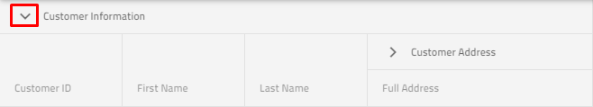

# {Platform} {ComponentTitle} Collapsible Column Groups Overview

Multi-column headers allow you to have multiple levels of nested columns and column groups. They also provide the ability to mark each column group as **collapsible**. **Collapsible multi-column headers** make it possible to collapse/expand, i.e. to show and hide the nested headers under the current one, which will give you a shortened/summarized information for example.

## {Platform} {ComponentTitle} Collapsible Column Groups Example

<code-view style="height:600px"
           data-demos-base-url="{environment:dvDemosBaseUrl}"
           iframe-src="{environment:dvDemosBaseUrl}/{ComponentSample}-column-collapsible-groups"
           github-src="{ComponentSample}/column-collapsible-groups"
           alt="{Platform} {ComponentTitle} Collapsible Column Groups Overview Example">
</code-view>

## Setup

To get started with the {ComponentName} and the **Collapsible multi-column headers** , first you need to install Ignite UI for {Platform} by typing the following command:

<!-- Angular -->
```cmd
ng add igniteui-angular
```
<!-- end: Angular -->

<!-- Blazor -->
```cmd
> dotnet add package IgniteUI.Blazor --version {PackageVerLatest}
```
<!-- end: Blazor -->

<!-- WebComponents -->
```cmd
npm install @webcomponents/custom-elements
```
<!-- end: WebComponents -->

For a complete introduction to the Ignite UI for {Platform}, read the [*getting started*](../..\general-getting-started.md) topic.

Also, we strongly suggest that you take a brief look at [*multi-column groups*](multi-column-headers.md) topic, to see more detailed information on how to setup the column groups in your grid.

## Usage

*Collapsible Column Groups* is a part of the multi-column headers feature which provides a way to collapse/expand a column group to a smaller set of data. When a column group is collapsed, a subset of the columns will be shown to the end-user and the other child columns of the group will hide. Each collapsed/expanded column can be bound to the grid data source, or it may be unbound, thus calculated.

In order to define a column group as `Collapsible`, you need to set the property to **true** and also keep in mind that you need to define the property `VisibleWhenCollapsed` to at least two child columns: at least one column must be visible when the group is collapsed (`VisibleWhenCollapsed` set to **true**) and at least one column must be hidden when the group is expanded (`VisibleWhenCollapsed` set to `false`), otherwise the **collapsible functionality will be disabled**. If  `VisibleWhenCollapsed` is not specified for some of the child columns, then this column will be always visible no matter whether the parent state is expanded or collapsed.

So let's see the markup below:

```html
<igx-column-group header="Customer Information" [collapsible]="true"> <!-- Initially the column groups will be expanded--->
    <!--The column below will be visible when its parent is collapsed-->
    <igx-column field="CustomerName" header="Fullname" [dataType]="'string'" [visibleWhenCollapsed]="true"></igx-column>
    <!--The three columns below will be visible when its parent is expanded-->
    <igx-column field="CustomerID" header="Customer ID" [dataType]="'string'" [visibleWhenCollapsed]="false"></igx-column>
    <igx-column field="FirstName" header="First Name" [dataType]="'string'" [visibleWhenCollapsed]="false">
    </igx-column>
    <igx-column field="LastName" header="Last Name" [dataType]="'string'" [visibleWhenCollapsed]="false">
    </igx-column>
    <igx-column-group header="Customer Address"> <!--This column visibility will not be changed based on parent expand/collapsed state-->
        <igx-column field="Country" header="Country" [dataType]="'string'" [sortable]="true">
        </igx-column>
        <igx-column field="City" header="City" [dataType]="'string'" [sortable]="true">
        </igx-column>
    </igx-column-group>
</igx-column-group>
```

```razor
 <IgbColumnGroup Header="Customer Information" Collapsible="true">
    <!--The column below will be visible when its parent is collapsed-->
    <IgbColumn Field="CustomerName" Header="Full name" VisibleWhenCollapsed="true"></IgbColumn>
        <!--The three columns below will be visible when its parent is expanded-->
        <IgbColumn Field="CustomerID" Header="Customer ID" VisibleWhenCollapsed="false"></IgbColumn>
        <IgbColumn Field="FirstName" Header="First Name" VisibleWhenCollapsed="false"></IgbColumn>
        <IgbColumn Field="LastName" Header="Last Name" VisibleWhenCollapsed="false"></IgbColumn>
        <IgbColumnGroup Header="Customer Address">
            <IgbColumn Field="Country" Header="Country" Sortable="true"></IgbColumn>
            <IgbColumn Field="City" Header="City" Sortable="true"></IgbColumn>
        </IgbColumnGroup>
 </IgbColumnGroup>
```

```html
<igc-column-group header="Customer Information" collapsible="true"> <!-- Initially the column groups will be expanded--->
    <!--The column below will be visible when its parent is collapsed-->
    <igx-column field="CustomerName" header="Full name" data-type="string" visible-when-collapsed="true"></igx-column>
    <!--The three columns below will be visible when its parent is expanded-->
    <igx-column field="CustomerID" header="Customer ID" data-type="string" visible-when-collapsed="false"></igx-column>
    <igx-column field="FirstName" header="First Name" data-type="string" visible-when-collapsed="false">
    </igx-column>
    <igx-column field="LastName" header="Last Name" data-type="string" visible-when-collapsed="false">
    </igx-column>
    <igx-column-group header="Customer Address"> <!--This column visibility will not be changed based on parent expand/collapsed state-->
        <igx-column field="Country" header="Country" data-type="string" sortable="true">
        </igx-column>
        <igx-column field="City" header="City" data-type="string" sortable="true">
        </igx-column>
    </igx-column-group>
</igx-column-group>
```

And now let's sum up: every child column has three states:
-	Can be always visible, no matter the expanded state of its parent;
-	Can be visible, when its parent is collapsed;
-	Can be hidden, when its parent is collapsed;

The initial state of the column group which is specified as collapsible is `Expanded`set to **true**. But you can easily change this behavior by setting it to **false**.

## Expand/Collapse Indicator Template

Default expand indicator for the {ComponentName} is the following:

 

Default collapse indicator for the {ComponentName} is the following:


Also, if you need to change the default expand/collapse indicator, we provide templating options in order to achieve this.

<!-- Angular -->

### Using Property

You can define custom expand/collapse template and provide it to each of the collapsible column groups using `CollapsibleIndicatorTemplate` property. Check the markup below:

```html
<ng-template #indTemplate let-column="column">
    <igx-icon [attr.draggable]="false" >{{column.expanded ? 'remove' : 'add'}} </igx-icon>
</ng-template>
<igx-column-group header="Customer Information" [collapsible]="true" [collapsibleIndicatorTemplate]="indTemplate">
    <igx-column field="CustomerName" header="Fullname" [dataType]="'string'" [visibleWhenCollapsed]="true"></igx-column>
    <igx-column field="CustomerID" header="Customer ID" [dataType]="'string'" [visibleWhenCollapsed]="false"></igx-column>
    <igx-column-group header="Customer Address" [collapsible]="true" [collapsibleIndicatorTemplate]="indTemplate">
        <igx-column field="Country" header="Country" [dataType]="'string'" [sortable]="true" [visibleWhenCollapsed]="true"></igx-column>
        <igx-column field="City" header="City" [dataType]="'string'" [sortable]="true" [visibleWhenCollapsed]="false"></igx-column>
    </igx-column-group>
</igx-column-group>
```

```razor
    public RenderFragment<IgbColumnTemplateContext> Template = (context) =>
    {
        string icon = context.Column.Expanded ? "remove" : "add";
        return @<IgbIcon IconName="@icon" Collection="material"></IgbIcon>;
    };
```

### Using igxCollapsibleIndicator Directive

Another way to achieve this behavior is to use the igxCollapsibleIndicator directive as shown in the example below:

```html
<igx-column-group header="Customer Information" [collapsible]="true">
    <ng-template igxCollapsibleIndicator let-column="column">
        <igx-icon [attr.draggable]="false">{{column.expanded ? 'remove' : 'add'}} </<igx-icon>
    </ng-template>
    <igx-column field="CustomerName" header="Fullname" [dataType]="'string'" [visibleWhenCollapsed]="true"></igx-column>
    <igx-column field="CustomerID" header="Customer ID" [dataType]="'string'" [visibleWhenCollapsed]="false"></igx-column>
    <igx-column-group header="Customer Address" [collapsible]="true">
        <igx-column field="Country" header="Country" [dataType]="'string'" [sortable]="true" [visibleWhenCollapsed]="true"></igx-column>
        <igx-column field="City" header="City" [dataType]="'string'" [sortable]="true" [visibleWhenCollapsed]="false"></igx-column>
    </igx-column-group>
</igx-column-group>
```
<!-- end: Angular -->

> [!Note]
> Please keep in mind that initially collapse group option takes precedence over column hidden - If you declared your column to be hidden using the property
> hidden and you have a group defined where the same column should be shown, the column will be shown.


## API References

* `{ComponentName}`
* `Column`

## Additional Resources

* [{ComponentTitle} overview](overview.md)
* [Virtualization and Performance](virtualization.md)
* [Paging](paging.md)
* [Filtering](filtering.md)
* [Sorting](sorting.md)
* [Summaries](summaries.md)
* [Column Moving](column-moving.md)
* [Column Pinning](column-pinning.md)
* [Selection](selection.md)

Our community is active and always welcoming to new ideas.

* [Ignite UI for {Platform} **Forums**](https://www.infragistics.com/community/forums/f/ignite-ui-for-{Platform})
* [Ignite UI for {Platform} **GitHub**](https://github.com/IgniteUI/igniteui-{Platform})
