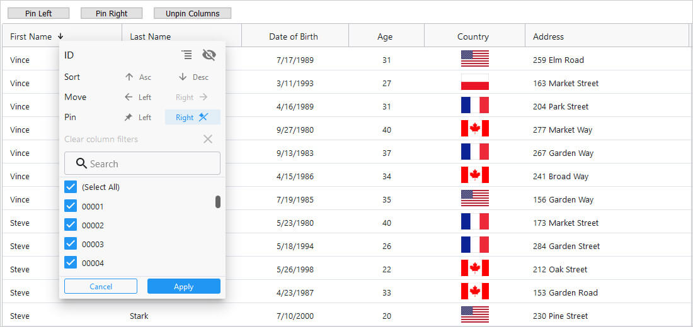
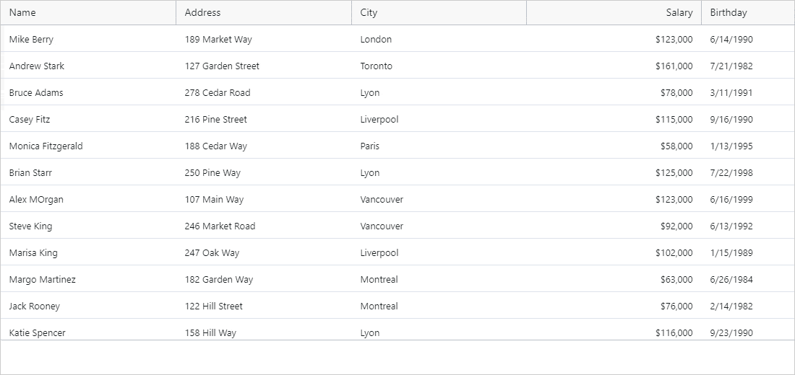
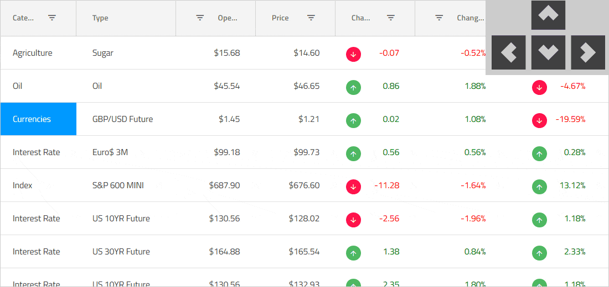

    

# The Fastest {Platform} Data Grid

<!-- React -->

A {Platform} data grid or data table is a component used to display tabular data in a series of rows and columns. Data grids, also known as tables, are well known in the desktop world with popular software such as Microsoft Excel. While grids have been available on desktop platforms for a long time, they have only recently become part of web app UIs, such as {Platform} UI. Modern grids and tables can be complex and may include a range of features and functionality, including data binding, editing, Excel-like filtering, custom sorting, grouping, row reordering, row and column freezing, row aggregation, exporting to Excel, CSV, and pdf formats.

<!--end: React -->

<!-- WebComponents -->

A {Platform} data grid, also known as a {Platform} data table, is a data visualization component that allows you to bind and display your data as a series of rows and columns. They are somewhat new to the world of web application user interfaces, although they have been available on desktop platforms for quite a long time in many different forms - for example, Microsoft Excel. These grids and tables generally possess the ability to be very complex, including functionality like cell and row selection, filtering, editing, row and column hiding, column summaries, searching, and the ability to display your data in type-specific columns.

<!-- end: WebComponents -->

<!-- Blazor -->

A {Platform} data table, more commonly known as a {Platform} data grid, is a component allowing you to visualize your bound data as a series of rows and columns. These data grids have been accessible for quite a long time on desktop-related platforms such as WPF and Windows Forms but have only more recently become available for the development of web applications. Modern web applications use tables and data grids that are feature-rich with the ability to data bind, cell and row selection, cell and row editing and error validation, column summaries, interactive Outlook-style grouping, Microsoft Excel-style filtering, and virtualized rows and columns so that you can potentially load millions of records.

<!-- end: Blazor -->

<!-- WebComponents -->

## What are Web Components

Web Components are a library of web-based APIs that follow existing web standards, allowing the creation of reusable, custom HTML objects and tags to use in your web applications and pages. These components can be used within any modern web application that works with Javascript libraries or any framework that utilizes HTML.

<!-- end: WebComponents -->

## {Platform} Grid Example

In this {Platform} grid example, you can see how users can customize their view of the data by using features and functionality of the grid, such as search and filtering, columns sorting, resizing, pinning and hiding, row grouping, grid summaries, horizontal and vertical, and cell styling which includes embedded in the cell linear progress bar indicator component and sparkline component.

<code-view style="height: 435px"
           data-demos-base-url="{environment:dvDemosBaseUrl}"
           iframe-src="{environment:dvDemosBaseUrl}/grids/data-grid-overview"
           alt="{Platform} Grid Example" >
</code-view>

Like this sample? Get access to our complete {Platform} toolkit and start building your own apps in minutes. <a href="{environment:infragisticsBaseUrl}/products/{ProductSpinal}/download">Download it for free.</a>

## Why Use a {Platform} Data Grid?

{Platform} data grids are essential in use cases where high volumes of data must be stored and sorted through quickly. This can include industries such as financial services, banking and insurance, which often use high-volume, high-velocity data. The success of these companies is dependent upon the features, functionality and performance of these data grids. When stock decisions need to be made in microseconds, for example, it’s imperative that the data grid performs with no lag time or flicker.

## {Platform} Data Grid Features

The {ProductName} Data Grid is not just for high-volume and real-time data. It is a feature-rich {Platform} grid that gives you capabilities that you would never be able to accomplish with so little code on your own.
This example demonstrates a few of the data grid’s key features:

<ul id="features-list">
<li>[Virtualized Rows and Columns](data-grid-live-data.md) so you can load millions of records</li>

<li>[Inline Editing](data-grid-cell-editing.md) with Cell, Row, and Batch Update options</li>

<li>[Excel-style Filtering](data-grid-column-filtering.md) and full [Excel Keyboard Navigation](data-grid-cell-activation.md) capability</li>

<li>Interactive [Outlook-style Grouping](data-grid-row-grouping.md)</li>

<li>[Column Summaries](data-grid-column-summaries.md) based on any data in a grid cell or column</li>

<!-- React, WebComponents -->
<li>Export to Excel, including [Data Visualization](..\excel-library-working-with-charts.md)</li>
<!-- end: React, WebComponents -->

<li>[Cell and Row Selection](data-grid-cell-selection.md) for Single and Multi-Select</li>

<li>Full touch support for mobile app development</li>
</ul>

### The Fastest {Platform} Data Grid Example

Demo

<code-view style="height: 435px"
           data-demos-base-url="{environment:dvDemosBaseUrl}"
           iframe-src="{environment:dvDemosBaseUrl}/grids/data-grid-type-marketing-table"  >
</code-view>

### Data Virtualization and Performance

Data Virtualization and Performance

<!-- React -->

Seamlessly scroll through unlimited rows and columns in your {Platform} grid, with the data grid’s column and row level virtualization. With support for local or remote data sources, you get the best performance no matter where your data lives. Your users will experience Excel-like scrolling, with enterprise speed — no lag, screen flicker, or visual delay — giving you the best user experience (UX) without compromising performance.

<!--end: React -->

<!-- WebComponents -->

The {Platform} Data Grid boasts the ability to plot an infinite number of records while keeping performance fast and fluid. This is done through built-in, aggressive row and column virtualization techniques that leave only the cells and rows that are in view in the memory footprint. End users will have the best possible user-experience with Microsoft Excel-like scrolling, without lag, visual delay, or any traces of screen flicker.

<!-- end: WebComponents -->

<!-- Blazor -->

The {ProductName} Data Grid component has built-in virtualization for the rows and cells of the grid, meaning that the only rows and cells that are kept in memory are the ones that are in view at a particular time, regardless of whether your data source is local or remote. This affords the best possible performance with seamless vertical and horizontal, Excel-like scrolling with no visual delay or screen flicker, even when plotting millions of records into the grid.

<!-- end: Blazor -->

    <h4 class="h2" style="text-align: center; font-weight: 700; margin-top: 0;" >Quick and Easy to Customize, Build and Implement {Platform} Tables</h4>
    

    
The {ProductName} Data Grid can handle unlimited rows and columns of data, while providing access to custom templates and real-time data updates. Featuring an intuitive API for easy theming and branding, you can quickly bind to data with minimal code.

    

        

            <a class="cta-btn no-external-icon ui-btn--sm" href="{environment:infragisticsBaseUrl}/resources/sample-applications">view samples</a>
        

    

    

### {Platform} Grid Cell and Row Selection

<!-- React -->

    

    

        {Platform} Grid Cell and Row Selection
        
The {Platform} Data Grid includes every option for mouse and [touch-driven selection](data-grid-cell-selection.md) by cell and row level, including modes like SingleCell, SingleRow, MultipleCell, MultipleRow, RangeCell and more.

    

<!--end: React -->

<!-- WebComponents -->

    

    

        {Platform} Grid Cell and Row Selection
        
The {Platform} Data Grid has the ability to configure [mouse and touch-driven selection](data-grid-cell-selection.md) for both cells and rows. You can select either single or multiple cells and rows, and the ability to use range selection is also available.

    

<!-- end: WebComponents -->

<!-- Blazor -->

    

    

        {Platform} Grid Cell and Row Selection
        
The {ProductName} Data Grid component includes the options to [select rows and cells](data-grid-cell-selection.md) using both the user’s mouse and touchscreen. The available modes for cell and row selection include MultipleCell, MultipleRow, SingleCell, SingleRow, and RangeCell.

    

<!-- end: Blazor -->

### {Platform} Grid Filtering

<!-- React -->

    

        
    

    

        {Platform} Grid Filtering
        
The {Platform} Data Grid includes [column filtering](data-grid-column-filtering.md) based on the data type of the column being filtered. For example, if your column is a DateTime field you can use filters like Last Month, This Quarter, Next Week, etc.

    

<!--end: React -->

<!-- WebComponents -->

    

        
    

    

        {Platform} Grid Filtering
        
The user has the in-built ability to [filter columns](data-grid-column-filtering.md) based on data type in the {Platform} Data Grid. For example, if your column represents a numeric property, you can use filtering options like Greater Than, Less Than, Equal To, etc.

    

<!-- end: WebComponents -->

<!-- Blazor -->

    

        
    

    

        {Platform} Grid Filtering
        
The {ProductName} Data Grid allows users to [filter its columns](data-grid-column-filtering.md) with the data type as criteria for the filters applied. For example, if your column represents a string property of your data item, you can use filtering options such as Contains, Starts With, Ends With, etc.

    

<!-- end: Blazor -->

### {Platform} Grid Column Moving

<!-- React -->

    

    

        {Platform} Grid Column Moving
        
Rearranging [column order](data-grid-column-moving.md) is as easy as Click and Drag in the {Platform} Data Grid. We’ve also included a complete animation engine, giving you control over the UX of this interaction.

    

<!--end: React -->

<!-- WebComponents -->

    

    

        {Platform} Grid Column Moving
        
Users can [modify the order](data-grid-column-moving.md) that columns appear in the {Platform} Data Grid simply by clicking and dragging the column headers. We have also included the option to use a built-in animation for this column movement.

    

<!-- end: WebComponents -->

<!-- Blazor -->

    

    

        {Platform} Grid Column Moving
        
The {Platform} Data Grid has the in-built ability to click and drag your columns in order to [reorder and rearrange them](data-grid-column-moving.md). While dragging the columns, the ability to animate the column moving is available for more control of the user experience of your application.

    

<!-- end: Blazor -->

### {Platform} Grid Column Pinning

<!-- React -->

    

    

        {Platform} Grid Column Pinning
        
With Right and Left [column pinning](data-grid-column-pinning.md) in the {Platform} Data Grid, users can lock a single column or multiple columns in any order, so that the column maintains position, while scrolling horizontally.

    

<!--end: React -->

<!-- WebComponents -->

    

    

        {Platform} Grid Column Pinning
        
The {Platform} Data Grid supports the ability to [pin columns](data-grid-column-pinning.md) to the left or right side of the table. Doing this will lock as many columns as are pinned in their position while the user scrolls horizontally.

    

<!-- end: WebComponents -->

<!-- Blazor -->

    

    

        {Platform} Grid Column Pinning
        
The ability to [fix columns](data-grid-column-pinning.md) to the left or right side is present in the {Platform} Data Grid component. When a column is fixed or pinned, it will maintain its position while the user scrolls the grid horizontally.

    

<!-- end: Blazor -->

### {Platform} Grid Column Resizing

<!-- React -->

    

    

        {Platform} Grid Column Resizing
        
The {Platform} Data Grid supports the ability to [resize columns](data-grid-column-resizing.md), giving your customers flexibility over how they display the Data Grid columns, with respect to the other columns in the table.

    

<!--end: React -->

<!-- WebComponents -->

    

    

        {Platform} Grid Column Resizing
        
The {ProductName} Data Grid has the in-built ability to give users the ability to click and drag column borders in order to [resize them](data-grid-column-resizing.md). An animation engine also exists so that you can optionally animate the resizing of the columns.

    

<!-- end: WebComponents -->

<!-- Blazor -->

    

    

        {Platform} Grid Column Resizing
        
The {Platform} Data Grid allows your users to [resize the columns](data-grid-column-resizing.md) that exist in the grid. The data table is feature rich in this area in that the user can configure the resizing mode such that the resizing operation either happens immediately or is deferred until the drag is released.

    

<!-- end: Blazor -->

### {Platform} Grid Column Sorting

<!-- React -->

    

    

        {Platform} Grid Column Sorting
        
The {Platform} Data Grid supports ascending and descending [column sorting](data-grid-column-sorting.md) with a Single, Multi or Tri-State Column Sorting configuration. Sorting is triggered on header click or using the Column Options dropdown.

    

<!--end: React -->

<!-- WebComponents -->

    

    

        {Platform} Grid Column Sorting
        
The ability to [sort column data](data-grid-column-sorting.md) in ascending or descending order is available in the {Platform} Data Grid. The user has the ability to sort with a Single, Multi, or Tri-State column sorting configuration and sorting is triggered by default by clicking the header.

    

<!-- end: WebComponents -->

<!-- Blazor -->

    

    

        {Platform} Grid Column Sorting
        
Looking for a {Platform} sortable grid for your project? The {ProductName} Data Grid component has the in-built ability to [sort column data](data-grid-column-sorting.md) with the configuration of the sorting between Single, Multi, and Tri-State also being available. Sorting a particular column in the grid by default is done by clicking the column header, but you can also do this by using the column options dialog.

    

<!-- end: Blazor -->

### {Platform} Grid Column Summaries

<!-- React -->

    

    

        {Platform} Grid Column Summaries
        
The {Platform} Data Grid supports [column summaries](data-grid-column-summaries.md) in the footer area of the Data Grid, or in the Group Headers. This is great for showing values like Count, Sum, Min, Max, Avg, etc.

    

<!--end: React -->

<!-- WebComponents -->

    

    

        {Platform} Grid Column Summaries
        
[Column summaries](data-grid-column-summaries.md) are available for display in the footer area of the {Platform} Data Grid, with configurable options to show them in group headers as well. This is useful for showing the Sum, Minimum, and Maximum of numeric data, among other summary options.

    

<!-- end: WebComponents -->

<!-- Blazor -->

    

    

        {Platform} Grid Column Summaries
        
The user has the in-built ability to apply [column summaries](data-grid-column-summaries.md) in the {Platform} Data Grid component. These summaries have the ability to display the Sum, Minimum, Maximum, among others, of numeric data and can be configured to display in the footer or group headers of the grid.

    

<!-- end: Blazor -->

### {Platform} Grid Column Types

<!-- React -->

    

    

        {Platform} Grid Column Types
        
The {Platform} Data Grid supports a variety of [column types](data-grid-column-types.md), plus a Template Column type and a Sparkline Template type, giving you complete flexibility over the way your data is displayed in the Grid.

    

<!--end: React -->

<!-- WebComponents -->

    

    

        {Platform} Grid Column Types
        
There are a number of different [column types](data-grid-column-types.md) available in the {Platform} Data Grid that are specific to different data types that you may be using in your underlying data source. Additionally, there is a Template Column that allows the user complete flexibility over their UI by allowing just about anything to be placed within the cells of that column.

    

<!-- end: WebComponents -->

<!-- Blazor -->

    

    

        {Platform} Grid Column Types
        
The {ProductName} Data Grid allows the user to utilize a variety of data-type specific [column types](data-grid-column-types.md) to most effectively display their data. If the data is a bit more complex, there is an additional Template Column, allowing the ability to define your own cell content for the display of a particular part of the grid’s data source.

    

<!-- end: Blazor -->

### {Platform} Grid Column Animations

<!-- React -->

    

    

        {Platform} Grid Column Animations
        
The {Platform} Data Grid supports [column animation](data-grid-column-animation.md) during events like Column Hiding or Column Moving. When Column Animation on the {Platform} Data Grid is set, the corresponding animation will fire for all of the cells in that column.

    

<!--end: React -->

<!-- WebComponents -->

    

    

        {Platform} Grid Column Animations
        
The {ProductName} Data Grid component possesses the in-built ability to [animate column headers and cells](data-grid-column-animation.md) upon different actions that a user can take. For example, there are a variety of different animations available for column adding, hiding, and moving actions, among others.

    

<!-- end: WebComponents -->

<!-- Blazor -->

    

    

        {Platform} Grid Column Animations
        
[Column animations](data-grid-column-animation.md) are available in the {Platform} Data Grid component for different user actions such as column showing or hiding. Each of the user actions that can be animated has a dedicated animation property that can be set that will fire for the column header as well as all of the cells belonging to the column animated.

    

<!-- end: Blazor -->

### {Platform} Grid Column Options Dialog

<!-- React -->

    

    

        {Platform} Grid Column Options Dialog
        
The {Platform} Data Grid supports the ability to group, hide, move, pin, filter, and sort columns directly from a UI exposed on each column header. The [column options](data-grid-column-options.md) are on by default for every column, via the Kebab menu on column hover.

    

<!--end: React -->

<!-- WebComponents -->

    

    

        {Platform} Grid Column Options Dialog
        
A Kebab menu is available in the column headers of the {ProductName} Data Grid that, when clicked, will open the [options dialog](data-grid-column-options.md) for that column. This dialog gives users the ability to group, sort, hide, move, pin, and filter the owning column for that dialog.

    

<!-- end: WebComponents -->

<!-- Blazor -->

    

    

        {Platform} Grid Column Options Dialog
        
Each column in the {Platform} Data Grid can be sorted, grouped, hidden, moved, and pinned from the same place – the [column options dialog](data-grid-column-options.md). Each of the column headers of the grid show a Kebab menu on mouse-hover that when clicked, will show this dialog.

    

<!-- end: Blazor -->

### {Platform} Grid Column and Row Outlook Style Grouping

<!-- React -->

    

    

        {Platform} Grid Column and Row Outlook Style Grouping
        
The {Platform} Data Grid lets you [group rows](data-grid-row-grouping.md) into a ‘sticky header’ Row Group. Like the Group By feature in Microsoft Outlook, your users have an easy way to visually group data based on their own criteria.

    

<!--end: React -->

<!-- WebComponents -->

    

    

        {Platform} Grid Column and Row Outlook Style Grouping
        
The {ProductName} Data Grid gives users the ability to [group rows](data-grid-row-grouping.md) into a “sticky header” Row Group. Users can visualize data items that are alike by grouping them by the columns with the similar data entries in a Microsoft Outlook-style way.

    

<!-- end: WebComponents -->

<!-- Blazor -->

    

    

        {Platform} Grid Column and Row Outlook Style Grouping
        
The {Platform} Data Grid component includes the ability to [group columns](data-grid-row-grouping.md), directly inspired by the way groupings are visualized in Microsoft Outlook. It is also possible to group multiple columns in the grid and display them with multiple group headers or combine them all into one.

    

<!-- end: Blazor -->

<!-- React -->

### {Platform} Grid Paging

    

    

    

        {Platform} Grid Paging
        
The {Platform} Data Grid [Paging component](data-grid-row-paging.md) is designed to take in an array of data and output portions of that data as a page, with a simple navigation UI.

    

<!-- end: React -->

### {Platform} Grid Row Pinning

<!-- React -->

    

    

        {Platform} Grid Row Pinning
        
The {Platform} Data Grid allows you to [pin rows](data-grid-row-pinning.md) to the top of the Data Grid. When a row is pinned, it will be duplicated at the top of the Data Grid and remain fixed there with a light gray background and its actual (or original) row in the Data Grid will be rendered with low opacity, making it clear to the user this is a special row.

    

<!--end: React -->

<!-- WebComponents -->

    

    

        {Platform} Grid Row Pinning
        
Users can decide to [pin rows](data-grid-row-pinning.md) to the top of the {Platform} Data Grid. When a row has been pinned, it will be copied to the top of the grid and remain locked to that location with a customizable background while the user scrolls vertically. The original, copied row will still be displayed in its original location, but with a lowered opacity.

    

<!-- end: WebComponents -->

<!-- Blazor -->

    

    

        {Platform} Grid Row Pinning
        
The {ProductName} Data Grid component has the in-built ability to [pin rows](data-grid-row-pinning.md) to the top of the grid, rendering them just under the headers. These rows will vertically remain there until unpinned while the user vertically scrolls the grid.

    

<!-- end: Blazor -->

### {Platform} Grid Keyboard Navigation

<!-- React -->

    

    

        {Platform} Grid Keyboard Navigation
        
The {Platform} Data Grid supports extensive Excel-like [keyboard navigation](data-grid-cell-activation.md). Ensure accessibility compliance and improve usability, enabling Excel-like keyboard navigation in the {Platform} Data Grid, using the up, down, right, left, tab, and Enter keys. You can toggle single or multiple row selection using the mouse or keyboard to select or de-select full rows.

    

<!--end: React -->

<!-- WebComponents -->

    

    

        {Platform} Grid Keyboard Navigation
        
The user can use the left, right, up, down, Enter, and tab keys to perform Excel-inspired [keyboard navigation](data-grid-cell-activation.md) in the {Platform} Data Grid. This will improve usability for the end-user of the grid, allowing more accessible navigation and editing throughout the grid.

    

<!-- end: WebComponents -->

<!-- Blazor -->

    

    

        {Platform} Grid Keyboard Navigation
        
The {Platform} Data Grid component allows users to enable [keyboard navigation](data-grid-cell-activation.md) that behaves just like in Microsoft Excel. Accessibility and usability can be improved with navigation in mind by using the arrow keys as well as the tab and Enter keys on the user’s keyboard.

    

<!-- end: Blazor -->

## {Platform} Grid Features

<!-- React -->

<ul>
    <li>[Grid Editing](data-grid-cell-editing.md)</li>
    <li>[Cell Selection](data-grid-cell-selection.md)</li>
    <li>[Cell Templates](data-grid-column-types.md#template-column)</li>
    <li>[Column Filtering](data-grid-column-filtering.md)</li>
    <li>[Column Hiding](data-grid-column-chooser.md)</li>
    <li>[Column Moving](data-grid-column-moving.md)</li>
    <li>[Column Summaries](data-grid-column-summaries.md)</li>
    <li>[Custom Grid Toolbar](data-grid-column-chooser.md#toolbars-column-chooser-ui)</li>
    <li>[Fixed/Pinned Columns](data-grid-column-pinning.md)</li>
</ul>
<ul>
    <li>[Grid Paging](data-grid-row-paging.md)</li>
    <li>[Grid Sorting](data-grid-column-sorting.md)</li>
    <li>[Real-time/Live Data](data-grid-live-data.md)</li>
    <li>[Remote Data Load on Demand](data-grid-remote-data.md)</li>
    <li>[Resizable Columns](data-grid-column-resizing.md)</li>
    <li>[Row Grouping](data-grid-row-grouping.md)</li>
    <li>[Row Selection](data-grid-cell-selection.md)</li>
    <li>[Virtualization and Performance](data-grid-performance.md)</li>
</ul>

<!-- end: React -->

<!-- WebComponents -->

<ul>
    <li>[Grid Editing](data-grid-cell-editing.md)</li>
    <li>[Cell Selection](data-grid-cell-selection.md)</li>
    <li>[Cell Templates](data-grid-column-types.md#template-column)</li>
    <li>[Column Filtering](data-grid-column-filtering.md)</li>
    <li>[Column Hiding](data-grid-column-chooser.md)</li>
    <li>[Column Moving](data-grid-column-moving.md)</li>
    <li>[Column Summaries](data-grid-column-summaries.md)</li>
    <li>[Custom Grid Toolbar](data-grid-column-chooser.md#toolbars-column-chooser-ui)</li>
</ul>
<ul>
    <li>[Fixed/Pinned Columns](data-grid-column-pinning.md)</li>
    <li>[Grid Sorting](data-grid-column-sorting.md)</li>
    <li>[Real-time/Live Data](data-grid-live-data.md)</li>
    <li>[Remote Data Load on Demand](data-grid-remote-data.md)</li>
    <li>[Resizable Columns](data-grid-column-resizing.md)</li>
    <li>[Row Grouping](data-grid-row-grouping.md)</li>
    <li>[Row Selection](data-grid-cell-selection.md)</li>
    <li>[Virtualization and Performance](data-grid-performance.md)</li>
</ul>

<!-- end: WebComponents -->

<!-- Blazor -->

<ul>
    <li>[Grid Editing](data-grid-cell-editing.md)</li>
    <li>[Cell Selection](data-grid-cell-selection.md)</li>
    <li>[Cell Templates](data-grid-column-types.md#template-column)</li>
    <li>[Column Filtering](data-grid-column-filtering.md)</li>
    <li>[Column Hiding](data-grid-column-chooser.md)</li>
    <li>[Column Moving](data-grid-column-moving.md)</li>
    <li>[Column Summaries](data-grid-column-summaries.md)</li>
    <li>[Custom Grid Toolbar](data-grid-column-chooser.md#toolbars-column-chooser-ui)</li>
</ul>
<ul>
    <li>[Fixed/Pinned Columns](data-grid-column-pinning.md)</li>
    <li>[Grid Sorting](data-grid-column-sorting.md)</li>
    <li>[Real-time/Live Data](data-grid-live-data.md)</li>
    <li>[Resizable Columns](data-grid-column-resizing.md)</li>
    <li>[Row Grouping](data-grid-row-grouping.md)</li>
    <li>[Row Selection](data-grid-cell-selection.md)</li>
    <li>[Virtualization and Performance](data-grid-performance.md)</li>
</ul>

<!-- end: Blazor -->

    <h4 class="h2" style="font-weight: 700; margin-top: 0;">Download the Fastest {Platform} Grid Today!</h4>
    

    <a class="cta-btn no-external-icon ui-btn--sm" href="{environment:infragisticsBaseUrl}/products/ignite-ui-{Platform}/download">download now</a>
     
    30 days free trial. No credit card required.
    

    

    

        <h2>{ProductName} Supported Browsers</h2>
    

   The {Platform} Data Grid is supported on all modern web browsers, including:

        <ul>
            <li>Chrome</li>
            <li>Edge / Edge Chromium</li>
            <li>Firefox</li>
            <li>Safari</li>
            <li>Internet Explorer 11 with polyfills</li>
        </ul>
    

    

    

            <h2>{ProductName} Support Options</h2>
    

There are multiple options to get access to our award-winning support at Infragistics for the {Platform} product.

        <ul>
            <li>Start at the {Platform} <a class="no-external-icon" href="{environment:infragisticsBaseUrl}/support/{ProductSpinal}-help">Support</a> home page</li>
            <li>Read the {Platform} [Documentation](..\general-getting-started.md) and experiment with {Platform} Samples</li>
            <li>Read the<a class="no-external-icon" href="{environment:infragisticsBaseUrl}/community/blogs/tags/Ignite UI for {Platform}"> {Platform} Blogs</a> to stay up to date</li>
            <li>Submit a <a class="no-external-icon" href="{environment:infragisticsBaseUrl}/my-account/support-activity"> Support Case</a> after signing into your account</li>
            <li>Learn from the {Platform} <a class="no-external-icon" href="{environment:infragisticsBaseUrl}/resources/sample-applications">Reference Applications</a></li>
        </ul>
    

## {ProductName} Trial License and Commercial

{ProductName} is a commercially licensed product available via a subscription model. You can try the {ProductName} product for free when you <a class="no-external-icon" href="{environment:infragisticsBaseUrl}/free-downloads">register for a 30-day trial</a>. When you are done with your Trial Period, you can <a class="no-external-icon" href="{environment:infragisticsBaseUrl}/how-to-buy/product-pricing">purchase a license </a> from our web site or by calling <a class="no-external-icon" href="{environment:infragisticsBaseUrl}/about-us/contact-us">sales in your region</a>.

## Frequently Asked Questions

<!-- React, WebComponents -->

    

        
Why should I choose the Infragistics {ProductName} Data Grid?

        

        

            <ul>
                <li>[Virtualized Rows and Columns](data-grid-live-data.md) so you can load millions of records</li>
                <li>[Inline Editing](data-grid-cell-editing.md) with Cell, Row, and Batch Update options</li>
                <li>[Excel-style Filtering](data-grid-column-filtering.md) and full [Excel Keyboard Navigation](data-grid-cell-activation.md) capability</li>
                <li>Interactive [Outlook-style Grouping](data-grid-row-grouping.md)</li>
                <li>[Column Summaries](data-grid-column-summaries.md) based on any data in a grid cell or column</li>
                <li>Export to Excel, including [Data Visualization](..\excel-library-working-with-charts.md)</li>
                <li>[Cell and Row Selection](data-grid-cell-selection.md) for Single and Multi-Select</li>
                <li>Full touch support for mobile app development</li>
            </ul>
        

    

    

    
What is the Pricing for the Infragistics {ProductName} Data Grid?

    

    

Our {ProductName} components are included as a part of our Ignite UI bundle. A single developer license starts at $1,295 USD for a
one-year subscription, including one year of standard support and updates.

{ProductName} is a commercially licensed product available via a subscription model. This subscription includes the {Platform} Grid, plus {Platform} Charts and dozens on other {Platform} UI Controls.

We also offer discounts for multi-year licenses. Please <a class="no-external-icon" href="{environment:infragisticsBaseUrl}/how-to-buy/product-pricing">refer to our Pricing page</a> for more information on pricing.

If you are developing applications on multiple platforms, consider our complete app development package, Infragistics Ultimate, which include desktop platforms like WPF and Windows Forms, plus all modern web toolsets for Angular, React, Web Components, ASP.NET MVC and ASP.NET Core.
    

    

    

        
Can I purchase the Infragistics {ProductName} Data Grid control separately?

        

        

        No, you cannot purchase the {Platform} Data Grid separately. It is part of a the <a class="no-external-icon" href="{environment:infragisticsBaseUrl}/products/{ProductSpinal}">Ignite UI for {Platform} product</a>, which includes dozens of UI controls and components, plus over 60 charts, including {Platform} Financial Charting. If you are interested in other modern web platforms like Angular, React, ASP.NET MVC, Web Components or ASP.NET Blazor, check out our <a class="no-external-icon" href="{environment:infragisticsBaseUrl}/products/ignite-ui">Ignite UI product bundle</a>, which gives you every web platform for only $100 more on your subscription. That is hundreds of controls, components, and data visualizations for a very low price.
        

    

    

        
Can I purchase the Infragistics {ProductName} Data Grid control separately?

        

        

        To get started with the {Platform} Data Grid, follow the steps in the [getting started guide](..\general-getting-started.md). We also maintain a library of <a class="no-external-icon" href="{environment:infragisticsBaseUrl}/resources/sample-applications">sample applications</a>, which are designed to not only inspire but are best practices guides for {Platform} development.
        

    

<!-- end: React, WebComponents -->

<!-- Blazor -->

    

        
Why should I choose the Infragistics {ProductName} Data Grid?

        

        

            <ul>
                <li>[Virtualized Rows and Columns](data-grid-live-data.md) so you can load millions of records</li>
                <li>[Inline Editing](data-grid-cell-editing.md) with Cell, Row, and Batch Update options</li>
                <li>[Excel-style Filtering](data-grid-column-filtering.md) and full [Excel Keyboard Navigation](data-grid-cell-activation.md) capability</li>
                <li>Interactive [Outlook-style Grouping](data-grid-row-grouping.md)</li>
                <li>[Column Summaries](data-grid-column-summaries.md) based on any data in a grid cell or column</li>
                <li>[Cell and Row Selection](data-grid-cell-selection.md) for Single and Multi-Select</li>
                <li>Full touch support for mobile app development</li>
            </ul>
        

    

    

    
What is the Pricing for the Infragistics {ProductName} Data Grid?

    

    

Our {ProductName} components are included as a part of our Ignite UI bundle. A single developer license starts at $1,295 USD for a
one-year subscription, including one year of standard support and updates.

{ProductName} is a commercially licensed product available via a subscription model. This subscription includes the {Platform} Grid, plus {Platform} Charts and dozens on other {Platform} UI Controls.

We also offer discounts for multi-year licenses. Please <a class="no-external-icon" href="{environment:infragisticsBaseUrl}/how-to-buy/product-pricing">refer to our Pricing page</a> for more information on pricing.

If you are developing applications on multiple platforms, consider our complete app development package, Infragistics Ultimate, which include desktop platforms like WPF and Windows Forms, plus all modern web toolsets for Angular, React, Web Components, ASP.NET MVC and ASP.NET Core.
    

    

    

        
Can I purchase the Infragistics {ProductName} Data Grid control separately?

        

        

        No, you cannot purchase the {Platform} Data Grid separately. It is part of a the <a class="no-external-icon" href="{environment:infragisticsBaseUrl}/products/{ProductSpinal}">Ignite UI for {Platform} product</a>, which includes dozens of UI controls and components, plus over 60 charts, including {Platform} Financial Charting. If you are interested in other modern web platforms like Angular, React, ASP.NET MVC, Web Components or ASP.NET Blazor, check out our <a class="no-external-icon" href="{environment:infragisticsBaseUrl}/products/ignite-ui">Ignite UI product bundle</a>, which gives you every web platform for only $100 more on your subscription. That is hundreds of controls, components, and data visualizations for a very low price.
        

    

    

        
Can I purchase the Infragistics {ProductName} Data Grid control separately?

        

        

        To get started with the {Platform} Data Grid, follow the steps in the [getting started guide](..\general-getting-started.md). We also maintain a library of <a class="no-external-icon" href="{environment:infragisticsBaseUrl}/resources/sample-applications">sample applications</a>, which are designed to not only inspire but are best practices guides for {Platform} development.
        

    

<!-- end: Blazor -->

