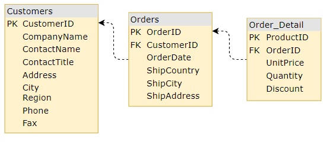

# Hierarchical Grid Load On Demand

The Ignite UI for {Platform} `HierarchicalGrid` allows fast rendering by requesting the minimum amount of data to be retrieved from the server so that the user can see the result in view and interact with the visible data as quickly as possible. Initially only the root grid’s data is retrieved and rendered, only after the user expands a row containing a child grid, he will receive the data for that particular child grid. This mechanism, also known as Load on Demand, can be easily configured to work with any remote data.

This topic demonstrates how to configure Load on Demand by creating a Remote Service Provider. Here's the working demo and later we will go through it step by step and describe the process of creating it.

## {Platform} Hierarchical Grid Load On Demand Example

`sample="/{HierarchicalGridSample}/data-performance-virtualization", height="700", alt="{Platform} Hierarchical Grid Load On Demand Example"`

### Remote Service Provider

First we will prepare our service provider so we will be ready to get the data we would need for the hierarchical grid.

#### Getting basic data

In this case, we will use local data, however, the service provider can be easily configured to work with any remote data as well.

The model will differ per application but we will use the following one:



What we first need is the `key` of our table to determine from where to get the data for the desired grid, the primary key of the parent row and its unique ID.

<!-- Angular -->
We will define all this in an interface called `IDataState`. An example:

```typescript
export interface IDataState {
    key: string;
    parentID: any;
    parentKey: string;
    rootLevel: boolean;
}
```
<!-- end: Angular -->

<!-- WebComponents, React -->
We will define all this in a `dataState` object. An example:

```ts
const dataState: {
    key: string;
    parentID: any;
    parentKey: string;
    rootLevel: boolean;
} = {
    //...
};
```
<!-- end: WebComponents, React -->

<!-- Blazor -->
We will define all this in a `dataState` object. An example:

```razor
const dataState: {
    key: string;
    parentID: any;
    parentKey: string;
    rootLevel: boolean;
} = {
    //...
};
```
<!-- end: Blazor -->

<!-- WebComponents, React -->
That way in order to get our data we will need this simple method in our service:

```ts
export async function getData(dataState: any): Promise<any[]> {
    const key = dataState.key as "Customers" | "Orders" | "Order_Details";
    let resultData: any[] = DATA[key];

    if (!dataState.rootLevel) {
        resultData = resultData.filter((record: any) => record[dataState.parentKey] === dataState.parentID);
    } 

    return new Promise<any[]>((resolve) => {
        setTimeout(() => {
            resolve(resultData);
        }, 1000);
    });
}
```

As you can see the result data will be generated based on the data state that we have received. This way we will be able to get the data for our main grid but also for any child grid inside it. We return a [`Promise`](https://developer.mozilla.org/en-US/docs/Web/JavaScript/Reference/Global_Objects/Promise) and simulate a delay using the [`setTimeout()`](https://developer.mozilla.org/en-US/docs/Web/API/setTimeout) global function the browsers provide. That way we can later subscribe to it, process it further in our application and pass it to our grid.
<!-- end: WebComponents, React -->

<!-- Blazor -->
That way in order to get our data we will need this simple method in our service:

```razor
function getData(dataState) {
    const key = dataState.key;
    let resultData = DATA[key];

    if (!dataState.rootLevel) {
        resultData = resultData.filter((record) => record[dataState.parentKey] === dataState.parentID);
    }

    return new Promise((resolve) => {
        setTimeout(() => {
            resolve(resultData);
        }, 1000);
    });
}
```

As you can see the result data will be generated based on the data state that we have received. This way we will be able to get the data for our main grid but also for any child grid inside it. We return a [`Promise`](https://developer.mozilla.org/en-US/docs/Web/JavaScript/Reference/Global_Objects/Promise) and simulate a delay using the [`setTimeout()`](https://developer.mozilla.org/en-US/docs/Web/API/setTimeout) global function the browsers provide. That way we can later subscribe to it, process it further in our application and pass it to our grid.
<!-- end: Blazor -->

### Hierarchical Grid Setup

Next we will setup our hierarchical grid and connect it to our remote service provider.

#### Template defining

First we will define our hierarchical grid template with the levels of hierarchy that we expect to have. We know that our root grid `PrimaryKey` for the customers is their `CustomerID`, for their orders on the first level -  `OrderID` and respectively for order details - `ProductID`. Knowing each database table and their keys allows us to define our initial template:

<!-- Angular -->
```html
<igx-hierarchical-grid #hGrid [primaryKey]="'CustomerID'" [autoGenerate]="false" [height]="'600px'" [width]="'100%'">
    <igx-column field="CustomerID" [hidden]="true"></igx-column>
    <igx-column field="CompanyName"></igx-column>
    <igx-column field="ContactName"></igx-column>
    <igx-column field="ContactTitle"></igx-column>
    <igx-column field="Country"></igx-column>
    <igx-column field="Phone"></igx-column>
    <igx-row-island [key]="'Orders'" [primaryKey]="'OrderID'" [autoGenerate]="false" >
        <igx-column field="OrderID" [hidden]="true"></igx-column>
        <igx-column field="ShipCountry"></igx-column>
        <igx-column field="ShipCity"></igx-column>
        <igx-column field="ShipAddress"></igx-column>
        <igx-column field="OrderDate"></igx-column>
        <igx-row-island [key]="'Order_Details'" [primaryKey]="'ProductID'" [autoGenerate]="false" >
            <igx-column field="ProductID" [hidden]="true"></igx-column>
            <igx-column field="Quantity"></igx-column>
            <igx-column field="UnitPrice"></igx-column>
            <igx-column field="Discount"></igx-column>
        </igx-row-island>
    </igx-row-island>
</igx-hierarchical-grid>
```
<!-- end: Angular -->

<!-- WebComponents -->
```html
<igc-hierarchical-grid id="hGrid" primary-key="CustomerID" height="600px">
    <igc-column field="CustomerID" hidden="true"></igc-column>
    <igc-column field="CompanyName" header="Company Name"></igc-column>
    <igc-column field="ContactName" header="Contact Name"></igc-column>
    <igc-column field="ContactTitle" header="Contact Title"></igc-column>
    <igc-column field="Country"></igc-column>
    <igc-column field="Phone"></igc-column>
    <igc-row-island child-data-key="Orders" primary-key="OrderID">
      <igc-column field="OrderID" hidden="true"></igc-column>
      <igc-column field="ShipCountry" header="Ship Country"></igc-column>
      <igc-column field="ShipCity" header="Ship City"></igc-column>
      <igc-column field="ShipAddress" header="Ship Address"></igc-column>
      <igc-column field="OrderDate" header="Order Date" data-type="date"></igc-column>
      <igc-row-island child-data-key="Order_Details" primary-key="ProductID">
        <igc-column field="ProductID" hidden="true"></igc-column>
        <igc-column field="Quantity"></igc-column>
        <igc-column field="UnitPrice" header="Unit Price"></igc-column>
        <igc-column field="Discount"></igc-column>
      </igc-row-island>
    </igc-row-island>
</igc-hierarchical-grid>
```
<!-- end: WebComponents -->

<!-- React -->
```tsx
<IgrHierarchicalGrid ref={hierarchicalGrid} primaryKey="CustomerID" height="600px">
    <IgrColumn field="CustomerID" hidden={true}></IgrColumn>
    <IgrColumn field="CompanyName" header="Company Name"></IgrColumn>
    <IgrColumn field="ContactName" header="Contact Name"></IgrColumn>
    <IgrColumn field="ContactTitle" header="Contact Title"></IgrColumn>
    <IgrColumn field="Country"></IgrColumn>
    <IgrColumn field="Phone"></IgrColumn>
    <IgrRowIsland childDataKey="Orders" primaryKey="OrderID">
      <IgrColumn field="OrderID" hidden={true}></IgrColumn>
      <IgrColumn field="ShipCountry" header="Ship Country"></IgrColumn>
      <IgrColumn field="ShipCity" header="Ship City"></IgrColumn>
      <IgrColumn field="ShipAddress" header="Ship Address"></IgrColumn>
      <IgrColumn field="OrderDate" header="Order Date" dataType="date"></IgrColumn>
      <IgrRowIsland childDataKey="Order_Details" primaryKey="ProductID">
        <IgrColumn field="ProductID" hidden={true}></IgrColumn>
        <IgrColumn field="Quantity"></IgrColumn>
        <IgrColumn field="UnitPrice" header="Unit Price"></IgrColumn>
        <IgrColumn field="Discount"></IgrColumn>
      </IgrRowIsland>
    </IgrRowIsland>
</IgrHierarchicalGrid>
```
<!-- end: React -->

<!-- Blazor -->
```razor
<IgbHierarchicalGrid Id="hGrid" PrimaryKey="CustomerID" Height="600px">
    <IgbColumn Field="CustomerID" Hidden="true"></IgbColumn>
    <IgbColumn Field="CompanyName" Header="Company Name"></IgbColumn>
    <IgbColumn Field="ContactName" Header="Contact Name"></IgbColumn>
    <IgbColumn Field="ContactTitle" Header="Contact Title"></IgbColumn>
    <IgbColumn Field="Country"></IgbColumn>
    <IgbColumn Field="Phone"></IgbColumn>
    <IgbRowIsland ChildDataKey="Orders" PrimaryKey="OrderID">
        <IgbColumn Field="OrderID" Hidden="true"></IgbColumn>
        <IgbColumn Field="ShipCountry" Header="Ship Country"></IgbColumn>
        <IgbColumn Field="ShipCity" Header="Ship City"></IgbColumn>
        <IgbColumn Field="ShipAddress" Header="Ship Address"></IgbColumn>
        <IgbColumn Field="OrderDate" Header="Order Date" DataType="GridColumnDataType.Date"></IgbColumn>
        <IgbRowIsland ChildDataKey="Order_Details" PrimaryKey="ProductID">
            <IgbColumn Field="ProductID" Hidden="true"></IgbColumn>
            <IgbColumn Field="Quantity"></IgbColumn>
            <IgbColumn Field="UnitPrice" Header="Unit Price"></IgbColumn>
            <IgbColumn Field="Discount"></IgbColumn>
        </IgbRowIsland>
    </IgbRowIsland>
</IgbHierarchicalGrid>
```
<!-- end: Blazor -->

There is one thing missing in our template though, and that is the data for our root level hierarchical grid, and eventually its children.

<!-- Angular -->
We will easily set the data of the root grid after getting its data from the service in our code later, since we can use the `#hGrid` reference.
<!-- end: Angular -->

<!-- WebComponents -->
We will easily set the data of the root grid after getting its data from the service in our code later, since we can use the `id="hGrid"` reference.
<!-- end: WebComponents -->

<!-- React -->
We will easily set the data of the root grid after getting its data from the service in our code later, since we can use the `ref={hierarchicalGrid}` reference.
<!-- end: React -->

<!-- Blazor -->
We will easily set the data of the root grid after getting its data from the service in our code later, since we can use the `Id="hGrid"` reference.
<!-- end: Blazor -->

Setting the data for any child that has been expanded is a bit different. When a row is expanded for the first time, a new child `HierarchicalGrid` is rendered for it and we need to get the reference for the newly created grid to set its data. That is why each `RowIsland` component provides the `GridCreated` event that is fired when a new child grid is created for that specific row island. We can use that to get the reference we need for the new grid, request its data from the service, and apply it.

We can use one method for all row islands since we built our service so that it needs only information if it is the root level, the key of the row island, the primary key of the parent row, and its unique identifier. All this information can be accessed either directly from the event arguments, or from the row island responsible for triggering the event. 

<!-- Angular, WebComponents, React -->
Let's name the method that we will use `gridCreated`.
<!-- end: Angular, WebComponents, React -->

<!-- Blazor -->
Let's name the method that we will use `OnGridCreated`.
<!-- end: Blazor -->

<!-- Angular, WebComponents -->
Since the `GridCreated` event provides the `parentID` property, a reference to the row island as `owner` and the new child `grid` property, it will be passed as the first argument. We are only missing information about the parent row's `primaryKey`, but we can easily pass that as a second argument, depending on which row island we bind. 
<!-- end: Angular, WebComponents -->

<!-- React -->
Since the `GridCreated` event provides a reference to the row island, the `parentID` property, and the new child `grid` property, this will be passed as the first and second arguments. We are only missing information about the parent row's `primaryKey`, but we can easily pass that as a third argument, depending on which row island we bind.
<!-- end: React -->

<!-- Blazor -->
Since the `GridCreated` event provides the `parentID` property, a reference to the row island as `owner` and the new child `grid` property, it will be passed as the first argument. We are only missing information about the parent row's `primaryKey`, but we can easily determine that based on the row island `ChildDataKey`.
<!-- end: Blazor -->

The template file, with these changes added, would look like this:

<!-- Angular -->
```html
<igx-hierarchical-grid #hGrid [primaryKey]="'CustomerID'" [autoGenerate]="false" [height]="'600px'" [width]="'100%'">
    <igx-column field="CustomerID" [hidden]="true"></igx-column>
    <igx-column field="CompanyName"></igx-column>
    <igx-column field="ContactName"></igx-column>
    <igx-column field="ContactTitle"></igx-column>
    <igx-column field="Country"></igx-column>
    <igx-column field="Phone"></igx-column>
    <igx-row-island [key]="'Orders'" [primaryKey]="'OrderID'" [autoGenerate]="false" (gridCreated)="gridCreated($event, 'CustomerID')">
        <igx-column field="OrderID" [hidden]="true"></igx-column>
        <igx-column field="ShipCountry"></igx-column>
        <igx-column field="ShipCity"></igx-column>
        <igx-column field="ShipAddress"></igx-column>
        <igx-column field="OrderDate"></igx-column>
        <igx-row-island [key]="'Order_Details'" [primaryKey]="'ProductID'" [autoGenerate]="false" (gridCreated)="gridCreated($event, 'OrderID')">
            <igx-column field="ProductID" [hidden]="true"></igx-column>
            <igx-column field="Quantity"></igx-column>
            <igx-column field="UnitPrice"></igx-column>
            <igx-column field="Discount"></igx-column>
        </igx-row-island>
    </igx-row-island>
</igx-hierarchical-grid>
```
<!-- end: Angular -->

<!-- WebComponents -->
```html
<igc-hierarchical-grid id="hGrid" primary-key="CustomerID" height="600px">
    <igc-column field="CustomerID" hidden="true"></igc-column>
    <igc-column field="CompanyName" header="Company Name"></igc-column>
    <igc-column field="ContactName" header="Contact Name"></igc-column>
    <igc-column field="ContactTitle" header="Contact Title"></igc-column>
    <igc-column field="Country"></igc-column>
    <igc-column field="Phone"></igc-column>
    <igc-row-island id="ordersRowIsland" child-data-key="Orders" primary-key="OrderID">
      <igc-column field="OrderID" hidden="true"></igc-column>
      <igc-column field="ShipCountry" header="Ship Country"></igc-column>
      <igc-column field="ShipCity" header="Ship City"></igc-column>
      <igc-column field="ShipAddress" header="Ship Address"></igc-column>
      <igc-column field="OrderDate" header="Order Date" data-type="date"></igc-column>
      <igc-row-island id="orderDetailsRowIsland" child-data-key="Order_Details" primary-key="ProductID">
        <igc-column field="ProductID" hidden="true"></igc-column>
        <igc-column field="Quantity"></igc-column>
        <igc-column field="UnitPrice" header="Unit Price"></igc-column>
        <igc-column field="Discount"></igc-column>
      </igc-row-island>
    </igc-row-island>
</igc-hierarchical-grid>
```
```ts
constructor() {
    const ordersRowIsland = document.getElementById("ordersRowIsland");
    const orderDetailsRowIsland = document.getElementById("orderDetailsRowIsland");

    ordersRowIsland.addEventListener("gridCreated", (event: any) => {
        this.gridCreated(event, "CustomerID");
    });

    orderDetailsRowIsland.addEventListener("gridCreated", (event: any) => {
        this.gridCreated(event, "OrderID");
    });
}
```
<!-- end: WebComponents -->

<!-- React -->
```tsx
<IgrHierarchicalGrid ref={hierarchicalGrid} primaryKey="CustomerID" height="600px">
    <IgrColumn field="CustomerID" hidden={true}></IgrColumn>
    <IgrColumn field="CompanyName" header="Company Name"></IgrColumn>
    <IgrColumn field="ContactName" header="Contact Name"></IgrColumn>
    <IgrColumn field="ContactTitle" header="Contact Title"></IgrColumn>
    <IgrColumn field="Country"></IgrColumn>
    <IgrColumn field="Phone"></IgrColumn>
    <IgrRowIsland
        childDataKey="Orders"
        primaryKey="OrderID"
        gridCreated={(
          rowIsland: IgrRowIsland,
          e: IgrGridCreatedEventArgs
        ) => gridCreated(rowIsland, e, "CustomerID")}
    >
        <IgrColumn field="OrderID" hidden={true}></IgrColumn>
        <IgrColumn field="ShipCountry" header="Ship Country"></IgrColumn>
        <IgrColumn field="ShipCity" header="Ship City"></IgrColumn>
        <IgrColumn field="ShipAddress" header="Ship Address"></IgrColumn>
        <IgrColumn field="OrderDate" header="Order Date" dataType="date"></IgrColumn>
        <IgrRowIsland
            childDataKey="Order_Details"
            primaryKey="ProductID"
            gridCreated={(
              rowIsland: IgrRowIsland,
              e: IgrGridCreatedEventArgs
            ) => gridCreated(rowIsland, e, "OrderID")}
        >
            <IgrColumn field="ProductID" hidden={true}></IgrColumn>
            <IgrColumn field="Quantity"></IgrColumn>
            <IgrColumn field="UnitPrice" header="Unit Price"></IgrColumn>
            <IgrColumn field="Discount"></IgrColumn>
        </IgrRowIsland>
    </IgrRowIsland>
</IgrHierarchicalGrid>
```
<!-- end: React -->

<!-- Blazor -->
```razor
<IgbHierarchicalGrid Id="hGrid" PrimaryKey="CustomerID" Height="600px">
    <IgbColumn Field="CustomerID" Hidden="true"></IgbColumn>
    <IgbColumn Field="CompanyName" Header="Company Name"></IgbColumn>
    <IgbColumn Field="ContactName" Header="Contact Name"></IgbColumn>
    <IgbColumn Field="ContactTitle" Header="Contact Title"></IgbColumn>
    <IgbColumn Field="Country"></IgbColumn>
    <IgbColumn Field="Phone"></IgbColumn>
    <IgbRowIsland ChildDataKey="Orders" PrimaryKey="OrderID" GridCreatedScript="OnGridCreated">
        <IgbColumn Field="OrderID" Hidden="true"></IgbColumn>
        <IgbColumn Field="ShipCountry" Header="Ship Country"></IgbColumn>
        <IgbColumn Field="ShipCity" Header="Ship City"></IgbColumn>
        <IgbColumn Field="ShipAddress" Header="Ship Address"></IgbColumn>
        <IgbColumn Field="OrderDate" Header="Order Date" DataType="GridColumnDataType.Date"></IgbColumn>
        <IgbRowIsland ChildDataKey="Order_Details" PrimaryKey="ProductID" GridCreatedScript="OnGridCreated">
            <IgbColumn Field="ProductID" Hidden="true"></IgbColumn>
            <IgbColumn Field="Quantity"></IgbColumn>
            <IgbColumn Field="UnitPrice" Header="Unit Price"></IgbColumn>
            <IgbColumn Field="Discount"></IgbColumn>
        </IgbRowIsland>
    </IgbRowIsland>
</IgbHierarchicalGrid>
```
<!-- end: Blazor -->

#### Connecting our service

One of our final steps now will be to connect our previously created service to our hierarchical grid.

<!-- Angular -->
Since we defined it as an `Injectable`, we can pass it as a provider to our application. We will get a reference to our root grid as well, by using `ViewChild` query to set its data:

```typescript
@Component({
    providers: [RemoteLoDService],
    selector: "app-hierarchical-grid-lod",
    styleUrls: ["./hierarchical-grid-lod.component.scss"],
    templateUrl: "./hierarchical-grid-lod.component.html"
})
export class HierarchicalGridLoDSampleComponent {
    @ViewChild("hGrid")
    public hGrid: IgxHierarchicalGridComponent;

    constructor(private remoteService: RemoteLoDService) { }
}
```

In order to make sure that our grid is rendered before we request its data from the service and assign it, we will use the `AfterViewInit` lifecycle hook. As it doesn't have any parents we can only pass that `rootLevel` is **true**, and the key for it, to the `getData` of our service. Since it returns an observable we will need to subscribe to it:

```typescript
public ngAfterViewInit() {
    this.remoteService.getData({ parentID: null, rootLevel: true, key: "Customers" }).subscribe((data) => {
        this.hGrid.data = data;
        this.hGrid.cdr.detectChanges();
    });
}
```
<!-- end: Angular -->

<!-- WebComponents -->
We will get a reference to our root grid to set its data. As it doesn't have any parents we can only pass that `rootLevel` is **true**, and the key for it, to the `getData` of our service. Since it returns a Promise we will need to subscribe to it:

```ts
constructor() {
    const hierarchicalGrid = document.getElementById("hGrid") as IgcHierarchicalGridComponent;

    getData({ parentID: null, rootLevel: true, key: "Customers" }).then((data: any) => {
        hierarchicalGrid.data = data;
        hierarchicalGrid.markForCheck();
    });
}
```
<!-- end: WebComponents -->

<!-- React -->
We will get a reference to our root grid via the `useRef` React hook to set its data:

```tsx
const hierarchicalGrid = useRef<IgrHierarchicalGrid>(null);
```

In order to make sure that our grid is rendered before we request its data from the service and assign it, we will use the `useEffect` React hook. As it doesn't have any parents we can only pass that `rootLevel` is **true**, and the key for it, to the `getData` of our service. Since it returns a Promise we will need to subscribe to it:

```tsx
useEffect(() => {
    getData({ parentID: null, rootLevel: true, key: "Customers" }).then(
      (data: any) => {
        hierarchicalGrid.current.data = data;
        hierarchicalGrid.current.markForCheck();
      }
    );
}, []);
```
<!-- end: React -->

<!-- Blazor -->
We will get a reference to our root grid to set its data. In order to make sure that our grid is rendered before we request its data from the service and assign it, we will use the `Rendered` event. As it doesn't have any parents we can only pass that `rootLevel` is **true**, and the key for it, to the `getData` of our service. Since it returns a Promise we will need to subscribe to it:

```razor
igRegisterScript("OnGridRendered", () => {
    const grid = document.getElementById("hGrid");

    getData({ parentID: null, rootLevel: true, key: "Customers" }).then(
        (data) => {
            grid.data = data;
            grid.markForCheck();
        });
}, false)
```
<!-- end: Blazor -->

<!-- Angular, WebComponents, React -->
Next, we only need to create our `gridCreated` method that will request data for any new child grid created.
<!-- end: Angular, WebComponents, React -->

<!-- Blazor -->
Next, we only need to create our `OnGridCreated` method that will request data for any new child grid created.
<!-- end: Blazor -->

It will be similar to getting the root level grid data, just this time we will need to pass more information, like `parentID` and `parentKey`. `rootLevel` will be **false** for any child:

<!-- Angular -->
```typescript
public gridCreated(event: IGridCreatedEventArgs, _parentKey: string) {
    const dataState = {
        key: event.owner.key,
        parentID: event.parentID,
        parentKey: _parentKey,
        rootLevel: false
    };
    this.remoteService.getData(dataState).subscribe(
        (data) => {
            event.grid.data = data;
            event.grid.cdr.detectChanges();
        }
    );
}
```
<!-- end: Angular -->

<!-- WebComponents -->
```ts
public gridCreated(event: CustomEvent<IgcGridCreatedEventArgs>, _parentKey: string) {
    const context = event.detail;
    const dataState = {
        key: context.owner.childDataKey,
        parentID: context.parentID,
        parentKey: _parentKey,
        rootLevel: false
    };

    getData(dataState).then((data: any[]) => {
        context.grid.data = data;
        context.grid.markForCheck();
    });
}
```
<!-- end: WebComponents -->

<!-- React -->
```tsx
function gridCreated(rowIsland: IgrRowIsland, event: IgrGridCreatedEventArgs, _parentKey: string) {
    const context = event.detail;
    const dataState = {
        key: rowIsland.childDataKey,
        parentID: context.parentID,
        parentKey: _parentKey,
        rootLevel: false,
    };

    getData(dataState).then((data: any[]) => {
        context.grid.data = data;
        context.grid.markForCheck();
    });
}
```
<!-- end: React -->

<!-- Blazor -->
```razor
igRegisterScript("OnGridCreated", (args) => {
    const context = args.detail;
    const _parentKey = context.owner.childDataKey === "Orders" ? "CustomerID" : "OrderID";
    const dataState = {
        key: context.owner.childDataKey,
        parentID: context.parentID,
        parentKey: _parentKey,
        rootLevel: false,
    };

    getData(dataState).then((data) => {
        context.grid.data = data;
        context.grid.markForCheck();
    });
}, false)
```
<!-- end: Blazor -->

With this, the setup of our application is almost done. This last step aims to improve the user experience by informing the user that the data is still loading so he doesn't have to look at an empty grid in the meantime. That's why the `HierarchicalGrid` supports a loading indicator that can be displayed while the grid is empty. If new data is received, the loading indicator will hide and the data will be rendered. 

#### Setup of loading indication

The `HierarchicalGrid` can display a loading indicator by setting the `IsLoading` property to **true** while there is no data. We need to set it initially for the root grid and also when creating new child grids, until their data is loaded. We could always set it to **true** in our template, but we want to hide it and display that the grid has no data if the service returns an empty array by setting it to **false**.

In this case the final version of our configuration would look like this:

<!-- Angular -->
```typescript
import { AfterViewInit, Component, ViewChild } from "@angular/core";
import {
    IGridCreatedEventArgs,
    IgxHierarchicalGridComponent,
    IgxRowIslandComponent
} from "igniteui-angular";
import { RemoteLoDService } from "../services/remote-lod.service";

@Component({
    providers: [RemoteLoDService],
    selector: "app-hierarchical-grid-lod",
    styleUrls: ["./hierarchical-grid-lod.component.scss"],
    templateUrl: "./hierarchical-grid-lod.component.html"
})
export class HierarchicalGridLoDSampleComponent implements AfterViewInit {
    @ViewChild("hGrid")
    public hGrid: IgxHierarchicalGridComponent;

    constructor(private remoteService: RemoteLoDService) { }

    public ngAfterViewInit() {
        this.hGrid.isLoading = true;
        this.remoteService.getData({ parentID: null, rootLevel: true, key: "Customers" }).subscribe((data) => {
            this.hGrid.isLoading = false;
            this.hGrid.data = data;
            this.hGrid.cdr.detectChanges();
        });
    }

    public gridCreated(event: IGridCreatedEventArgs, _parentKey: string) {
        const dataState = {
            key: event.owner.key,
            parentID: event.parentID,
            parentKey: _parentKey,
            rootLevel: false
        };
        event.grid.isLoading = true;
        this.remoteService.getData(dataState).subscribe(
            (data) => {
                event.grid.isLoading = false;
                event.grid.data = data;
                event.grid.cdr.detectChanges();
            }
        );
    }
}
```
<!-- end: Angular -->

<!-- WebComponents -->
```ts
constructor() {
    const hierarchicalGrid = document.getElementById("hGrid") as IgcHierarchicalGridComponent;
    const ordersRowIsland = document.getElementById("ordersRowIsland");
    const orderDetailsRowIsland = document.getElementById("orderDetailsRowIsland");

    ordersRowIsland.addEventListener("gridCreated", (event: any) => {
        this.gridCreated(event, "CustomerID");
    });

    orderDetailsRowIsland.addEventListener("gridCreated", (event: any) => {
        this.gridCreated(event, "OrderID");
    });

    hierarchicalGrid.isLoading = true;

    getData({ parentID: null, rootLevel: true, key: "Customers" }).then((data: any) => {
        hierarchicalGrid.isLoading = false;
        hierarchicalGrid.data = data;
        hierarchicalGrid.markForCheck();
    });
}

public gridCreated(event: CustomEvent<IgcGridCreatedEventArgs>, _parentKey: string) {
    const context = event.detail;
    const dataState = {
        key: context.owner.childDataKey,
        parentID: context.parentID,
        parentKey: _parentKey,
        rootLevel: false
    };

    context.grid.isLoading = true;

    getData(dataState).then((data: any[]) => {
        context.grid.isLoading = false;
        context.grid.data = data;
        context.grid.markForCheck();
    });
}
```
<!-- end: WebComponents -->

<!-- React -->
```tsx
const hierarchicalGrid = useRef<IgrHierarchicalGrid>(null);

useEffect(() => {
    hierarchicalGrid.current.isLoading = true;
    
    getData({ parentID: null, rootLevel: true, key: "Customers" }).then(
      (data: any) => {
        hierarchicalGrid.current.isLoading = false;
        hierarchicalGrid.current.data = data;
        hierarchicalGrid.current.markForCheck();
    }
  );
}, []);

function gridCreated(rowIsland: IgrRowIsland, event: IgrGridCreatedEventArgs, _parentKey: string) {
    const context = event.detail;
    const dataState = {
        key: rowIsland.childDataKey,
        parentID: context.parentID,
        parentKey: _parentKey,
        rootLevel: false,
    };
    
    context.grid.isLoading = true;
    
    getData(dataState).then((data: any[]) => {
        context.grid.isLoading = false;
        context.grid.data = data;
        context.grid.markForCheck();
    });
}
```
<!-- end: React -->

<!-- Blazor -->
```razor
igRegisterScript("OnGridRendered", () => {
    const grid = document.getElementById("hGrid");

    grid.isLoading = true;

    getData({ parentID: null, rootLevel: true, key: "Customers" }).then(
        (data) => {
            grid.isLoading = false;
            grid.data = data;
            grid.markForCheck();
        });
}, false)

igRegisterScript("OnGridCreated", (args) => {
    const context = args.detail;
    const _parentKey = context.owner.childDataKey === "Orders" ? "CustomerID" : "OrderID";
    const dataState = {
        key: context.owner.childDataKey,
        parentID: context.parentID,
        parentKey: _parentKey,
        rootLevel: false,
    };

    context.grid.isLoading = true;

    getData(dataState).then((data) => {
        context.grid.isLoading = false;
        context.grid.data = data;
        context.grid.markForCheck();
    });
}, false)
```
<!-- end: Blazor -->

### API References

* `HierarchicalGrid`
* `RowIsland`

### Additional Resources

* [Hierarchical Grid Component](overview.md)

Our community is active and always welcoming to new ideas.

* [{ProductName} **Forums**]({ForumsLink})
* [{ProductName} **GitHub**]({GithubLink})