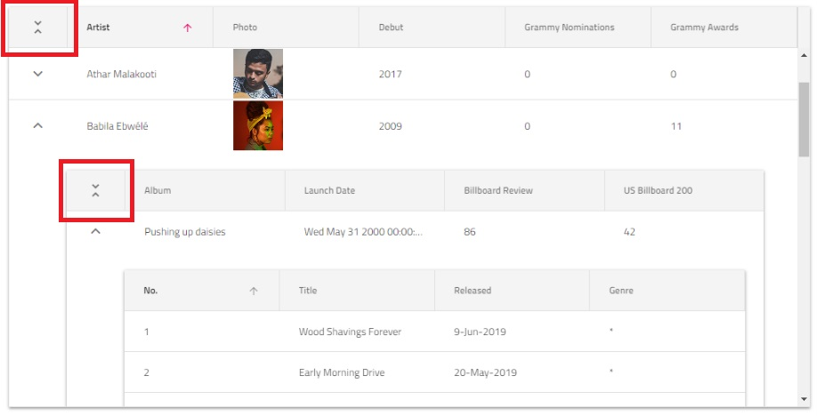

# Hierarchical Data Grid Overview and Configuration

The {ProductName} Hierarchical Data Grid is used to display and manipulate hierarchical tabular data. Quickly bind your data with very little code or use a variety of events to customize different behaviors. This component provides a rich set of features like data selection, excel style filtering, sorting, paging, templating, column moving, column pinning, export to Excel and CSV, and more. The Hierarchical Grid builds upon the Flat Grid Component and extends its functionality by allowing the users to expand or collapse the rows of the parent grid, revealing corresponding child grids, when more detailed information is needed.

## {Platform} Hierarchical Data Grid Example

In this {Platform} grid example you can see how users can visualize hierarchical sets of data and use cell templating to add other visual components.

`sample="/{HierarchicalGridSample}/overview", height="700", alt="{Platform} Hierarchical Grid example"`

## Getting Started with {ProductName} Hierarchical Grid

### Dependencies

To get started with the {Platform} hierarchical grid, first you need to install the {ProductName} package.

<!-- Blazor -->

Please refer to these topics on adding the IgniteUI.Blazor package:

- [Getting Started](../../general-getting-started-blazor-client.md)
- [Adding Nuget Package](../../general-nuget-feed.md)

You also need to include the following CSS link in the index.html file of your application to provide the necessary styles to the hierarchical grid:

```razor
<link href="_content/IgniteUI.Blazor/themes/grid/light/bootstrap.css" rel="stylesheet" />
```

Afterwards, you may start implementing the control by adding the following namespaces:

```razor
@using IgniteUI.Blazor.Controls
```

<!-- end: Blazor -->

<!-- Angular, React, WebComponents -->

When installing the {Platform} hierarchical grid package, the core package must also be installed.

```cmd
npm install --save {PackageCore}
npm install --save {PackageGrids}
npm install --save {PackageInputs}
npm install --save {PackageLayouts}
```

You also need to include the following import to use the grid:

<!-- WebComponents -->
```typescript
import 'igniteui-webcomponents-grids/grids/combined.js';
```
<!-- end: WebComponents -->

```tsx
import "igniteui-react-grids/grids";
```

The corresponding styles should also be referenced. You can choose light or dark option for one of the [themes](../../themes/overview.md) and based on your project configuration to import it:

<!-- WebComponents -->
```typescript
import 'igniteui-webcomponents-grids/grids/themes/light/bootstrap.css';
```
<!-- end: WebComponents -->

```tsx
import 'igniteui-react-grids/grids/themes/light/bootstrap.css'
```

<!-- WebComponents -->
Or to link it:
```typescript
<link rel='stylesheet' href='node_modules/igniteui-webcomponents-grids/grids/themes/light/bootstrap.css'>
```
<!-- end: WebComponents -->
For more details on how to customize the appearance of the hierarchical grid, you may have a look at the [styling](overview.md#Styling) section.

<!-- end: Angular, React, WebComponents -->

<!-- Angular, Blazor -->
### Component Modules

```razor
// in Program.cs file

builder.Services.AddIgniteUIBlazor(typeof(IgbhierarchicalGridModule));
```

```typescript
// app.module.ts

import { IgxhierarchicalGridModule } from 'igniteui-angular';
// import { IgxhierarchicalGridModule } from '@infragistics/igniteui-angular'; for licensed package

@NgModule({
    imports: [
        // ...
        IgxhierarchicalGridModule,
        // ...
    ]
})
export class AppModule {}
```

<!-- end: Angular, Blazor -->

## Using the {Platform} Hierarchical Data Grid

### Data Binding

The *{HierarchicalGridSelector}* derives from {GridSelector} and shares most of its functionality. The main difference is that it allows multiple levels of hierarchy to be defined. They are configured through a separate tag within the definition of *{HierarchicalGridSelector}*, called *{RowIslandSelector}*. The *{RowIslandSelector}* component defines the configuration for each child grid for the particular level. Multiple row islands per level are also supported.
The Hierarchical Grid supports two ways of binding to data:

### Using hierarchical data

If the application loads the whole hierarchical data as an array of objects referencing children arrays of objects, then the Hierarchical Grid can be configured to read it and bind to it automatically. Here is an example of a properly structured hierarchical data source:

```ts
export const singers = [{
    "Artist": "Naomí Yepes",
    "Photo": "assets/images/hgrid/naomi.png",
    "Debut": "2011",
    "Grammy Nominations": 6,
    "Grammy Awards": 0,
    "Tours": [{
        "Tour": "Faithful Tour",
        "Started on": "Sep-12",
        "Location": "Worldwide",
        "Headliner": "NO",
        "Toured by": "Naomí Yepes"
    }],
    "Albums": [{
        "Album": "Dream Driven",
        "Launch Date": new Date("August 25, 2014"),
        "Billboard Review": "81",
        "US Billboard 200": "1",
        "Artist": "Naomí Yepes",
        "Songs": [{
            "No.": "1",
            "Title": "Intro",
            "Released": "*",
            "Genre": "*",
            "Album": "Dream Driven"
        }]
    }]
}];
```
```razor
public class SingersData : List<SingersDataItem>
{
    public SingersData()
    {
        this.Add(new SingersDataItem()
        {
            Artist = "Naomí Yepes",
            Photo = "assets/images/hgrid/naomi.png",
            Debut = "2011",
            GrammyNomination = 6,
            GrammyAwards = 0,
            Tours = new List<ToursItem>() {
            new ToursItem() {
                Tour = "Faithful Tour",
                StartedOn = new DateTime(),
                Location = "Worldwide",
                Headliner = "NO",
                TouredBy = "Naomí Yepes"
            }
           },
            Albums = new List<AlbumItem>() {
            new AlbumItem() {
                Album = "Dream Driven",
                LaunchDate = new DateTime(),
                BillboardReview= "81",
                Artist = "Naomí Yepes",
                Songs = new List<SongItem>() {
                    new SongItem() {
                        Number = "1",
                        Title="Intro",
                        Released = "*",
                        Genre = "Rock",
                        Album ="Dream Driven"
                    }
                }
            }
           }
        });
    }
}
```
Each *{RowIslandSelector}* should specify the key of the property that holds the children data.

```html
<igx-hierarchical-grid #hierarchicalGrid [data]="singers" [autoGenerate]="true">
    <igx-row-island [key]="'Albums'" [autoGenerate]="true">
        <igx-row-island [key]="'Songs'" [autoGenerate]="true">
        </igx-row-island>
    </igx-row-island>
    <igx-row-island [key]="'Tours'" [autoGenerate]="true">
    </igx-row-island>
</igx-hierarchical-grid>
```

```html
<igc-hierarchical-grid auto-generate="true">
    <igc-row-island child-data-key="Albums" auto-generate="true">
        <igc-row-island child-data-key="Songs" auto-generate="true">
        </igc-row-island>
    </igc-row-island>
    <igc-row-island child-data-key="Tours" auto-generate="true">
    </igc-row-island>
</igc-hierarchical-grid>
```

```tsx
<IgrHierarchicalGrid data={singers} autoGenerate="true">
    <IgrRowIsland childDataKey="Albums" autoGenerate="true">
        <IgrRowIsland childDataKey="Songs" autoGenerate="true">
        </IgrRowIsland>
    </IgrRowIsland>
    <IgrRowIsland childDataKey="Tours" autoGenerate="true">
    </IgrRowIsland>
</IgrHierarchicalGrid>
```

```razor
<IgbHierarchicalGrid Data="SingersData" AutoGenerate="true">
    <IgbRowIsland ChildDataKey="Tours" AutoGenerate="true"></IgbRowIsland>
    <IgbRowIsland ChildDataKey="Albums"AutoGenerate="true">
        <IgbRowIsland ChildDataKey="Songs" AutoGenerate="true"></IgbRowIsland>
    </IgbRowIsland>
</IgbHierarchicalGrid>
```
> [!NOTE]
> Note that instead of `data` the user configures only the `childDataKey` that the {HierarchicalGridSelector} needs to read to set the data automatically.

### Using Load-On-Demand

Most applications are designed to load as little data as possible initially, which results in faster load times. In such cases {HierarchicalGridSelector} may be configured to allow user-created services to feed it with data on demand.

<!-- Angular -->
```html
<!-- hierarchicalGridSample.component.html -->

<igx-hierarchical-grid #hGrid [primaryKey]="'CustomerID'" [autoGenerate]="true" [height]="'600px'" [width]="'100%'">
    <igx-row-island [key]="'Orders'" [primaryKey]="'OrderID'" [autoGenerate]="true"  (gridCreated)="gridCreated($event, 'CustomerID')">
        <igx-row-island [key]="'Order_Details'" [primaryKey]="'ProductID'" [autoGenerate]="true" (gridCreated)="gridCreated($event, 'OrderID')">
        </igx-row-island>
    </igx-row-island>
</igx-hierarchical-grid>
```

```typescript
//  hierarchicalGridSample.component.ts

@Component({...})
export class HierarchicalGridLoDSampleComponent implements AfterViewInit {
    @ViewChild("hGrid")
    public hGrid: IgxHierarchicalGridComponent;

    constructor(private remoteService: RemoteLoDService) { }

    public ngAfterViewInit() {
        this.hGrid.isLoading = true;
        this.remoteService.getData({ parentID: null, rootLevel: true, key: "Customers" }).subscribe((data) => {
            this.hGrid.isLoading = false;
            this.hGrid.data = data;
            this.hGrid.cdr.detectChanges();
        });
    }

    public gridCreated(event: IGridCreatedEventArgs, _parentKey: string) {
        const dataState = {
            key: event.owner.key,
            parentID: event.parentID,
            parentKey: _parentKey,
            rootLevel: false
        };
        event.grid.isLoading = true;
        this.remoteService.getData(dataState).subscribe(
            (data) => {
                event.grid.isLoading = false;
                event.grid.data = data;
                event.grid.cdr.detectChanges();
            }
        );
    }
}
```

```typescript
// remote-load-on-demand.service.ts

@Injectable()
export class RemoteLoDService {
    public url = `https://services.odata.org/V4/Northwind/Northwind.svc/`;

    constructor(private http: HttpClient) { }

    public getData(dataState?: any): Observable<any[]> {
        return this.http.get(this.buildUrl(dataState)).pipe(
            map((response) => response["value"])
        );
    }

    public buildUrl(dataState) {
        let qS = "";
        if (dataState) {
            qS += `${dataState.key}?`;

            if (!dataState.rootLevel) {
                if (typeof dataState.parentID === "string") {
                    qS += `$filter=${dataState.parentKey} eq '${dataState.parentID}'`;
                } else {
                    qS += `$filter=${dataState.parentKey} eq ${dataState.parentID}`;
                }
            }
        }
        return `${this.url}${qS}`;
    }
}
```
<!-- end: Angular -->

<!-- WebComponents -->
```html
<igc-hierarchical-grid id="hGrid" primary-key="CustomerID" auto-generate="true" height="600px" width="100%">
    <igc-row-island id="ordersRowIsland" child-data-key="Orders" primary-key="OrderID" auto-generate="true">
        <igc-row-island id="orderDetailsRowIsland" child-data-key="Order_Details" primary-key="ProductID" auto-generate="true"></igc-row-island>
    </igc-row-island>
</igc-hierarchical-grid>
```

```ts
import { getData } from "./remoteService";

export class HierarchicalGridLoadOnDemand {
    constructor() {
        const hierarchicalGrid = document.getElementById("hGrid") as IgcHierarchicalGridComponent;
        const ordersRowIsland = document.getElementById("ordersRowIsland");
        const orderDetailsRowIsland = document.getElementById("orderDetailsRowIsland");
        ordersRowIsland.addEventListener("gridCreated", (event: any) => {
            this.gridCreated(event, "CustomerID");
        });
        orderDetailsRowIsland.addEventListener("gridCreated", (event: any) => {
            this.gridCreated(event, "OrderID");
        });
        hierarchicalGrid.isLoading = true;
        getData({ parentID: null, rootLevel: true, key: "Customers" }).then((data: any) => {
            hierarchicalGrid.isLoading = false;
            hierarchicalGrid.data = data;
            hierarchicalGrid.markForCheck();
        });
    }

    public gridCreated(event: CustomEvent<IgcGridCreatedEventArgs>, _parentKey: string) {
        const context = event.detail;
        const dataState = {
            key: context.owner.childDataKey,
            parentID: context.parentID,
            parentKey: _parentKey,
            rootLevel: false
        };
        context.grid.isLoading = true;
        getData(dataState).then((data: any[]) => {
            context.grid.isLoading = false;
            context.grid.data = data;
            context.grid.markForCheck();
        });
    }
}
```
<!-- end: WebComponents -->

```tsx
import { getData } from "./remoteService";

export default function Sample() {
  const hierarchicalGrid = useRef(null);
  function gridCreated(
    rowIsland: IgrRowIsland,
    event: IgrGridCreatedEventArgs,
    _parentKey: string
  ) {
    const context = event.detail;
    const dataState = {
      key: rowIsland.childDataKey,
      parentID: context.parentID,
      parentKey: _parentKey,
      rootLevel: false,
    };
    context.grid.isLoading = true;
    getData(dataState).then((data: any[]) => {
      context.grid.isLoading = false;
      context.grid.data = data;
      context.grid.markForCheck();
    });
  }
  useEffect(() => {
    hierarchicalGrid.current.isLoading = true;
    getData({ parentID: null, rootLevel: true, key: "Customers" }).then(
      (data: any) => {
        hierarchicalGrid.current.isLoading = false;
        hierarchicalGrid.current.data = data;
        hierarchicalGrid.current.markForCheck();
      }
    );
  }, []);

  return (
    <IgrHierarchicalGrid
        ref={hierarchicalGrid}
        primaryKey="CustomerID"
        autoGenerate="true"
        height="600px"
        width="100%"
    >
        <IgrRowIsland
        childDataKey="Orders"
        primaryKey="OrderID"
        autoGenerate="true"
        gridCreated={(
            rowIsland: IgrRowIsland,
            e: IgrGridCreatedEventArgs
        ) => gridCreated(rowIsland, e, "CustomerID")}
        >
        <IgrRowIsland
            childDataKey="Order_Details"
            primaryKey="ProductID"
            autoGenerate="true"
            gridCreated={(
            rowIsland: IgrRowIsland,
            e: IgrGridCreatedEventArgs
            ) => gridCreated(rowIsland, e, "OrderID")}
        ></IgrRowIsland>
        </IgrRowIsland>
    </IgrHierarchicalGrid>
  );
}
```

<!-- WebComponents, React -->
```ts
const URL = `https://services.odata.org/V4/Northwind/Northwind.svc/`;
export function getData(dataState?: any): any {
    return fetch(buildUrl(dataState))
        .then((result) => result.json())
        .then((data) => data["value"]);
}

function buildUrl(dataState: any) {
    let qS = "";
    if (dataState) {
        qS += `${dataState.key}?`;

        if (!dataState.rootLevel) {
            if (typeof dataState.parentID === "string") {
                qS += `$filter=${dataState.parentKey} eq '${dataState.parentID}'`;
            } else {
                qS += `$filter=${dataState.parentKey} eq ${dataState.parentID}`;
            }
        }
    }
    return `${URL}${qS}`;
}
```
<!-- end: WebComponents, React -->

```razor
TODO: Waiting for event handlers on row islands
```

## Hide/Show row expand indicators

If you have a way to provide information whether a row has children prior to its expanding, you could use the `HasChildrenKey` input property. This way you could provide a boolean property from the data objects which indicates whether an expansion indicator should be displayed.

```html
<igx-hierarchical-grid #grid [data]="data" primaryKey="ID" hasChildrenKey="hasChildren">
</igx-hierarchical-grid>
```

```html
<igc-hierarchical-grid data="data" primary-key="ID" has-children-key="hasChildren">
</igc-hierarchical-grid>
```

```tsx
<IgrHierarchicalGrid data={data} primaryKey="ID" hasChildrenKey="hasChildren">
</IgrHierarchicalGrid>
```

```razor
<IgbHierarchicalGrid Data="data" PrimaryKey="ID" HasChildrenKey="hasChildren">
</IgbHierarchicalGrid>
```

Note that setting the `HasChildrenKey` property is not required. In case you don't provide it, expansion indicators will be displayed for each row.

Additionally if you wish to show/hide the header expand/collapse all indicator you can use the `ShowExpandAll` property.
This UI is disabled by default for performance reasons and it is not recommended to enable it in grids with large data or grids with load on demand.

## Features

The grid features could be enabled and configured through the {RowIslandSelector} markup - they get applied for every grid that is created for it. Changing options at runtime through the row island instance changes them for each of the grids it has spawned.

```html
<igx-hierarchical-grid [data]="localData" [autoGenerate]="false"
    [allowFiltering]='true' [height]="'600px'" [width]="'800px'" #hGrid>
    <igx-column field="ID" [pinned]="true" [filterable]='true'></igx-column>
    <igx-column-group header="Information">
        <igx-column field="ChildLevels"></igx-column>
        <igx-column field="ProductName" hasSummary='true'></igx-column>
    </igx-column-group>
    <igx-row-island [key]="'childData'" [autoGenerate]="false" [rowSelection]="'multiple'" #layout1>
        <igx-column field="ID" [hasSummary]='true' [dataType]="'number'"></igx-column>
        <igx-column-group header="Information2">
            <igx-column field="ChildLevels"></igx-column>
            <igx-column field="ProductName"></igx-column>
        </igx-column-group>
        <igx-paginator *igxPaginator [perPage]="5"></igx-paginator>
    </igx-row-island>
    <igx-paginator>
    </igx-paginator>
</igx-hierarchical-grid>
```

```html
<igc-hierarchical-grid data="localData" auto-generate="false"
    allow-filtering='true' height="600px" width="800px">
    <igc-column field="ID" pinned="true" filterable="true"></igc-column>
    <igc-column-group header="Information">
        <igc-column field="ChildLevels"></igc-column>
        <igc-column field="ProductName" has-summary="true"></igc-column>
    </igc-column-group>
    <igc-row-island child-data-key="childData" auto-generate="false" row-selection="multiple">
        <igc-column field="ID" has-summary="true" data-type="number"></igc-column>
        <igc-column-group header="Information2">
            <igc-column field="ChildLevels"></igc-column>
            <igc-column field="ProductName"></igc-column>
        </igc-column-group>
        <igc-paginator per-page="5"></igc-paginator>
    </igc-row-island>
    <igc-paginator>
    </igc-paginator>
</igc-hierarchical-grid>
```

```tsx
<IgrHierarchicalGrid data={localData} autoGenerate="false"
    allowFiltering='true' height="600px" width="800px">
    <IgrColumn field="ID" pinned="true" filterable="true"></IgrColumn>
    <IgrColumnGroup header="Information">
        <IgrColumn field="ChildLevels"></IgrColumn>
        <IgrColumn field="ProductName" hasSummary="true"></IgrColumn>
    </IgrColumnGroup>
    <IgrRowIsland childDataKey="childData" autoGenerate="false" rowSelection="multiple">
        <IgrColumn field="ID" hasSummary="true" dataType="number"></IgrColumn>
        <IgrColumnGroup header="Information2">
            <IgrColumn field="ChildLevels"></IgrColumn>
            <IgrColumn field="ProductName"></IgrColumn>
        </IgrColumnGroup>
        <IgrPaginator perPage={5}></IgrPaginator>
    <IgrRowIsland>
    <IgrPaginator></IgrPaginator>
</IgrHierarchicalGrid>
```

```razor
<IgbHierarchicalGrid Data="localData" AutoGenerate="false"
    AllowFiltering="true" Height="600px" Width="800px">
    <IgbColumn Field="ID" Pinned="true" Filterable="true"></IgbColumn>
    <IgbColumnGroup Header="Information">
        <IgbColumn Field="ChildLevels"></IgbColumn>
        <IgbColumn Field="ProductName" HasSummary="true"></IgbColumn>
    </IgbColumnGroup>
    <IgbRowIsland ChildDataKey="childData" AutoGenerate="false" RowSelection="GridSelectionMode.Multiple">
        <IgbColumn Field="ID" HasSummary="true" DataType="number"></IgbColumn>
        <IgbColumnGroup Header="Information2">
            <IgbColumn Field="ChildLevels"></IgbColumn>
            <IgbColumn Field="ProductName"></IgbColumn>
        </IgbColumnGroup>
        <IgbPaginator PerPage="5"></IgbPaginator>
    <IgbRowIsland>
    <IgbPaginator></IgbPaginator>
</IgbHierarchicalGrid>
```

The following grid features work on a per grid level, which means that each grid instance manages them independently of the rest of the grids:

- Sorting
- Filtering
- Paging
- Multi Column Headers
- Hiding
- Pinning
- Moving
- Summaries
- Search

The Selection and Navigation features work globally for the whole {HierarchicalGridTitle}

- Selection
    Selection does not allow selected cells to be present for two different child grids at once.
- Navigation
    When navigating up/down, if next/prev element is a child grid, navigation will continue in the related child grid, marking the related cell as selected and focused. If the child cell is outside the current visible view port it is scrolled into view so that selected cell is always visible.

## Collapse All Button

The Hierarchical Grid allows the users to conveniently collapse all its currently expanded rows by pressing the "Collapse All" button at its top left corner. Additionally, every child grid which contains other grids and is a Hierarchical Grid itself, also has such a button - this way the user is able to collapse only a given grid in the hierarchy:



## Sizing

See the [Hierarchical Grid Sizing](sizing.md) topic.

<!-- Angular -->
## CRUD operations

> [!NOTE]
> An important difference from the flat Data Grid is that each instance for a given row island has the same transaction service instance and accumulates the same transaction log. In order to enable the CRUD functionality users should inject the `IgxHierarchicalTransactionServiceFactory`.

Calling CRUD API methods should still be done through each separate grid instance.

Check out the How-to [Build CRUD operations with igxGrid](../general/how-to/how-to-perform-crud.md) topic.
<!-- end: Angular -->

<!-- Angular -->
## Styling
The igxHierarchicalGrid allows styling through the [Ignite UI for Angular Theme Library](../themes/sass/component-themes.md). The grid's [theme]({environment:sassApiUrl}/index.html#function-grid-theme) exposes a wide variety of properties, which allow the customization of all the features of the grid.

In the below steps, we are going through the steps of customizing the igxHierarchicalGrid styling.

### Importing global theme
To begin the customization of the hierarchical grid, you need to import the `index` file, where all styling functions and mixins are located.

```scss
@import '~igniteui-angular/lib/core/styles/themes/index'
```

### Defining custom theme
Next, create a new theme, that extends the [`grid-theme`]({environment:sassApiUrl}/index.html#function-grid-theme) and accepts the parameters, required to customize the hierarchical grid as desired.

 >[!NOTE]
 >There is no specific `sass` hierarchical grid function.


```scss
$custom-theme: grid-theme(
  $cell-active-border-color: #ffcd0f,
  $cell-selected-background: #6f6f6f,
  $row-hover-background: #f8e495,
  $row-selected-background: #8d8d8d,
  $header-background: #494949,
  $header-text-color: #fff,
  $expand-icon-color: #ffcd0f,
  $expand-icon-hover-color: #e0b710,
  $resize-line-color: #ffcd0f,
  $row-highlight: #ffcd0f
);
```

### Defining a custom color palette
In the approach, that was described above, the color values were hardcoded. Alternatively, you can achieve greater flexibility, using the [`igx-palette`]({environment:sassApiUrl}/index.html#function-igx-palette) and [`igx-color`]({environment:sassApiUrl}/index.html#function-igx-color) functions.
`igx-palette` generates a color palette, based on provided primary and secondary colors.

 ```scss
$black-color: #494949;
$yellow-color: #FFCD0F;

$custom-palette: palette(
  $primary: $black-color,
  $secondary: $yellow-color
);
```
After a custom palette has been generated, the `igx-color` function can be used to obtain different varieties of the primary and the secondary colors.
```scss
$custom-theme: grid-theme(
    $cell-active-border-color: (igx-color($custom-palette, "secondary", 500)),
    $cell-selected-background: (igx-color($custom-palette, "primary", 300)),
    $row-hover-background: (igx-color($custom-palette, "secondary", 100)),
    $row-selected-background: (igx-color($custom-palette, "primary", 100)),
    $header-background: (igx-color($custom-palette, "primary", 500)),
    $header-text-color: (igx-contrast-color($custom-palette, "primary", 500)),
    $expand-icon-color: (igx-color($custom-palette, "secondary", 500)),
    $expand-icon-hover-color: (igx-color($custom-palette, "secondary", 600)),
    $resize-line-color: (igx-color($custom-palette, "secondary", 500)),
    $row-highlight: (igx-color($custom-palette, "secondary", 500))
);
```

### Defining custom schemas
You can go even further and build flexible structure that has all the benefits of a [**schema**](../themes/sass/schemas.md). The **schema** is the recipe of a theme.
Extend one of the two predefined schemas, that are provided for every component. In our case, we will use `$_light_grid`.
```scss
$custom-grid-schema: extend($_light-grid,(
    cell-active-border-color: (igx-color:('secondary', 500)),
    cell-selected-background: (igx-color:('primary', 300)),
    row-hover-background: (igx-color:('secondary', 100)),
    row-selected-background: (igx-color:('primary', 100)),
    header-background: (igx-color:('primary', 500)),
    header-text-color: (igx-contrast-color:('primary', 500)),
    expand-icon-color: (igx-color:('secondary', 500)),
    expand-icon-hover-color: (igx-color:('secondary', 600)),
    resize-line-color: (igx-color:('secondary', 500)),
    row-highlight: (igx-color:('secondary', 500))
));
```
In order for the custom schema to be applied, either `light`, or `dark` globals has to be extended. The whole process is actually supplying a component with a custom schema and adding it to the respective component theme afterwards.
```scss
$my-custom-schema: extend($light-schema, (
    igx-grid: $custom-grid-schema
));

$custom-theme: grid-theme(
    $palette: $custom-palette,
    $schema: $my-custom-schema
);
```

### Applying the custom theme
The easiest way to apply your theme is with a `sass` `@include` statement in the global styles file:

```scss
@include grid($custom-theme);
```

### Scoped component theme

In order for the custom theme do affect only specific component, you can move all of the styles you just defined from the global styles file to the custom component's style file (including the import of the `index` file).

This way, due to Angular's [ViewEncapsulation](https://angular.io/api/core/Component#encapsulation), your styles will be applied only to your custom component.

 >[!NOTE]
 >If the component is using an [`Emulated`](../themes/sass/component-themes.md#view-encapsulation) ViewEncapsulation, it is necessary to penetrate this encapsulation using `::ng-deep` in order to style the grid.
 >[!NOTE]
 >Wrap the statement inside of a `:host` selector to prevent your styles from affecting elements *outside of* our component:

```scss
:host {
    ::ng-deep {
        @include grid($custom-theme);
    }
}
```

### Demo

<code-view style="height:505px"
           no-theming
           data-demos-base-url="{environment:demosBaseUrl}"
           iframe-src="{environment:demosBaseUrl}/hierarchical-grid/hierarchical-grid-styling" >
</code-view>

>[!NOTE]
>The sample will not be affected by the selected global theme from `Change Theme`.
<!-- end: Angular -->


<!-- WebComponents, Blazor, React -->
## Styling
In addition to the predefined themes, the grid could be further customized by setting some of the available [CSS properties](../theming.md). In case you would like to change the header background and text color, you need to set a class for the grid first:

<!-- WebComponents -->
```html
<igc-hierarchical-grid class="grid"></igc-hierarchical-grid>
```
<!-- end: WebComponents -->

```tsx
<IgrHierarchicalGrid className="grid"></IgrHierarchicalGrid>
```

```razor
 <IgbHierarchicalGrid Class="grid"></IgbHierarchicalGrid>
```

Then set the `--header-background` and `--header-text-color` CSS properties for that class:

```css
.grid {
    --header-background: #494949;
    --header-text-color: #FFF;
}
```

<!-- end: WebComponents, Blazor, React -->

## Known Limitations

|Limitation|Description|
|--- |--- |
|Group By|Group By feature is not supported by the hierarchical grid.|

## API References

* `HierarchicalGrid`
* `RowIsland`
* `Grid`
* `Column`
* `Cell`


## Additional Resources

* [Grid Sizing](sizing.md)
* [Virtualization and Performance](virtualization.md)
* [Paging](paging.md)
* [Filtering](filtering.md)
* [Sorting](sorting.md)
* [Summaries](summaries.md)
* [Column Moving](column-moving.md)
* [Column Pinning](column-pinning.md)
* [Column Resizing](column-resizing.md)
* [Selection](selection.md)

Our community is active and always welcoming to new ideas.

* [{ProductName} **Forums**]({ForumsLink})
* [{ProductName} **GitHub**]({GithubLink})