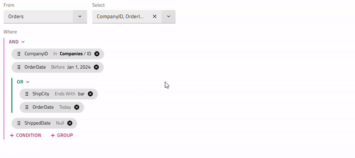
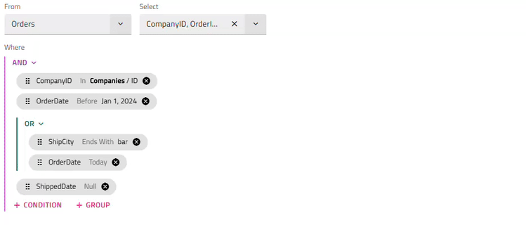

# {Platform} Query Builder Overview

The {ProductName} Query Builder provides a rich UI that allows developers to build complex data filtering queries for a specified data set. With this component, you can build an expression tree and specify AND/OR conditions between expressions, with editors and condition lists determined by each field's data type. The expression tree can then be easily transformed to a query in a format the backend supports.

`sample="/interactions/query-builder/overview", height="900", alt="{Platform} Query Builder Overview Example"`

# Getting started with {Platform} Query Builder
To start using the `QueryBuilder`, first, you need to install the `{ProductName}` package by running the following command:

<!-- WebComponents -->

```cmd
npm install {PackageWebComponents} {PackageGrids}
```
<!-- end: WebComponents -->

<!-- Blazor -->

```cmd
dotnet add package IgniteUI.Blazor --version {PackageVerLatest}
```

Register the Query Builder module in the **Program.cs** file:

```razor
builder.Services.AddIgniteUIBlazor(typeof(IgbQueryBuilderModule));
```
<!-- end: Blazor -->

<!-- React -->
```cmd
npm install igniteui-react {PackageGrids}
```
<!-- end: React -->

You also need to reference the corresponding styles based on your project configuration.

<!-- React, WebComponents -->
```ts
import 'igniteui-webcomponents-grids/grids/themes/light/bootstrap.css';
```
<!-- end: React, WebComponents -->

<!-- Blazor -->
```razor
<link href="_content/IgniteUI.Blazor/themes/light/bootstrap.css" rel="stylesheet" />
```
<!-- end: Blazor -->

# Using the {Platform} Query Builder

If no expression tree is initially set, you start by choosing an entity and which of its fields the query should return. After that, conditions or sub-groups can be added.

In order to add a condition you select a field, an operand based on the field data type and a value if the operand is not unary. The operands `In` and `Not In` will allow you to create an inner query with conditions for a different entity instead of simply providing a value. Once the condition is committed, a chip with the condition information appears. By clicking or hovering the chip, you have the options to modify it or add another condition or group right after it.

Clicking on the (AND or OR) button placed above each group, will open a menu with options to change the group type or ungroup the conditions inside.

Since every condition is related to a specific field from a particular entity changing the entity will lead to resetting all preset conditions and groups. 

You can start using the component by setting the `Entities` property to an array describing the entity name and an array of its fields, where each field is defined by its name and data type. Once a field is selected it will automatically assign the corresponding operands based on the data type.
The Query Builder has the `ExpressionTree` property. You could use it to set an initial state of the control and access the user-specified filtering logic.

<!-- WebComponents -->
```html
<igc-query-builder id="queryBuilder">
</igc-query-builder>
```

```ts
private queryBuilder: IgcQueryBuilderComponent;
public entities: any[] = [];
public ordersFields: any[] = [];
public expressionTree!: IgcExpressionTree;

constructor() {
  this.queryBuilder = document.getElementById('queryBuilder') as IgcQueryBuilderComponent;
  this.initFields();
}

private initFields(): void {
  this.ordersFields = [
    { field: 'orderId', dataType: 'number' },
    { field: 'customerId', dataType: 'string' },
    { field: 'orderDate', dataType: 'date' }
  ];

  this.entities = [
    { name: 'Orders', fields: this.ordersFields }
  ];

  const tree = new IgcFilteringExpressionsTree();
  tree.operator = FilteringLogic.And;
  tree.entity = 'Orders';

  this.expressionTree = tree;
  this.queryBuilder.entities = this.entities;
  this.queryBuilder.expressionTree = this.expressionTree;
}
```

The `ExpressionTree` is a bindable property which means you can subscribe to the `ExpressionTreeChange` event to receive notifications when the end-user changes the UI by creating, editing or removing conditions.

```ts
this.queryBuilder.addEventListener('expressionTreeChange', (e: CustomEvent<IgcExpressionTree>) => {
  this.expressionTree = e.detail;
  this.onExpressionTreeChange();
});
```
<!-- end: WebComponents -->

<!-- Blazor -->
```razor
<IgbQueryBuilder @ref="queryBuilder"
    Entities="Entities"
    ExpressionTree="ExpressionTree"
    ExpressionTreeChangeScript="WebQueryBuilderExpressionTreeChange">
</IgbQueryBuilder>

@code {
    private static readonly IgbFieldType[] OrderFields =
    [
        new() { Field = "orderId", DataType = GridColumnDataType.Number },
        new() { Field = "customerId", DataType = GridColumnDataType.String },
        new() { Field = "orderDate", DataType = GridColumnDataType.Date }
    ];

    private static readonly IgbEntityType[] Entities =
    [
        new() { Name = "Orders", Fields = OrderFields }
    ];

    private static readonly IgbExpressionTree ExpressionTree = new()
    {
        FilteringOperands = [],
        Operator = FilteringLogic.And,
        Entity = "Orders"
    };

    private IgbQueryBuilder queryBuilder;
}
```

The `ExpressionTree` is a bindable property which means you can use `ExpressionTreeChangeScript` to receive notifications when the end-user changes the UI by creating, editing or removing conditions.

```razor
// In JavaScript
igRegisterScript("WebQueryBuilderExpressionTreeChange", (evtArgs) => {
    const expressionTree = evtArgs.detail;
    console.log("Expression tree changed:", expressionTree);
}, false);
```
<!-- end: Blazor -->

<!-- React -->

```tsx
private queryBuilderRef: React.RefObject<IgcQueryBuilderComponent>;

constructor(props: any) {
  super(props);
  this.queryBuilderRef = React.createRef();
  this.state = {
    expressionTree: null
  };
}

componentDidMount() {
  const tree = new IgrFilteringExpressionsTree();
  tree.operator = FilteringLogic.And;
  tree.entity = 'Orders';

  this.setState({ expressionTree: tree });

  if (this.queryBuilderRef.current && tree) {
    const queryBuilder = this.queryBuilderRef.current;
    queryBuilder.entities = this.entities as any;
    queryBuilder.expressionTree = tree;
    queryBuilder.addEventListener('expressionTreeChange', this.handleExpressionTreeChange);
  }
}

componentWillUnmount() {
  if (this.queryBuilderRef.current) {
    this.queryBuilderRef.current.removeEventListener('expressionTreeChange', this.handleExpressionTreeChange);
  }
}

private handleExpressionTreeChange = (event: CustomEvent<IgcExpressionTree>) => {
  this.setState({ expressionTree: event.detail });
};

private get ordersFields(): Field[] {
  return [
    { field: 'orderId', dataType: 'number' },
    { field: 'customerId', dataType: 'string' },
    { field: 'orderDate', dataType: 'date' }
  ];
}

private get entities(): Entity[] {
  return [
    { name: 'Orders', fields: this.ordersFields }
  ];
}

private onExpressionTreeChange() {
  // Handle expression tree changes
  console.log('Expression tree changed:', this.state.expressionTree);
}

public render(): JSX.Element {
  return (
    <div className="container sample">
      <IgrQueryBuilder ref={this.queryBuilderRef} id="queryBuilder"></IgrQueryBuilder>
    </div>
  );
}
```

The `ExpressionTree` is stored in the component state which means you can subscribe to the `ExpressionTreeChange` event to receive notifications when the end-user changes the UI by creating, editing or removing conditions. The event listener is attached in `componentDidMount` and cleaned up in `componentWillUnmount`.

```tsx
private handleExpressionTreeChange = (event: CustomEvent<IgcExpressionTree>) => {
  this.setState({ expressionTree: event.detail });
  this.onExpressionTreeChange();
};
```
<!-- end: React -->

# Expressions Dragging

Condition chips can be easily repositioned using mouse Drag & Drop or Keyboard reordering approaches. With those, users can adjust their query logic dynamically.

- Dragging a chip does not modify its condition/contents, only its position.
- Chip can also be dragged along groups and subgroups. For example, grouping/ungrouping expressions is achieved via the Expressions Dragging functionality.
In order to group already existing conditions, first you need to add a new group through the 'add' group button. Then via dragging, the required expressions can be moved to that group. In order to ungroup, you could drag all conditions outside their current group and once the last condition is moved out, the group will be deleted.

>[!NOTE]
>Chips from one query tree cannot be dragged in another, e.g. from parent to inner and vice versa.



## Keyboard interaction

**Key Combinations**

- <kbd>Tab</kbd> / <kbd>Shift + Tab</kbd> - navigates to the next/previous chip, drag indicator, remove button, 'add' expression button.
- <kbd>Arrow Down</kbd>/<kbd>Arrow Up</kbd> - when chip's drag indicator is focused, the chip can be moved up/down.
- <kbd>Space</kbd> / <kbd>Enter</kbd> - focused expression enters edit mode. If chip is been moved, this confirms it's new position.
- <kbd>Esc</kbd> - chip's reordering is canceled and it returns to it's original position.

>[!NOTE]
>Keyboard reordering provides the same functionality as mouse Drag & Drop. Once a chip is moved, user has to confirm the new position or cancel the reorder.



## Templating

The {ProductName} Query Builder allows defining templates for the component's header and search value:

### Header Template

By default the `{ComponentName}` header would not be displayed. In order to define one, add the query builder header component inside the query builder.

<!-- WebComponents -->
```html
<igc-query-builder id="queryBuilder">
  <igc-query-builder-header title="My Query Builder">
  </igc-query-builder-header>
</igc-query-builder>
```
<!-- end: WebComponents -->

<!-- Blazor -->
```razor
<IgbQueryBuilder Entities="Entities" ExpressionTree="ExpressionTree">
    <IgbQueryBuilderHeader Title="My Query Builder"></IgbQueryBuilderHeader>
</IgbQueryBuilder>
```
<!-- end: Blazor -->

<!-- React -->
```tsx
<IgrQueryBuilder ref={this.queryBuilderRef}>
  <IgrQueryBuilderHeader title="My Query Builder"></IgrQueryBuilderHeader>
</IgrQueryBuilder>
```
<!-- end: React -->

### Search Value Template

The search value of a condition can be templated by setting the `SearchValueTemplate` property.

<!-- React, WebComponents -->
For Web Components and React, the property accepts a function that returns a template.
<!-- end: React, WebComponents -->

<!-- Blazor -->
For Blazor, use the `SearchValueTemplateScript` property to reference a client-side function registered with `igRegisterScript`.
<!-- end: Blazor -->

> [!Note]
> When using a search value template, you must provide templates for all field types in your entity, or the query builder will not function correctly. It is mandatory to implement a default/fallback template that handles any fields or conditions not covered by specific custom templates. Without this, users will not be able to edit conditions for those fields.

<!-- WebComponents -->
```ts
constructor() {
  this.queryBuilder = document.getElementById('queryBuilder') as IgcQueryBuilderComponent;
  this.queryBuilder.searchValueTemplate = (ctx) => this.buildSearchValueTemplate(ctx);
}

private buildSearchValueTemplate(ctx: IgcQueryBuilderSearchValueContext) {
  const field = ctx.selectedField?.field;
  const condition = ctx.selectedCondition;
  const matchesEqualityCondition = condition === 'equals' || condition === 'doesNotEqual';

  if (!ctx.implicit) {
      ctx.implicit = { value: null };
  }

  // Custom template for Region field
  if (field === 'Region' && matchesEqualityCondition) {
      return this.buildRegionSelect(ctx);
  }

  // Custom template for OrderStatus field
  if (field === 'OrderStatus' && matchesEqualityCondition) {
      return this.buildStatusRadios(ctx);
  }

  // Custom template for date fields
  if (ctx.selectedField?.dataType === 'date') {
      return this.buildDatePicker(ctx);
  }

  // Custom template for time fields
  if (ctx.selectedField?.dataType === 'time') {
      return this.buildTimeInput(ctx);
  }

  // Default template for all other fields (string, number, boolean, etc.)
  // This ensures all fields have a functioning editor
  return this.buildDefaultInput(ctx);
}
```
<!-- end: WebComponents -->

<!-- Blazor -->
```razor
<IgbQueryBuilder @ref="queryBuilder"
    Entities="Entities"
    ExpressionTree="ExpressionTree"
    ExpressionTreeChangeScript="WebQueryBuilderExpressionTreeChange"
    SearchValueTemplateScript="SearchValueTemplate">
    <IgbQueryBuilderHeader Title="Query Builder Template Sample"></IgbQueryBuilderHeader>
</IgbQueryBuilder>
```

```razor
// In JavaScript
igRegisterScript("SearchValueTemplate", (ctx) => {
    const field = ctx.selectedField?.field;
    const condition = ctx.selectedCondition;
    const matchesEqualityCondition = condition === "equals" || condition === "doesNotEqual";

    if (!ctx.implicit) {
        ctx.implicit = { value: null };
    }

    if (field === "Region" && matchesEqualityCondition) {
        return buildRegionSelect(ctx);
    }

    if (field === "OrderStatus" && matchesEqualityCondition) {
        return buildStatusRadios(ctx);
    }

    if (ctx.selectedField?.dataType === "date") {
        return buildDatePicker(ctx);
    }

    if (field === "RequiredTime") {
        return buildTimeInput(ctx);
    }

    return buildDefaultInput(ctx, matchesEqualityCondition);
}, false);
```
<!-- end: Blazor -->

<!-- React -->
```tsx
<IgrQueryBuilder 
  ref={this.queryBuilderRef} 
  id="queryBuilder"
  searchValueTemplate={this.buildSearchValueTemplate}>
  <IgrQueryBuilderHeader title="Query Builder Template Sample"></IgrQueryBuilderHeader>
</IgrQueryBuilder>
```

```tsx
componentDidMount() {
  if (this.queryBuilderRef.current && tree) {
    const queryBuilder = this.queryBuilderRef.current;
    queryBuilder.entities = this.entities as any;
    queryBuilder.expressionTree = tree;
  }
}

private buildSearchValueTemplate = (ctx: QueryBuilderSearchValueContext) => {
  const field = ctx.selectedField?.field;
  const condition = ctx.selectedCondition;
  const matchesEqualityCondition = condition === 'equals' || condition === 'doesNotEqual';

  if (!ctx.implicit) {
    ctx.implicit = { value: null };
  }

  if (field === 'Region' && matchesEqualityCondition) {
    return this.buildRegionSelect(ctx);
  }

  if (field === 'OrderStatus' && matchesEqualityCondition) {
    return this.buildStatusRadios(ctx);
  }

  if (ctx.selectedField?.dataType === 'date') {
    return this.buildDatePicker(ctx);
  }

  if (ctx.selectedField?.dataType === 'time') {
    return this.buildTimeInput(ctx);
  }

  return this.buildDefaultInput(ctx, matchesEqualityCondition);
};
```
<!-- end: React -->

Below are examples showing one template for each type of editor:

<!-- WebComponents -->
For the Region Select example:

```ts
// Field definition
{ field: 'Region', dataType: 'string' }

// Template
private buildRegionSelect(ctx: IgcQueryBuilderSearchValueContext) {
  const currentValue = ctx?.implicit?.value?.value ?? '';

  return html`
    <igc-select
      placeholder="Region"
      .value=${currentValue}
      @igcChange=${(event: CustomEvent<{ value: string }>) => {
        const region = this.regionOptions.find(o => o.value === event.detail.value);
        ctx.implicit.value = region ?? null;
      }}>
      ${this.regionOptions.map(option => html`
        <igc-select-item value=${option.value}>${option.text}</igc-select-item>
      `)}
    </igc-select>
  `;
}
```

For the Status Radio Group example:

```ts
// Field definition
{ field: 'OrderStatus', dataType: 'number' }

// Template
private buildStatusRadios(ctx: IgcQueryBuilderSearchValueContext) {
  const currentValue = ctx.implicit?.value?.toString() ?? '';

  return html`
    <igc-radio-group
      .alignment=${"horizontal"}
      .value=${currentValue}
      @igcChange=${(event: CustomEvent<{ value: string }>) => {
        ctx.implicit.value = Number(event.detail.value);
      }}>
      ${this.statusOptions.map(option => html`
        <igc-radio
          name="status"
          value=${option.value}
          ?checked=${option.value.toString() === currentValue}>
          ${option.text}
        </igc-radio>
      `)}
    </igc-radio-group>
  `;
}
```

For the Date Picker example:

```ts
// Field definition
{ field: 'OrderDate', dataType: 'date' }

// Template
private buildDatePicker(ctx: IgcQueryBuilderSearchValueContext) {
  const currentValue = ctx.implicit?.value instanceof Date
    ? ctx.implicit.value
    : ctx.implicit?.value ? new Date(ctx.implicit.value) : null;

  const allowedConditions = ['equals', 'doesNotEqual', 'before', 'after'];
  const isEnabled = allowedConditions.includes(ctx.selectedCondition ?? '');

  return html`
    <igc-date-picker
      .value=${currentValue}
      .disabled=${!isEnabled}
      @igcChange=${(event: CustomEvent) => {
        ctx.implicit.value = event.detail;
      }}>
    </igc-date-picker>
  `;
}
```

For the Time Input example:

```ts
// Field definition
{ field: 'RequiredTime', dataType: 'time' }

// Template
private buildTimeInput(ctx: IgcQueryBuilderSearchValueContext) {
  const currentValue = this.normalizeTimeValue(ctx.implicit?.value);
  const allowedConditions = ['at', 'not_at', 'at_before', 'at_after', 'before', 'after'];
  const isDisabled = !allowedConditions.includes(ctx.selectedCondition ?? '');

  return html`
    <igc-date-time-input
      .inputFormat=${"hh:mm tt"}
      .value=${currentValue}
      .disabled=${isDisabled}
      @igcChange=${(event: CustomEvent) => {
        ctx.implicit.value = event.currentTarget.value;
      }}>
      <igc-icon slot="prefix" name="clock" collection="material"></igc-icon>
    </igc-date-time-input>
  `;
}
```

For the Default Input template:

```ts
// Field definitions for string, number, and boolean types
{ field: 'ShipCountry', dataType: 'string' }
{ field: 'OrderID', dataType: 'number' }
{ field: 'IsRushOrder', dataType: 'boolean' }

// Template that handles all these types
private buildDefaultInput(ctx: IgcQueryBuilderSearchValueContext) {
  const dataType = ctx.selectedField?.dataType;
  const isNumber = dataType === 'number';
  const isBoolean = dataType === 'boolean';
  
  const placeholder = ctx.selectedCondition === 'inQuery' || ctx.selectedCondition === 'notInQuery'
    ? 'Sub-query results'
    : 'Value';

  const inputValue = ctx.implicit?.value ?? '';
  const disabledConditions = ['empty', 'notEmpty', 'null', 'notNull', 'inQuery', 'notInQuery'];
  const isDisabled = isBoolean || !ctx.selectedField || disabledConditions.includes(ctx.selectedCondition ?? '');

  return html`
    <igc-input 
      .value=${inputValue}
      ?disabled=${isDisabled}
      placeholder=${placeholder}
      type=${isNumber ? 'number' : 'text'}
      @input=${(event: Event) => {
        const target = event.target as HTMLInputElement;
        ctx.implicit.value = isNumber
          ? target.value === '' ? null : Number(target.value)
          : target.value;
      }}>
    </igc-input>
  `;
}
```
<!-- end: WebComponents -->

<!-- Blazor -->
For the Region Select example:

```razor
// Field definition
new() { Field = "Region", DataType = GridColumnDataType.String }
```

```razor
// In JavaScript
// Template
function buildRegionSelect(ctx) {
    const select = document.createElement("igc-select");
    const implicitValue = ctx?.implicit?.value;
    const currentValue = typeof implicitValue === "object" && implicitValue
        ? implicitValue.value ?? ""
        : implicitValue ?? "";

    select.placeholder = "Region";
    if (currentValue) {
        select.value = currentValue;
    }

    for (const option of regionOptions) {
        const item = document.createElement("igc-select-item");
        item.setAttribute("value", option.value);
        item.textContent = option.text;
        select.appendChild(item);
    }

    select.addEventListener("igcChange", (event) => {
        const value = event.detail?.value;
        const currentImplicitValue = ctx?.implicit?.value;
        const currentKey = typeof currentImplicitValue === "object" && currentImplicitValue
            ? currentImplicitValue.value ?? ""
            : currentImplicitValue ?? "";

        if (!value || value === currentKey) {
            return;
        }

        ctx.implicit.value = regionOptions.find((option) => option.value === value) ?? null;
    });

    return select;
}
```

For the Status Radio Group example:

```razor
// Field definition
new() { Field = "OrderStatus", DataType = GridColumnDataType.Number }
```

```razor
// In JavaScript
// Template
function buildStatusRadios(ctx) {
    const group = document.createElement("igc-radio-group");
    const implicitValue = ctx.implicit?.value;
    const currentValue = implicitValue == null ? "" : implicitValue.toString();

    group.style.gap = "5px";
    group.alignment = "horizontal";
    group.value = currentValue;

    for (const option of statusOptions) {
        const radio = document.createElement("igc-radio");
        radio.setAttribute("name", "status");
        radio.setAttribute("value", option.value.toString());
        radio.checked = option.value.toString() === currentValue;
        radio.textContent = option.text;
        group.appendChild(radio);
    }

    group.addEventListener("igcChange", (event) => {
        const value = event.detail?.value;
        if (value === undefined) {
            return;
        }

        const numericValue = Number(value);
        if (ctx.implicit.value === numericValue) {
            return;
        }

        ctx.implicit.value = numericValue;
    });

    return group;
}
```

For the Date Picker example:

```razor
// Field definition
new() { Field = "OrderDate", DataType = GridColumnDataType.Date }
```

```razor
// In JavaScript
// Template
function buildDatePicker(ctx) {
    const picker = document.createElement("igc-date-picker");
    const implicitValue = ctx.implicit?.value;
    const currentValue = implicitValue instanceof Date
        ? implicitValue
        : implicitValue
            ? new Date(implicitValue)
            : null;

    const allowedConditions = ["equals", "doesNotEqual", "before", "after"];
    const isEnabled = allowedConditions.includes(ctx.selectedCondition ?? "");

    picker.disabled = !isEnabled;
    if (currentValue) {
        picker.value = currentValue;
    }

    picker.addEventListener("click", () => picker.show?.());
    picker.addEventListener("igcChange", (event) => {
        ctx.implicit.value = event.detail;
    });

    return picker;
}
```

For the Time Input example:

```razor
// Field definition
new()
{
    Field = "RequiredTime",
    DataType = GridColumnDataType.DateTime,
    DefaultTimeFormat = "hh:mm tt"
}
```

```razor
// In JavaScript
// Template
function buildTimeInput(ctx) {
    const input = document.createElement("igc-date-time-input");
    const icon = document.createElement("igc-icon");
    const currentValue = normalizeTimeValue(ctx.implicit?.value);
    const allowedConditions = ["at", "not_at", "at_before", "at_after", "before", "after"];
    const isDisabled = ctx.selectedField == null || !allowedConditions.includes(ctx.selectedCondition ?? "");

    input.inputFormat = "hh:mm tt";
    input.disabled = isDisabled;
    if (currentValue) {
        input.value = currentValue;
    }

    icon.slot = "prefix";
    icon.setAttribute("name", "clock");
    icon.setAttribute("collection", "material");
    input.appendChild(icon);

    input.addEventListener("igcChange", (event) => {
        ctx.implicit.value = event.currentTarget?.value ?? null;
    });

    return input;
}
```

For the Default Input template:

```razor
// Field definitions for string, number, and boolean types
new() { Field = "ShipCountry", DataType = GridColumnDataType.String }
new() { Field = "OrderID", DataType = GridColumnDataType.Number }
new() { Field = "IsRushOrder", DataType = GridColumnDataType.Boolean }
```

```razor
// In JavaScript
// Template that handles all these types
function buildDefaultInput(ctx, matchesEqualityCondition) {
    const input = document.createElement("igc-input");
    const selectedField = ctx.selectedField;
    const dataType = selectedField?.dataType;
    const isNumber = dataType === "number";
    const isBoolean = dataType === "boolean";

    const placeholder = ctx.selectedCondition === "inQuery" || ctx.selectedCondition === "notInQuery"
        ? "Sub-query results"
        : "Value";

    const currentImplicitValue = ctx.implicit?.value;
    const currentValue = typeof currentImplicitValue === "object" && currentImplicitValue && "text" in currentImplicitValue
        ? matchesEqualityCondition ? currentImplicitValue.text : ""
        : currentImplicitValue;

    const disabledConditions = ["empty", "notEmpty", "null", "notNull", "inQuery", "notInQuery"];
    const isDisabled = isBoolean || selectedField == null || disabledConditions.includes(ctx.selectedCondition ?? "");

    input.value = currentValue == null ? "" : currentValue;
    input.placeholder = placeholder;
    input.disabled = isDisabled;
    input.type = isNumber ? "number" : "text";

    input.addEventListener("input", (event) => {
        const value = event.target?.value ?? "";
        ctx.implicit.value = isNumber
            ? value === "" ? null : Number(value)
            : value;
    });

    return input;
}
```
<!-- end: Blazor -->

<!-- React -->
For the Region Select example:

```tsx
// Field definition
{ field: 'Region', dataType: 'string' }

// Template
private buildRegionSelect = (ctx: QueryBuilderSearchValueContext) => {
  const currentValue = ctx?.implicit?.value?.value ?? '';
  const key = `region-select-${currentValue}`;

  return (
    <IgrSelect
      className="qb-select"
      key={key}
      value={currentValue}
      change={(sender: any) => {
        const value = sender.value;
        const currentKey = ctx?.implicit?.value?.value ?? '';

        if (!value || value === currentKey) return;

        setTimeout(() => {
          ctx.implicit.value = this.regionOptions.find(option => option.value === value) ?? null;
        });
      }}>
      {this.regionOptions.map(option => (
        <IgrSelectItem key={option.value} value={option.value}>
          <span>{option.text}</span>
        </IgrSelectItem>
      ))}
    </IgrSelect>
  );
};
```

For the Status Radio Group example:

```tsx
// Field definition
{ field: 'OrderStatus', dataType: 'number' }

// Template
private buildStatusRadios = (ctx: QueryBuilderSearchValueContext) => {
  const implicitValue = ctx.implicit?.value;
  const currentValue = implicitValue === null ? '' : implicitValue.toString();
  const key = `status-radio-${currentValue}`;

  return (
    <IgrRadioGroup
      key={key}
      style={{ gap: '5px' }}
      alignment="horizontal"
      value={currentValue}
      change={(sender: any) => {
        const value = sender.value;
        if (value === undefined) return;

        const numericValue = Number(value);
        if (ctx.implicit.value === numericValue) return;

        setTimeout(() => {
          ctx.implicit.value = numericValue;
        });
      }}>
      {this.statusOptions.map(option => (
        <IgrRadio
          key={option.value}
          name="status"
          value={option.value.toString()}
          checked={option.value.toString() === currentValue}
          labelText={option.text}>
        </IgrRadio>
      ))}
    </IgrRadioGroup>
  );
};
```

For the Date Picker example:

```tsx
// Field definition
{ field: 'OrderDate', dataType: 'date' }

// Template
private buildDatePicker = (ctx: QueryBuilderSearchValueContext) => {
  const implicitValue = ctx.implicit?.value;
  const currentValue = implicitValue instanceof Date
    ? implicitValue
    : implicitValue
      ? new Date(implicitValue)
      : null;

  const allowedConditions = ['equals', 'doesNotEqual', 'before', 'after'];
  const isEnabled = allowedConditions.indexOf(ctx.selectedCondition ?? '') !== -1;
  const key = `date-picker-${currentValue}`;

  return (
    <IgrDatePicker
      key={key}
      value={currentValue}
      disabled={!isEnabled}
      click={(sender: any) => sender.show()}
      change={(sender: any) => {
        setTimeout(() => {
          ctx.implicit.value = sender.value;
        });
      }}>
    </IgrDatePicker>
  );
};
```

For the Time Input example:

```tsx
// Field definition
{ field: 'RequiredTime', dataType: 'time' }

// Template
private buildTimeInput = (ctx: QueryBuilderSearchValueContext) => {
  const currentValue = this.normalizeTimeValue(ctx.implicit?.value);
  const allowedConditions = ['at', 'not_at', 'at_before', 'at_after', 'before', 'after'];
  const isDisabled = ctx.selectedField == null || allowedConditions.indexOf(ctx.selectedCondition ?? '') === -1;
  const key = `time-input-${currentValue}`;

  return (
    <IgrDateTimeInput
      key={key}
      inputFormat="hh:mm tt"
      value={currentValue}
      disabled={isDisabled}
      change={(sender: any) => {
        setTimeout(() => {
          ctx.implicit.value = sender.value;
        });
      }}>
      <div slot="prefix">
        <IgrIcon name="clock" collection="material" />
      </div>
    </IgrDateTimeInput>
  );
};
```

For the Default Input template:

```tsx
// Field definitions for string, number, and boolean types
{ field: 'ShipCountry', dataType: 'string' }
{ field: 'OrderID', dataType: 'number' }
{ field: 'IsRushOrder', dataType: 'boolean' }

// Template that handles all these types
private buildDefaultInput = (ctx: QueryBuilderSearchValueContext, matchesEqualityCondition: boolean) => {
  const selectedField = ctx.selectedField;
  const dataType = selectedField?.dataType;
  const isNumber = dataType === 'number';
  const isBoolean = dataType === 'boolean';

  const placeholder = ctx.selectedCondition === 'inQuery' || ctx.selectedCondition === 'notInQuery'
    ? 'Sub-query results'
    : 'Value';

  const currentValue = typeof ctx.implicit?.value === 'object' && (ctx.implicit.value && 'text' in ctx.implicit.value)
    ? matchesEqualityCondition ? ctx.implicit.value.text : ''
    : ctx.implicit?.value;

  const inputValue = currentValue == null ? '' : currentValue;
  const disabledConditions = ['empty', 'notEmpty', 'null', 'notNull', 'inQuery', 'notInQuery'];
  const isDisabled = isBoolean || selectedField == null || disabledConditions.indexOf(ctx.selectedCondition ?? '') !== -1;
  const key = `default-input-${inputValue}`;

  return (
    <IgrInput 
      key={key}
      value={inputValue?.toString() || ''}
      disabled={isDisabled}
      placeholder={placeholder}
      type={isNumber ? 'number' : 'text'}
      input={(sender: any) => {
        const value = sender.value;
        setTimeout(() => {
          ctx.implicit.value = isNumber
            ? value === '' ? null : Number(value)
            : value;
        });
      }}>
    </IgrInput>
  );
};
```
<!-- end: React -->

### Formatter

In order to change the appearance of the search value in the chip displayed when a condition is not in edit mode, you can set a formatter function to the fields array. The search value can be accessed through the value argument as follows:

<!-- React, WebComponents -->
```ts
this.ordersFields = [
  { field: 'OrderID', dataType: 'number' },
  { field: 'ShipCountry', dataType: 'string' },
  {
    field: 'OrderDate',
    dataType: 'date',
    formatter: (value: any) => value.toLocaleDateString(this.queryBuilder?.locale, { 
      month: 'short', 
      day: 'numeric', 
      year: 'numeric' 
    })
  },
  {
    field: 'Region',
    dataType: 'string',
    formatter: (value: any) => value?.text ?? value?.value ?? value
  }
];
```
<!-- end: React, WebComponents -->

<!-- Blazor -->
```razor
private static readonly IgbFieldType[] OrderFields =
[
    new() { Field = "OrderID", DataType = GridColumnDataType.Number },
    new() { Field = "ShipCountry", DataType = GridColumnDataType.String },
    new()
    {
        Field = "OrderDate",
        DataType = GridColumnDataType.Date,
        PipeArgs = new IgbFieldPipeArgs { Format = "MMM d, y" }
    },
    new() { Field = "Region", DataType = GridColumnDataType.String }
];
```
<!-- end: Blazor -->

### Demo

We’ve created this example to show you the templating and formatter functionalities for the header and the search value of the {Platform} Query Builder component.

`sample="/interactions/query-builder/template", height="900", alt="{Platform} Query Builder Template Example"`

## API Reference

- `QueryBuilder`
- `QueryBuilderHeader`
- `ExpressionTree`
- `FilteringExpressionsTree`
- `FilteringLogic`
- `StringFilteringOperand`
- `QueryBuilderSearchValueContext`
- [Styling & Themes](../themes/overview.md)

## Additional Resources

Our community is active and always welcoming to new ideas.

- [{ProductName} **Forums**]({ForumsLink})
- [{ProductName} **GitHub**]({GithubLink})