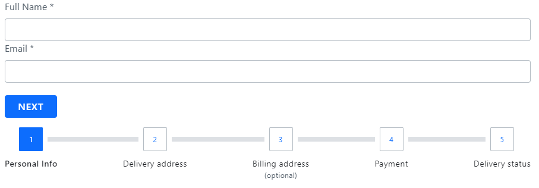

# {Platform} Stepper Overview
The {ProductName} Stepper is a highly customizable component that visualizes content as a process and shows its progress by dividing the content into successive steps. It appears as a vertical or horizontal line. Provided by the {ProductName} library, the stepper component delivers a wizard-like workflow and multiple features like step validation, styling, orientation and keyboard navigation. 

## {Platform} Stepper Example
In this {ProductName} Stepper example, you can see how users are given the opportunity to customize their credit card and they pass trough the process in five logical steps - selecting card type, adding business information, filling in personal information, providing shipping details and confirmation.
Note that the fourth step in our Angular stepper demo gets enabled only if the user ticks the checkbox in the second step, signifying that their mailing address is different from the business physical address.

<code-view style="height: 725px"
           data-demos-base-url="{environment:dvDemosBaseUrl}"
           iframe-src="{environment:demosBaseUrl}/layouts/stepper-overview-example"
           alt="{Platform} Stepper Example"
           github-src="layouts/stepper/overview">
</code-view>

<div class="divider--half"></div>

## Getting Started with {Platform} Stepper

<!-- WebComponents -->

First, you need to install the {ProductName} by running the following command:

```cmd
npm install {PackageWebComponents}
```

Before using the `Stepper`, you need to register it as follows:

```ts
import { defineComponents, IgcStepperComponent } from 'igniteui-webcomponents';

defineComponents(IgcStepperComponent);
```

<!-- end: WebComponents -->

Now you can start with a basic configuration of the `Stepper` and its steps.

## Usage
The `Step` is the representation of every step that belongs to the `Stepper`. Steps provide `invalid`, `active`, `optional`, `disabled` and `completed` properties, which give you the ability to configure the step states according to your business requirement.

### Declaring a Stepper
Steps can be declared using one of the following approaches.
- Iterating through a data set

```html
<igc-stepper>
     ${stepsData.map((step) => html`
    <igc-step .disabled=${step.disabled}>
        <div slot="indicator">
			<igc-icon .iconName=${step.indicator}></i>
        </div>

        <p slot="title">${step.title}</p>	
    </igc-step>
    `
</igc-stepper>
```

- Creating static steps

```html
<igc-stepper>
    <igc-step> 
       <p slot="title">Step 1</p>
    </igc-step>
    <igc-step> 
       <p slot="title">Step 2</p>
    </igc-step>
</igc-stepper>
```
For each step the user has the ability to configure indicator, title and subtitle using the `indicator`, `title`and `sub-title` slots as follows: 

```html
<igc-stepper>
    <igc-step>
       <igc-icon slot="indicator" iconName="home"></igc-icon>
       <p slot="title">Home</p>
       <p slot="subtitle">Home Sub Title</p>
       <div>
          Step Content
          ...
       </div>
    </igc-step>
</igc-stepper>
```


### Changing the Stepper Orientation
You can customize the stepper orientation through the exposed `orientation` property. It could be set to **horizontal** *(default value)* or **vertical**.

**Horizontal Stepper Orientation**

*horizontal* is the default value for the `Stepper` orientation property.
When the stepper is horizontally orientated you have the opportunity to determine whether the steps’ content would be displayed above or below the steps’ headers. This could be achieved by setting the `Stepper` contentTop boolean property, which default value is *false*. In case it is enabled the steps’ content would be displayed above the steps’ headers.



**Vertical Stepper Orientation**

You can easily switch from the horizontal to vertical layout. In order to change the default orientation you should set the `orientation` property to *vertical*.

The sample below demonstrates how stepper orientation and titles position could be changed runtime. 

<code-view style="height: 528px"
           data-demos-base-url="{environment:dvDemosBaseUrl}"
           iframe-src="{environment:demosBaseUrl}/layouts/stepper-title-position-and-orientation-example"
           alt="{Platform} Stepper Orientation Example"
           github-src="layouts/stepper/title-position-and-orientation-example">
</code-view>

<div class="divider--half"></div>

### Step States 
`Stepper` supports four steps states and each of them apply different styles by default:
- **active** - Determines whether the step is the currently displayed. By design, if the user does not explicitly set some step’s active attribute to *true*, the initial active step would be the first non-disabled step.
- **disabled** - Determines whether the step is interactable. By default, the disabled attribute of a step is set to *false*.
- **optional** - By default, the optional attribute of a step is set to *false*. If validity of a step in linear stepper is not required, then the optional attribute can be enabled in order to be able to move forward independently from the step validity.
- **completed** - By default, the completed attribute of a step returns *false*. The user, however, can override this default completed behavior by setting the completed attribute as needed. When step is marked as completed not only that the style of the step header is changed by default, but also the style of the progress line between the completed step and the next one.

The `Stepper` gives you the opportunity to set validation logic for each step through the `invalid` property. Based on its value it is decided whether the user will have the ability to move forward in linear stepper mode. Its defaut value is *false*.

### Linear Stepper

The `Stepper` gives you the opportunity to set its steps flow using the `linear` property. By default, linear is set to *false* and the user is enabled to select any non-disabled step in the `Stepper`.

When the linear property is set to *true*, the stepper will require the current non-optional step to be valid before proceeding to the next one. 

If the current non-optional step is not valid you cannot go forward to the next step until you validate the current one. 

> [!NOTE]
> Optional steps validity is not taken into account in order to move forward.

The following example demonstrates how to configure a linear stepper:

<code-view style="height: 430px"
           data-demos-base-url="{environment:dvDemosBaseUrl}"
           iframe-src="{environment:demosBaseUrl}/layouts/stepper-linear-example"
           alt="{Platform} Linear Stepper Example"
           github-src="layouts/stepper/linear-example">
</code-view>

<div class="divider--half"></div>

### Step Interactions

`Stepper` provides the following API methods for step interactions:
- **navigateTo** – activates the step by given index.
- **next** - activates the next non-disabled step.
- **prev** – activates the previous non-disabled step.
- **reset** – resets the stepper to its initial state.

> [!NOTE]
> The reset method would not clear the step`s content. This should be done manually.

### Customizing the Steps

The {ProductName} Stepper gives you the ability to configure different options for titles, indicators and more.

This could be achieved through the `stepType` property of the `Stepper`. It takes the following values:
- Full *(default value)*
- Indicator
- Title

**Full**

If titles and subtitles are defined, with this setup both indicators and titles would be rendered.

The user would also have the ability to define the position of the title for the steps, so it could be placed before, after, above or below the step indicator.
The user can configure the title position using the `titlePosition` property. It takes the following values:
- end
- start
- bottom
- top

When the `Stepper` is horizontally orientated, the title position default value is *bottom*.

When the orientation is set to vertical layout the title position by default is *end*.

> [!NOTE]
> **titlePosition** property is applicable **only** when the stepper stepType property is set to *full*.

**Indicator**

If you want to display only indicators for the steps, set the stepType option to *indicator*.

The step indicator supports any content, however with the restriction that its size would be always **24 pixels**. Having this in mind, we recommend using `Icon` or `Avatar` as step indicators.

**Title**

If you want to display only titles for the steps, set the stepType option to *title*.

In this way if subtitles are defined, they will also be rendered below the step title.

> [!NOTE]
> This container could be re-templated as per your requirement without any size restrictions. For example, you could add an indicator with size greater than 24 pixels inside it.

The sample below demonstrates all exposed step types and how they could be changed:

<code-view style="height: 300px"
           data-demos-base-url="{environment:dvDemosBaseUrl}"
           iframe-src="{environment:demosBaseUrl}/layouts/stepper-steptypes-example"
           alt="{Platform} Step Types Example"
           github-src="layouts/stepper/steptypes">
</code-view>

<div class="divider--half"></div>

## Keyboard Navigation

The {ProductName} Stepper provides a rich variety of keyboard interactions to the end-user. This functionality is enabled by default and allows end-users to easily navigate through the steps. 
The `Stepper` navigation is compliant with [W3 accessability standards](https://www.w3.org/WAI/ARIA/apg/patterns/tabpanel/) and convenient to use.

**Key Combinations**

 - <kbd>Tab</kbd> - moves the focus to the next tabbable element
 - <kbd>Shift + Tab</kbd> - moves the focus to the previous tabbable element
 - <kbd>Arrow Down</kbd> - moves the focus to the header of the next accessible step when the stepper is **vertically orientated**
 - <kbd>Arrow Up</kbd> - moves the focus to the header of the previous accessible step when the stepper is **vertically orientated**
 - <kbd>Arrow Left</kbd> - moves the focus to the header of the previous accessible step in both orientations
 - <kbd>Arrow Right</kbd> - moves the focus to the header of the next accessible step in both orientations
 - <kbd>Home</kbd> - moves the focus to the header of the FIRST enabled step in the stepper
 - <kbd>End</kbd> - moves the focus to the header of the LAST enabled step in the igx-stepper
 - <kbd>Enter / Space</kbd> - activates the currently focused step
 
 ## Styling

You can change the appearance of the `Step`s, by using some of the exposed CSS parts listed below:

Part name | Description
---------|------------
`header-container` | Wrapper of the step's header and its separators.
`disabled` | Indicates a disabled state. Applies to header-container.
`complete-start` | Indicates a complete state of the current step. Applies to header-container.
`complete-end` | Indicates a complete state of the previous step. Applies to header-container.
`optional` | Indicates an optional state. Applies to header-container.
`invalid` | Indicates an invalid state. Applies to header-container.
`top` | Indicates that the title should be above the indicator. Applies to header-container.
`bottom` | Indicates that the title should be below the indicator. Applies to header-container.
`start` | Indicates that the title should be before the indicator. Applies to header-container.
`end` | Indicates that the title should be after the indicator. Applies to header-container.
`header` | Wrapper of the step's indicator and text.
`indicator` | The indicator of the step.
`text` | Wrapper of the step's title and subtitle.
`empty` | Indicates that no title and subtitle has been provided to the step. Applies to text.
`title` | The title of the step.
`subtitle` | The subtitle of the step.
`body` | Wrapper of the step's content.
`content` | The steps content.

Using these CSS parts we can customize thе appearance of the `Stepper` component like this:

```css
igc-step::part(title) {
    background: #351e65;
}

igc-step::part(subtitle) {
    background: #5f4691;
}
```

<!-- WebComponents -->

## API References

* `Stepper`
* `Step`
* `Avatar`
* `Icon`

<!-- end: WebComponents -->

<div class="divider--half"></div>

## Additional Resources

<!-- Blazor -->

* [Ignite UI for Blazor **Forums**](https://www.infragistics.com/community/forums/f/ignite-ui-for-blazor)
* [Ignite UI for Blazor Examples on **GitHub**](https://github.com/IgniteUI/igniteui-blazor-examples)

<!-- end: Blazor -->

<!-- React -->

* [Ignite UI for React **Forums**](https://www.infragistics.com/community/forums/f/ignite-ui-for-react)
* [Ignite UI for React Examples on **GitHub**](https://github.com/IgniteUI/igniteui-react-examples)

<!-- end: React -->

<!-- WebComponents -->

* [Ignite UI for Web Components **Forums**](https://www.infragistics.com/community/forums/f/ignite-ui-for-web-components)
* [Ignite UI for Web Components **GitHub**](https://github.com/IgniteUI/igniteui-webcomponents)

<!-- end: WebComponents -->
