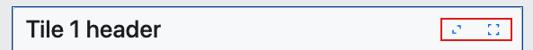

# {Platform} Tile Manager Overview

The {ProductName} Tile Manager component enables the display of content in individual tiles. It allows users to interact with these tiles by rearranging and resizing them, giving them the freedom to customize the layout and appearance of the content according to their preferences. This flexibility enhances the user experience by enabling a more personalized and efficient way to view and manage content.

## {Platform} Tile Manager Example

The following {ProductName} Tile Manager Example shows the component in action.

`sample="/layouts/tile-manager/overview", height="752", scrollable, alt="{Platform} Tile Manager Example"`

> [!Warning] Due to the iframe permissions policy, the fullscreen button in this example will only work when the example is opened in standalone mode by clicking the 'Expand to fullscreen' button in the top-right corner.

## Usage

The `TileManager` provides a base tile layout behavior, managing the placement of tiles in maximized or normal state. The tiles can be sized independently of each other and used to form complex layouts. End users can reorder tiles by dragging and dropping them, providing a flexible and intuitive experience.

The Tile Manager offers two components that we can use:
- `Tile` - This component represents an individual tile displayed within the Tile Manager.
- `TileManager` - This is the main component that contains all of the tile components, serving as the container for the entire tile layout.

### Getting Started

<!-- WebComponents -->
To start using the Tile Manager, first, you need to install the {ProductName} by running the following command:

```cmd
npm install {PackageWebComponents}
```
<!-- end: WebComponents -->

<!-- React -->
To start using the Tile Manager, first, you need to install the {ProductName} by running the following command:

```cmd
npm install igniteui-react
```

<!-- end: React -->

Before using the Tile Manager, you need to import it as follows:

<!-- WebComponents -->
```ts
import { defineComponents, IgcTileManagerComponent } from 'igniteui-webcomponents';

defineComponents(IgcTileManagerComponent);
```
<!-- end: WebComponents -->

<!-- React -->
```tsx
import { IgrTile, IgrTileManager } from 'igniteui-react';
import 'igniteui-webcomponents/themes/light/bootstrap.css';
```
<!-- end: React -->

<!-- Blazor -->
```razor
// in Program.cs file

builder.Services.AddIgniteUIBlazor(typeof(IgbTileManagerModule));
```

You will also need to link an additional CSS file to apply the styling to the `TileManager` component. The following needs to be placed in the **wwwroot/index.html** file in a **Blazor Web Assembly** project or the **Pages/_Host.cshtml** file in a **Blazor Server** project:

```razor
<link href="_content/IgniteUI.Blazor/themes/light/bootstrap.css" rel="stylesheet" />
```
<!-- end: Blazor -->

Now you can start with a basic configuration of the {Platform} Tile Manager.

<!-- WebComponents -->
```html
<igc-tile-manager>
  <igc-tile>
    <p>Tile 1</p>
  </igc-tile>
  <igc-tile>
    <p>Tile 2</p>
  </igc-tile>
  <igc-tile>
    <p>Tile 3</p>
  </igc-tile>
</igc-tile-manager>
```
<!-- end: WebComponents -->
<!-- Blazor -->
```razor
<IgbTileManager>
  <IgbTile>
    <p>Tile 1</p>
  </IgbTile>
  <IgbTile>
    <p>Tile 2</p>
  </IgbTile>
  <IgbTile>
    <p>Tile 3</p>
  </IgbTile>
</IgbTileManager>
```
<!-- end: Blazor -->

<!-- React -->
```tsx
  <IgrTileManager>
    <IgrTile>
      <p>Tile 1</p>
    </IgrTile>
    <IgrTile>
      <p>Tile 2</p>
    </IgrTile>
    <IgrTile>
      <p>Tile 3</p>
    </IgrTile>
  </IgrTileManager>
```
<!-- end: React -->

For a complete introduction to the {ProductName}, read the [**Getting Started**](../general-getting-started.md) topic.

## Layout

### Columns and Rows

We can specify the number of grid columns for our Tile Manager. To do this, simply set the `ColumnCount` property to the desired number of columns. If the number is less than one or the property is not set, the Tile Manager will create as many columns as can fit, with each column being at least 200px wide and expanding to equally share the available space. When the viewport dimensions change, the tiles will also rearrange themselves to maximize the use of space.

<!-- WebComponents -->
```html
<igc-tile-manager column-count="2">
  <igc-tile>
    <span slot="title">Tile 1 header</span>
    <p>Tile 1 Content</p>
  </igc-tile>
  <igc-tile>
    <span slot="title">Tile 2 header</span>
    <p>Tile 2 Content</p>
  </igc-tile>
  <igc-tile>
    <span slot="title">Tile 3 header</span>
    <p>Tile 3 Content</p>
  </igc-tile>
  ...
</igc-tile-manager>
```
<!-- end: WebComponents -->

<!-- React -->
```tsx
<IgrTileManager columnCount={2}>
  <IgrTile>
    <span slot="title">Tile 1 header</span>
    <p>Tile 1 Content</p>
  </IgrTile>
  <IgrTile>
    <span slot="title">Tile 2 header</span>
    <p>Tile 2 Content</p>
  </IgrTile>
  <IgrTile>
    <span slot="title">Tile 3 header</span>
    <p>Tile 3 Content</p>
  </IgrTile>
  ...
</IgrTileManager>
```
<!-- end: React -->

<!-- Blazor -->
```razor
<IgbTileManager ColumnCount="2">
  <IgbTile>
    <span slot="title">Tile 1 header</span>
    <p>Tile 1 Content</p>
  </IgbTile>
  <IgbTile>
    <span slot="title">Tile 2 header</span>
    <p>Tile 2 Content</p>
  </IgbTile>
  <IgbTile>
    <span slot="title">Tile 3 header</span>
    <p>Tile 3 Content</p>
  </IgbTile>
  ...
</IgbTileManager>
```
<!-- end: Blazor -->
In this code snippet, the three tiles in the Tile Manager will be arranged into 2 rows and 2 columns.

### Gap

Another property that can be used in the Tile Manager is the `Gap` property, which defines the space between tiles. The value of the `Gap` property must be a number followed by a length unit (e.g., px, rem, em, ...). This value will apply to both the horizontal gap (width) and the vertical gap (height) between tiles.

<!-- WebComponents -->
```html
<igc-tile-manager gap="20px">
  <igc-tile>
    <span slot="title">Tile 1 header</span>
    <p>Tile 1 Content</p>
  </igc-tile>
  <igc-tile>
    <span slot="title">Tile 2 header</span>
    <p>Tile 2 Content</p>
  </igc-tile>
  ...
</igc-tile-manager>
```
<!-- end: WebComponents -->
<!-- React -->
```tsx
<IgrTileManager gap="20px">
  <IgrTile>
    <span slot="title">Tile 1 header</span>
    <p>Tile 1 Content</p>
  </IgrTile>
  <IgrTile>
    <span slot="title">Tile 2 header</span>
    <p>Tile 2 Content</p>
  </IgrTile>
  ...
</IgrTileManager>
```
<!-- end: React -->
<!-- Blazor -->
```razor
<IgbTileManager Gap="20px">
  <IgbTile>
    <span slot="title">Tile 1 header</span>
    <p>Tile 1 Content</p>
  </IgbTile>
  <IgbTile>
    <span slot="title">Tile 2 header</span>
    <p>Tile 2 Content</p>
  </IgbTile>
  ...
</IgbTileManager>
```
<!-- end: Blazor -->
### Minimum width and height

We also have properties for setting the minimum width of the columns (`MinColumnWidth`) and the minimum height of the rows (`MinRowHeight`) in the Tile Manager. Similar to the gap property, the values for these properties must be a number followed by a length unit. These values will define the minimum width for all columns and the minimum height for all rows in the Tile Manager.

<!-- WebComponents -->
```html
<igc-tile-manager min-column-width="200px" min-row-height="150px">
  <igc-tile>
    <span slot="title">Tile 1 header</span>
    <p>Tile 1 Content</p>
  </igc-tile>
  <igc-tile>
    <span slot="title">Tile 2 header</span>
    <p>Tile 2 Content</p>
  </igc-tile>
  ...
</igc-tile-manager>
```
<!-- end: WebComponents -->

<!-- React -->
```tsx
<IgrTileManager minColumnWidth="200px" minRowHeight="150px">
  <IgrTile>
    <span slot="title">Tile 1 header</span>
    <p>Tile 1 Content</p>
  </IgrTile>
  <IgrTile>
    <span slot="title">Tile 2 header</span>
    <p>Tile 2 Content</p>
  </IgrTile>
  ...
</IgrTileManager>
```
<!-- end: React -->

<!-- Blazor -->
```razor
<IgbTileManager MinColumnWidth="200px" MinRowHeight="150px">
  <IgbTile>
    <span slot="title">Tile 1 header</span>
    <p>Tile 1 Content</p>
  </IgbTile>
  <IgbTile>
    <span slot="title">Tile 2 header</span>
    <p>Tile 2 Content</p>
  </IgbTile>
  ...
</IgbTileManager>
```
<!-- end: Blazor -->

### Example

`sample="/layouts/tile-manager/columngap", height="631", alt="{Platform} Tile Manager Column Example"`

## Tile component

The Tile component has properties that can be set individually for each tile. Some of these properties include:

- The `ColSpan` property specifies how many columns the tile will span across in the layout, allowing you to control its horizontal size.
- The `RowSpan` property determines how many rows the tile will span vertically, adjusting the tile's height within the layout.
- The `ColStart` property specifies the starting column where the tile is placed.
- The `RowStart` property specifies the starting row where the tile is placed.
- The `DisableFullscreen` property hides the default fullscreen action button.
- The `DisableMaximize` property hides the default maximize toggle action button.
- The `DisableResize` property prevents the tile from being resized by the user.

<!-- WebComponents -->
```html
<igc-tile-manager>
  <igc-tile col-span="2" disable-resize>
    <span slot="title">Tile 1 header</span>
    <p>Tile 1 Content</p>
  </igc-tile>
  <igc-tile>
    <span slot="title">Tile 2 header</span>
    <p>Tile 2 Content</p>
  </igc-tile>
  ...
</igc-tile-manager>
```
<!-- end: WebComponents -->
<!-- React -->
```tsx
<IgrTileManager>
  <IgrTile colSpan={2} disableResize={true}>
    <span slot="title">Tile 1 header</span>
    <p>Tile 1 Content</p>
  </IgrTile>
  <IgrTile>
    <span slot="title">Tile 2 header</span>
    <p>Tile 2 Content</p>
  </IgrTile>
  ...
</IgrTileManager>
```
<!-- end: React -->
<!-- Blazor -->
```razor
<IgbTileManager>
  <IgbTile ColSpan="2" DisableResize="true">
    <span slot="title">Tile 1 header</span>
    <p>Tile 1 Content</p>
  </IgbTile>
  <IgbTile>
    <span slot="title">Tile 2 header</span>
    <p>Tile 2 Content</p>
  </IgbTile>
  ...
</IgbTileManager>
```
<!-- end: Blazor -->

The Tile component also exposes several slots which you can use:

| Slot name | Description |
| ---------|------------ |
| `title` | Content for the tile header. |
| `fullscreen-action` | Overwrite the default fullscreen action content. |
| `maximize-action` | Overwrite the default maximize action content. |
| `actions` | 	Custom content rendered after the default actions. |
| `side-adorner` | Overwrite the default horizontal resize adorner. |
| `corner-adorner` | 	Overwrite the default diagonal resize adorner. |
| `bottom-adorner` | Overwrite the default vertical resize adorner. |


### Header section actions

By default, the header section includes two action buttons:

- The `maximize` button enlarges the tile's content to fill the entire width of the Tile Manager, offering a wider view of the content.
- The `fullscreen` button enables the tile to open in fullscreen mode in the user's browser.



If you want to display just one of the two buttons, you can set either `DisableMaximize` or `DisableFullscreen` property. To customize the appearance you can use the `maximize-action` slot for the maximize button, or the `fullscreen-action` slot for the fullscreen button.

<!-- WebComponents -->
```html
<igc-tile-manager>
  <igc-tile disable-fullscreen>
    <igc-icon-button slot="maximize-actions" name="north_east" collection="material">
    </igc-icon-button>
    <p>Tile 1 Content</p>
  </igc-tile>
</igc-tile-manager>
```
<!-- end: WebComponents -->
<!-- React -->
```tsx
<IgrTileManager>
  <IgrTile disableFullscreen={true}>
    <IgrIconButton slot="maximize-actions" name="north_east" collection="material">
    </IgrIconButton>
    <p>Tile 1 Content</p>
  </IgrTile>
</IgrTileManager>
```
<!-- end: React -->
<!-- Blazor -->
```razor
<IgbTileManager>
  <IgbTile DisableFullscreen="true">
    <IgbIconButton slot="maximize-actions" IconName="north_east" Collection="material">
    </IgbIconButton>
    <p>Tile 1 Content</p>
  </IgbTile>
</IgbTileManager>
```
<!-- end: Blazor -->

You also have the option to disable both action buttons and create custom ones according to your preferences.

`sample="/layouts/tile-manager/actions", height="700", alt="{Platform} Tile Manager Actions Example"`

In this example, we created custom action buttons using the Ignite UI Icon Button component.

## Resizing

Resizing in the Tile Manager is a functionality that allows tiles to be resized using three different resize adorners.

- **Side Adorner**: Adjusts the width by modifying the column span.
- **Bottom Adorner**: Adjusts the height by modifying the row span.
- **Corner Adorner**: Adjusts both width and height simultaneously.

To ensure smooth resizing, a ghost element is used instead of directly modifying the tile’s dimensions. This element appears on top of the original tile, displaying its current dimensions when resizing begins, and it updates in real time as the user drags any of the resize handles.

> [!Note] If the ghost element exceeds the available grid space, it will automatically adjust to the largest possible span within the grid's limits.

The Tile Manager automatically rearranges itself when a tile changes size, ensuring that there is minimal empty space. That's why expanding a tile may push adjacent tiles into new positions, while shrinking creates gaps that other tiles may fill dynamically. This ensures that the Tile Manager stays as compact as possible, without any overlapping tiles, and that all movements remain within the defined grid structure.

We can use the `ResizeMode` property to control how resizing is applied in the Tile Manager. It can be set to `none`, `hover` or `always`, which determines when the resize adorners are visible. The default value is `none` and the tile could not be resized.

<!-- WebComponents -->
```html
<igc-tile-manager resize-mode='hover'>
  <igc-tile>
    <p>Tile 1</p>
  </igc-tile>
  <igc-tile>
    <p>Tile 2</p>
  </igc-tile>
</igc-tile-manager>
```
<!-- end: WebComponents -->
<!-- React -->
```tsx
<IgrTileManager resizeMode="hover">
  <IgrTile>
    <p>Tile 1</p>
  </IgrTile>
  <IgrTile>
    <p>Tile 2</p>
  </IgrTile>
</IgrTileManager>
```
<!-- end: React -->
<!-- Blazor -->
```razor
<IgbTileManager ResizeMode="TileManagerResizeMode.Hover">
  <IgbTile>
    <p>Tile 1</p>
  </IgbTile>
  <IgbTile>
    <p>Tile 2</p>
  </IgbTile>
</IgbTileManager>
```
<!-- end: Blazor -->

You can see the difference between the three states in the example below:

`sample="/layouts/tile-manager/resize", height="522", alt="{Platform} Tile Manager Resize Example"`

### Snapping

Tiles resize in full grid units, meaning they can only grow or shrink by whole columns or rows. The ghost element snaps to the next column or row when expanding past the halfway point and to the previous one when shrinking past the halfway mark. This applies to all adorners (bottom, side and corner), ensuring tiles always stay aligned to the grid.

Grid gaps are also considered, keeping the layout consistent during resizing.

### Limitations

There are several constraints and limitations in the resizing process:

- A tile cannot be resized smaller than its defined minimum width or height (`MinColumnWidth`, `MinRowHeight`).
- A tile cannot exceed the maximum available horizontal space in the grid.

## Reorder

You can reorder tiles in the Tile Manager using the drag-and-drop feature. By default, tiles are not draggable. To enable this functionality, set the `DragMode` property on the Tile Manager to either `tile` or `tile-header`.

- With the `tile` option, you can click and hold anywhere on an individual tile to start dragging it.
- With the `tile-header` option, you can only click and hold in the tile's header section to start the dragging process.

> [!Note] While the tile is in maximized or fullscreen state, the tile cannot be dragged.

Similar to resizing, when you initiate the drag-and-drop process, a ghost element appears beneath the tile you’ve grabbed. As you drag the tile, the ghost element moves with it, dynamically reordering the other tiles in real time. This allows you to preview how the tile grid will look when you drop the tile.

<!-- WebComponents -->
```html
<igc-tile-manager drag-mode="tile-header">
  <igc-tile>
    <span slot="title">Tile 1 header</span>
    <p>Tile 1 Content</p>
  </igc-tile>
  <igc-tile>
    <span slot="title">Tile 2 header</span>
    <p>Tile 2 Content</p>
  </igc-tile>
</igc-tile-manager>
```
<!-- end: WebComponents -->
<!-- React -->
```tsx
<IgrTileManager dragMode="tile-header">
  <IgrTile>
    <span slot="title">Tile 1 header</span>
    <p>Tile 1 Content</p>
  </IgrTile>
  <IgrTile>
    <span slot="title">Tile 2 header</span>
    <p>Tile 2 Content</p>
  </IgrTile>
</IgrTileManager>
```
<!-- end: React -->
<!-- Blazor -->
```razor
<IgbTileManager DragMode="TileManagerDragMode.TileHeader">
  <IgbTile>
    <span slot="title">Tile 1 header</span>
    <p>Tile 1 Content</p>
  </IgbTile>
  <IgbTile>
    <span slot="title">Tile 2 header</span>
    <p>Tile 2 Content</p>
  </IgbTile>
</IgbTileManager>
```
<!-- end: Blazor -->

`sample="/layouts/tile-manager/dragndrop", height="522", alt="{Platform} Tile Manager Drag and drop Example"`

## Serialization

The Tile Manager provides methods that help manage the layout of tiles:

- The `SaveLayout` method allows you to save the current arrangement of tiles in the Tile Manager, it captures the current order, size and position of all tiles, so you can later restore it to this exact configuration.
- The `LoadLayout` method enables you to load a previously saved layout. When called, it restores the tiles to the exact state they were in when the layout was saved, including their order, size and position.

`sample="/layouts/tile-manager/layout", height="527", alt="{Platform} Tile Manager Layout Example"`

## Styling

You can also customize the appearance of the two components - `TileManager` and `Tile`.
The `TileManager` exposes only one CSS property - `base` which can be used for styling the base wrapper of the Tile Manager.
The `Tile` exposes several CSS properties we can use:

| Part name | Description |
| ---------|------------ |
| `base` | The wrapping container of the tile component. |
| `header` | The header container of the tile, including title and actions parts. |
| `title` | The title container. |
| `actions` | The actions container. |
| `content-container` | The container wrapping the tile default slot. |
| `trigger-side` | The horizontal adorner. |
| `trigger` | The diagonal adorner |
| `trigger-bottom` | The vertical adorner. |

Using these CSS parts you can customize the appearance of the two components as follows:

```css
igc-tile-manager::part(base) {
  background-color: var(--ig-surface-900);
}

igc-tile::part(content-container) {
  color: var(--ig-secondary-200);
}

igc-tile::part(header) {
  background-color: var(--ig-gray-300);
}

igc-tile::part(title) {
  color: var(--ig-primary-400);
}

igc-tile:nth-child(n+2)::part(trigger-side),
igc-tile:nth-child(n+2)::part(trigger-bottom) {
  background-color: var(--ig-success-500);
}

igc-tile:nth-child(n+2)::part(trigger) {
  background-color: var(--ig-error-500);
}
```

You can also change the icon of the adorners to a custom one using the `side-adorner`, `corner-adorner`, and `bottom-adorner` slots. For instance:

<!-- WebComponents -->
```html
<igc-tile>
  <igc-icon slot="side-adorner" class="side" name="indicator"></igc-icon>
  <igc-icon slot="corner-adorner" class="corner" name="indicator"></igc-icon>
  <igc-icon slot="bottom-adorner" class="bottom" name="indicator"></igc-icon>
  <span slot="title">Tile header</span>
</igc-tile>
```
<!-- end: WebComponents -->
<!-- React -->
```tsx
<IgrTile>
  <IgrIcon slot="side-adorner" className="side" name="indicator"></IgrIcon>
  <IgrIcon slot="corner-adorner" className="corner" name="indicator"></IgrIcon>
  <IgrIcon slot="bottom-adorner" className="bottom" name="indicator"></IgrIcon>
  <span slot="title">Tile header</span>
</IgrTile>
```
<!-- end: React -->
<!-- Blazor -->
```razor
<IgbTile>
  <IgbIcon slot="side-adorner" Class="side" IconName="indicator"></IgbIcon>
  <IgbIcon slot="corner-adorner" Class="corner" IconName="indicator"></IgbIcon>
  <IgbIcon slot="bottom-adorner" Class="bottom" IconName="indicator"></IgbIcon>
  <span slot="title">Tile header</span>
</IgbTile>
```
<!-- end: Blazor -->

`sample="/layouts/tile-manager/styling", height="481", alt="{Platform} Tile Manager Styling Example"`

## API Reference

- `TileManager`
- `Tile`
- [`Styling & Themes`](../themes/overview.md)

## Additional Resources

- `Tile`
- `TileManager`
- [{ProductName} **Forums**]({ForumsLink})
- [{ProductName} **GitHub**]({GithubLink})

