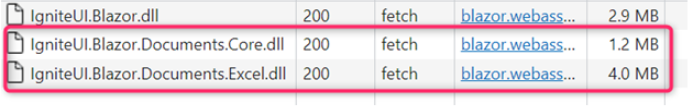

# Blazor WebAssembly 上で Excel ファイルを読み書きし、サーバー負荷を減らす

[Infragistics Blazor Excel ライブラリ](https://jp.infragistics.com/products/ignite-ui-blazor/blazor/components/excel-library)を使うことで、Microsoft® Excel と同様の表計算機能と Workbook、Worksheet、Cell、Formula などの表計算オブジェクト用い、Blazor アプリケーションから Excel ファイルへエクスポートしてアプリケーションのデータを Excel スプレッドシートで表現したり、Excel ファイルからアプリケーションにデータを転送してデータを管理したりすることが可能となります。

[Blazor WebAssembly アプリケーション](https://jp.infragistics.com/products/ignite-ui-blazor/blazor/components/general-getting-started-blazor-client)上で Infragistics Blazor Excel ライブラリを使うと、Web ブラウザ上で Excel 形式のファイル (.xlsx) を生成し、ダウンロードさせることができるようになります。この方法で Excel ファイルを生成すると、その処理は Web サーバー側ではなく Web ブラウザ上で行なわれますので、Excel 生成処理の負荷がサーバーに一極集中しない、という利点があります。

この記事では、サンプルアプリケーションの作成を通してその実装方法を解説します。
この記事では以下のトピックを取り上げます:

* Blazor WebAssembly と Blazor Server を理解する
* サンプル アプリケーションの概要
* 実装手順とプロジェクト構成の概要
    - NuGet パッケージの追加
    - JavaScript ファイルへの参照の追加
    - Workbook.InProcessRuntime 静的プロパティを設定
    - Workbook クラスを使って Excel ファイルを読み書き
* 処理に時間がかかってしまう場合
* "アセンブリの遅延読み込み" によりアプリケーションの初速を改善
* まとめ

## Blazor WebAssembly と Blazor Server を理解する

[Blazor](https://jp.infragistics.com/products/ignite-ui-blazor/blazor/components/general-getting-started) を簡潔に説明すると、これはマイクロソフトが開発したオープンソースのクライアント Web アプリケーション フレームワークです。JavaScript ではなく .NET と C# を使ったシングルページ Web アプリケーションの構築を可能にします。Blazor アプリケーションをホストする方法は [Blazor Server と Blazor WebAssembly](https://blogs.jp.infragistics.com/entry/Blazor-Server-vs-Blazor-WebAssembly-Just-the-Facts) の 2 種類があります。

Blazor WebAssembly (WASM とも呼ばれます) は、[W3C](https://www.computerhope.com/jargon/w/w3c.htm) が策定した、Web ブラウザ上で動作するソフトウェアを作成するための規格であり、CPU のネイティブに近い速度で動作する、コンパイルされたソフトウェアです。

一方、Blazor Server は、標準的な ASP.NET Core アプリケーションを使用して、サーバー上でクライアント処理を実行します。ブラウザは SignalR によってアプリケーションと常時接続し、通信を行います。

## サンプル アプリケーションの概要

この記事ではデモンストレーションとして、[インターネット上の気象庁防災情報 XML サービス](https://www-data-go-jp.translate.goog/data/dataset/mlit_20170902_0034/resource/de72cea0-a658-4c64-987c-38effeca3eb8?_x_tr_sl=ja&_x_tr_tl=en&_x_tr_hl=ja&_x_tr_pto=wapp)から取得したデータに基づき、直近 7 日間に発生した 1 日ごとの地震発生回数を、Excel の表にしてダウンロードできる Blazor WebAssembly アプリケーションを作ってみます。ダウンロードされる Excel にはバーチャートを組み込み済みとしてみました。


このサンプルアプリケーションのソースコードは、[こちらの GitHub リポジトリ](https://github.com/igjp-sample/IgbExcelDemo)に公開されています。

## 実装手順とプロジェクト構造の概要

気象庁防災情報 XML を取得するにあたって、CORS の関係上、スタンドアロンの Blazor WebAssembly プロジェクトではなく、ASP.NET Core サーバーでホストされる Blazor WebAssembly プロジェクトとします。

ただし冒頭に記したとおり、Excel ファイル生成はすべて Web ブラウザ上で完結して処理します。ASP.NET Core サーバー側は、気象庁防災情報 XML を取得・加工して Web ブラウザ上で実行されている Blazor WebAssembly プログラムに JSON でデータ提供するためだけに必要です。また、生成する Excel ファイルはプログラムコード上で全くの新規に生成するのではなく、予めバーチャートを構成した「ひな形 (テンプレート)」となる Excel ファイル (.xlsx) を Web サーバー上に配置しておき、これを Blazor WebAssembly プログラム上で HttpClient を使って取得、この Excel ファイル中のシートの各セルを日付と地震発生回数で埋めていく方式とします。

以下では、気象庁防災情報 XML から取得し加工した直近 7 日間の1日ごと地震発生回数を Ignite UI for Blazor のグリッドに表示するところまでは実装できたものとして、それ以降、Excel ファイルを生成する処理を追加していく手順を以下に記していきます。

### NuGet パッケージの追加

Infragistics Blazor Excel ライブラリの利用には、NuGet パッケージ「IgniteUI.Blazor.Documents.Excel」が必要です。Visual Studio を使用している場合は NuGet パッケージマネージャーを使うなどして、Blazor WebAssembly プロジェクトに NuGet パッケージ **IgniteUI.Blazor.Documents.Excel** を追加しておきます。

および、このあと記述するプログラムコードにて名前空間の記述を簡略化するため、_Imports.razor に Infragistics Blazor Excel ライブラリの名前空間 Infragistics.Documents.Excel を予め開いておくことにします。

```razor
@* _Imports.razor *@
@using System.Net.Http
@using Infragistics.Documents.Excel @* 👈 この行を追加 *@
```

### JavaScript ファイルへの参照の追加

Blazor WebAssembly 上で Infragistics Blazor Excel ライブラリによる Excel ファイルの操作を行なうには、NuGet パッケージ「IgniteUI.Blazor.Documents.Excel」によって提供される JavaScript ファイルを Web ページ上で読み込んでおく必要があります。

Blazor WebAssembly プロジェクト中のフォールバックページである wwwroot/index.html ファイル中に、下記のように `<script>` タグを追加します。

```razor
<script src="_content/IgniteUI.Blazor/app.bundle.js"></script>
<!-👇 この行を追加->
<script src="_content/IgniteUI.Blazor.Documents.Excel/excel.js"></script>
<script src="_framework/blazor.webassembly.js"></script> </body></ html>
```

### Workbook.InProcessRuntime 静的プロパティを設定

以上で Infragistics Blazor Excel ライブラリを使う準備ができました。Excel ファイルの読み書きには、具体的には Infragistics.Documents.Excel 名前空間の Workbook クラスを使用します。

なお、ひとつ注意点として、Blazor WebAssembly 上で Workbook クラスを使って Excel ファイルを処理するにあたり、事前にいちど、Workbook.InProcessRuntime 静的プロパティに IJSInProcessRuntime インターフェースを持つ JavaScript ランタイム オブジェクトを設定する必要があります。下記は Razor コンポーネント上での実装例の抜粋です。

```razor
@inject IJSRuntime JSRuntime
@* ... *@
@code {
    // ...
    // ⚠️注意 - Blazor WebAssembly 上で Excel ライブラリを使うには、
    //  Workbook.InProcessRuntime 静的プロパティの初期設定が必要です。
    if (Workbook.InProcessRuntime == null)
        Workbook.InProcessRuntime = this .JSRuntime as IJSInProcessRuntime;
    // ...
```

### Workbook クラスを使って Excel ファイルを読み書き

ここまで準備ができたら、あとは、Workbook クラスの Load() 静的メソッドを使って Excel ファイルを読み込み、返ってきた Workbook オブジェクトを介してシートやセルのオブジェクトを参照したり値を書き込んだりすることができます。ひととおり Excel 表の作成が済んだら、最後に Workbook オブジェクトの Save() メソッドを使って Stream に Excel ファイルとしてのコンテンツを書き込むことができますので、.NET の MemoryStream に書き込んで byte の配列を取得し、これをそのままブラウザにダウンロードさせることができます。(Blazor アプリケーション上でのダウンロード発動処理は、MIT ライセンスの OSS ライブラリを利用しました)。

```razor
@inject HttpClient HttpClient
@inject IJSRuntime JSRuntime
@* ... *@
@code
{
    // ...
    private IEnumerable <EarthquakeCountParDay>? _EarthquakeCountParDays;

    // <summary>
    // [ダウンロード] ボタンがクリックされたときに呼び出され、直近1週間の1日ごと地震発生回数データを Excel ファイルに収めてダウンロードさせます。
    // </summary>
    private async Task OnClickedDownloadAsync()
    {
        // ⚠️注意 - Blazor WebAssembly 上で Excel ライブラリを使うには、Workbook.InProcessRuntime 静的プロパティの初期設定が必要です。
        if (Workbook.InProcessRuntime == null) Workbook.InProcessRuntime = this .JSRuntime as IJSInProcessRuntime;

        // 雛形の Excel ファイルをサーバーから取得し、Workbook オブジェクトに読み込みます。
        await using var templateStream = await this .HttpClient.GetStreamAsync ("./TemplateBook.xlsx");

        var workBook = Workbook.Load(templateStream);
        await templateStream.DisposeAsync();

        // シートの中身 (セル) に、地震発生の日付と回数を転記していきます。
        var sheet = workBook.Worksheets[0];
        var row = 2;
        foreach (var item in this._EarthquakeCountParDays)
        {
            sheet.GetCell($"A{row}").Value = item.Date;
            sheet.GetCell($"B{row}").Value = item.Count;
            row++;
        }

        // 記入が終わった Workbook オブジェクトを .xlsx ファイル形式に書き出し、ブラウザにダウンロードさせます。
        await using var memStream = new MemoryStream();
        workBook.Save(memStream);
        await this.JSRuntime.InvokeDownloadAsync("Book.xlsx", "application / octet-stream" ,memStream.ToArray());
    }
    // ...
```

以上の手順にて、Blazor WebAssembly アプリケーション上で、ひな形となる Excel ファイルのセルを実データで埋めてダウンロードさせる処理が実現できました。

Excel ファイルの加工処理は Web ブラウザ上で行なわれ、Web サーバー側では何も処理が発生しませんので、多数のクライアントが一斉に Excel ファイル生成を実行しても Web サーバー側の負荷が急激に増加することはありません。

## 処理に時間がかかってしまう場合

Excel ファイルの処理には、下記項目の状況によっては、かなりの時間がかかる場合があります。

* 内容
* 処理するデータの規模
* セル数

とくに、インタープリター方式で .NET コードが処理される Blazor WebAssembly アプリケーション上では、その処理性能の劣化が顕著です。そのような場合に、処理速度を改善できるかもしれない選択肢をいくつかご紹介します。

### 方法その 1 - 数式の自動計算を一時停止する

Blazor WebAssembly アプリケーション上で Excel ファイル中のセル参照や書き換えにとても時間がかかってしまう場合、もしかすると、数式の自動計算・再計算に負荷がかかっているかもしれません。そのような場合、Infragistics Blazor Excel ライブラリでは、数式の自動計算を一時停止できますので、そうすることで処理速度の改善が見込まれます。詳しくは[このドキュメント トピック](blazor-excel-library-temporarily-stop-automatic-calculation-of-formulas-to-speed-up-processing.md)を参照してください。

### 方法その 2 - Ahead-Of-Time (AOT) コンパイルを使う

.NET 6 以降では、Blazor WebAssembly アプリケーション構築に「Ahead-Of-Time (AOT) コンパイル」という技法が使えます。これは、アプリケーションの発行時に .NET コードを直接 WebAssembly にコンパイルし、処理速度の向上を図る技法です。AOT コンパイルの詳細は、下記リンク先のマイクロソフトの公式ドキュメントサイトをご参照ください。

https://learn.microsoft.com/ja-jp/aspnet/core/blazor/host-and-deploy/webassembly

### 方法その3 - サーバ側で実行する

Excel ファイルの生成処理をサーバー側で行なう選択肢も考えられます。インタープリター方式で .NET コードが逐次処理される Blazor WebAssembly と異なり、Blazor Server や ASP.NET Core サーバー上での Infragistics Blazor Excel ライブラリの実行は、Just In Time (JIT) コンパイラによって CPU ネイティブな速度で実行されますので、サーバー負荷増加と引き換えに、圧倒的な処理速度の改善が見込まれます。

具体的な実装方法としては、アプリケーションをまるごと Blazor WebAssembly から Blazor Server に作り替えることでも実現可能ですし、基本的には Blazor WebAssembly アプリケーションのまま、Excel ファイル生成処理部分だけを ASP.NET Core サーバーの Web API に載せ替えることでも実現可能です。

## 「アセンブリの遅延読み込み」によりアプリケーションの初速を改善

Infragistics Blazor Excel ライブラリが提供するアセンブリファイル (.dll) のサイズは、概ね 5 MB ほどあります。初回起動時のコンテンツサイズが膨らむと、コンテンツの読み込み時間・Blazor WebAssembly アプリケーションが操作可能になるまでの初速時間が問題になる場合が想像されます。



そのような場合は、.NET 5 以降で使える「アセンブリの遅延読み込み」という技法を使うことで、Infragistics Blazor Excel ライブラリが提供するアセンブリファイル (.dll) の読み込みを、Excel ファイルの読み書き処理を行なうそのときまで先送りすることで、Blazor WebAssembly アプリケーションの初期起動時間を改善できる場合があります。以下では今回のサンプルアプリケーションに、この「アセンブリの遅延読み込み」を適用してみます。

## アセンブリの遅延読み込みの組み込み

### プロジェクトファイル中で遅延読み込みするアセンブリを指定する

まずは Blazor WebAssembly のプロジェクトファイル (.csproj) にて、`<ItemGroup>` 要素内に `<BlazorWebAssemblyLazyLoad>` 要素を並べて、遅延読み込みさせたいアセンブリファイル (.dll) の名前を列記します。Infragistics Blazor Excel ライブラリが提供するアセンブリファイルを遅延読み込みさせる例が下記となります。

```razor
<!- Blazor WebAssembly のプロジェクト ファイル (.csproj) ->
<Project Sdk="Microsoft.NET.Sdk.BlazorWebAssembly" >

  <!- 遅延読み込みさせたいアセンブリ ファイル (.dll) のファイル名を、BlazorWebAssemblyLazyLoad 要素で指定します。 ->
  <ItemGroup>
    <BlazorWebAssemblyLazyLoad Include="IgniteUI.Blazor.Documents.Core.dll" />
    <BlazorWebAssemblyLazyLoad Include="IgniteUI.Blazor.Documents.Excel.dll" />
  </ItemGroup>

</ Project>
```

### LazyAssemblyLoader を使ってアセンブリを読み込む

続けて、「遅延読み込みする」と指定したアセンブリを、プログラム上からその必要が発生するタイミングで読み込むよう実装します。アセンブリの読み込みには、Blazor WebAssembly に標準搭載されている LazyAssemblyLoader クラスのサービスを DI コンテナから注入してもらって、その LoadAssembliesAsync() 非同期メソッドを呼び出すことで行ないます。

今回のサンプルアプリケーションでは、Excel ファイルのダウンロードボタンがクリックされたときに、Infragistics Blazor Excel ライブラリのアセンブリファイルを読み込むようにします。下記はその抜粋です。

```razor
@using Microsoft.AspNetCore.Components.WebAssembly.Services
@inject LazyAssemblyLoader AssemblyLoader
@* ... *@
@code {
    // ...
    // <summary>
    // [ダウンロード] ボタンがクリックされたときに呼び出され、直近1週間の1日ごと地震発生回数データを Excel ファイルに収めてダウンロードさせます。
    // </summary>
    private async Task OnClickedDownloadAsync()
    {
        // プロジェクトファイル (IgbExcelDemo.Client.csproj) にて遅延読み込みを指定しておいた
        // アセンブリファイル (.dll) を、ここで AssemblyLoader を使って読み込みます。
        // (補足: 繰り返し何度も呼び出しても大丈夫です、まだいちども読み込まれていない .dll のみが読み込まれます)
        await this.AssemblyLoader.LoadAssembliesAsync(new [])
        {
            "IgniteUI.Blazor.Documents.Core.dll",
            "IgniteUI.Blazor.Documents.Excel.dll"
        });
    // ...
```

### 遅延読み込みするアセンブリに関係する処理を別のスコープに切り出す

さてこのまま試しにこのサンプルアプリケーションを実行すると、初回ページ表示時には、期待どおり Infragistics Blazor Excel ライブラリのアセンブリファイルは読み込まれなくなり、ページ初回表示時に読み込まれるコンテンツサイズが 5MB ほど節約できたことが確認できます。


しかし実際にダウンロードボタンをクリックすると、「System.IO.FileNotFoundException: Could not load file or assembly」例外が発生してしまいます。

これは遅延読み込みを行なっているのと同じメソッドのスコープ内でその遅延読み込みされるアセンブリ内に存在する型を参照していると、まだそのアセンブリが読み込まれていないのに、そのメソッドのスコープ内の型を解決しようとして、この例外となってしまいます。この問題を回避するには、遅延読み込みされるアセンブリ内に存在している型 (このサンプル アプリケーションの例ですと、Workbook クラスなど) を参照している処理を、別の独立したメソッドに切り出し、そのメソッドを呼び出すようにします。下記はその抜粋です。

```razor
@* ... *@
@code {
    // ...
    // <summary>
    // [ダウンロード] ボタンがクリックされたときに呼び出され、直近1週間の1日ごと地震発生回数データを Excel ファイルに収めてダウンロードさせます。
    // </summary>
    private async Task OnClickedDownloadAsync()
    {
        // ...
        await this .AssemblyLoader.LoadAssembliesAsync ( new [] )
        {
            "IgniteUI.Blazor.Documents.Core.dll",
            "IgniteUI.Blazor.Documents.Excel.dll"
        });

        // アセンブリの遅延読み込みを行なってから、その遅延読み込みされるアセンブリ内の機能を使うメソッドを呼び出します。
        // (アセンブリの遅延読み込みを行なうメソッド内で直接、遅延読み込みしたアセンブリ内の機能を参照していると、
        //  System.IO.FileNotFoundException: Could not load file or assembly 例外が発生します。)
        Await this.DownloadAsExcelAsync();
    }
    // <summary>
    // アセンブリの遅延読み込みを有効にするために、Excel ライブラリを使用するコードを独立したメソッドに切り出します。
    // </summary>
    private async ValueTask DownloadAsExcelAsync ()
    {
        // このメソッド内で Workbook クラスを使った Excel ファイルの読み書きを行ないます
    }
    // ...
```

## まとめと記事のポイント

この記事では、Blazor WebAssembly アプリケーション上で Infragistics Blazor Excel ライブラリを使うことで、Web ブラウザ上で完結して Excel ファイルの読み書きを行えること、その結果として Web サーバー側の負荷を軽減できることを解説しました。

また、処理速度上の懸念がある場合に、取り得ることのできる改善案について以下の選択肢を説明しました。

* 数式の自動計算を一時停止する。
* AOT（Ahead-Of-Time）コンパイルを使用する。
* サーバーサイドで実行する。
* "アセンブリの遅延読み込み" を指定する。