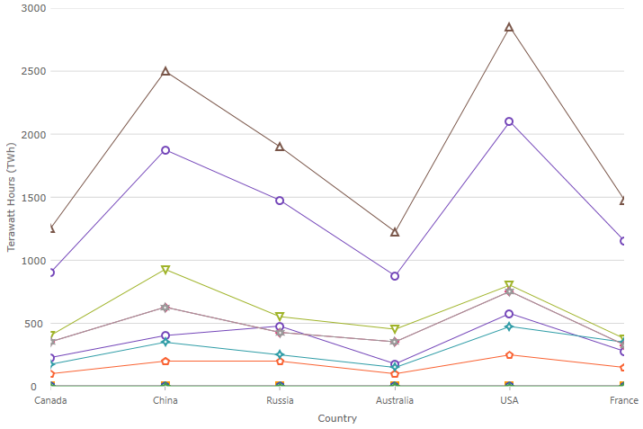
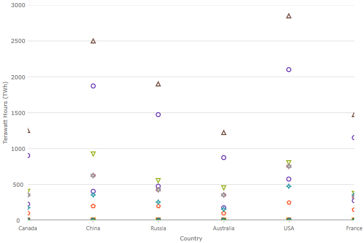

# $PlatformShort$ チャート

$PlatformShort$ カテゴリ チャート コンポーネント は、カテゴリ データの可視化を容易にする $ProductName$ チャート コンポーネントです。データ可視化ドメインの複雑さを管理しやすい API に簡素化できます。

## $PlatformShort$ チャートの例


<code-view style="height: 500px" 
           data-demos-base-url="{environment:dvDemosBaseUrl}" 
           iframe-src="{environment:dvDemosBaseUrl}/charts/category-chart-overview" 
           alt="$PlatformShort$ チャートの例" 
           github-src="charts/category-chart/overview">
</code-view>

<div class="divider--half"></div>

 ユーザーがデータのコレクョンまたはコレクション グループにバインドしてデータを指定するプロパティを設定後、あとの作業はチャート コントロールによって処理されます。$PlatformShort$ コンポーネントはデータを解析し、データを表すための最適なチャート タイプを自動的に選択します。

スマート データ アダプターは、データを分析して適切なビジュアライゼーションを描画します。たとえば、`ChartType` プロパティが `Auto` に設定される場合、コントロールは小さいデータ セットのために縦棒チャートを使用し、より大きいデータ セットのために折れ線チャートを使用します。

ただし、`ChartType` を明示的に以下に設定してチャート タイプを指定することもできます。

- `Line`
- `Area`
- `Column`
- `Point`
- `Spline`
- `SplineArea`
- `StepArea`
- `StepLine`
- `Waterfall`

その他の $PlatformShort$ カテゴリ チャート コンポーネントの直感的な動作の例として、明示的にラベルを設定する必要がないことがあります。カテゴリ チャートは、提供したデータ内で最初の適切な文字列プロパティを使用し、ラベルに使用します。

<!-- Angular, React, WebComponents -->
## 依存関係
$PlatformShort$ チャート パッケージをインストールするときに core パッケージもインストールする必要があります。

<pre style="background:#141414;color:white;display:inline-block;padding:16x;margin-top:10px;font-family:'Consolas';border-radius:5px;width:100%">
npm install --save {PackageCore}
npm install --save {PackageCharts}
</pre>
<!-- end: Angular, React, WebComponents -->

## モジュールの要件

`CategoryChart` は以下のモジュールを要求します。

```razor
CategoryChartModule.Register(IgniteUIBlazor);
```

```ts
// app.module.ts
import { IgxCategoryChartModule } from 'igniteui-angular-charts';

@NgModule({
    imports: [
        // ...
        IgxCategoryChartModule,
        // ...
    ]
})
export class AppModule {}
```

```ts
import { IgrCategoryChartModule } from 'igniteui-react-charts';

IgrCategoryChartModule.register();
```

```ts
import { ModuleManager } from 'igniteui-webcomponents-core';
import { IgcCategoryChartModule } from 'igniteui-webcomponents-charts';

ModuleManager.register(
    IgcCategoryChartModule
    );
```

カテゴリ チャートのより最小限の設定をロードすることも可能で、それによって可能なシリーズのサブセットだけをロードし、代わりに `Ig$CategoryChartCoreModule` や `Ig$LineSeriesDynamicModule` など問題のシリーズの動的モジュールをロードして除外します。`ChartType` が `Auto` の場合、読み込んだシリーズ型が選択されます。

<div class="divider--half"></div>

## 使用方法
カテゴリ チャート モジュールをインポートした後、チャートをデータにバインドします。

$PlatformShort$ カテゴリ チャート コンポーネントを作成するには、はじめにデータをバインドする必要があります。以下のコード スニペットは、シンプルなデータソースを作成する方法を示します。

```ts
var data = [
 { "CountryName": "China", "Pop1995": 1216, "Pop2005": 1297, "Pop2015": 1361, "Pop2025": 1394 },
 { "CountryName": "India", "Pop1995": 920, "Pop2005": 1090, "Pop2015": 1251, "Pop2025": 1396 },
 { "CountryName": "United States", "Pop1995": 266, "Pop2005": 295, "Pop2015": 322, "Pop2025": 351 },
 { "CountryName": "Indonesia", "Pop1995": 197, "Pop2005": 229, "Pop2015": 256, "Pop2025": 277 },
 { "CountryName": "Brazil", "Pop1995": 161, "Pop2005": 186, "Pop2015": 204, "Pop2025": 218 }
];

```

```razor
public class Country
{
    public string CountryName { get; set; }
    public int Pop1995 { get; set; }
    public int Pop2005 { get; set; }
    public int Pop2015 { get; set; }
    public int Pop2025 { get; set; }
}

public static class CountryData
{
    public static List<Country> Create()
    {
        var countries = new List<Country>();
        Country china = new Country
        {
            CountryName = "China",
            Pop1995 = 1216,
            Pop2005 = 1297,
            Pop2015 = 1361,
            Pop2025 = 1394
        };
        Country india = new Country
        {
            CountryName = "India",
            Pop1995 = 920,
            Pop2005 = 1090,
            Pop2015 = 1251,
            Pop2025 = 1396
        };
        Country usa = new Country
        {
            CountryName = "United States",
            Pop1995 = 266,
            Pop2005 = 295,
            Pop2015 = 322,
            Pop2025 = 351
        };
        Country indonesia = new Country
        {
            CountryName = "Indonesia",
            Pop1995 = 197,
            Pop2005 = 229,
            Pop2015 = 256,
            Pop2025 = 277
        };
        Country brazil = new Country
        {
            CountryName = "Brazil",
            Pop1995 = 161,
            Pop2005 = 186,
            Pop2015 = 204,
            Pop2025 = 218
        };
        countries.Add(china);
        countries.Add(india);
        countries.Add(usa);
        countries.Add(indonesia);
        countries.Add(brazil);
        return countries;
    }
}
```

以下のコードはカテゴリ チャートを上記のデータにバインドします。

```razor

<CategoryChart DataSource="@DataSource"
    Width="700px"
    Height="500px"/>

@code {
    private List<Country> DataSource;

    protected override void OnInitialized()
    {
        base.OnInitialized();

        CategoryChartModule.Register(IgniteUIBlazor);
        this.DataSource = CountryData.Create();
    }
}
```

```html
 <igx-category-chart [dataSource]="data"
                     width="700px"
                     height="500px">
 </igx-category-chart>
```

```tsx
 <IgrCategoryChart dataSource={this.state.data}
                   width="700px"
                   height="500px" />
```

```html
 <igc-category-chart id="chart"
                     width="700px"
                     height="500px">
 </igc-category-chart>
```

```ts
let chart = (document.getElementById("chart") as IgcCategoryChartComponent);
chart.dataSource = data;
```

<div class="divider--half"></div>

## チャート タイプ
表示するチャート型を設定するために、カテゴリ チャートのデフォルト動作をオーバーライドできます。これを実行するには、`ChartType` プロパティを設定します。
以下は、$PlatformShort$ カテゴリ チャートでサポートされるすべてのタイプです。

> [!NOTE]
> 特別なケースにプロパティの `Auto` 設定があります。`Auto` を使用した場合、チャートがデータを分析し、最適なチャート タイプを割り当てます。

## サポートされるチャート タイプ
タイプ|説明とプレビュー
---|---
`Auto`|チャートにバインドされたデータソースを分析する定義済みのデータ アダプターからの提案に基づいてチャート タイプの自動選択を指定します。
`Line`|各データ ポイントにマーカーがあるカテゴリ折れ線シリーズを指定します。 
`Area`|カテゴリ エリア シリーズを指定します。 
`Column`|各データ ポイントに垂直長方形があるカテゴリ縦棒チャートを指定します。 
`Point`|各データ ポイントにマーカーがあるカテゴリ ポイント チャートを指定します。 
`StepLine`|カテゴリ ステップ折れ線チャートを指定します。 
`StepArea`|カテゴリ ステップ エリア チャートを指定します。 
`Spline`|各データ ポイントにマーカーがあるカテゴリ スプライン折れ線チャート シリーズを指定します。
`SplineArea`|カテゴリ スプライン エリア シリーズを指定します。 
`Waterfall`|カテゴリ ウォーターフォール チャートを指定します。 