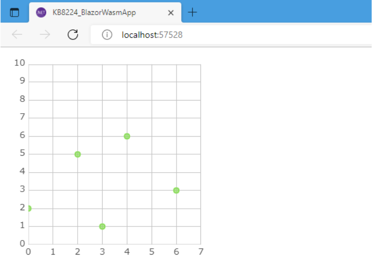
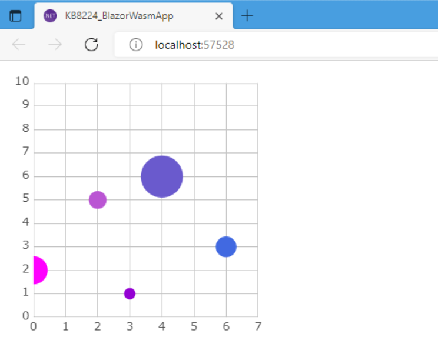

# Blazor チャートでマーカー表示をカスタマイズする方法

このトピックでは、Ignite UI for Blazor のマーカー表示カスタマイズ機能を使って、バインドした項目のプロパティに応じた大きさと塗りつぶし色のマーカーで散布図を表示する方法を説明します。

目次:

* [Blazor チャートを使用したサンプル アプリケーションの作成](#blazor-チャートを使用したサンプルアプリケーションの作成)
* [マーカーのカスタム描画オブジェクトを返す、ファクトリー関数を定義](#マーカーのカスタム描画オブジェクトを返す、ファクトリー関数を定義)
* [マーカーのカスタム描画オブジェクトの measure メソッドを実装](#マーカーのカスタム描画オブジェクトの-measure-メソッドを実装)
* [マーカーのカスタム描画オブジェクトの render メソッドを実装](#マーカーのカスタム描画オブジェクトの-render-メソッドを実装)
* [マーカーのカスタム描画オブジェクトを返すファクトリー関数を、Ignite UI に登録](#マーカーのカスタム描画オブジェクトを返すファクトリー関数を、ignite-ui-に登録)
* [マーカー描画に指定のスクリプト名の JavaScript プログラムを使うよう指定](#マーカー描画に指定のスクリプト名の-javascript-プログラムを使うよう指定)
* [まとめ – Blazor が優れたフレームワークである理由](#まとめ)

それでは、Blazor チャートのマーカー表示のカスタマイズを始めましょう。デモのため、まずサンプル Blazor アプリを作成するところから始めます。

## Blazor チャートを使用したサンプルアプリケーションの作成

バインドした項目のプロパティに基づいて、マーカーの表示 (描画) をカスタマイズするには、マーカーの描画を行なう JavaScript プログラムを作成し、その自作の JavaScript プログラムを使ってマーカーの描画を行なうようシリーズのプロパティに指定することで行ないます。そのマーカーの描画を任される JavaScript プログラムには、シリーズから、HTML Canvas 要素の 2D コンテキストオブジェクトが渡されます。その HTML Canvas 2D コンテキストに対して、自由に描画することでマーカーの描画を実装します。

そのため、マーカーの表示 (描画) のカスタマイズのためには、JavaScript および HTML Canvas への描画についての事前知識が必要となります。

さて、バインドするサンプルデータの型ですが、下記のレコード型とします。

```razor
public record SampleDataType(
    string Name, 
    double XValue, 
    double YValue,
    double Volume, // 👈 このプロパティをマーカーの大きさに、
    System.Drawing.Color Color // 👈 このプロパティを塗りつぶし色として参照
);
```

[Blazor チャート](https://jp.infragistics.com/products/ignite-ui-blazor/blazor/components/charts/chart-overview)の[散布図](https://jp.infragistics.com/products/ignite-ui-blazor/blazor/components/charts/types/scatter-chart)で一般的に使われるであろう、X 軸・Y 軸用の値として XValue、YValue といったプロパティを持つことに加えて、

* double 型の Volume プロパティと、
* System.Drawing.Color 型の Color プロパティを設けておきます。

この Volume プロパティ値をマーカーの大きさとして、Color プロパティ値をマーカーの塗りつぶし色として、マーカーの表示に用いることとします。

上記 SampleDataType レコード型を使用して、以下のとおり適当にサンプルデータを用意しておきます。

```razor
// サンプルの Razor コンポーネント (.razor) 中の @code ブロック内にて
public IEnumerable<SampleDataType> DataSource { get; } = new SampleDataType[]
{
    new (Name: "item1", XValue: 0, YValue: 2, Volume: 5.7, Color: System.Drawing.Color.Fuchsia),
    new (Name: "item2", XValue: 2, YValue: 5, Volume: 3.6, Color: System.Drawing.Color.MediumOrchid),
    new (Name: "item3", XValue: 3, YValue: 1, Volume: 2.3, Color: System.Drawing.Color.DarkViolet),
    new (Name: "item4", XValue: 4, YValue: 6, Volume: 8.5, Color: System.Drawing.Color.SlateBlue),
    new (Name: "item5", XValue: 6, YValue: 3, Volume: 4.2, Color: System.Drawing.Color.RoyalBlue),
};
```

上記のとおり用意したサンプル データを、別途用意した IgbDataChart 内に設けた、IgbScatterSeries のデータ ソースにバインドします (下記コード)。

```razor
@* サンプルの Razor コンポーネント (.razor) 内のマークアップにて *@
<IgbDataChart Height="320px" Width="320px">
    <IgbNumericXAxis Name="xAxis" MinimumValue="0" MaximumValue="7"/>
    <IgbNumericYAxis Name="yAxis" MinimumValue="0" MaximumValue="10"/>
    <IgbScatterSeries DataSource="@DataSource"
        XMemberPath="XValue"
        YMemberPath="YValue"
        XAxisName="xAxis"
        YAxisName="yAxis"/>
</IgbDataChart>
```

ここまでの実装で、下図のとおり、散布図が表示されるようになります。



それではここから、この散布図におけるマーカーの表示を、冒頭の画像のように、バインドした項目のプロパティ (今回は Volume と Color) に応じた大きさと塗りつぶし色で表示するよう、カスタマイズしていきます。

## マーカーのカスタム描画オブジェクトを返す、ファクトリー関数を定義

まずはじめに、マーカー描画の必要が発生する毎に Ignite UI 側から呼び出される measure および render という2つのメソッドを持つ JavaScript オブジェクトを返す、そのような関数を定義します。
例えば下記のとおり customMarkerTemplateFunc() とします。

```js
// wwwroot/customMarkerTemplateFunc.js
function customMarkerTemplateFunc() {
    return {
        measure: function(mesureInfo) {},
        render: function(renderInfo) {}
   }
}
```

## マーカーのカスタム描画オブジェクトの measure メソッドを実装
さて measure メソッドは、マーカーの大きさが必要となる度に、Ignite UI 側から呼び出されます。そのとき、この measure メソッドの呼び出し時の引数には、その引数オブジェクトの .data.item フィールドに、描画対象のデータの JavaScript 側表現が含まれています。

つまり今回の例ですと、SampleDataType レコード型の各プロパティの値が、measure メソッド呼び出し時の引数から参照できますので、それに基づいてマーカーの大きさを算定し、Ignite UI からの呼び出しに対する回答とします。

Ignite UI への回答方法は、この measure メソッド呼び出し時の引数の width および height フィールドにマーカーの幅と高さ (いずれも px 単位) を設定することで行ないます。

```js
// wwwroot/customMarkerTemplateFunc.js

function customMarkerTemplateFunc() {
    return {
        measure: function(measureInfo) {
           // この例では、描画するデータの Volume プロパティ値に基づいて、
           // その 3倍を半径とした (なので直径はその2倍) 円をマーカーとして
           // 描画することとして、width と height を計算・設定しています。
           const item = measureInfo.data.item;
           const size = item.Volume * 3 * 2;
           measureInfo.width = size;
           easureInfo.height = size;
       }
   } 
}

...
```

## マーカーのカスタム描画オブジェクトの render メソッドを実装

引き続き render メソッドを実装していきます。この render メソッドは、マーカーの描画が必要となる度に、Ignite UI 側から呼び出されます。
そのとき、この render メソッドの呼び出し時の引数には、(measure メソッドと同じく) その引数オブジェクトの .data.item フィールドに、描画対象のデータの JavaScript 側表現が含まれています。

そのため、measure メソッドのときと同じように render メソッド呼び出し時も、その描画対象のデータを、その JavaScript 側表現を介して、マーカー描画のパラメータとして参照できます。そしてまた、render メソッド呼び出し時の引数には、マーカーを描画する対象となる HTML Canvas 要素の 2D コンテキストオブジェクトも、そのフィールド変数に格納されています。render メソッドでは、その引数経由で渡された 2D コンテキストオブジェクトに対して、マーカーの描画を実行します。以下にコード例を示します。

```js
// wwwroot/customMarkerTemplateFunc.js

function customMarkerTemplateFunc() {
    return {
        ... 
        render: function(renderInfo) {
            // 引数に渡された renderInfo に描画のための座標関係の情報がつまっているので、
            // これを取り出しておく
            const cx = renderInfo.xPosition;
            const cy = renderInfo.yPosition;
            const halfWidth = renderInfo.availableWidth / 2.0;
            const halfHeight = renderInfo.availableHeight / 2.0;
            // マーカーの塗りつぶしの色は、描画するデータの Color プロパティ値を使う
            // (ちなみに、既定のマーカーの塗りつぶし色は、
            //  renderInfo.data.actualItemBrush.fill に格納されています)
            const color = renderInfo.data.item.Color; 
            // HTML Canvas 要素の 2D コンテキストに対して、マーカーの描画を実行
            // (measure メソッドで算定した大きさで、真円のマーカーを描画)
            const ctx = renderInfo.context;
            ctx.beginPath();
            ctx.fillStyle = `rgba (${color.R}, ${color.G}, ${color.B}, ${color.A})`; 
            ctx.ellipse(cx, cy, halfWidth, halfHeight, 0 , 0 , 360 * Math.PI / 180); 
            ctx.fill(); 
        }
    }
}
...
```
なお、HTML Canvas の 2D コンテキストに対して行える処理は何でも実行可能ですので、どのようなカスタム描画も実装できます。

ただし、マーカーを描画する全責任がこの render メソッドに任されていますから、マーカー表示に必要な処理は、些細なことでもすべてを自身で実装する必要があり、そのため HTML Canvas 要素への 2D 描画処理についての事前知識が必要となります。

## マーカーのカスタム描画オブジェクトを返すファクトリー関数を、Ignite UI に登録

measure および render メソッドが実装できたら、残りの作業はあと少しです。ここまでで実装した、measure および render の 2つのメソッドを持つオブジェクトを返す関数を、Ignite UI が提供する igRegisterScript() 関数を呼び出して、Ignite UI に対して登録します。

このとき、igRegisterScript() 関数の第1引数に、文字列の「スクリプト名」を指定します。このスクリプト名は任意の名称とすることができ、実装した JavaScript 関数の名前と同じである必要はありません。Ignite UI からは、実際の JavaScript 関数の名前とは関係なく、この第1引数に指定した「スクリプト名」で識別されます。以下にコード例を示します。

```js
// wwwroot/customMarkerTemplateFunc.js

function customMarkerTemplateFunc() {
    ...
}

// 上で実装したファクトリー関数を、Ignite UI に登録します。
// (※ファクトリー関数の JavaScript 上の名前とは関係なく、
//    この登録時の第一引数で指定した "スクリプト" 名称で参照されます)
igRegisterScript("customMarkerTemplateFunc", customMarkerTemplateFunc);
```

以上の JavaScript プログラムをブラウザに読み込ませるわけですが、ブラウザに読み込まれたときに、上記スクリプト登録が実行されつつグローバル汚染を避けるために、ここまでの JavaScript プログラムを即時実行の無名関数でくるんでおくことにします。以下にコード例を示します。

```js
// wwwroot/customMarkerTemplateFunc.js

(function() {
    function customMarkerTemplateFunc() {
        ...
    } 
    igRegisterScript("customMarkerTemplateFunc", customMarkerTemplateFunc);
}) ();
```
これで JavaScript 側の実装がひととおり完了となります。

こうして作成した JavaScript プログラムファイル (.js) を、ブラウザから読み込むように、フォールバックページ (wwwroot/index.html や Pages/_Layout.cshtml、Pages/_Host.cshtml など) に script 要素を記載します。

その際、Ignite UI for Blazor の JavaScript ランタイムよりあとで読み込まれるよう、script 要素の配置順にはご注意ください。以下に Blazor WebAssembly プログラムにおけるコード例を示します。

```html
<script src="_content/IgniteUI.Blazor/app.bundle.js"></script>

<!-- Ignite UI for Blazor の JavaScript よりあとで、
     マーカー表示のカスタム描画の JavaScript プログラムを読み込み --> 

<script src="customMarkerTemplateFunc.js"></script>  
... 
```

## マーカー描画に指定のスクリプト名の JavaScript プログラムを使うよう指定

最後に、ここまでで作成した、マーカーのカスタム描画を行なう JavaScript を使うよう、シリーズのパラメータにて、"スクリプト名" で指定します。

具体的には MarkerTemplateScript という string 型のパラメータがありますので、ここに、マーカーのカスタム描画を行なう JavaScript プログラムのスクリプト名 (igRegisterScript() JavaScript 関数での登録時に、第1引数に指定した文字列で識別) を指定します。下記にコード例を示します。

```razor
@* サンプルの Razor コンポーネント (.razor) 内のマークアップにて *@
<IgbDataChart Height="320px" Width="320px">  
    ... 
    <IgbScatterSeries ...
        ...
        MarkerTemplateScript="customMarkerTemplateFunc"/>
</IgbDataChart> 
```
これで、バインドした項目のプロパティに応じた大きさと塗りつぶし色のマーカーで、散布図が表示されるようになりました。



## まとめ

Blazor は、[Angular](https://blogs.jp.infragistics.com/entry/blazor-vs-angular) のようなよく知られてはいるが複雑なフレームワークを扱うことなく、ハイエンドな Web アプリケーションの構築や、データ可視化の管理、データ チャートの既定の外観と操作感の改善を望む .NET 開発者にとって優れた選択です。

しかし、そのような Web アプリケーションを構築するには、色やマージン、パディングを調整するだけでは不十分です。大量のリアルタイムのデータロードを処理できると同時に、美しく対話的な体験を提供できるデータ可視化ツールセットが重要であるとの認識から、我々は[最新の Ultimate 22.1 製品リリース](https://jp.infragistics.com/community/blogs/b/jason_beres/posts/product-release-whats-new-in-infragistics-ultimate-22-1) で Ignite UI for Blazor のすべてのデータ可視化機能およびデータチャートの改善に努力と時間をつぎ込みました。

Ignite UI for Blazor の最新のアドオンには、自動ラベル回転、スタイル イベント、ラベル ギャップのプロパティ、コールアウト レイヤーでの位置決め、シリーズ モードの強調、水平および垂直スクロールバー、マージンアングル モードと [Blazor グリッド](https://www.youtube.com/watch?v=1dWR_N4teDs)、データ凡例とデータ ツールチップなどのコンポーネントが含まれます。