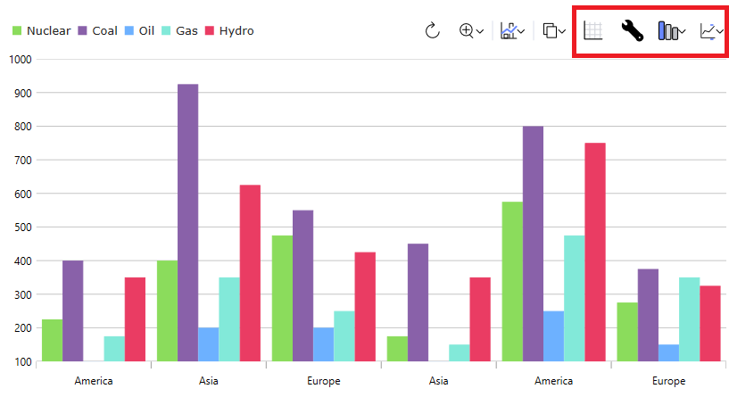

# {Platform} Dashboard Tile (ダッシュボード タイル) の概要

{Platform} Dashboard Tile は、データ ソース コレクション/配列または単一のデータ ポイントを分析して、表示する最も適切な視覚化を決定する自動データ視覚化コンポーネントです。また、埋め込みの `Toolbar` で提供される一連のツールを使用して、さまざまな方法で表示される視覚化を変更できます。

提供されたデータの形状に応じて、以下を含む多種多様な視覚化が選択可能です。これには以下が含まれますが、これらに限定されません: カテゴリ チャート、`ラジアル チャートと極座標チャート、散布図、地理マップ、ラジアル ゲージとリニア ゲージ、ファイナンシャル チャート、積層型チャート。

ツールバー内のチャート タイプ メニューを操作すると、候補リストの中から異なる視覚化を選択できます。

## {Platform} Dashboard Tile の例

<!-- TODO -->
`sample="/charts/dashboard-tile/overview", height="600", alt="{Platform} Dashboard Tile の例"`

## 依存関係

<!-- Angular, WebComponents, React -->
{ProductName} ツールセットに次のパッケージをインストールします:

```cmd
npm install {PackageCharts}
npm install {PackageCore}
npm install {PackageDashboards}
npm install {PackageGauges}
npm install {PackageGrids}
npm install {PackageInputs}
npm install {PackageLayouts}
npm install {PackageMaps}
```

Dashboard Tile コンポーネントを使用する場合、以下のモジュールを使用することをお勧めします:

```ts
import { IgxDashboardTileModule, IgxDataChartDashboardTileModule, IgxRadialGaugeDashboardTileModule,
         IgxLinearGaugeDashboardTileModule, IgxGeographicMapDashboardTileModule,
         IgxPieChartDashboardTileModule } from "igniteui-angular-dashboards";

@NgModule({
    imports: [
        IgxDataChartDashboardTileModule,
        IgxRadialGaugeDashboardTileModule,
        IgxLinearGaugeDashboardTileModule,
        IgxGeographicMapDashboardTileModule,
        IgxPieChartDashboardTileModule,
        IgxDashboardTileModule
    ]
})
export class AppModule {}
```

```ts
import { IgrDashboardTileModule, IgrDataChartDashboardTileModule, IgrRadialGaugeDashboardTileModule,
         IgrLinearGaugeDashboardTileModule, IgrGeographicMapDashboardTileModule,
         IgrPieChartDashboardTileModule } from "igniteui-react-dashboards";

IgrDataChartDashboardTileModule.register();
IgrRadialGaugeDashboardTileModule.register();
IgrLinearGaugeDashboardTileModule.register();
IgrGeographicMapDashboardTileModule.register();
IgrPieChartDashboardTileModule.register();
IgrDashboardTileModule.register();
```

```ts
import { IgcDashboardTileModule, IgcDataChartDashboardTileModule, IgcRadialGaugeDashboardTileModule,
         IgcLinearGaugeDashboardTileModule, IgcGeographicMapDashboardTileModule,
         IgcPieChartDashboardTileModule } from "igniteui-angular-dashboards";

ModuleManager.register(
    IgcDataChartDashboardTileModule,
    IgcRadialGaugeDashboardTileModule,
    IgcLinearGaugeDashboardTileModule,
    IgcGeographicMapDashboardTileModule,
    IgcPieChartDashboardTileModule,
    IgcDashboardTileModule
);
```

<!-- end:Angular, WebComponents, React -->

<!-- Blazor -->

**IgniteUI.Blazor.Controls** 名前空間を **_Imports.razor** ファイルに追加します。

```razor
@using IgniteUI.Blazor.Controls
```

Dashboard Tile コンポーネントを使用する場合、以下のモジュールを使用することをお勧めします:

```razor
// in Program.cs file

builder.Services.AddIgniteUIBlazor(
    typeof(IgbDataChartDashboardTileModule),
    typeof(IgbRadialGaugeDashboardTileModule),
    typeof(IgbLinearGaugeDashboardTileModule),
    typeof(IgbGeographicMapDashboardTileModule),
    typeof(IgbPieChartDashboardTileModule),
    typeof(IgbDashboardTileModule)
);
```

<!-- end: Blazor -->

## 使用方法

コントロールはバインドしたデータを評価し、{ProductName} ツールセットから表示する視覚エフェクトを選択するため、Dashboard Tile の `DataSource` プロパティを何にバインドするかによって、デフォルトで表示される視覚エフェクトが決まります。Dashboard Tile に表示されるデータ視覚化コントロールは次のとおりです。

* [{IgPrefix}CategoryChart](charts/chart-overview.md)
* [{IgPrefix}DataChart](charts/chart-overview.md)
* [{IgPrefix}DataPieChart](charts/types/data-pie-chart.md)
* [{IgPrefix}GeographicMap](geo-map.md)
* [{IgPrefix}LinearGauge](linear-gauge.md)
* [{IgPrefix}RadialGauge](radial-gauge.md)

デフォルトで選択されるデータ視覚化は、主にスキーマとバインドした `DataSource` の数によって決まります。たとえば、単一の数値をバインドすると `XamRadialGauge` が取得されますが、互いに区別しやすい値とラベルのペアのコレクションをバインドすると `XamDataPieChart` が取得されます。より多くの値パスを持つ `DataSource` をバインドすると、バインドされたコレクションの数に応じて、複数の列シリーズまたは線シリーズを持つ `DataChart` を受け取ります。また、`XamGeographicMap` を取得するために、`ShapeDataSource` または地理的ポイントを含むデータにバインドすることもできます。

`DataSource` をバインドするときに単一の視覚化にロックされることはなく、`VisualizationType` プロパティを設定することで、特定の視覚化を表示することをコントロールに指示できます。たとえば、特に折れ線チャートを表示したい場合は、次のように Dashboard Tile を定義できます。

<!-- TODO SAMPLE -->

視覚化または視覚化のプロパティも、コントロールの上部にある `Toolbar` を使用して構成できます。この `Toolbar` には、現在の視覚化の既定のツールに加えて、以下で強調表示されている 4 つの Dashboard Tile 固有のツールが含まれています。



左から右へ:

- 最初のツールは、コントロールに提供された `DataSource` を含むデータ グリッドを表示します。これは切り替えツールなので、グリッドを表示した後にもう一度クリックすると、視覚化に戻ります。
- 2 番目のツールを使用すると、現在のデータ視覚化の設定を構成できます。
- 3 番目のツールを使用すると、現在の視覚化を変更して、異なるシリーズ タイプをプロットしたり、まったく異なるタイプの視覚化を表示したりすることができます。これは、前述の `VisualizationType` プロパティを設定することによってコントロール上で設定できます。
- 最後のツールを使用すると、基になるデータ項目のどのプロパティをコントロールに含めるかを構成できます。これを構成するには、コントロールに `IncludedProperties` または `ExcludedProperties` コレクションを設定します。

## API リファレンス

 - `Toolbar`
 - `CategoryChart`
 - `XamDataChart`
 - `DataPieChart`
 - `XamGeographicMap`
 - `XamLinearGauge`
 - `XamRadialGauge`

## その他のリソース

* [{ProductName} **フォーラム (英語)**]({ForumsLink})
* [{ProductName} **GitHub (英語)**]({GithubLink})
