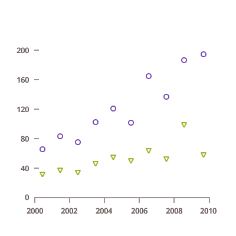
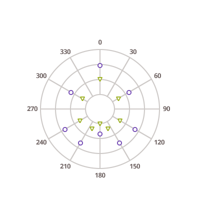

# $Platform$ ポイント チャート

$ProductName$ は以下のタイプのポイント チャートを提供します。

<section class="feature__container">
    
    <body>
        

            

                
ポイント チャート

                
            

        

        

            

                
散布マーカー チャート

                
            

        

        

            

                
散布バブル チャート

                
            

        

        

            

                
極座標散布チャート

                
            

        

        <!-- 

            

                
Scatter High Density Chart

                
            

        
 -->
    </body>
</section>
