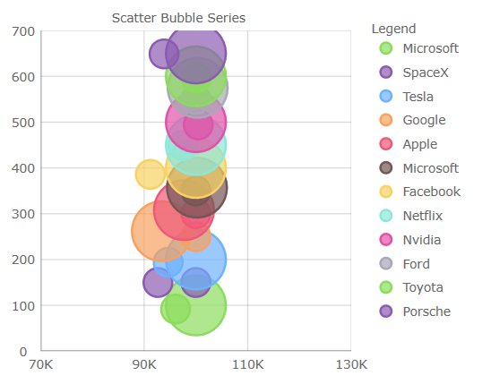
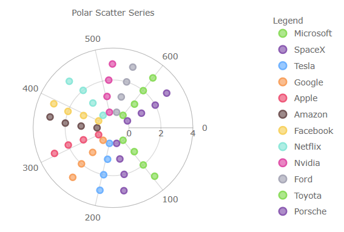

# $ProductName$ 変更ログ (データ可視化)


$ProductName$ の各バージョンのすべての重要な変更は、このページに記載されています。

<!-- Angular -->

> [!NOTE]
> Angular LOB コンポーネントに固有の変更については、[Ignite UI Angular 変更](https://github.com/IgniteUI/igniteui-angular/blob/master/CHANGELOG.md)を参照してください。

<!-- end: Angular -->

<div class="divider--half"></div>

## **$Platform$ {PackageVerChanges-21-2}**

<!-- Blazor -->

> [!NOTE]
> 'Igb' は、すべてのコンポーネントと各コンポーネント内のネストされた要素に必要になりました。この API の変更は、Infragistics コントロールとサードパーティのコントロールの間の曖昧を回避するために必要でした。
>
>例:
>
>`<IgbDataGrid>`
>
>   `<IgbTextColumn Field="ProductID" />`
>
>`</IgbDataGrid>`

<!-- end: Blazor -->

<div class="divider--half"></div>

<!-- WebComponents -->

> [!Note]
> パッケージ「lit-html」を確認してください。最適な互換性のために、「^2.0.0」以降がプロジェクトに追加されます。

<!-- end: WebComponents -->

<div class="divider--half"></div>

<!-- Blazor, WebComponents -->
### 新しいコンポーネント

* [Avatar](layouts/avatar.md)
* [Badge](inputs/badge.md)
* [Button & Icon Button](inputs/button.md)
* [Calendar](scheduling/calendar.md)
* [Card](layouts/card.md)
* [Checkbox](inputs/checkbox.md)
* [Form](inputs/form.md)
* [Icon](layouts/icon.md)
* [List](grids/list.md)
* [Navbar](menus/navbar.md)
* [Navigation Drawer](menus/navigation-drawer.md)
* [Radio & Radio Group](inputs/radio.md)
* [Ripple](inputs/ripple.md)
* [Switch](inputs/switch.md)

<!-- end: Blazor, WebComponents -->

<div class="divider--half"></div>

### チャートとマップ

このリリースでは、地理マップとすべてのチャート コンポーネントのビジュアル デザインと構成オプションにいくつかの改善と簡素化が導入されています。

* `FinancialChart` と `CategoryChart` の `YAxisLabelLocation` プロパティのタイプ `AxisLabelLocation` を `YAxisLabelLocation` に変更しました。
* `FinancialChart` の `XAxisLabelLocation` プロパティのタイプ `AxisLabelLocation` を `YAxisLabelLocation` に変更しました。
* `CategoryChart` に `XAxisLabelLocation` プロパティを追加しました。
* Legend で `XamGeographicMap` の地理的シリーズを表すためのサポートを追加しました。
* `FinancialChart` と `CategoryChart` にデフォルトで十字線を追加しました。
* `FinancialChart`と `CategoryChart` にデフォルトで十字線注釈を追加しました。
* デフォルトで `FinancialChart` に最終値の注釈を追加しました。
* カテゴリ チャートとファイナンシャル チャートに新しいプロパティを追加しました:
   - 十字線をカスタマイズするための `CrosshairsLineThickness` およびその他のプロパティ
   - 十字線の注釈をカスタマイズするための `CrosshairsAnnotationXAxisBackground` およびその他のプロパティ
   - 最終値の注釈をカスタマイズするための `FinalValueAnnotationsBackground` およびその他のプロパティ
   - 塗りつぶしの図形の不透明度の変更を可能にする (エリア チャートなど) `AreaFillOpacity`
   - マーカーの厚さの変更を可能にする `MarkerThickness`
* カテゴリ チャート、ファイナンシャル チャート、データ チャート、および地理マップに新しいプロパティを追加しました。
   - 同じチャート内の複数のシリーズにどのマーカー タイプを割り当てるを可能にする `MarkerAutomaticBehavior`
   - 凡例で表されるすべてのシリーズのバッジの形状を設定するための `LegendItemBadgeShape`
   - 凡例のすべてのシリーズにバッジの複雑さを設定するための `LegendItemBadgeMode`
* データ チャートと地理マップのシリーズに新しいプロパティを追加しました。
   - 凡例で表される特定のシリーズにバッジの形状を設定するための `LegendItemBadgeShape`
   - 凡例の特定のシリーズにバッジの複雑さを設定するための `LegendItemBadgeMode`
* カテゴリ チャートとシリーズのデフォルトの垂直十字線ストロークを <span style="color:#000000">#000000</span> から <span style="color:#BBBBBB">#BBBBBB</span> に変更しました。
* 同じチャートにプロットされたすべてのシリーズのマーカーの図形を円に変更しました。これは、チャートの `MarkerAutomaticBehavior` プロパティを `SmartIndexed` 列挙値に設定することで元に戻すことができます。
* チャートの凡例のシリーズの簡略化された図形で、円、線、または四角のみを表示します。これは、チャートの `LegendItemBadgeMode` プロパティを `MatchSeries` 列挙値に設定することで元に戻すことができます。
* すべてのチャートに表示されるシリーズとマーカーのカラー パレットを変更しました。

古いのブラシ/アウトライン | 新のアウトライン/ブラシ
-------------------- | -------------------
<span style="color:#8BDC5C">#8BDC5C</span> <br><span style="color:#8B5BB1">#8B5BB1</span> <br><span style="color:#6DB1FF">#6DB1FF</span> <br><span style="color:#F8A15F">#F8A15F</span> <br><span style="color:#EE5879">#EE5879</span> <br><span style="color:#735656">#735656</span> <br><span style="color:#F7D262">#F7D262</span> <br><span style="color:#8CE7D9">#8CE7D9</span> <br><span style="color:#E051A9">#E051A9</span> <br><span style="color:#A8A8B7">#A8A8B7</span> | <span style="color:#8BDC5C">#8BDC5C</span> <br><span style="color:#8961A9">#8961A9</span> <br><span style="color:#6DB1FF">#6DB1FF</span> <br><span style="color:#82E9D9">#82E9D9</span> <br><span style="color:#EA3C63">#EA3C63</span> <br><span style="color:#735656">#735656</span> <br><span style="color:#F8CE4F">#F8CE4F</span> <br><span style="color:#A8A8B7">#A8A8B7</span> <br><span style="color:#E051A9">#E051A9</span> <br><span style="color:#FF903B">#FF903B</span> <br>

<!-- Blazor, React, WebComponents -->

### DataGrid

* 新規機能:
    - [列フィルタリング](grids/data-grid-column-filtering.md)
    - [レイアウトのカスタマイズの読み込みと保存](grids/data-grid-load-save-layout.md)
    - [列をグループ化するための GroupBy 地域](grids/data-grid-row-grouping.md)
    - [セルの結合](grids/data-grid-cell-merging.md)
* 新規 API:
    - `SelectionChanged` イベントを追加しました。複数行の選択など、選択の相互作用の変化を検出するために使用されます。
* 重大な変更:
    - `GridSummaryScope` プロパティのタイプを `DataSourceSummaryScope` から `SummaryScope` に変更しました。
    - `GroupHeaderDisplayMode` プロパティのタイプを DataSourceSectionHeaderDisplayMode から `GroupHeaderDisplayMode` に変更しました。

<!-- end: Blazor, React, WebComponents -->

<div class="divider--half"></div>

## **$Platform$ {PackageVerChanges-21-1}**

### チャートとマップ

このリリースでは、すべてのチャート コンポーネントに、いくつかの新しく改善されたビジュアル デザインと構成オプションが導入されています。例えば、`DataChart`、`CategoryChart`、および `FinancialChart`。

* シリーズとマーカーの再設計されたカラー パレット:

古いのブラシ/アウトライン | 新のアウトライン/ブラシ
-------------------- | -------------------
<span style="color:#7446B9">#7446B9</span> <br><span style="color:#9FB328">#9FB328</span> <br><span style="color:#F96232">#F96232</span> <br><span style="color:#2E9CA6">#2E9CA6</span> <br><span style="color:#DC3F76">#DC3F76</span> <br><span style="color:#FF9800">#FF9800</span> <br><span style="color:#3F51B5">#3F51B5</span> <br><span style="color:#439C47">#439C47</span> <br><span style="color:#795548">#795548</span> <br><span style="color:#9A9A9A">#9A9A9A</span> | <span style="color:#8bdc5c">#8bdc5c</span> <br><span style="color:#8b5bb1">#8b5bb1</span> <br><span style="color:#6db1ff">#6db1ff</span> <br><span style="color:#f8a15f">#f8a15f</span> <br><span style="color:#ee5879">#ee5879</span> <br><span style="color:#735656">#735656</span> <br><span style="color:#f7d262">#f7d262</span> <br><span style="color:#8ce7d9">#8ce7d9</span> <br><span style="color:#e051a9">#e051a9</span> <br><span style="color:#a8a8b7">#a8a8b7</span> <br>

例:

|
------------- | -------------
 | 
 | 

<div class="divider--half"></div>

* 棒/縦棒/ウォーターフォール シリーズを、角丸ではなく角が四角になるように変更しました。
* heat min プロパティの 散布高密度シリーズの色を <span style="color:#8a5bb1">#8a5bb1</span> から <span style="color:#000000">#000000</span> に変更しました。
* heat max プロパティの 散布高密度シリーズの色を <span style="color:#ee5879">#ee5879</span> から <span style="color:#ee5879">#ee5879</span> に変更しました。
* ファイナンシャル/ウォーターフォール シリーズの `NegativeBrush` および `NegativeOutline` プロパティを <span style="color:#C62828">#C62828</span> から <span style="color:#ee5879">#ee5879</span> に変更しました。
* マーカーの厚さを 1px から 2px に変更しました。
* `PointSeries`、`BubbleSeries`、`ScatterSeries`、`PolarScatterSeries` のマーカーのアウトラインに一致するようにマーカーの塗りつぶしを変更しました。`MarkerFillMode` プロパティを Normal に設定すると、この変更を元に戻すことができます。
* `TimeXAxis` および `OrdinalTimeXAxis` のラベリングを圧縮しました。
* 新しいマーカー プロパティ:
    - シリーズ。`MarkerFillMode` - マーカーがアウトラインに依存するように、`MatchMarkerOutline` に設定できます。
    - シリーズ。`MarkerFillOpacity` - 0〜1 の値に設定できます。
    - シリーズ。`MarkerOutlineMode` - マーカーのアウトラインが塗りブラシの色に依存するように、`MatchMarkerBrush` に設定できます。
* 新シリーズプロパティ:
    - シリーズ。`OutlineMode` - シリーズ アウトラインの表示を切り替えるように設定できます。データ チャートの場合、プロパティはシリーズ上にあることに注意してください。
    - チャートがデフォルトのズーム レベルにあるときにビューポートに導入されるブリード オーバー領域を定義する新しいチャート プロパティを追加しました。一般的な使用例では、軸と最初/最後のデータ ポイントの間にスペースを提供します。以下にリストされている `ComputedPlotAreaMarginMode` は、マーカーが有効になっているときに自動的にマージンを設定することに注意してください。その他は、厚さを表す `Double` を指定するように設計されており、PlotAreaMarginLeft などがチャートの 4 辺すべてにスペースを調整します:
    - チャート。`PlotAreaMarginLeft`
    - チャート。`PlotAreaMarginTop`
    - チャート。`PlotAreaMarginRight`
    - チャート。`PlotAreaMarginBottom`
    - チャート。`ComputedPlotAreaMarginMode`
* 新しい強調表示プロパティ:
    - チャート。`HighlightingMode` - ホバーされたシリーズとホバーされていないシリーズをフェードまたは明るくするかを設定します。
    - チャート。`HighlightingBehavior` - 真上または最も近い項目など、マウスの位置に応じてシリーズを強調表示するかどうかを設定します。
    - 以前のリリースでは、強調表示はホバー時にフェードするように制限されていたことに注意してください。
* 積層型、散布図、極座標、ラジアル、図形シリーズに強調表示を追加しました。
* 積層型、散布図、極座標、ラジアル、図形注釈レイヤーを追加しました。
* 積層型シリーズ内の個々の積層フラグメントのデータ ソースをオーバーライドするためのサポートが追加されました。
* 積層型、散布、範囲、極座標、ラジアル、シェイプ シリーズにカスタム スタイルのイベントを追加しました。
* 垂直ズームをシリーズ コンテンツに自動的に同期するサポートが追加されました。
* 表示された最初のラベルに基づいてチャートの水平マージンを自動的に拡張するサポートが追加されました。

### チャート凡例

*バブル、ドーナツ、および円チャートで使用できる水平方向の `Orientation` プロパティを ItemLegend に追加しました。
* `LegendHighlightingMode` プロパティを追加 - 凡例項目にカーソルを合わせたときにシリーズの強調表示を有効にします。

### 地理マップ

> [!NOTE]
> これらの機能は CTP です。

* マップの表示を折り返すためのサポートが追加されました (水平方向に無限にスクロールできます)。
* 座標原点を折り返しながら、一部のマップ シリーズの表示をシフトするためのサポートが追加されました。
* シェイプ シリーズの強調表示のサポートが追加されました。
* シェイプ シリーズの一部の注釈レイヤーのサポートが追加されました。

<div class="divider--half"></div>

<!-- Blazor, React, WebComponents -->

### データ グリッド

* `EditOnKeyPress`、(別名: Excel スタイルの編集) を追加し、入力するとすぐに編集を開始します。
* `EditModeClickAction` プロパティを追加しました - デフォルトでは、編集モードに入るにはダブル クリックが必要です。これを `SingleClick` に設定して、新しいセルを選択するときに編集モードを実行できるようにすることができます。
* `EnterKeyBehaviors` プロパティ (別名 Excel スタイルのナビゲーション (Enter 動作)) を追加して、Enter キーの動作を制御します。例えば、オプションは (なし、編集、上、下、左、右に移動) です。
* `EnterKeyBehaviorAfterEdit` プロパティを追加しました - 編集モードでは、このプロパティは Enter キーが押されたときを制御します。例えば、オプションは (下、上、右、左のセルに移動) です。
* `SelectAllRows` メソッドを追加しました。
* 行範囲の選択を追加しました - `GridSelectionMode` プロパティを MultipleRow に設定すると、次の新しい機能が含まれるようになりました:
    - クリックしてドラッグし、行を選択します。
    - Shift キーを押しながらクリックして、複数の行を選択します。
    - Shift キーを押しながら上下の矢印キーを押して、複数の行を選択します。
* スペース バーを押すと、MultipleRow または SingleRow に設定された `GridSelectionMode` プロパティを介してアクティブな行の選択が切り替わります。
* 列オプション ダイアログに列集計を追加しました。

### 日付ピッカー

* `ShowTodayButton` - 現在の日付のボタンの表示を切り替えます。
* `Label` - 日付値の上にラベルを追加します。
* `Placeholder` プロパティ - 値が選択されていない場合にカスタム テキストを追加します。
* `FormatString` - 入力日付文字列をカスタマイズします。(例: yyyy-MM-dd)
* `DateFormat` - 選択した日付を LongDate または ShortDate のどちらとして表示するかを指定します。
* `FirstDayOfWeek` - 週の最初の曜日を指定します。
* `FirstWeekOfYear` - 年の最初の週をいつ表示するかを指定します。例えば、最初の 1 週間、最初の 4 日間の週です。
* `ShowWeekNumbers` - 週番号の表示を切り替えます。
* `MinDate` & `MaxDate` - 使用可能の選択できる日付の範囲を指定する日付制限。
* アクセシビリティの追加

<!-- end: Blazor, React, WebComponents -->

<div class="divider--half"></div>

<!-- React, WebComponents -->
## **$Platform$ {PackageVerChangedFields}**

> [!NOTE]
> これらの重大な変更は、グリッド パッケージで導入されました。

### データ グリッド

- PropertyPath の名称変更

データ グリッド コンポーネントの `propertyPath` プロパティ名が `field` に変更されました。これは、すべての Column タイプ、GroupDescription、SortDescription および SummaryDescription に適用します。

```tsx
 <IgrTextColumn field="Name"/>
```

```ts
import { IgrColumnSummaryDescription, IgrColumnSortDescription, IgrColumnGroupDescription } from 'igniteui-react-grids'
const productCount = new IgrColumnSummaryDescription();
productCount.field = "ProductName";
const colSortDesc = new IgrColumnSortDescription();
colSortDesc.field = "UnitsInStock";
const income = new IgrColumnGroupDescription();
income.field = "Income";
```

```html
 <igc-text-column field="Name"></igc-text-column>
```

```ts
import { IgcColumnSummaryDescription, IgcColumnSortDescription, IgcColumnGroupDescription} from 'igniteui-webcomponents-grids'
const productCount = new IgcColumnSummaryDescription();
productCount.field = "ProductName";
const colSortDesc = new IgcColumnSortDescription();
colSortDesc.field = "UnitsInStock";
const income = new IgcColumnGroupDescription();
income.field = "Income";

```
## **$Platform$ {PackageVerRenamedGrid}**
### データ グリッド

- Live Grid の名称変更

Data Grid コンポーネントおよび対応するモジュールの名前が LiveGrid から DataGrid に変更されました。

> [!NOTE]
> これらの重大な変更は、これらのパッケージとコンポーネントでのみ導入されました:

グリッドとそれに対応するモジュールをインポートする新しいコードは以下のとおりです。

```ts
import { IgrDataGrid } from "igniteui-react-grids";
import { IgrDataGridModule } from 'igniteui-react-grids';
```

```ts
import { IgcDataGrid } from "igniteui-webcomponents-grids";
import { IgcDataGridModule } from 'igniteui-webcomponents-grids';
```

- Data Grid の必須ピア依存関係

Data Grid コンポーネントには 「inputs」 パッケージが必要です。

```ts
**npm install --save {PackageInputs}**
```
<!-- end: React, WebComponents -->

<div class="divider--half"></div>

<!-- Angular, React, WebComponents -->
## **$Platform$ {PackageVerChangedImports}**

- import ステートメントの変更

Import ステートメントは、API クラスと列挙型へのフル パスではなくパッケージ名のみを使用するように簡素化されました。

> [!NOTE]
> これらの重大な変更は、これらのパッケージとコンポーネントでのみ導入されました:

| 影響されるパッケージ | 影響されるコンポーネント |
| ------------------|---------------------|
| <a href="{PackageWebsite}{PackageExcel}/v/{PackageVerChangedImports}" target="_blank">{PackageExcel}</a> | [Excel ライブラリ](excel-library.md)  |
| <a href="{PackageWebsite}{PackageSpreadsheet}/v/{PackageVerChangedImports}" target="_blank">{PackageSpreadsheet}</a> | [スプレッドシート](spreadsheet-overview.md) |
| <a href="{PackageWebsite}{PackageMaps}/v/{PackageVerChangedImports}" target="_blank">{PackageMaps}</a> | [マップ](geo-map.md)、[ツリーマップ](charts/types/treemap-chart.md)  |
| <a href="{PackageWebsite}{PackageGauges}/v/{PackageVerChangedImports}" target="_blank">{PackageGauges}</a> |  [ブレット グラフ](bullet-graph.md)、[リニア ゲージ](linear-gauge.md)、[ラジアル ゲージ](radial-gauge.md)   |
| <a href="{PackageWebsite}{PackageCharts}/v/{PackageVerChangedImports}" target="_blank">{PackageCharts}</a>| カテゴリ チャート、データ チャート、ドーナツ チャート、ファイナンシャル チャート、円チャート、[ズーム スライダー](zoomslider-overview.md)  |
| <a href="{PackageWebsite}{PackageGrids}/v/{PackageVerChangedImports}" target="_blank">{PackageGrids}</a>             | [データ グリッド](data-grid.md)       |
| <a href="{PackageWebsite}{PackageCore}/v/{PackageVerChangedImports}" target="_blank">{PackageCore}</a> | すべてのクラスと列挙型  |


- 変更後のコード

API クラスと列挙型へのフル パスの代わりにパッケージ名のみを使用できます。

注: Data Grid コンポーネントとそれに対応するモジュールの名前も変更されました

```ts
// gauges:
import { IgxLinearGauge } from "igniteui-angular-gauges";
import { IgxLinearGaugeModule } from "igniteui-angular-gauges";
import { IgxLinearGraphRange } from "igniteui-angular-gauges";

import { IgxRadialGauge } from 'igniteui-angular-gauges}';
import { IgxRadialGaugeModule } from 'igniteui-angular-gauges';
import { IgxRadialGaugeRange } from 'igniteui-angular-gauges';
import { SweepDirection } from 'igniteui-angular-core';

// charts:
import { IgxFinancialChartComponent } from "igniteui-angular-charts";
import { IgxFinancialChartModule } from "igniteui-angular-charts";
import { IgxDataChartComponent } from "igniteui-angular-charts";
import { IgxDataChartCoreModule } from "igniteui-angular-charts";

// maps:
import { IgxGeographicMapComponent } from "igniteui-angular-maps";
import { IgxGeographicMapModule } from "igniteui-angular-maps";
```

```ts
// gauges:
import { IgcLinearGaugeComponent } from "igniteui-webcomponents-gauges";
import { IgcLinearGaugeModule } from "igniteui-webcomponents-gauges";
import { IgcLinearGraphRange } from "igniteui-webcomponents-gauges";

import { IgcRadialGaugeComponent } from 'igniteui-webcomponents-gauges';
import { IgcRadialGaugeModule } from 'igniteui-webcomponents-gauges';
import { IgcRadialGaugeRange } from 'igniteui-webcomponents-gauges';
import { SweepDirection } from 'igniteui-webcomponents-core';

// charts:
import { IgcFinancialChartComponent } from "igniteui-webcomponents-charts";
import { IgcFinancialChartModule } from "igniteui-webcomponents-charts";
import { IgcDataChartComponent } from "igniteui-webcomponents-charts";
import { IgcDataChartCoreModule } from "igniteui-webcomponents-charts";

// maps:
import { IgcGeographicMapComponent } from "igniteui-webcomponents-maps";
import { IgcGeographicMapModule } from "igniteui-webcomponents-maps";

// grids:
import { IgcDataGridComponent } from "igniteui-webcomponents-grids";
import { IgcDataGridModule } from "igniteui-webcomponents-grids";
```

```ts
// gauges:
import { IgrLinearGauge } from "igniteui-react-gauges";
import { IgrLinearGaugeModule } from "igniteui-react-gauges";
import { IgrLinearGraphRange } from "igniteui-react-gauges";

import { IgrRadialGauge } from 'igniteui-react-gauges';
import { IgrRadialGaugeModule } from 'igniteui-react-gauges';
import { IgrRadialGaugeRange } from 'igniteui-react-gauges';
import { SweepDirection } from 'igniteui-react-core';

// charts:
import { IgrFinancialChart } from 'igniteui-react-charts';
import { IgrFinancialChartModule } from 'igniteui-react-charts';
import { IgrDataChart } from 'igniteui-react-charts';
import { IgrDataChartCoreModule } from 'igniteui-react-charts';

// maps:
import { IgrGeographicMap } from "igniteui-react-maps";
import { IgrGeographicMapModule } from "igniteui-react-maps";

// grids:
import { IgrLiveGrid } from "igniteui-react-grids";
import { IgrLiveGridModule } from 'igniteui-react-grids';
```

- 変更前のコード

以前は、API クラスと列挙型への完全なパスを使用してインポートする必要がありました。

```ts
// gauges:
import { IgxLinearGaugeComponent } from 'igniteui-webcomponents-gauges/ES5/igx-linear-gauge-component';
import { IgxLinearGaugeModule } from 'igniteui-webcomponents-gauges/ES5/igx-linear-gauge-module';
import { IgxLinearGraphRange } from 'igniteui-webcomponents-gauges/ES5/igx-linear-graph-range';

import { IgxRadialGaugeComponent } from "igniteui-webcomponents-gauges/ES5/igx-radial-gauge-component";
import { IgxRadialGaugeModule } from "igniteui-webcomponents-gauges/ES5/igx-radial-gauge-module";
import { IgxRadialGaugeRange } from "igniteui-webcomponents-gauges/ES5/igx-radial-gauge-range";
import { SweepDirection } from "igniteui-webcomponents-core/ES5/SweepDirection";

// charts:
import { IgxFinancialChartComponent } from "igniteui-webcomponents-charts/ES5/igx-financial-chart-component";
import { IgxFinancialChartModule } from "igniteui-webcomponents-charts/ES5/igx-financial-chart-module";
import { IgxDataChartComponent } from "igniteui-webcomponents-charts/ES5/igx-data-chart-component";
import { IgxDataChartCoreModule } from "igniteui-webcomponents-charts/ES5/igx-data-chart-core-module";

// maps:
import { IgxGeographicMapComponent } from "igniteui-webcomponents-maps/ES5/igx-geographic-map-component";
import { IgxGeographicMapModule } from "igniteui-webcomponents-maps/ES5/igx-geographic-map-module";
```

```ts
// gauges:
import { IgcLinearGaugeComponent } from 'igniteui-webcomponents-gauges/ES5/igc-linear-gauge-component';
import { IgcLinearGaugeModule } from 'igniteui-webcomponents-gauges/ES5/igc-linear-gauge-module';
import { IgcLinearGraphRange } from 'igniteui-webcomponents-gauges/ES5/igc-linear-graph-range';

import { IgcRadialGaugeComponent } from "igniteui-webcomponents-gauges/ES5/igc-radial-gauge-component";
import { IgcRadialGaugeModule } from "igniteui-webcomponents-gauges/ES5/igc-radial-gauge-module";
import { IgcRadialGaugeRange } from "igniteui-webcomponents-gauges/ES5/igc-radial-gauge-range";
import { SweepDirection } from "igniteui-webcomponents-core/ES5/SweepDirection";

// charts:
import { IgcFinancialChartComponent } from "igniteui-webcomponents-charts/ES5/igc-financial-chart-component";
import { IgcFinancialChartModule } from "igniteui-webcomponents-charts/ES5/igc-financial-chart-module";
import { IgcDataChartComponent } from "igniteui-webcomponents-charts/ES5/igc-data-chart-component";
import { IgcDataChartCoreModule } from "igniteui-webcomponents-charts/ES5/igc-data-chart-core-module";

// maps:
import { IgcGeographicMapComponent } from "igniteui-webcomponents-maps/ES5/igc-geographic-map-component";
import { IgcGeographicMapModule } from "igniteui-webcomponents-maps/ES5/igc-geographic-map-module";

// grids:
import { IgcLiveGridModule } from 'igniteui-webcomponents-grids/ES5/igc-live-grid-module';
import { IgcLiveGridComponent } from 'igniteui-webcomponents-grids/ES5/igc-live-grid-component';
```

```ts
// gauges:
import { IgrLinearGauge } from "igniteui-react-gauges/ES5/igr-linear-gauge";
import { IgrLinearGaugeModule } from "igniteui-react-gauges/ES5/igr-linear-gauge-module";
import { IgrLinearGraphRange } from "igniteui-react-gauges/ES5/igr-linear-graph-range";

import { IgrRadialGauge } from "igniteui-react-gauges/ES5/igr-radial-gauge";
import { IgrRadialGaugeModule } from "igniteui-react-gauges/ES5/igr-radial-gauge-module";
import { IgrRadialGaugeRange } from "igniteui-react-gauges/ES5/igr-radial-gauge-range";
import { SweepDirection } from "igniteui-react-core/ES5/SweepDirection";

// charts:
import { IgrFinancialChart } from "igniteui-react-charts/ES5/igr-financial-chart";
import { IgrFinancialChartModule } from "igniteui-react-charts/ES5/igr-financial-chart-module";
import { IgrDataChart } from "igniteui-react-charts/ES5/igr-data-chart";
import { IgrDataChartCoreModule } from "igniteui-react-charts/ES5/igr-data-chart-core-module";

// maps:
import { IgrGeographicMap } from "igniteui-react-maps/ES5/igr-geographic-map";
import { IgrGeographicMapModule } from "igniteui-react-maps/ES5/igr-geographic-map-module";

// grids:
import { IgrLiveGrid } from "igniteui-react-grids/ES5/igr-live-grid";
import { IgrLiveGridModule } from 'igniteui-react-grids/ES5/igr-live-grid-module';
```
<!-- end: Angular, React, WebComponents -->
