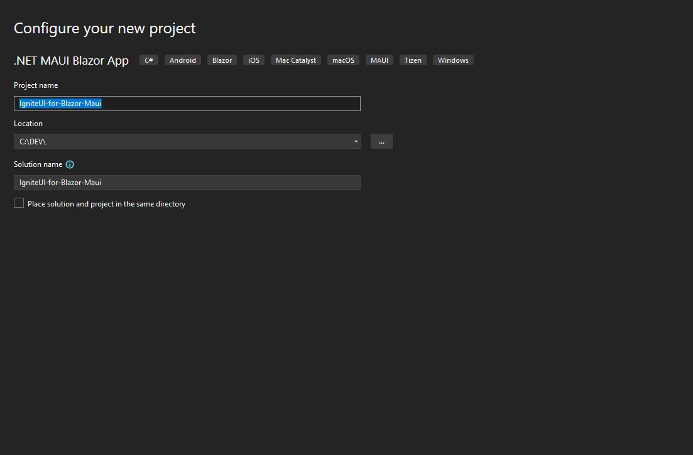
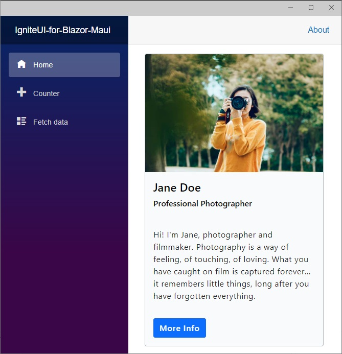

# 作業の開始: .NET MAUI を使用して Blazor Hybrid アプリを構築する

このトピックでは、Visual Studio 2022 を使用して Ignite UI for Blazor で .NET MAUI Blazor アプリケーションを作成するための手順を説明します。

### Blazor Hybrid とは

Blazor Hybrid は、Blazor Server と Blazor Web Assembly の間のようなものです。デスクトップとモバイルのネイティブ クライアント フレームワークの機能を統合することで、開発、コード、およびプロセスが簡素化されます。このテクノロジを使用すると、ネイティブ クライアント アプリケーションを作成するときに C# および .NET のスキルを適用できます。

ただし、アプリで使用できるようにするには、.NET MAUI が必要です。

### .NET MAUI とは

.NET MAUI (.NET Multi-platform App UI) は、単一の共有コードベースからネイティブ デスクトップおよびモバイル アプリを構築するための、オープンソースのクロス プラットフォーム フレームワークです。これにより、C# と XAML を使用して、Android、iOS、macOS、Windows など、さまざまなデバイスやオペレーティング システムで実行される Blazor アプリケーションをより簡単に開発できます。


## 前提条件

* .NET SDK 7 以降
* Visual Studio 2022 17.4 以降および次のワークロード:
    - .NET によるモバイル開発
    - ASP.NET と Web 開発

## .NET MAUI と Ignite UI for Blazor を使用して Blazor Hybrid アプリを作成して実行する

以下の手順では、新しい .NET MAUI Blazor プロジェクトを作成する方法について説明します。Ignite UI for Blazor を既存のアプリケーションに追加する場合は、[**Ignite UI for Blazor パッケージをインストール**](#ignite-ui-for-blazor-のインストール) セクションに移動します。

Visual Studio 2022 を起動し、開始ページで **[新しいプロジェクトの作成]** をクリックし、**.NET MAUI Blazor アプリ** テンプレートを選択して、**[次へ]** をクリックします。


プロジェクト名と場所を入力し、**[作成]** をクリックします。



## Ignite UI for Blazor のインストール

Ignite UI for Blazor は、NuGet パッケージで提供されます。Blazor アプリケーションで Ignite UI for Blazor コンポーネントを使用するには、最初に適切な NuGet パッケージをインストールする必要があります。

Visual Studio で、**[ツール]** → **[NuGet パッケージ マネージャー]** → **[ソリューションの NuGet パッケージの管理]** を選択して、NuGet パッケージ マネージャーを開きます。**IgniteUI.Blazor** NuGet パッケージを検索してインストールします。

NuGet を使用した Ignite UI for Blazor のインストールの詳細については、[Ignite UI for Blazor のインストール](general-installing-blazor.md) トピックを参照してください。

## Ignite UI for Blazor の登録

1 - **Program.cs** ファイルを開き、**builder.Services.AddIgniteUIBlazor()** を呼び出して Ignite UI for Blazor サービスを登録します。

```
public static class MauiProgram
{
	public static MauiApp CreateMauiApp()
	{
		var builder = MauiApp.CreateBuilder();
		builder
			.UseMauiApp<App>()
			.ConfigureFonts(fonts =>
			{
				fonts.AddFont("OpenSans-Regular.ttf", "OpenSansRegular");
			});

		builder.Services.AddMauiBlazorWebView();
#if DEBUG
		builder.Services.AddBlazorWebViewDeveloperTools();
#endif

        //register IgniteUI for Blazor
		builder.Services.AddIgniteUIBlazor();

		return builder.Build();
	}
}
```

2 - **IgniteUI.Blazor.Controls** 名前空間を **_Imports.razor** ファイルに追加します。

```razor
@using IgniteUI.Blazor.Controls
```

3 - **wwwroot/index.html** ファイルの **<head\>** 要素にスタイル シートを追加します。

```razor
<head>
    <link href="_content/IgniteUI.Blazor/themes/light/bootstrap.css" rel="stylesheet" />
</head>
```

4 - スクリプト参照を **wwwroot/index.html** ファイルに追加します。

```razor
	<script src="_content/IgniteUI.Blazor/app.bundle.js"></script>
	<script src="_framework/blazor.webview.js" autostart="false"></script>
```

## Ignite UI for Blazor コンポーネントの追加

Razor ページに Ignite UI for Blazor コンポーネントの追加:

```razor
<IgbCard style="width:350px">
    <IgbCardMedia>
        
    </IgbCardMedia>
    <IgbCardHeader>
        <h4>Jane Doe</h4>
        <h6>Professional Photographer</h6>
    </IgbCardHeader>
    <IgbCardContent>Hi! I'm Jane, photographer and filmmaker.
        Photography is a way of feeling, of touching,
        of loving. What you have caught on film is captured forever...
        it remembers little things, long after you have
        forgotten everything.</IgbCardContent>
    <IgbCardActions>
        <IgbButton>More Info</IgbButton>
    </IgbCardActions>
</IgbCard>
```

Windows 用の .NET MAUI Blazor アプリをビルドして実行します。



> [!NOTE]
> .NET MAUI を使用したクロス プラットフォーム アプリケーションの構築の詳細については、[Microsoft のドキュメント](https://docs.microsoft.com/ja-jp/dotnet/maui/get-started/first-app?pivots=devices-android)を参照してください。