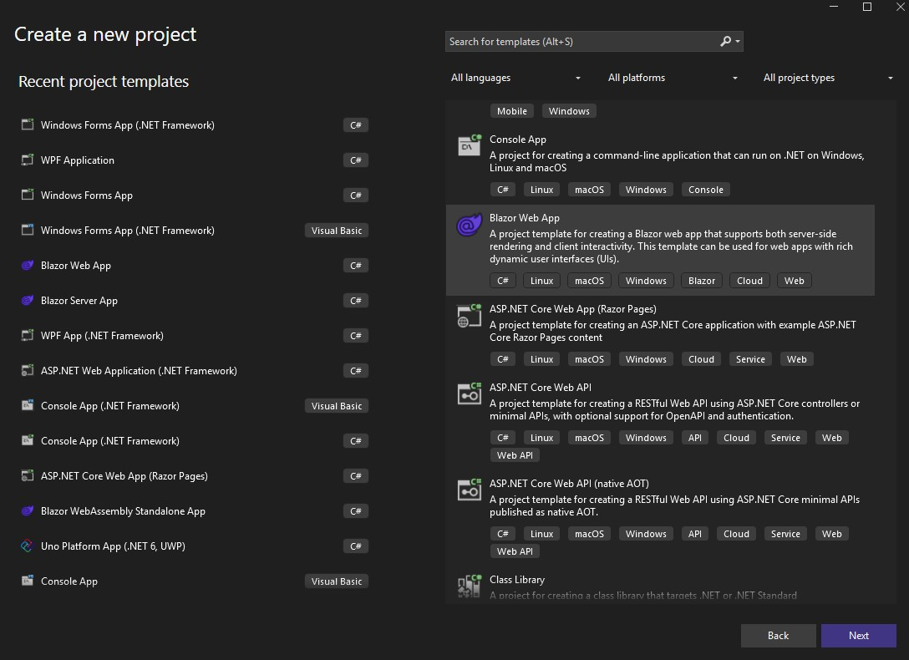
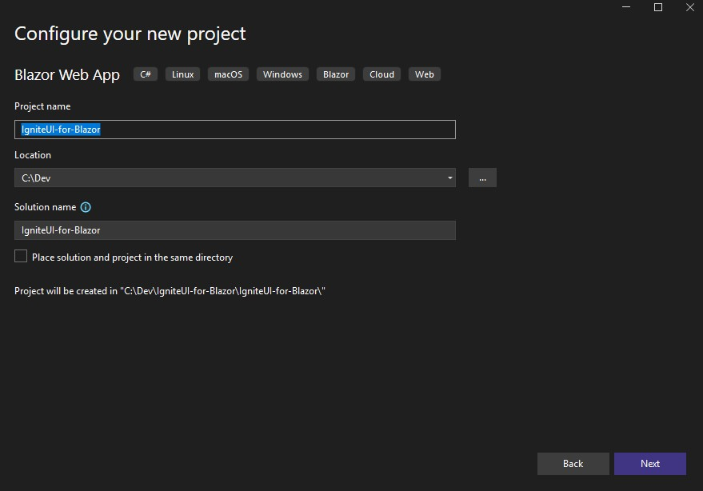
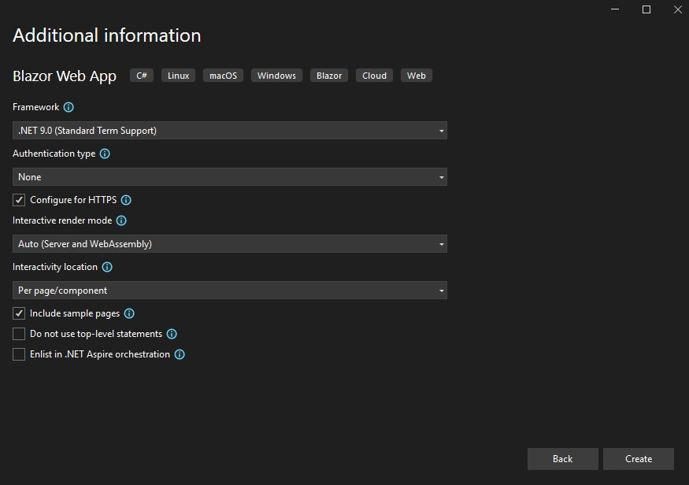

# Ignite UI for Blazor Web App で作業を開始

このトピックでは、Visual Studio および Ignite UI for Blazor を使用して Blazor Web App アプリケーションを作成するための手順を説明します。

## 新しい Blazor Web App プロジェクトを作成する
以下の手順では、新しい Blazor Web App プロジェクトを作成する方法を説明します。Ignite UI for Blazor を既存のアプリケーションに追加する場合は、[**Ignite UI for Blazor パッケージをインストール**](#ignite-ui-for-blazor-のインストール) セクションに移動します。

Visual Studio 2022 を起動し、開始ページで **[新しいプロジェクトの作成]** をクリックし、**Blazor Web App** テンプレートを選択して、**[次へ]** をクリックします。



プロジェクト名と場所を入力し、**[次へ]** をクリックします。



次のステップでは、オプションの Interactivity の場所の設定に注意してください。これは、クライアント プロジェクト内のページごとにデフォルト設定されます (例: @rendermode Interactive Auto)。もう 1 つのオプションである Global では、Interactivity レンダリング モードの設定を、共有 Blazor プロジェクト内の 1 つの場所にある App.razor に移動します。

例: <Routes @rendermode="InteractiveAuto"/>

**追加のプロジェクト オプションを指定し、[作成]** をクリックします。



## Ignite UI for Blazor のインストール

Ignite UI for Blazor は、NuGet パッケージで提供されます。Blazor アプリケーションで Ignite UI for Blazor コンポーネントを使用するには、最初に適切な NuGet パッケージをインストールする必要があります。

Visual Studio で、**[ツール]** → **[NuGet パッケージ マネージャー]** → **[ソリューションの NuGet パッケージの管理]** を選択して、NuGet パッケージ マネージャーを開きます。すべての対象プロジェクトを選択してパッケージをインストールし、**IgniteUI.Blazor** NuGet パッケージを検索してインストールします。

NuGet を使用した Ignite UI for Blazor のインストールの詳細については、[Ignite UI for Blazor のインストール](general-installing-blazor.md) トピックを参照してください。

## Ignite UI for Blazor の登録

1 - サーバーの **Program.cs** ファイルを開き、**builder.Services.AddIgniteUIBlazor()** 関数を呼び出して Ignite UI for Blazor サービスを登録します。

```razor
var builder = WebApplication.CreateBuilder(args);

// Add services to the container.
builder.Services.AddRazorComponents()
    .AddInteractiveServerComponents()
    .AddInteractiveWebAssemblyComponents();

builder.Services.AddIgniteUIBlazor();

var app = builder.Build();
```

クライアントの **Program.cs** を開き、同じサービスを追加します。

```razor
var builder = WebAssemblyHostBuilder.CreateDefault(args);

builder.Services.AddIgniteUIBlazor();

await builder.Build().RunAsync();
```

2 - クライアント プロジェクトとサーバー プロジェクト両方の **_Imports.razor** ファイルに、**IgniteUI.Blazor.Controls** 名前空間を追加します。

```razor
@using IgniteUI.Blazor.Controls
```

3 - サーバー プロジェクトの **Components/App.razor** ファイル内の **<head\>** 要素にスタイル シートを追加します。

```razor
<head>
    <meta charset="utf-8" />
    <meta name="viewport" content="width=device-width, initial-scale=1.0" />
    <base href="/" />

    <link rel="stylesheet" href="_content/IgniteUI.Blazor/themes/light/bootstrap.css" />
```

.NET 9 以降のアプリケーションでは、**Assets** コレクション プロパティを使用することを推奨します。

```razor
<head>
    <meta charset="utf-8" />
    <meta name="viewport" content="width=device-width, initial-scale=1.0" />
    <base href="/" />

    <link rel="stylesheet" href="@Assets["_content/IgniteUI.Blazor/themes/light/bootstrap.css"]" />
```

4 - スクリプト参照を **Components/App.razor** ファイルに追加します。

```razor
<script src="_content/IgniteUI.Blazor/app.bundle.js"></script>
<script src="_framework/blazor.web.js"></script>
```

## Ignite UI for Blazor コンポーネントの追加

Razor ページに Ignite UI for Blazor コンポーネントを追加します。(Ignite UI for Blazor コンポーネントには **InteractiveServer**、**InteractiveWebAssembly**、または **InteractiveAuto** のようなインタラクティブなレンダー モードが必要です。「ページ/コンポーネントごと」のインタラクティビティを使用する場合は、Ignite UI コンポーネントを使用するページにインタラクティブなレンダー モードが指定されていることを確認してください。)

```razor
<IgbCard style="width:350px">
    <IgbCardMedia>
        
    </IgbCardMedia>
    <IgbCardHeader>
        <h4>Jane Doe</h4>
        <h6>Professional Photographer</h6>
    </IgbCardHeader>
    <IgbCardContent>Hi! I'm Jane, photographer and filmmaker.
        Photography is a way of feeling, of touching,
        of loving. What you have caught on film is captured forever...
        it remembers little things, long after you have
        forgotten everything.</IgbCardContent>
    <IgbCardActions>
        <IgbButton>More Info</IgbButton>
    </IgbCardActions>
</IgbCard>
```

Blazor アプリをビルドして実行します。


