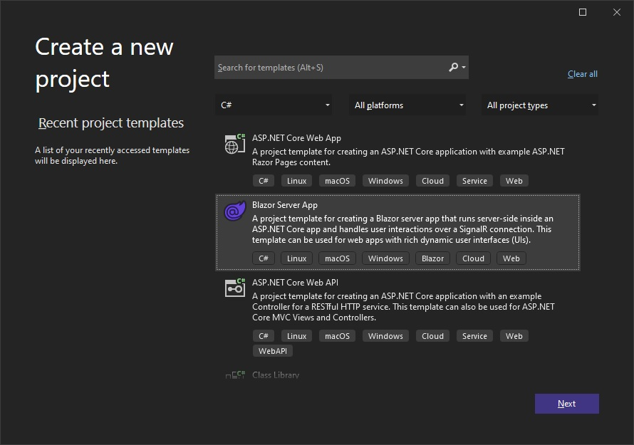
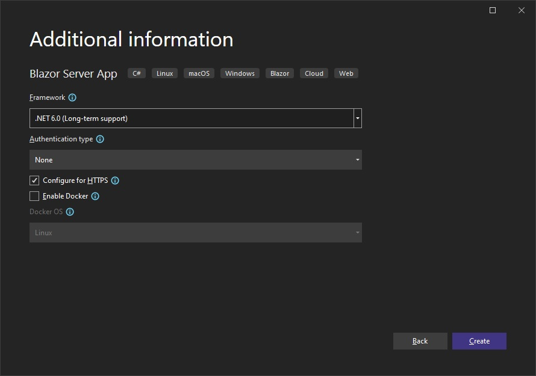

<!-- React -->
# {ProductName} を使用した作業の開始

このトピックでは、Ignite UI for React を使用して React アプリケーションを作成するための手順を説明します。

## 新しい React プロジェクトの作成

前提条件のインストール後、新しい React アプリケーションを作成できます。

1 - **VS Code** を開き、**[ターミナル]** メニューを選択してから、**[新しいターミナル]** オプションを選択します。

2 - ターミナル ウィンドウに以下のコマンドのいずれかを入力します。

<pre style="background:#141414;color:white;display:inline-block;padding:16x;margin-top:10px;font-family:'Consolas';border-radius:5px;width:100%">
npx create-react-app my-app-name --typescript
</pre>
<pre style="background:#141414;color:white;display:inline-block;padding:16x;margin-top:10px;font-family:'Consolas';border-radius:5px;width:100%">
yarn create react-app my-app-name --typescript
</pre>

以上のコマンドについての詳細は<a href="https://facebook.github.io/create-react-app/docs/adding-typescript" target="_blank">こちら</a>を参照してください。

<!-- end: React -->

<!-- WebComponents -->
# {ProductName} Packages Overview

{ProductName} is a complete set of UI widgets, components, UI kits for design tools and supporting services for Web Components. Designed to enable developers to build the most modern, high-performance HTML5 & JavaScript apps for modern desktop browsers, mobile experiences and progressive web apps (PWA’s) targeting the browsers web components APIs.

## Charts & Graphs
{ProductName} Charts & Graphs is a library that lets you visualize any type of data through its 65+ types of series and combinations into stunning and interactive charts and dashboards. Built for speed and beauty, designed to work on every modern browser and with complete touch and interactivity, you can quickly build responsive visuals on any device.

## Gauges
{ProductName} Gauges provides a radial and a linear gauge components used to illustrate data in an easy and intuitive way.
The radial gauge has a variety of customization options in order to create a predefined shape and scale.
The linear gauge provides a simple view of a value compared against a scale and one or more ranges. It supports one scale, one set of tick marks and one set of labels.

{ProductName} Gauges also includes a `Bullet Graph` component that lets you create data visualizations, replacing meters and gauges that are used on dashboards with simpl bar charts.

## Maps
{ProductName} Maps brings the ability to visualize geographic data in your application. It can render data sets consisting of many geographic locations in shapes of markers, lines, polygons, or even interactive bitmaps. It allows you to overlay multiple map layers with geographic data, mark specific geographic locations and display information using custom markers and colors.

## Grids & Inputs
{ProductName} Grid is a grid component that allows you to bind and display data with little configuration. It also provides features such as filtering, sorting, grouping, pinning and more.

## IgniteUI Web Components
{ProductName} is a complete library of UI components, giving you the ability to build modern web applications using encapsulation and the concept of reusable components in a dependency-free approach. See the [Storybook Here](https://igniteui.github.io/igniteui-webcomponents)!

All components are based on the [Indigo.Design Design System](https://www.infragistics.com/products/appbuilder/ui-toolkit), are fully supported by [App Builder](https://appbuilder.indigo.design/) and are backed by ready-to-use UI kits for Sketch, Adobe XD and Figma.

# Getting Started With {ProductName}

This topic provides step-by-step instructions for creating Web Components application with Ignite UI for Web Components.

## Ignite UI Web Components Example
The sample below provides an overview on the web components and shows how utilizing them can help you create a well structured app. It represents a sample travel blog that includes an app header with the user's avatar, side navigation and main content area.

<code-view style="height: 800px"
           data-demos-base-url="{environment:dvDemosBaseUrl}"
           iframe-src="{environment:dvDemosBaseUrl}/layouts/getting-started-overview"
           alt="{Platform} Overview Example"
           github-src="layouts/getting-started/overview">
</code-view>

# Configuration

## Install IgniteUI CLI

To create an application from scratch and configure it to use the Ignite UI Web Components you can use the Ignite UI CLI. The first step is to install the respective package globally as follows:

<pre style="background:#141414;color:white;display:inline-block;padding:16x;margin-top:10px;font-family:'Consolas';border-radius:5px;width:100%">
npm install -g igniteui-cli
</pre>

If you want to get a guided experience through the available options, you can initialize the step by step mode that will help you create and setup your new application. To start the guide, simply run the `ig` command:

<pre style="background:#141414;color:white;display:inline-block;padding:16x;margin-top:10px;font-family:'Consolas';border-radius:5px;width:100%">
ig
</pre>

Then choose Web Components as framework, select `Base` project template, add a specific component/view or select `Complete & Run`.
Additionally, you can read more about the Ignite UI CLI [here](general-cli-overview.md).

## Install Polyfills

Run this command to install the web component polyfills:

```bash
npm install @webcomponents/custom-elements
```

Then import the web component polyfills into index.js:

```ts
import '@webcomponents/custom-elements/custom-elements.min';
import '@webcomponents/custom-elements/src/native-shim.js';
```

## Install Ignite UI for Web Components
In order to use the Ignite UI Web Components in your application you should install the `igniteui-webcomponents` package:

```
npm install igniteui-webcomponents
```

Next you will need to import the components that you want to use in your `index.ts` file. You could import one or more components using the `defineComponents` function like this:

```ts
import { defineComponents, IgcAvatarComponent, IgcBadgeComponent } from 'igniteui-webcomponents';

defineComponents(IgcAvatarComponent, IgcBadgeComponent);
```

You could also import all of the components using the `defineAllComponents` function:

```ts
import { defineAllComponents } from 'igniteui-webcomponents';

defineAllComponents();
```

> [!Note] 
> Importing all of the components will increase the bundle size of your application. That's why we recommend you to import only the components that you are actually using.

After the components are imported you can use them in your html:

```html
<igc-avatar initials="AZ"></igc-avatar>
<igc-badge></igc-badge>
```

# Install Charts and Map Web Component packages
## 手順 1 - Web コンポーネント プロジェクトの作成

1 - コマンドラインを開き、**wc-html** という名前のディレクトリを作成します。
<pre style="background:#141414;color:white;display:inline-block;padding:16x;margin-top:10px;font-family:'Consolas';border-radius:5px;width:100%">
mkdir wc-html
</pre>

2 - コマンドライン パスを新しく作成したディレクトリに変更します。
<pre style="background:#141414;color:white;display:inline-block;padding:16x;margin-top:10px;font-family:'Consolas';border-radius:5px;width:100%">
cd wc-html
</pre>

3 - ディレクトリで **npm** を初期化します。
<pre style="background:#141414;color:white;display:inline-block;padding:16x;margin-top:10px;font-family:'Consolas';border-radius:5px;width:100%">
npm init -y
</pre>

4 - **webpack** バンドラー および **webpack cli** を developer dependency としてインストールします。
<pre style="background:#141414;color:white;display:inline-block;padding:16x;margin-top:10px;font-family:'Consolas';border-radius:5px;width:100%">
> npm install webpack webpack-cli --save-dev
</pre>

> [!Note]
> Webpack はモジュール バンドラーです。主な目的は、ブラウザーで使用するために JavaScript ファイルをバンドルすることですが、あらゆるリソースやアセットを変換、バンドル、またはパッケージ化することもできます。

5 - **VS Code** でプロジェクトを開きます。
<pre style="background:#141414;color:white;display:inline-block;padding:16x;margin-top:10px;font-family:'Consolas';border-radius:5px;width:100%">
code .
</pre>

6 - 以下のコードを使用して **index.html** という名前の新しいファイルを作成します。

```
<html>
    <head>
        <title>Getting Started with Ignite UI for Web Components</title>
    </head>
    <body>

    </body>
</html>
```

7 - **src** という名前の新しいフォルダーを作成し、そのフォルダー内に **index.js** という名前の新しいファイルを作成します。プロジェクト構造は以下のようになります。


8 - **package.json** ファイルを、**webpack** を使用してビルド スクリプトを含めるよう変更します。

```
  "scripts": {
    "build": "webpack ./src/index.js -o ./dist/ --output-filename index.bundle.js"
  },
```

> [!Note]
> このスクリプトは webpack を使用して **index.js** ファイルを **index.bundle.js** と呼ばれる別のファイルにバンドルし、**dist** という名前のフォルダーに配置します。
>
> ビルド中に **javaScript のメモリ不足** の問題が発生した場合、代わりに以下のビルド コマンドを使用してヒープ サイズを増やすことができます。

```
"scripts": {
    "build": "node --max_old_space_size=8192 node_modules/webpack/bin/webpack src/index.js -o dist/index.bundle.js"
},
```

## 手順 2 - ポリフィルのインストール

1 - **VS Code** でターミナルを開きます (**[表示]** -> **[ターミナル]** メニューまたは <kbd>CTRL</kbd> + <kbd>`</kbd> キーを押します)

2 - Web コンポーネントのポリフィルで以下のコマンドを入力します。

<pre style="background:#141414;color:white;display:inline-block;padding:16x;margin-top:10px;font-family:'Consolas';border-radius:5px;width:100%">
npm install @webcomponents/custom-elements
</pre>

3 - Web コンポーネントのポリフィルを **index.js** にインポートします。
```ts
import '@webcomponents/custom-elements/custom-elements.min';
import '@webcomponents/custom-elements/src/native-shim.js';
```

## 手順 3 - Ignite UI for Web Components と lit-html をインストール

1 - **npm** を使用して Ignite UI for Web コンポーネントをインストールします。この例では、Map Web コンポーネントをインストールします。

<pre style="background:#141414;color:white;display:inline-block;padding:16x;margin-top:10px;font-family:'Consolas';border-radius:5px;width:100%">
npm install --save {PackageCore}
npm install --save {PackageCharts}
npm install --save {PackageMaps}
npm install lit-html
</pre>

2 - Geographic Map モジュールと**ModuleManager** を **index.js** ファイルにインポートします。

```ts
import { IgcGeographicMapModule } from 'igniteui-webcomponents-maps';
import { IgcDataChartInteractivityModule } from 'igniteui-webcomponents-charts';
// module manager for registering the modules
import { ModuleManager } from 'igniteui-webcomponents-core';
```

3 - **ModuleManager** で Geographic Map モジュールを登録します。

```ts
ModuleManager.register(
    IgcGeographicMapModule,
    IgcDataChartInteractivityModule
);
```

4 - **index.html** ファイルの本文に Geographic Map Web コンポーネントを追加します。

```html
<body>
    <igc-geographic-map id="map" height="500px" width="100%">
    </igc-geographic-map>
</body>
```

## 手順 4 - Web コンポーネント プロジェクトのビルドと実行

1 - **VS Code** でターミナルを開き、**build** スクリプトを実行します。

<pre style="background:#141414;color:white;display:inline-block;padding:16x;margin-top:10px;font-family:'Consolas';border-radius:5px;width:100%">
npm run build
</pre>

> [!Note]
> このコマンドは、前に作成したビルド スクリプトを実行します。ビルド スクリプトは、**dist** という名前のフォルダーに **index.bundle.js** という名前のファイルを生成します。

2 - **index.html** ファイルの **body** 要素の最後に **index.bundle.js** スクリプトを追加します。

```html
<body>
    <igc-geographic-map id="map" height="500px" width="100%">
    </igc-geographic-map>

    <script src="dist/index.bundle.js"></script>
</body>
```

3 - プロジェクトを実行するには、ローカル開発サーバーを起動します。この例では、Live Server を使用しています。**index.html** のエディター内で右クリックし、**[Live Server で開く]** を選択します。

<!--  -->

> [!Note]
> Live Server は Visual Studio Code の拡張機能で、静的および動的ページの自動更新機能を備えたローカル開発サーバーを起動できます。この拡張機能は、Visual Studio Code の [拡張機能] タブから、または [Visual Studio Marketplace](https://marketplace.visualstudio.com/items?itemName=ritwickdey.LiveServer) からダウンロードしてインストールできます。

4 - ローカル サーバー上の Web ブラウザーを使用して **index.html** に移動すると、Ignite UI for Web Components のスプレッドシートがブラウザーに表示されます。


<!-- end: WebComponents -->

<!-- Angular, React -->
# {ProductName} を使用した作業の開始

## 既存アプリの更新

既存の {Platform} CLI プロジェクト (以前のもの) で {ProductName} を使用する場合は、以下のコマンドを実行します。

<pre style="background:#141414;color:white;display:inline-block;padding:16x;margin-top:10px;font-family:'Consolas';border-radius:5px;width:100%">
npm install --save {PackageCharts} {PackageCore}
npm install --save {PackageExcel} {PackageCore}
npm install --save {PackageGauges} {PackageCore}
npm install --save {PackageGrids} {PackageCore}
npm install --save {PackageMaps} {PackageCore}
npm install --save {PackageSpreadsheet} {PackageCore}
</pre>

また

<pre style="background:#141414;color:white;display:inline-block;padding:16x;margin-top:10px;font-family:'Consolas';border-radius:5px;width:100%">
yarn add {PackageCharts} {PackageCore}
yarn add {PackageExcel} {PackageCore}
yarn add {PackageGauges} {PackageCore}
yarn add {PackageGrids} {PackageCore}
yarn add {PackageMaps} {PackageCore}
yarn add {PackageSpreadsheet} {PackageCore}
</pre>

これにより、{ProductName} のパッケージが、それらのすべての依存関係、フォントのインポート、および既存のプロジェクトへのスタイル参照と共に自動的にインストールされます。

## モジュールのインポート

はじめに、使いたいコンポーネントの必要なモジュールをインポートします。[**GeographicMap**](geo-map.md) に対してこれを行います。


```razor
builder.Services.AddIgniteUIBlazor(
    typeof(IgbGeographicMapModule),
    typeof(IgbDataChartInteractivityModule)
);
```

```ts
import { IgrGeographicMapModule } from 'igniteui-react-maps';
import { IgrGeographicMap } from 'igniteui-react-maps';
import { IgrDataChartInteractivityModule } from 'igniteui-react-charts';

IgrGeographicMapModule.register();
IgrDataChartInteractivityModule.register();
```

```ts
import { IgcGeographicMapModule } from 'igniteui-webcomponents-maps';
import { IgcGeographicMapComponent } from 'igniteui-webcomponents-maps';
import { IgcDataChartInteractivityModule } from 'igniteui-webcomponents-charts';
import { ModuleManager } from 'igniteui-webcomponents-core';

ModuleManager.register(
    IgcGeographicMapModule,
    IgcDataChartInteractivityModule
);

```

## コンポーネントの使用

マークアップに {ProductName} マップ コンポーネントを使用する準備が整いました。以下のように定義します。

```tsx
// App.txs
render() {
    return (
        <div style={{height: "100%", width: "100%" }}>
            <IgrGeographicMap
            width="800px"
            height="500px"
            zoomable="true" />
        </div>
    );
}
```

```html
<div style="height: 100%, width: 100%">
    <igc-geographic-map
      width="800px"
      height="500px"
      zoomable="true">
    </igc-geographic-map>
</div>
```

## アプリケーションの実行

以下のコマンドを使用して新しいアプリケーションを実行できます。

<pre style="background:#141414;color:white;display:inline-block;padding:16x;margin-top:10px;font-family:'Consolas';border-radius:5px;width:100%">
npm run-script start
</pre>

コマンドを実行した後、プロジェクトがローカルでビルドされて提供されます。これでデフォルトのブラウザーで自動的に開き、プロジェクトで {ProductName} コンポーネントを使用できるようになります。

以下の画像は、上記を実行した結果です。


<!-- end: Angular, React -->

<!-- Blazor -->
# {ProductName} を使用した作業の開始

このトピックでは、Visual Studio および Ignite UI for Blazor を使用して Blazor Server アプリケーションを作成するための手順を説明します。

## 新しい Blazor Server プロジェクトを作成する
以下の手順では、新しい Blazor Server プロジェクトを作成する方法を説明します。Ignite UI for Blazor を既存のアプリケーションに追加する場合は、[**Ignite UI for Blazor パッケージをインストール**](#ignite-ui-for-blazor-のインストール) セクションに移動します。

Visual Studio 2022 を起動し、開始ページで [新しいプロジェクトの作成] をクリックし、**Blazor Server App** テンプレートを選択して、**[次へ]** をクリックします。



プロジェクト名と場所を入力し、**[次へ]** をクリックします。


追加のプロジェクト オプションを指定し、**[作成]** をクリックします。



## Ignite UI for Blazor のインストール

Ignite UI for Blazor は、NuGet パッケージで提供されます。Blazor アプリケーションで Ignite UI for Blazor コンポーネントを使用するには、最初に適切な NuGet パッケージをインストールする必要があります。

Visual Studio で、**[ツール]** → **[NuGet パッケージ マネージャー]** → **[ソリューションの NuGet パッケージの管理]** を選択して、NuGet パッケージ マネージャーを開きます。**IgniteUI.Blazor** NuGet パッケージを検索してインストールします。

NuGet を使用した Ignite UI for Blazor のインストールの詳細については、[Ignite UI for Blazor のインストール](general-installing-blazor.md) トピックを参照してください。

## Ignite UI for Blazor の登録

### .NET 6 アプリケーション

1 - **Program.cs** ファイルを開き、**builder.Services.AddIgniteUIBlazor()** を呼び出して Ignite UI for Blazor サービスを登録します。

```
var builder = WebApplication.CreateBuilder(args);

// Add services to the container.
builder.Services.AddRazorPages();
builder.Services.AddServerSideBlazor();

builder.Services.AddIgniteUIBlazor();

var app = builder.Build();
```

2 - **IgniteUI.Blazor.Controls** 名前空間を **_Imports.razor** ファイルに追加します。

```razor
@using IgniteUI.Blazor.Controls
```

3 - **Pages/_Layout.cshtml** ファイルの **<head\>** 要素にスタイル シートを追加します。

```razor
<head>
    <link href="_content/IgniteUI.Blazor/themes/light/bootstrap.css" rel="stylesheet" />
</head>
```

### .NET 5 アプリケーション

1 - **Startup.cs** ファイルを開き、**services.AddIgniteUIBlazor()** を呼び出して Ignite UI for Blazor サービスを登録します。

```razor
public void ConfigureServices(IServiceCollection services)
{
    // ...
    services.AddIgniteUIBlazor();
}
```

2 - **IgniteUI.Blazor.Controls** 名前空間を **_Imports.razor** ファイルに追加します。

```razor
@using IgniteUI.Blazor.Controls
```

3 - **Pages/_Host.cshtml** ファイルの **<head\>** 要素にスタイル シートを追加します。

```razor
<head>
    <link href="_content/IgniteUI.Blazor/themes/light/bootstrap.css" rel="stylesheet" />
</head>
```

4 - スクリプト参照を **Pages/_Host.cshtml** ファイルに追加します。

```razor
<script src="_content/IgniteUI.Blazor/app.bundle.js"></script>
<script src="_framework/blazor.server.js"></script>
```

## Ignite UI for Blazor コンポーネントの追加

Razor ページに Ignite UI for Blazor コンポーネントの追加:

```razor
<IgbCard style="width:350px">
    <IgbCardMedia>
        
    </IgbCardMedia>
    <IgbCardHeader>
        <h4>Jane Doe</h4>
        <h6>Professional Photographer</h6>
    </IgbCardHeader>
    <IgbCardContent>Hi! I'm Jane, photographer and filmmaker.
        Photography is a way of feeling, of touching,
        of loving. What you have caught on film is captured forever...
        it remembers little things, long after you have
        forgotten everything.</IgbCardContent>
    <IgbCardActions>
        <IgbButton>More Info</IgbButton>
    </IgbCardActions>
</IgbCard>
```

Blazor アプリケーションをビルドして実行します。


<!-- end: Blazor -->