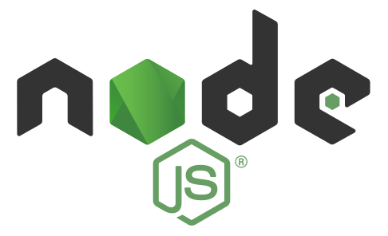

# $ProductName$ を使用した作業の開始

$ProductName$ は、最新のデスクトップ ブラウザー対応の高パフォーマンス HTML 5 および TypeScript アプリケーションを構築するために設計された $Platform$ コンポーネントのコンプリート セットです。

<!-- Angular, React, WebComponents -->

## コンピューターのセットアップ

$ProductName$ を実行する前に、$ProductName$ を含むすべての $Platform$ アプリケーションを実行するためにシステムでセットアップする必要のあるステップが 2 つあります。最初にシステムに NodeJS と Visual Studio Code をインストールします。$Platform$ を使用した最新の Web 開発には NodeJS が必要で、これはブラウザーで実行されている ASP.NET アプリケーションのようなもので、サーバーに ASP.NET ランタイムを配備する必要があります。また $Platform$ アプリケーションを構築するための開発環境は、Visual Studio Code が最も適しているため、作業を開始する前に Node.js と Visual Studio Code をインストールします。

<div style="display:block;width:100%;margin:50px;">
    <div style="display:inline-block;width:45%;text-align:center;">
      
      <a target="_blank" href="https://nodejs.org/en/download/"
         style="color:white;background-color:#09f;text-decoration:none;font-weight:700;font-size:16px;padding: 5px 15px 5px 15px;">
        DOWNLOAD NODE JS
      </a>
    </div>
    <div style="display:inline-block;width:45%;text-align:center;">
      
      <a target="_blank" href="https://code.visualstudio.com/download"
         style="color:white;background-color:#09f;text-decoration:none;font-weight:700;font-size:16px;padding: 5px 15px 5px 15px;">
        DOWNLOAD VS CODE
      </a>
    </div>
</div>

> [!NOTE]
> For React:
> 以上ですべて準備が整いました。新しい React アプリケーションを作成しましょう。  <br>
> **VS Code** で、**ターミナル** メニュー、**新しいターミナル** オプションを選択し、ターミナル ウィンドウで以下のコマンドを入力します。 <br>
> **npx create-react-app my-app-name --typescript**
> <br> または <br>
> **yarn create react-app my-app-name --typescript**
> <br> 以上のコマンドについての詳細は<a href="https://facebook.github.io/create-react-app/docs/adding-typescript" target="_blank">こちら</a>を参照してください。

<!-- end: Angular, React, WebComponents -->

<!-- WebComponents -->
## 手順 1 - Web コンポーネント プロジェクトの作成

1 - コマンドラインを開き、**wc-html** という名前のディレクトリを作成します。
<pre style="background:#141414;color:white;display:inline-block;padding:16x;margin-top:10px;font-family:'Consolas';border-radius:5px;width:100%">
> mkdir wc-html
</pre>

2 - コマンドライン パスを新しく作成したディレクトリに変更します。
<pre style="background:#141414;color:white;display:inline-block;padding:16x;margin-top:10px;font-family:'Consolas';border-radius:5px;width:100%">
> cd wc-html
</pre>

3 - ディレクトリで **npm** を初期化します。
<pre style="background:#141414;color:white;display:inline-block;padding:16x;margin-top:10px;font-family:'Consolas';border-radius:5px;width:100%">
> npm init -y
</pre>

4 - **webpack** バンドラー および **webpack cli** を developer dependency としてインストールします。
<pre style="background:#141414;color:white;display:inline-block;padding:16x;margin-top:10px;font-family:'Consolas';border-radius:5px;width:100%">
> npm install webpack webpack-cli --save-dev
</pre>

> [!Note]
> Webpack はモジュール バンドラーです。主な目的は、ブラウザーで使用するために JavaScript ファイルをバンドルすることですが、あらゆるリソースやアセットを変換、バンドル、またはパッケージ化することもできます。

5 - **VS Code** でプロジェクトを開きます。
<pre style="background:#141414;color:white;display:inline-block;padding:16x;margin-top:10px;font-family:'Consolas';border-radius:5px;width:100%">
> code .
</pre>
6 - **index.html** という名前の新しいファイルを作成します。

```
<html>
    <head>
        <title>Getting Started with Ignite UI for Web Components</title>
    </head>
    <body>

    </body>
</html>
```

7 - **src** という名前の新しいフォルダーを作成し、そのフォルダー内に **index.js** という名前の新しいファイルを作成します。プロジェクト構造は以下のようになります。


8 - **package.json** ファイルを、**webpack** を使用してビルド スクリプトを含めるよう変更します。

```
  "scripts": {
    "build": "webpack src/index.js -o dist/index.bundle.js"
  },
```

> [!Note]
> このスクリプトは webpack を使用して **index.js** ファイルを **index.bundle.js** と呼ばれる別のファイルにバンドルし、**dist** という名前のフォルダーに配置します。
>
> ビルド中に **javaScript のメモリ不足** の問題が発生した場合、代わりに以下のビルド コマンドを使用してヒープ サイズを増やすことができます。

```
"scripts": {
    "build2": "node --max_old_space_size=8192 node_modules/webpack/bin/webpack src/index.js -o dist/index.bundle.js"
},
```

## 手順 2 - ポリフィルのインストール

1 - **VS Code** でターミナルを開き (表示 -> ターミナル、または CTRL + `)、npm を使用して web コンポーネント polyfills パッケージをインストールします。
<pre style="background:#141414;color:white;display:inline-block;padding:16x;margin-top:10px;font-family:'Consolas';border-radius:5px;width:100%">
> npm install @webcomponents/custom-elements
</pre>

2 - Web コンポーネント ポリフィルを **index.js** にインポートします。
```
import '@webcomponents/custom-elements/custom-elements.min';
import '@webcomponents/custom-elements/src/native-shim.js';
```

## 手順 3 - Ignite UI for Web Components のインストール

1 - **npm** を使用して Ignite UI for Web コンポーネントをインストールします。この例では、Spreadsheet Web コンポーネントをインストールします。
<pre style="background:#141414;color:white;display:inline-block;padding:16x;margin-top:10px;font-family:'Consolas';border-radius:5px;width:100%">
> npm install igniteui-webcomponents-core
> npm install igniteui-webcomponents-excel
> npm install igniteui-webcomponents-spreadsheet
</pre>

2 - **ModuleManager** と Web コンポーネント モジュールを **index.js** にインポートします。

```
// module manager for registering the modules
import { ModuleManager } from 'igniteui-webcomponents-core';

// spreadsheet modules
import { IgcExcelModule } from 'igniteui-webcomponents-excel';
import { IgcSpreadsheetModule } from 'igniteui-webcomponents-spreadsheet';
```

3 - **ModuleManager** で Web コンポーネント モジュールを登録します。

```
// register the modules
ModuleManager.register(
    IgcExcelModule,
    IgcSpreadsheetModule
);
```

4 - `igc-spreadsheet` Web コンポーネント を **index.html** に追加します。

```
<body>
    <igc-spreadsheet id="spreadsheet" height="500px" width="100%">
    </igc-spreadsheet>
</body>
```

## 手順 4 - Web コンポーネント プロジェクトのビルドと実行

1 - **VS Code** でターミナルを開き、**ビルド** スクリプトを実行します。

<pre style="background:#141414;color:white;display:inline-block;padding:16x;margin-top:10px;font-family:'Consolas';border-radius:5px;width:100%">
> npm run build
</pre>

> [!Note]
> このコマンドは、前に作成したビルド スクリプトを実行します。ビルド スクリプトは、**dist** という名前のフォルダーに **index.bundle.js** という名前のファイルを生成します。

2 - **index.bundle.js** スクリプトを **index.html** の `igc-spreadsheet` の後に追加します。
```
<body>
    <igc-spreadsheet id="spreadsheet" height="500px" width="100%">
    </igc-spreadsheet>

    <script src="dist/index.bundle.js"></script>
</body>
```

3 - プロジェクトを実行するには、ローカル開発サーバーを起動します。この例では、Live Server を使用しています。**index.html** のエディター内で右クリックし、**[Live Server で開く]** を選択します。


> [!Note]
> Live Server は Visual Studio Code の拡張機能で、静的および動的ページの自動更新機能を備えたローカル開発サーバーを起動できます。この拡張機能は、Visual Studio Code の [拡張機能] タブから、または [Visual Studio Marketplace](https://marketplace.visualstudio.com/items?itemName=ritwickdey.LiveServer) からダウンロードしてインストールできます。

4 - ローカル サーバー上の Web ブラウザーを使用して **index.html** に移動すると、Ignite UI for Web Components のスプレッドシートがブラウザーに表示されます。


<!-- end: WebComponents -->

<!-- Angular, React -->

## 既存アプリの更新

既存の $Platform$ CLI プロジェクト (以前のもの) で $ProductName$ を使用する場合は、以下のコマンドを実行します。

<pre style="background:#141414;color:white;display:inline-block;padding:16x;margin-top:10px;font-family:'Consolas';border-radius:5px;width:100%">
npm install --save {PackageCharts} {PackageCore}
npm install --save {PackageExcel} {PackageCore}
npm install --save {PackageGauges} {PackageCore}
npm install --save {PackageGrids} {PackageCore}
npm install --save {PackageMaps} {PackageCore}
npm install --save {PackageSpreadsheet} {PackageCore}
</pre>

また

<pre style="background:#141414;color:white;display:inline-block;padding:16x;margin-top:10px;font-family:'Consolas';border-radius:5px;width:100%">
yarn add {PackageCharts} {PackageCore}
yarn add {PackageExcel} {PackageCore}
yarn add {PackageGauges} {PackageCore}
yarn add {PackageGrids} {PackageCore}
yarn add {PackageMaps} {PackageCore}
yarn add {PackageSpreadsheet} {PackageCore}
</pre>

これにより、$ProductName$ のパッケージが、それらのすべての依存関係、フォントのインポート、および既存のプロジェクトへのスタイル参照と共に自動的にインストールされます。

## モジュールのインポート

はじめに、使いたいコンポーネントの必要なモジュールをインポートします。[**GeographicMap**](geo-map.md) に対してこれを行います。

```razor
GeographicMapModule.Register(IgniteUIBlazor);
DataChartInteractivityModule.Register(IgniteUIBlazor);
```

```ts
import { IgrGeographicMapModule } from 'igniteui-react-maps';
import { IgrGeographicMap } from 'igniteui-react-maps';
import { IgrDataChartInteractivityModule } from 'igniteui-react-charts';

IgrGeographicMapModule.register();
IgrDataChartInteractivityModule.register();
```

```ts
import { IgcGeographicMapModule } from 'igniteui-webcomponents-maps';
import { IgcGeographicMapComponent } from 'igniteui-webcomponents-maps';
import { IgcDataChartInteractivityModule } from 'igniteui-webcomponents-charts';
import { ModuleManager } from 'igniteui-webcomponents-core';

ModuleManager.register(
    IgcGeographicMapModule,
    IgcDataChartInteractivityModule
);

```

## コンポーネントの使用

マークアップに $ProductName$ マップ コンポーネントを使用する準備が整いました。以下のように定義します。

```tsx
// App.txs
render() {
    return (
        <div style={{height: "100%", width: "100%" }}>
            <IgrGeographicMap
            width="800px"
            height="500px"
            zoomable="true" />
        </div>
    );
}
```

```html
<div style="height: 100%, width: 100%">
    <igc-geographic-map
      width="800px"
      height="500px"
      zoomable="true">
    </igc-geographic-map>
</div>
```

## アプリケーションの実行

以下のコマンドを使用して新しいアプリケーションを実行できます。

<pre style="background:#141414;color:white;display:inline-block;padding:16x;margin-top:10px;font-family:'Consolas';border-radius:5px;width:100%">
npm run-script start
</pre>

コマンドを実行した後、プロジェクトがローカルでビルドされて提供されます。これでデフォルトのブラウザーで自動的に開き、プロジェクトで $ProductName$ コンポーネントを使用できるようになります。

以下の画像は、上記を実行した結果です。


<!-- end: Angular, React -->

<!-- Blazor -->

$ProductName$ は、開発者がモダンなデスクトップ ブラウザー用の最新の高性能アプリケーションを構築できるように設計された $Platform$ コンポーネントの完全なセットです。

## 手順 1 - 新しい Blazor プロジェクトの作成
以下の手順では、新しい Blazor プロジェクトを作成する方法を説明します。Ignite UI for Blazor コンポーネントを既存のアプリケーションに追加する場合は、[**手順 2**](#手順-2---ignite-ui-for-blazor-nuget-パッケージのインストール) に進みます。

1 - Visual Studio 2019 を起動し、スタート ページで **[新しいプロジェクトの作成]** をクリックします。**Blazor App** テンプレートを選択し、**[次へ]** をクリックします。


2 - プロジェクト名と説明を入力し、**[作成]** をクリックします。


3 - 使用したい Blazor テンプレート (サーバーまたは Web アセンブリ (WASM)) を選択します。


## 手順 2 - Ignite UI for Blazor NuGet パッケージのインストール

1 - ソリューションまたはプロジェクトを右クリックし、**[ソリューションの NuGet パッケージの管理]** を選択します。


2 - パッケージ マネージャー ダイアログで **[参照]** タブを開き、**Infragistics** パッケージ ソースを選択して **IgniteUI.Blazor** NuGet パッケージをプロジェクトにインストールします。


> [!Note]
> トライアル版をお使いの場合、[NuGet.org](https://www.nuget.org/packages/IgniteUI.Blazor/20.1.15-trial) にある `IgniteUI.Blazor` トライアル版 NuGet パッケージをインストールできます。

> [!Note]
> Infragistics パッケージソースがない場合、追加するには [Infragistics NuGet フィード トピック](./nuget-feed.md)を参照してください。

## 手順 3 - Ignite UI for Blazor の登録

1 - Ignite UI for Blazor スクリプトをデフォルトの Blazor スクリプトの上に追加します。

Blazor Web アセンブリで **wwwroot/index.html** ファイルを変更します。

```razor
<script src="_content/IgniteUI.Blazor/app.bundle.js"></script>
<script src="_framework/blazor.webassembly.js"></script>
```

Blazor サーバーで **Pages/_Host.cshtml** ファイルを変更します。

```razor
<script src="_content/IgniteUI.Blazor/app.bundle.js"></script>
<script src="_framework/blazor.server.js"></script>
```

2 - `AddIgniteUIBlazor` メソッドを使用して Ignite UI Blazor コンポーネントのサービス モジュールを登録します。

Blazor Web アセンブリのプロジェクトで **Program.cs** ファイルを変更します。

```razor
using IgniteUI.Blazor.Controls;
// ...

public static async Task Main(string[] args)
{
    // ...
    builder.Services.AddIgniteUIBlazor(typeof(GeographicMapModule));
}
```

Blazor サーバーのプロジェクトで **Startup.cs** ファイルを変更します。

```razor
using IgniteUI.Blazor.Controls;
// ...

public void ConfigureServices(IServiceCollection services)
{
    // ...
    services.AddIgniteUIBlazor(typeof(GeographicMapModule));
}
```

オプションで、アプリケーション レベルでモジュールを登録できない場合は、ページの初期化時にモジュールを razor りファイルに登録できます。

```
@page ...

@using IgniteUI.Blazor.Controls
@inject IIgniteUIBlazor IgniteUIBlazor;

@code
{

   protected override void OnInitialized()
    {
        base.OnInitialized();
        GeographicMapModule.Register(IgniteUIBlazor);

        ...
    }
}

```

> [!Note]
> この例では、Blazor ラジアル ゲージ コンポーネントを使用するために `GeographicMapModule` を登録しました。ただし、Blazor アプリケーションで適切に動作するためには、他の Blazor コンポーネントおよびその機能用の追加モジュールを登録する必要があります。必要なモジュールの詳細については、各コンポーネントのトピックを参照してください。


3 - `_Imports.razor` に `IgniteUI.Blazor.Controls` 名前空間を追加します。

```razor
@using IgniteUI.Blazor.Controls;
```

4 - Ignite UI for Blazor コンポーネントを razor ページに追加します。

```razor
<GeographicMap Height="100%" Width="100%" />
</GeographicMap>
```

<!-- end: Blazor -->