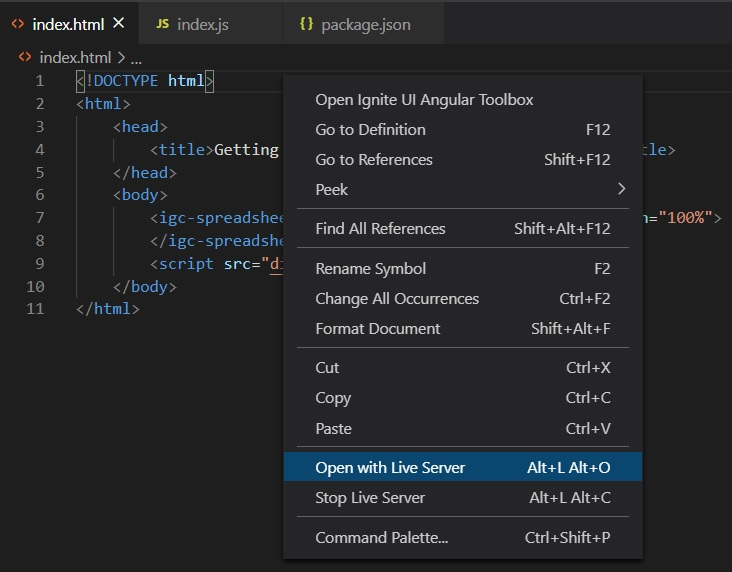
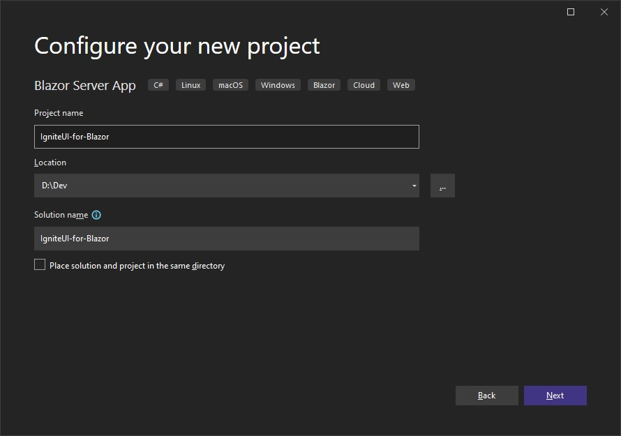

# $ProductName$ を使用した作業の開始

<!-- React -->

This topic provides step-by-step instructions for creating React applications with Ignite UI for React

## 新しい React プロジェクトの作成

前提条件のインストール後、新しい React アプリケーションを作成できます。

1 - **VS Code** を開き、**[ターミナル]** メニューを選択してから、**[新しいターミナル]** オプションを選択します。

2 - ターミナル ウィンドウに以下のコマンドのいずれかを入力します。

<pre style="background:#141414;color:white;display:inline-block;padding:16x;margin-top:10px;font-family:'Consolas';border-radius:5px;width:100%">
npx create-react-app my-app-name --typescript
</pre>
<pre style="background:#141414;color:white;display:inline-block;padding:16x;margin-top:10px;font-family:'Consolas';border-radius:5px;width:100%">
yarn create react-app my-app-name --typescript
</pre>

以上のコマンドについての詳細は<a href="https://facebook.github.io/create-react-app/docs/adding-typescript" target="_blank">こちら</a>を参照してください。

<!-- end: React -->

<!-- WebComponents -->

This topic provides step-by-step instructions for creating Web Components applications with Ignite UI for Web Components

## 手順 1 - Web コンポーネント プロジェクトの作成

1 - コマンドラインを開き、**wc-html** という名前のディレクトリを作成します。
<pre style="background:#141414;color:white;display:inline-block;padding:16x;margin-top:10px;font-family:'Consolas';border-radius:5px;width:100%">
mkdir wc-html
</pre>

2 - コマンドライン パスを新しく作成したディレクトリに変更します。
<pre style="background:#141414;color:white;display:inline-block;padding:16x;margin-top:10px;font-family:'Consolas';border-radius:5px;width:100%">
cd wc-html
</pre>

3 - ディレクトリで **npm** を初期化します。
<pre style="background:#141414;color:white;display:inline-block;padding:16x;margin-top:10px;font-family:'Consolas';border-radius:5px;width:100%">
npm init -y
</pre>

4 - **webpack** バンドラー および **webpack cli** を developer dependency としてインストールします。
<pre style="background:#141414;color:white;display:inline-block;padding:16x;margin-top:10px;font-family:'Consolas';border-radius:5px;width:100%">
> npm install webpack webpack-cli --save-dev
</pre>

> [!Note]
> Webpack はモジュール バンドラーです。主な目的は、ブラウザーで使用するために JavaScript ファイルをバンドルすることですが、あらゆるリソースやアセットを変換、バンドル、またはパッケージ化することもできます。

5 - **VS Code** でプロジェクトを開きます。
<pre style="background:#141414;color:white;display:inline-block;padding:16x;margin-top:10px;font-family:'Consolas';border-radius:5px;width:100%">
code .
</pre>

6 - 以下のコードを使用して **index.html** という名前の新しいファイルを作成します。

```
<html>
    <head>
        <title>Getting Started with Ignite UI for Web Components</title>
    </head>
    <body>

    </body>
</html>
```

7 - **src** という名前の新しいフォルダーを作成し、そのフォルダー内に **index.js** という名前の新しいファイルを作成します。プロジェクト構造は以下のようになります。


8 - **package.json** ファイルを、**webpack** を使用してビルド スクリプトを含めるよう変更します。

```
  "scripts": {
    "build": "webpack src/index.js -o dist/index.bundle.js"
  },
```

> [!Note]
> このスクリプトは webpack を使用して **index.js** ファイルを **index.bundle.js** と呼ばれる別のファイルにバンドルし、**dist** という名前のフォルダーに配置します。
>
> ビルド中に **javaScript のメモリ不足** の問題が発生した場合、代わりに以下のビルド コマンドを使用してヒープ サイズを増やすことができます。

```
"scripts": {
    "build": "node --max_old_space_size=8192 node_modules/webpack/bin/webpack src/index.js -o dist/index.bundle.js"
},
```

## 手順 2 - ポリフィルのインストール

1 - **VS Code** でターミナルを開きます (**[表示]** -> **[ターミナル]** メニューまたは <kbd>CTRL</kbd> + <kbd>`</kbd> キーを押します)

2 - Web コンポーネントのポリフィルで以下のコマンドを入力します。

<pre style="background:#141414;color:white;display:inline-block;padding:16x;margin-top:10px;font-family:'Consolas';border-radius:5px;width:100%">
npm install @webcomponents/custom-elements
</pre>

3 - Web コンポーネントのポリフィルを **index.js** にインポートします。
```ts
import '@webcomponents/custom-elements/custom-elements.min';
import '@webcomponents/custom-elements/src/native-shim.js';
```

## 手順 3 - Ignite UI for Web Components のインストール

1 - **npm** を使用して Ignite UI for Web コンポーネントをインストールします。この例では、Map Web コンポーネントをインストールします。

<pre style="background:#141414;color:white;display:inline-block;padding:16x;margin-top:10px;font-family:'Consolas';border-radius:5px;width:100%">
npm install --save {PackageCore}
npm install --save {PackageCharts}
npm install --save {PackageMaps}
</pre>

2 - Geographic Map モジュールと**ModuleManager** を **index.ts** ファイルにインポートします。

```ts
import { IgcGeographicMapModule } from 'igniteui-webcomponents-maps';
import { IgcDataChartInteractivityModule } from 'igniteui-webcomponents-charts';
// module manager for registering the modules
import { ModuleManager } from 'igniteui-webcomponents-core';
```

3 - **ModuleManager** で Geographic Map モジュールを登録します。

```ts
ModuleManager.register(
    IgcGeographicMapModule,
    IgcDataChartInteractivityModule
);
```

4 - **index.html** ファイルの本文に Geographic Map Web コンポーネントを追加します。

```html
<body>
    <igc-geographic-map id="map" height="500px" width="100%">
    </igc-geographic-map>
</body>
```

## 手順 4 - Web コンポーネント プロジェクトのビルドと実行

1 - **VS Code** でターミナルを開き、**build** スクリプトを実行します。

<pre style="background:#141414;color:white;display:inline-block;padding:16x;margin-top:10px;font-family:'Consolas';border-radius:5px;width:100%">
npm run build
</pre>

> [!Note]
> このコマンドは、前に作成したビルド スクリプトを実行します。ビルド スクリプトは、**dist** という名前のフォルダーに **index.bundle.js** という名前のファイルを生成します。

2 - **index.html** ファイルの **body** 要素の最後に **index.bundle.js** スクリプトを追加します。

```html
<body>
    <igc-geographic-map id="map" height="500px" width="100%">
    </igc-geographic-map>

    <script src="dist/index.bundle.js"></script>
</body>
```

3 - プロジェクトを実行するには、ローカル開発サーバーを起動します。この例では、Live Server を使用しています。**index.html** のエディター内で右クリックし、**[Live Server で開く]** を選択します。

<!--  -->

> [!Note]
> Live Server は Visual Studio Code の拡張機能で、静的および動的ページの自動更新機能を備えたローカル開発サーバーを起動できます。この拡張機能は、Visual Studio Code の [拡張機能] タブから、または [Visual Studio Marketplace](https://marketplace.visualstudio.com/items?itemName=ritwickdey.LiveServer) からダウンロードしてインストールできます。

4 - ローカル サーバー上の Web ブラウザーを使用して **index.html** に移動すると、Ignite UI for Web Components のスプレッドシートがブラウザーに表示されます。


<!-- end: WebComponents -->

<!-- Angular, React -->

## 既存アプリの更新

既存の $Platform$ CLI プロジェクト (以前のもの) で $ProductName$ を使用する場合は、以下のコマンドを実行します。

<pre style="background:#141414;color:white;display:inline-block;padding:16x;margin-top:10px;font-family:'Consolas';border-radius:5px;width:100%">
npm install --save {PackageCharts} {PackageCore}
npm install --save {PackageExcel} {PackageCore}
npm install --save {PackageGauges} {PackageCore}
npm install --save {PackageGrids} {PackageCore}
npm install --save {PackageMaps} {PackageCore}
npm install --save {PackageSpreadsheet} {PackageCore}
</pre>

また

<pre style="background:#141414;color:white;display:inline-block;padding:16x;margin-top:10px;font-family:'Consolas';border-radius:5px;width:100%">
yarn add {PackageCharts} {PackageCore}
yarn add {PackageExcel} {PackageCore}
yarn add {PackageGauges} {PackageCore}
yarn add {PackageGrids} {PackageCore}
yarn add {PackageMaps} {PackageCore}
yarn add {PackageSpreadsheet} {PackageCore}
</pre>

これにより、$ProductName$ のパッケージが、それらのすべての依存関係、フォントのインポート、および既存のプロジェクトへのスタイル参照と共に自動的にインストールされます。

## モジュールのインポート

はじめに、使いたいコンポーネントの必要なモジュールをインポートします。[**GeographicMap**](geo-map.md) に対してこれを行います。

```razor
IgbGeographicMapModule.Register(IgniteUIBlazor);
IgbDataChartInteractivityModule.Register(IgniteUIBlazor);
```

```ts
import { IgrGeographicMapModule } from 'igniteui-react-maps';
import { IgrGeographicMap } from 'igniteui-react-maps';
import { IgrDataChartInteractivityModule } from 'igniteui-react-charts';

IgrGeographicMapModule.register();
IgrDataChartInteractivityModule.register();
```

```ts
import { IgcGeographicMapModule } from 'igniteui-webcomponents-maps';
import { IgcGeographicMapComponent } from 'igniteui-webcomponents-maps';
import { IgcDataChartInteractivityModule } from 'igniteui-webcomponents-charts';
import { ModuleManager } from 'igniteui-webcomponents-core';

ModuleManager.register(
    IgcGeographicMapModule,
    IgcDataChartInteractivityModule
);

```

## コンポーネントの使用

マークアップに $ProductName$ マップ コンポーネントを使用する準備が整いました。以下のように定義します。

```tsx
// App.txs
render() {
    return (
        <div style={{height: "100%", width: "100%" }}>
            <IgrGeographicMap
            width="800px"
            height="500px"
            zoomable="true" />
        </div>
    );
}
```

```html
<div style="height: 100%, width: 100%">
    <igc-geographic-map
      width="800px"
      height="500px"
      zoomable="true">
    </igc-geographic-map>
</div>
```

## アプリケーションの実行

以下のコマンドを使用して新しいアプリケーションを実行できます。

<pre style="background:#141414;color:white;display:inline-block;padding:16x;margin-top:10px;font-family:'Consolas';border-radius:5px;width:100%">
npm run-script start
</pre>

コマンドを実行した後、プロジェクトがローカルでビルドされて提供されます。これでデフォルトのブラウザーで自動的に開き、プロジェクトで $ProductName$ コンポーネントを使用できるようになります。

以下の画像は、上記を実行した結果です。


<!-- end: Angular, React -->

<!-- Blazor -->

This topic provides step-by-step instructions for creating Blazor Server applications with Ignite UI for Blazor using Visual Studio.

## Create a New Blazor Server Project
The steps below describe how to create a new Blazor Server project. If you want to add Ignite UI for Blazor to an existing application, go to the [**Install Ignite UI for Blazor Package**](#install-ignite-ui-for-blazor) section.

Start Visual Studio 2022 and click **Create a new project** on the start page, select the **Blazor Server App** template, and click **Next**.


Provide a project name and location, and click **Next**



Specify additional project options, and click **Create**


## Install Ignite UI for Blazor

Ignite UI for Blazor is delivered via NuGet packages. To use the Ignite UI for Blazor components in your Blazor applications, you must first install the appropriate NuGet packages.

In Visual Studio, open the NuGet package manager by selecting **Tools** → **NuGet Package Manager** → **Manage NuGet Packages for Solution**. Search for and install the **IgniteUI.Blazor** NuGet package.

For more information on installing Ignite UI for Blazor using NuGet, read the [Installing Ignite UI for Blazor](general-installing-blazor.md) topic.

## Register Ignite UI for Blazor

### .NET 6 Applications

1 - Open the **Program.cs** file and register the Ignite UI for Blazor Service by calling **builder.Services.AddIgniteUIBlazor()**:

```
var builder = WebApplication.CreateBuilder(args);

// Add services to the container.
builder.Services.AddRazorPages();
builder.Services.AddServerSideBlazor();

builder.Services.AddIgniteUIBlazor();

var app = builder.Build();
```

2 - Add the **IgniteUI.Blazor.Controls** namespace in the **_Imports.razor** file:

```razor
@using IgniteUI.Blazor.Controls
```

3 - Add the Style Sheet in the **<head\>** element of the **Pages/_Layout.cshtml** file:

```razor
<head>
    ...
    <link href="_content/IgniteUI.Blazor/themes/light/bootstrap.css" rel="stylesheet" />
</head>
```

### .NET 5 Applications

1 - Open the **Startup.cs** file and register the Ignite UI for Blazor Service by calling **services.AddIgniteUIBlazor()**:

```razor
public void ConfigureServices(IServiceCollection services)
{
    // ...
    services.AddIgniteUIBlazor();
}
```

2 - Add the **IgniteUI.Blazor.Controls** namespace in the **_Imports.razor** file:

```razor
@using IgniteUI.Blazor.Controls
```

3 - Add the Style Sheet in the **<head\>** element of the **Pages/_Host.cshtml** file:

```razor
<head>
    ...
    <link href="_content/IgniteUI.Blazor/themes/light/bootstrap.css" rel="stylesheet" />
</head>
```

4 - Add Script Reference to the **Pages/_Host.cshtml** file:

```razor
<script src="_content/IgniteUI.Blazor/app.bundle.js"></script>
<script src="_framework/blazor.server.js"></script>
```

## Add Ignite UI for Blazor Component

Add an Ignite UI for Blazor component to your razor page:

```razor
<IgbCard style="width:350px">
    <IgbCardMedia>
        
    </IgbCardMedia>
    <IgbCardHeader>
        <h4>Jane Doe</h4>
        <h6>Professional Photographer</h6>
    </IgbCardHeader>
    <IgbCardContent>Hi! I'm Jane, photographer and filmmaker.
        Photography is a way of feeling, of touching,
        of loving. What you have caught on film is captured forever...
        it remembers little things, long after you have
        forgotten everything.</IgbCardContent>
    <IgbCardActions>
        <IgbButton>More Info</IgbButton>
    </IgbCardActions>
</IgbCard>
```

Build and run the Blazor app.


<!-- end: Blazor -->