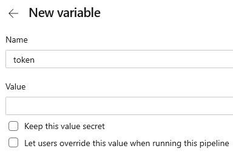

# License FAQ and Installation
# {ProductName} 使用許諾契約
購入して使用する {ProductName} に関するすべての[使用条件](https://jp.infragistics.com/legal/license/igultimate-la)を知っておくことが重要です。

> 2020 年第 2 四半期にライセンス条項とサブスクリプション モデルを更新しました。

If your trial has ended or your subscription [has expired](http://www.infragistics.com/renewal), each developer on your team using Ignite UI will need to [purchase](https://www.infragistics.com/how-to-buy/product-pricing) a subscription. これにより、<https://packages.infragistics.com/npm/js-licensed/> でホストされるプライベート npm フィードを開発に使用できます。ここには、{ProductName} パッケージの最新バージョンがあります。現在サブスクリプションをお持ちの場合は、{ProductName} の製品版をプライベート フィードによりアクセスできます。

For detailed explanation of the Ignite UI license agreement and terms of use, [click here](https://www.infragistics.com/legal/license/igultimate-la).

Infragistics offers free, non-commercial, not-for-resale (NFR) licenses for the following:

  - If you are part of a developer program like the Microsoft MVP, Microsoft Regional Director, Google Developer Expert, etc.  
  - If you are a primary, secondary or university student, or an academic institution, or a professor.  

If you qualify for a free, non-commercial, NFR license or if you have any license questions, please [contact us](https://www.infragistics.com/about-us/contact-us).

> Currently only the **igniteui-dockmanager** package is available in our private npm feed, but in the future we will add the other {ProductName} packages as well.

## {ProductName} npm パッケージ - プライベート npm フィードの使用
Npm は Node.js ランタイム環境で使用する一般的なデフォルト パッケージ マネージャーです。プロジェクトに依存するパッケージをすばやく簡単に処理できます。npm の使用方法の詳細については、[npm ヘルプ](https://docs.npmjs.com/)を参照してください。

Infragistics {ProductName} は npm パッケージで提供され、[いくつかの簡単な手順](./general-getting-started.md)でプロジェクトの依存関係として追加できます。この方法を選択する場合、npm を構成する必要はありません。このパッケージをインストールすると、製品の **{ProductName} トライアル版**の使用が開始されます。

> 現在、[igniteui-dockmanager](https://www.npmjs.com/package/igniteui-dockmanager) の npm パッケージのみにトライアル ウォーターマークがありますが、今後は他の {ProductName} パッケージにも追加する予定です。

### プライベート npm フィードを使用するための環境設定方法

#### 最初にプライベート レジストリを構成し、レジストリを Infragistics スコープと関連付けます。

これにより公開用の npm レジストリおよびプライベート Infragistics レジストリからのパッケージを同時に使用できます。Infragistics アカウントにログインするユーザー名およびパスワードを入力する必要があります。Infragistics プロファイルに登録されるメールも入力してください。

> If your account is not licensed (you are still using a Trial account) the private package feed won't be accessible to you e.g. it will return 404 or 403 error message. **Only licensed accounts can access the packages.infragistics private feed.**

### Now, to log in to our private feed using npm

#### npm バーション 9 以降
Our private feed doesn't currently support login/adduser commands with npm v9, so we recommend the following steps instead to add the required auth fields to the config:

```cmd
npm config set @infragistics:registry https://packages.infragistics.com/npm/js-licensed/

npm config set //packages.infragistics.com/npm/js-licensed/:username=YOUR_USERNAME

npm config set //packages.infragistics.com/npm/js-licensed/:email=YOUR_IG_EMAIL

npm config set //packages.infragistics.com/npm/js-licensed/:_auth=YOUR_IG_AUTH_TOKEN
```

You can generate [Access Token](#access-token-usage) through your Infragistics profile.

This approach is applicable to all prior versions of `npm`.

#### v8 までの npm バージョン
Run the `adduser` command and specify a user account and password:

```cmd
npm adduser --registry=https://packages.infragistics.com/npm/js-licensed/ --scope=@infragistics
```

You will be asked to provide the username and the password that you use for logging into your Infragistics account. You should also provide the email that is registered to your Infragistics profile.

> `npm` is disallowing the use of the `"@"` symbol inside your username as it is considered as being "not safe for the net". Because your username is actually the email that you use for your Infragistics account it always contains the symbol `"@"`. That's why you must escape this limitation by replacing the `"@"` symbol with `"!!"` (two exclamation marks). For example, if your username is `"username@example.com"` when asked about your username you should provide the following input: `"username!!example.com"`.

#### After this is done, you will be logged in and you will be able to install the latest versions of the Ignite UI packages into your project:

```cmd
npm uninstall igniteui-dockmanager
npm install @infragistics/igniteui-dockmanager

npm uninstall igniteui-dockmanager
npm install @infragistics/igniteui-dockmanager
```

{ProductName} パッケージをスコープに設定したため、プライベート フィードおよび npmjs.org からのパッケージを同時にインストールするためにレジストリを変更する必要はありません。

#### プロジェクト ソースに追加の変更が必要になる場合があります。
トライアル版からライセンス パッケージにアップグレードする場合:
- プロジェクトの **tsconfig.json** に **paths** マッピングを追加します。

```json
{
  /* ... */
  "compilerOptions": {
    "baseUrl": "./",
    "outDir": "./dist/out-tsc",
    /* ... */
    "paths": {
      "igniteui-dockmanager": ["./node_modules/@infragistics/igniteui-dockmanager"],
      "igniteui-dockmanager/*": ["./node_modules/@infragistics/igniteui-dockmanager/*"],
    }
  }
}
```

- テーマのインポートを以下のように変更します。

```ts
@import '~igniteui-dockmanager/dist/collection/styles/igc.themes';

// Should be changed to

@import '~@infragistics/igniteui-dockmanager/dist/collection/styles/igc.themes';
```

npm を既に使用していて、{ProductName} ライセンスがある場合、Infragistics プライベート フィードを構成してください。

## アクセス トークンの使用

アクセス トークンを使用してプライベート npm フィードの認証を受けることもできます。アクセストークンは [infragistics.com ユーザー アカウント](https://account.infragistics.com/access-tokens)で取得できます。アクセス トークン認証は、CI プロセスを {ProductName} ライセンス パッケージを使用する公開アクセス可能なリポジトリに統合する場合に推奨される代替方法です。

以下は、ローカル構成でアクセス トークンを使用してプライベート npm レジストリへの認証を設定する方法、Azure Pipelines のビルド手順、および Travis CI のビルド プロセスです。

* https://account.infragistics.com/access-tokens からトークンを生成します。


> 各トークンは Base64 エンコードです。

* 以下を [.npmrc](https://docs.npmjs.com/configuring-npm/npmrc.html) ファイルに追加します。

```cmd
@infragistics:registry=https://packages.infragistics.com/npm/js-licensed/
//packages.infragistics.com/npm/js-licensed/:_auth=YOUR_ACCESS_TOKEN
//packages.infragistics.com/npm/js-licensed/:username=YOUR_USERNAME
```

## Azure Pipelines の構成
以下の手順で azure-pipelines.yml を更新します。

```cmd
steps:

- script: npm config set @infragistics:registry $(npmRegistry)
  displayName: 'Npm add registry'
- script: npm config set $(igScope):_auth=$(token)
  displayName: 'Npm config auth'
```


**npm registry** および **token** 変数を追加します。




## Travis CI の構成
ここではほとんど同じ方法を使用しますが、構成は [before_install](https://docs.travis-ci.com/user/job-lifecycle/#the-job-lifecycle) に設定されます。

```cmd
before_install:
- echo "@infragistics:registry=https://packages.infragistics.com/npm/js-licensed/" >> ~/.npmrc
- echo "//packages.infragistics.com/npm/js-licensed/:_auth=$TOKEN" >> ~/.npmrc
```

環境変数を定義する方法は、含まれる情報のタイプによって異なるため、[2 つ のオプションがあります](https://docs.travis-ci.com/user/environment-variables/)。

* 暗号化して [.travis.yml](https://docs.travis-ci.com/user/environment-variables/#defining-encrypted-variables-in-travisyml) に追加します。
* [リポジトリ設定](https://docs.travis-ci.com/user/environment-variables/#defining-variables-in-repository-settings)に追加します。

### GitHub Actions Configuration

Add the following scripts before the `npm i(ci)` step to your [CI workflow configuration](https://help.github.com/en/actions/language-and-framework-guides/using-nodejs-with-github-actions):

```cmd
- run: echo "@infragistics:registry=https://packages.infragistics.com/npm/js-licensed/" >> ~/.npmrc
- run: echo "//packages.infragistics.com/npm/js-licensed/:_auth=${{ secrets.NPM_TOKEN }}" >> ~/.npmrc
```

Define [*secrets* (encrypted environment variables)](https://help.github.com/en/actions/configuring-and-managing-workflows/creating-and-storing-encrypted-secrets) and use them in the GitHub actions workflow for sensitive information like the access token. 