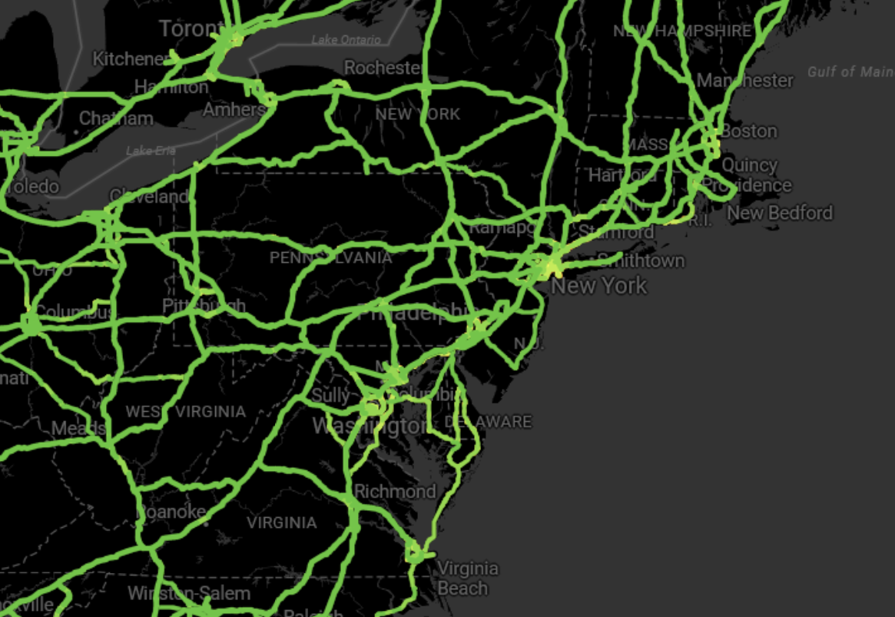

# {Platform} Azure Maps からの画像の表示

{Platform} `AzureMapImagery` は、Microsoft® が提供する地理的画像マッピング サービスです。
世界の地理的画像タイルを複数のスタイルで供します。この地理的画像サービスは、<a href="https://azure.microsoft.com/ja-jp/products/azure-maps" target="_blank">www.azure.microsoft.com</a> ウェブサイトから直接アクセスできます。{ProductName} Map コンポーネントは、`AzureMapImagery` クラスを使用して、地図の背景コンテンツに Azure Maps の地理的画像を表示します。

## {Platform} Azure Maps からの画像の表示例


<div class="divider--half"></div>

`sample="/maps/geo-map/display-azure-imagery", height="600", alt="{Platform} Azure Maps からの画像の表示例"`

## コード スニペット
以下のコード スニペットは、`AzureMapImagery` クラスを使用して {Platform} `XamGeographicMap` で Azure Maps からの地理的画像タイルを表示する方法を示します。

```html
<igx-geographic-map #map
    width="100%"
    height="100%"
    zoomable="true" >
</igx-geographic-map>
```

```ts
import { IgxGeographicMapComponent } from 'igniteui-angular-maps';
import { IgxAzureMapImagery } from 'igniteui-angular-maps';
// ...
const tileSource = new IgxAzureMapImagery();
tileSource.apiKey = "YOUR_Azure_MAPS_API_KEY";
tileSource.imageryStyle = AzureMapsImageryStyle.Satellite; // or
tileSource.imageryStyle = AzureMapsImageryStyle.TerraOverlay; // or
tileSource.imageryStyle = AzureMapsImageryStyle.Road; //or Traffic & Weather etc.

this.map.backgroundContent = tileSource;
```

```ts
import { IgrGeographicMap } from 'igniteui-react-maps';
import { IgrAzureMapImagery } from 'igniteui-react-maps';
import { AzureMapsImageryStyle } from 'igniteui-react-maps';
// ...
const tileSource = new IgrAzureMapImagery();
tileSource.apiKey = "YOUR_Azure_MAPS_API_KEY";
tileSource.imageryStyle = AzureMapsImageryStyle.Satellite; // or
tileSource.imageryStyle = AzureMapsImageryStyle.Road; // or
tileSource.imageryStyle = AzureMapsImageryStyle.DarkGrey; // Traffic, Weather etc.

const geoMap = new IgrGeographicMap({ name: "geoMap" });
geoMap.backgroundContent = tileSource;
```

```ts
const tileSource = new IgcAzureMapImagery();
tileSource.apiKey = "YOUR_Azure_MAPS_API_KEY";
tileSource.imageryStyle = AzureMapsImageryStyle.Satellite; // or
tileSource.imageryStyle = AzureMapsImageryStyle.Road; // or
tileSource.imageryStyle = AzureMapsImageryStyle.DarkGrey; // Traffic, Weather etc.

map.backgroundContent = tileSource;
```

```razor
@using IgniteUI.Blazor.Controls

<IgbGeographicMap @ref="AzureMap"
    Height="100%" Width="100%"
    Zoomable="true"
    BackgroundContent="@AzureImagery">
</IgbGeographicMap>

@code {
    
    private IgbGeographicMap AzureMap;
    private IgbAzureMapsImagery AzureImagery { get; set; }

    protected override async Task OnAfterRenderAsync(bool firstRender)
    {
        await base.OnAfterRenderAsync(firstRender);

        //Update Map Background
        AzureImagery = new IgbAzureMapsImagery
        {
            ApiKey = AzureKey,
            ImageryStyle = AzureMapsImageryStyle.Satellite
        };
    }
}
```

## {Platform} Azure Maps の画像上にタイル シリーズ オーバーレイを表示する例



<div class="divider--half"></div>

`sample="/maps/geo-map/display-azure-imagery", height="600", alt="{Platform} Azure Maps からの画像の表示例"`

## コード スニペット

次のコード スニペットは、`AzureMapImagery` クラスと `GeographicTileSeries` クラスを使用して、{Platform} `XamGeographicMap` の交通情報と濃い灰色のマップを結合した背景画像の上に地理画像タイルを表示する方法を示しています。

```html
<igx-geographic-map #map height="100%" width="100%" zoomable="true">
  <igx-geographic-tile-series #tileSeries></igx-geographic-tile-series>
</igx-geographic-map>
```

```ts
export class AppComponent implements AfterViewInit {
  @ViewChild('map', { static: true }) public map!: IgxGeographicMapComponent;
  @ViewChild('tileSeries', { static: true }) public tileSeries!: IgxGeographicTileSeriesComponent;

  public azureImagery!: IgxAzureMapsImagery;
  public azureKey: string = "<YOUR_KEY_HERE>";

  ngAfterViewInit(): void {
    // Update TileSeries
    const overlay = new IgxAzureMapsImagery();
    overlay.apiKey = this.azureKey;
    overlay.imageryStyle = AzureMapsImageryStyle.TrafficAbsoluteOverlay;
    this.tileSeries.tileImagery = overlay;

    // Update Map Background
    this.azureImagery = new IgxAzureMapsImagery();
    this.azureImagery.apiKey = this.azureKey;
    this.azureImagery.imageryStyle = AzureMapsImageryStyle.DarkGrey;
    this.map.backgroundContent = this.azureImagery;
  }
}
```

```ts
// App.tsx
import React, { useEffect, useRef } from 'react';
import { 
  IgrGeographicMap, 
  IgrGeographicTileSeries, 
  IgrAzureMapsImagery, 
  AzureMapsImageryStyle 
} from 'igniteui-react-maps';

export default function App() {
    const mapRef = useRef<IgrGeographicMap>(null);
    const tileSeriesRef = useRef<IgrGeographicTileSeries>(null);
    const azureKey = "<YOUR_KEY_HERE>";

    // Update TileSeries
    const series = new IgrGeographicTileSeries({
    name: "AzureTileSeries",
    });

    const overlay = new IgrAzureMapsImagery({});
    overlay.apiKey = azureKey;
    overlay.imageryStyle = AzureMapsImageryStyle.TrafficAbsoluteOverlay;
    series.tileImagery = overlay;

    // Update Map Background
    const background = new IgrAzureMapsImagery({});
    background.apiKey = azureKey;
    background.imageryStyle = AzureMapsImageryStyle.DarkGrey;
    this.geoMap.backgroundContent = background;

    this.geoMap.series.add(series);

    return (
        <div style={{ height: "100vh" }}>
        <IgrGeographicMap
            ref={mapRef}
            width="100%" height="100%"
            zoomable={true}>
            <IgrGeographicTileSeries ref={tileSeriesRef} />
        </IgrGeographicMap>
        </div>
    );
}
```

```html
<!-- index.html -->
<html>
  <head>
    <script type="module" src="index.ts"></script>
  </head>
  <body style="margin:0;">
    <igc-geographic-map id="map" width="100%" height="100%" zoomable="true">
      <igc-geographic-tile-series id="tileSeries"></igc-geographic-tile-series>
    </igc-geographic-map>
  </body>
</html>
```

```ts
// index.ts
import { 
  IgcGeographicMapComponent, 
  IgcGeographicTileSeriesComponent, 
  IgcAzureMapsImagery, 
  AzureMapsImageryStyle, 
  IgcGeographicMapModule 
} from 'igniteui-webcomponents-maps';
import { ModuleManager } from 'igniteui-webcomponents-core';

ModuleManager.register(IgcGeographicMapModule);

const azureKey = "<YOUR_KEY_HERE>";

window.addEventListener("load", () => {
  const map = document.getElementById("map") as IgcGeographicMapComponent;
  const tileSeries = document.getElementById("tileSeries") as IgcGeographicTileSeriesComponent;

  // Update TileSeries
  const overlay = new IgcAzureMapsImagery();
  overlay.apiKey = azureKey;
  overlay.imageryStyle = AzureMapsImageryStyle.TrafficAbsoluteOverlay;
  tileSeries.tileImagery = overlay;

  // Update Map Background
  const background = new IgcAzureMapsImagery();
  background.apiKey = azureKey;
  background.imageryStyle = AzureMapsImageryStyle.DarkGrey;
  map.backgroundContent = background;
});
```

```razor
@using IgniteUI.Blazor.Controls

<IgbGeographicMap @ref="AzureMap"
                          Height="100%" Width="100%"
                          Zoomable="true"
                          BackgroundContent="@AzureImagery">
        <IgbGeographicTileSeries @ref="ImagerySeries" />
</IgbGeographicMap>

@code {
    
    private IgbGeographicMap AzureMap;
    private IgbAzureMapsImagery AzureImagery { get; set; }
    private IgbGeographicTileSeries ImagerySeries;

    protected override async Task OnAfterRenderAsync(bool firstRender)
    {
        await base.OnAfterRenderAsync(firstRender);
        
        //Update TileSeries
        var imagery = new IgbAzureMapsImagery
        {
            ApiKey = AzureKey,
            ImageryStyle = AzureMapsImageryStyle.TrafficAbsoluteOverlay
        };

        ImagerySeries.TileImagery = imagery;

        //Update Map Background
        AzureImagery = new IgbAzureMapsImagery
        {
            ApiKey = AzureKey,
            ImageryStyle = AzureMapsImageryStyle.DarkGrey
        };
    }
}
```

## プロパティ
以下の表で、`AzureMapImagery` クラスのプロパティを説明します。

| プロパティ名  | プロパティ タイプ   | 説明   |
|----------------|-----------------|---------------|
|`ApiKey`|string|Azure Maps 画像サービスで必要となる API キーを設定するためのプロパティを表します。このキーは <a href="https://azure.microsoft.com/ja-jp/products/azure-maps" target="_blank">azure.microsoft.com</a> ウェブサイトから取得してください。|
|`ImageryStyle`|`AzureMapsImageryStyle`|Azure Maps 画像タイルのマップ スタイルを設定するプロパティを表します。このプロパティは、以下の `AzureMapsImageryStyle` 列挙値に設定できます。 <ul><li> Aerial - 道路またはラベルのオーバーレイなしの Aerial 地図スタイルを指定します</li> <li> LabelsRoad - 道路およびラベルのオーバーレイ付き航空地図スタイルを指定します</li><li> Road - 空中オーバーレイなしの道路マップ スタイルを指定します</li></ul>|

## API リファレンス

 - `AzureMapsImageryStyle`
 - `AzureMapImagery`
 - `XamGeographicMap`