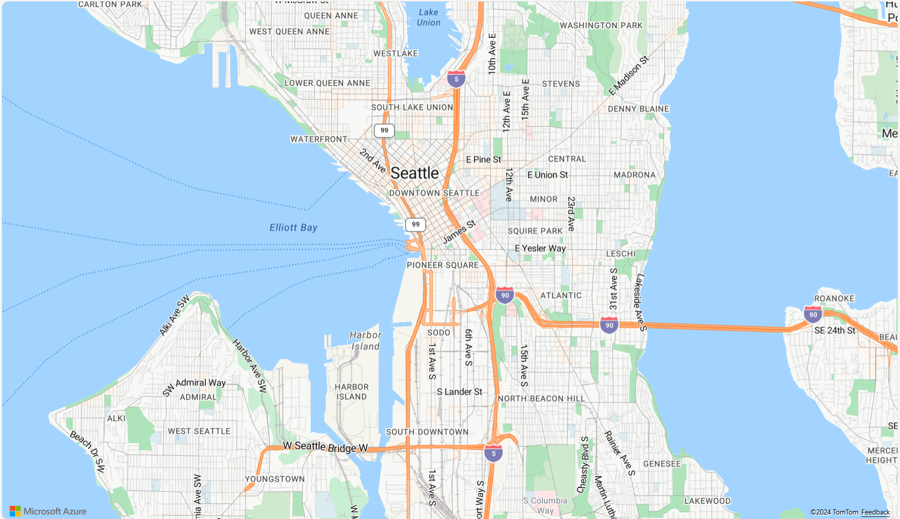

# {Platform} Azure Maps からの画像の表示

{Platform} `AzureMapsMapImagery` は、Microsoft® が提供する地理的画像マッピング サービスです。
世界の地理的画像タイルを複数のスタイルで供します。この地理的画像サービスは、<a href="https://azure.microsoft.com/ja-jp/products/azure-maps" target="_blank">www.azure.microsoft.com</a> ウェブサイトから直接アクセスできます。{ProductName} Map コンポーネントは、`AzureMapsMapImagery` クラスを使用して、地図の背景コンテンツに Azure Maps の地理的画像を表示します。

## {Platform} Azure Maps からの画像の表示例





<div class="divider--half"></div>

`sample="/maps/geo-map/display-azure-imagery", height="600", alt="{Platform} Azure Maps からの画像の表示例"`

## コード スニペット
以下のコード スニペットは、`AzureMapsMapImagery` クラスを使用して {Platform} `XamGeographicMap` で Azure Maps からの地理的画像タイルを表示する方法を示します。

```html
<igx-geographic-map #map
    width="100%"
    height="100%"
    zoomable="true" >
</igx-geographic-map>
```

```ts
import { IgxGeographicMapComponent } from 'igniteui-angular-maps';
import { IgxAzureMapsMapImagery } from 'igniteui-angular-maps';
// ...
const tileSource = new IgxAzureMapsMapImagery();
tileSource.apiKey = "YOUR_Azure_MAPS_API_KEY";
tileSource.imageryStyle = AzureMapsImageryStyle.LabelsRoad; // or
tileSource.imageryStyle = AzureMapsImageryStyle.Aerial; // or
tileSource.imageryStyle = AzureMapsImageryStyle.Road;

this.map.backgroundContent = tileSource;
```

```ts
import { IgrGeographicMap } from 'igniteui-react-maps';
import { IgrAzureMapsMapImagery } from 'igniteui-react-maps';
import { AzureMapsImageryStyle } from 'igniteui-react-maps';
// ...
const tileSource = new IgrAzureMapsMapImagery();
tileSource.apiKey = "YOUR_Azure_MAPS_API_KEY";
tileSource.imageryStyle = AzureMapsImageryStyle.Imagery; // or
tileSource.imageryStyle = AzureMapsImageryStyle.Terra; // or
tileSource.imageryStyle = AzureMapsImageryStyle.Road;

const geoMap = new IgrGeographicMap({ name: "geoMap" });
geoMap.backgroundContent = tileSource;
```

```ts
const tileSource = new IgcAzureMapsMapImagery();
tileSource.apiKey = "YOUR_Azure_MAPS_API_KEY";
tileSource.imageryStyle = AzureMapsImageryStyle.Imagery; // or
tileSource.imageryStyle = AzureMapsImageryStyle.Terra; // or
tileSource.imageryStyle = AzureMapsImageryStyle.Road;

map.backgroundContent = tileSource;
```

## プロパティ
以下の表で、`AzureMapsMapImagery` クラスのプロパティを説明します。

| プロパティ名  | プロパティ タイプ   | 説明   |
|----------------|-----------------|---------------|
|`ApiKey`|string|Azure Maps 画像サービスで必要となる API キーを設定するためのプロパティを表します。このキーは <a href="https://azure.microsoft.com/ja-jp/products/azure-maps" target="_blank">azure.microsoft.com</a> ウェブサイトから取得してください。|
|`ImageryStyle`|`AzureMapsImageryStyle`|Azure Maps 画像タイルのマップ スタイルを設定するプロパティを表します。このプロパティは、以下の `AzureMapsImageryStyle` 列挙値に設定できます。 <ul><li> Aerial - 道路またはラベルのオーバーレイなしの Aerial 地図スタイルを指定します</li> <li> LabelsRoad - 道路およびラベルのオーバーレイ付き航空地図スタイルを指定します</li><li> Road - 空中オーバーレイなしの道路マップ スタイルを指定します</li></ul>|
|`AzureImageryRestUri`|string|TilePath と SubDomain の位置を指定する Azure Imagery REST URI を設定するためのプロパティを表します。これはオプションのプロパティです。指定されていない場合、デフォルトの REST URI を使用します。|
|`CultureName`|string|タイル ソースのカルチャ名を設定するためのプロパティを表します。|
|`IsDeferredLoad`|boolean|Azure Maps サービスが有効なプロパティ値の割り当てで自動初期化するかどうかを指定するプロパティを表します。|
|`IsInitialized`|boolean|True に設定されているプロパティは、Azure Maps サービスからの地理的画像タイルが初期化され、マップ コンポーネントでのレンダリングの準備ができたときに発生することを表します。|
|`SubDomains`|`SubDomainsCollection`|URI サブ ドメインの画像コレクションを表します。|
|`TilePath`|string|マップ タイル画像 URI を設定するプロパティを表します。これは Azure Maps の実際の位置です。|

## API リファレンス

 - `AzureMapsImageryStyle`
 - `AzureMapsMapImagery`
 - `XamGeographicMap`