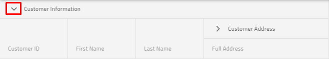

# {Platform} {ComponentTitle} の縮小可能な列グループの概要

複数列ヘッダーを使用すると、複数レベルのネストされた列と列グループを使用できます。また、各列グループを**縮小可能**としてマークできます。**縮小可能な複数列ヘッダー**により、縮小/展開が可能です。現在のヘッダーの下にネストされたヘッダーを表示および非表示にします。これにより、たとえば短縮/要約された情報が得られます。

## {Platform} {ComponentTitle} の縮小可能な列グループの例

`sample="/{ComponentSample}/column-collapsible-groups", height="600", alt="{Platform} {ComponentTitle} の縮小可能な列グループの例"`


## 設定

`{ComponentName}` および**縮小可能な複数列ヘッダー**を使用するには、まず以下のコマンドを入力して、{ProductName} をインストールする必要があります。

<!-- Angular -->
```cmd
ng add igniteui-angular
```
<!-- end: Angular -->

<!-- Blazor -->
```cmd
> dotnet add package IgniteUI.Blazor --version {PackageVerLatest}
```
<!-- end: Blazor -->

<!-- WebComponents -->
```cmd
npm install @webcomponents/custom-elements
```
<!-- end: WebComponents -->

{ProductName} については、[はじめに](../../general-getting-started.md) トピックををご覧ください。

そのため、[複数列ヘッダー](multi-column-headers.md)のトピックを簡単に確認することを強くお勧めします。グリッドで列グループを設定する方法の詳細情報を参照してください。

## 使用方法

縮小可能な列グループは複数列ヘッダー機能の一部で、列グループをより小さいデータ セットに縮小/展開する方法を提供します。列グループが折りたたまれると、列のサブセットがエンドユーザーに表示され、グループの他の子列が非表示になります。縮小/展開された各列は、グリッド データソースにバインドすることも、非バインドにして計算することもできます。

列グループを縮小可能なに定義するには、`ColumnGroup` の `Collapsible` プロパティを **true** に設定する必要があります。

`VisibleWhenCollapsed` プロパティを少なくとも 2 つの子列に定義する必要があることに注意してください。グループが縮小されたときに少なくとも 1 列が表示され (`VisibleWhenCollapsed` の設定が **true**)、グループが展開されたときは少なくとも 1 列が非表示になります (`VisibleWhenCollapsed` の設定が `false`)。**それ以外は、縮小機能は無効になります。**子列の一部に `VisibleWhenCollapsed` が指定されていない場合、この列は、親の状態が展開または縮小されているかに関係なく常に表示されます。

それでは、以下のマークアップを見てみましょう。

```html
<igx-column-group header="Customer Information" [collapsible]="true"> <!-- Initially the column groups will be expanded--->
    <!--The column below will be visible when its parent is collapsed-->
    <igx-column field="CustomerName" header="Fullname" [dataType]="'string'" [visibleWhenCollapsed]="true"></igx-column>
    <!--The three columns below will be visible when its parent is expanded-->
    <igx-column field="CustomerID" header="Customer ID" [dataType]="'string'" [visibleWhenCollapsed]="false"></igx-column>
    <igx-column field="FirstName" header="First Name" [dataType]="'string'" [visibleWhenCollapsed]="false">
    </igx-column>
    <igx-column field="LastName" header="Last Name" [dataType]="'string'" [visibleWhenCollapsed]="false">
    </igx-column>
    <igx-column-group header="Customer Address"> <!--This column visibility will not be changed based on parent expand/collapsed state-->
        <igx-column field="Country" header="Country" [dataType]="'string'" [sortable]="true">
        </igx-column>
        <igx-column field="City" header="City" [dataType]="'string'" [sortable]="true">
        </igx-column>
    </igx-column-group>
</igx-column-group>
```

```razor
 <IgbColumnGroup Header="Customer Information" Collapsible="true">
    <!--The column below will be visible when its parent is collapsed-->
    <IgbColumn Field="CustomerName" Header="Full name" VisibleWhenCollapsed="true"></IgbColumn>
        <!--The three columns below will be visible when its parent is expanded-->
        <IgbColumn Field="CustomerID" Header="Customer ID" VisibleWhenCollapsed="false"></IgbColumn>
        <IgbColumn Field="FirstName" Header="First Name" VisibleWhenCollapsed="false"></IgbColumn>
        <IgbColumn Field="LastName" Header="Last Name" VisibleWhenCollapsed="false"></IgbColumn>
        <IgbColumnGroup Header="Customer Address">
            <IgbColumn Field="Country" Header="Country" Sortable="true"></IgbColumn>
            <IgbColumn Field="City" Header="City" Sortable="true"></IgbColumn>
        </IgbColumnGroup>
 </IgbColumnGroup>
```

```html
<igc-column-group header="Customer Information" collapsible="true"> <!-- Initially the column groups will be expanded--->
    <!--The column below will be visible when its parent is collapsed-->
    <igc-column field="CustomerName" header="Fullname" data-type="String" visible-when-collapsed="true"></igc-column>
    <!--The three columns below will be visible when its parent is expanded-->
    <igc-column field="CustomerID" header="Customer ID" data-type="String" visible-when-collapsed="false"></igc-column>
    <igc-column field="FirstName" header="First Name" data-type="String" visible-when-collapsed="false">
    </igc-column>
    <igc-column field="LastName" header="Last Name" data-type="String" visible-when-collapsed="false">
    </igc-column>
    <igc-column-group header="Customer Address"> <!--This column visibility will not be changed based on parent expand/collapsed state-->
        <igc-column field="Country" header="Country" data-type="String" sortable="true">
        </igc-column>
        <igc-column field="City" header="City" data-type="String" sortable="true">
        </igc-column>
    </igc-column-group>
</igc-column-group>
```

すべての子列に 3 つの状態があります。
-	親の展開状態に関係なく、常に表示できます。
-	親が縮小されているときに表示できます。
-	親が縮小されているときに非表示にできます。

縮小可能として指定された列グループの初期状態は `Expanded` が **true** に設定されていますが、**false** に設定することでこの動作を簡単に変更できます。

<!-- Angular -->

## 展開/縮小インジケーター テンプレート

`{ComponentName}` のデフォルトの展開インジケーターは次のとおりです。

 

`{ComponentName}` のデフォルトの縮小インジケーターは次のとおりです。


また、デフォルトの展開/縮小インジケーターを変更する必要がある場合は、これを実現するためのテンプレート オプションを提供します。

### プロパティの使用

`CollapsibleIndicatorTemplate` プロパティを使用して、カスタムの展開/折りたたみテンプレートを定義し、それを各折りたたみ可能な列グループに提供できます。以下のマークアップを確認してください。

```html
<ng-template #indTemplate let-column="column">
    <igx-icon [attr.draggable]="false" >{{column.expanded ? 'remove' : 'add'}} </igx-icon>
</ng-template>
<igx-column-group header="Customer Information" [collapsible]="true" [collapsibleIndicatorTemplate]="indTemplate">
    <igx-column field="CustomerName" header="Fullname" [dataType]="'string'" [visibleWhenCollapsed]="true"></igx-column>
    <igx-column field="CustomerID" header="Customer ID" [dataType]="'string'" [visibleWhenCollapsed]="false"></igx-column>
    <igx-column-group header="Customer Address" [collapsible]="true" [collapsibleIndicatorTemplate]="indTemplate">
        <igx-column field="Country" header="Country" [dataType]="'string'" [sortable]="true" [visibleWhenCollapsed]="true"></igx-column>
        <igx-column field="City" header="City" [dataType]="'string'" [sortable]="true" [visibleWhenCollapsed]="false"></igx-column>
    </igx-column-group>
</igx-column-group>
```

```razor
    public RenderFragment<IgbColumnTemplateContext> Template = (context) =>
    {
        string icon = context.Column.Expanded ? "remove" : "add";
        return @<IgbIcon IconName="@icon" Collection="material"></IgbIcon>;
    };
```

```html
<igc-column-group id="info" header="Customer Information" collapsible="true">
    <igc-column field="CustomerName" header="Fullname" data-type="String" visible-when-collapsed="true"></igx-column>
    <igc-column field="CustomerID" header="Customer ID" data-type="String" visible-when-collapsed="false"></igx-column>
    <igc-column-group id="address" header="Customer Address" collapsible="true">
        <igc-column field="Country" header="Country" data-type="String" sortable="true" visible-when-collapsed="true"></igx-column>
        <igc-column field="City" header="City" data-type="String" sortable="true" visible-when-collapsed="false"></igx-column>
    </igc-column-group>
</igc-column-group>
```
```ts
constructor() {
    var info = this.info = document.getElementById('info') as IgcColumnGroupComponent;
    var address = this.address = document.getElementById('address') as IgcColumnGroupComponent;

    this._bind = () => {
        info.collapsibleIndicatorTemplateRef = this.indTemplate;
        address.collapsibleIndicatorTemplateRef = this.indTemplate;
    }
    this._bind();
}

public indTemplate = (ctx: IgcCellTemplateContext) => {
    return html`
        <igc-icon draggable="false" >${ctx.cell.column.expanded ? 'remove' : 'add'} </igc-icon>
    `;
}
```

### igxCollapsibleIndicator ディレクティブの使用

この動作を実現する別の方法は、以下の例に示すように igxCollapsibleIndicator ディレクティブを使用することです。

```html
<igx-column-group header="Customer Information" [collapsible]="true">
    <ng-template igxCollapsibleIndicator let-column="column">
        <igx-icon [attr.draggable]="false">{{column.expanded ? 'remove' : 'add'}} </<igx-icon>
    </ng-template>
    <igx-column field="CustomerName" header="Fullname" [dataType]="'string'" [visibleWhenCollapsed]="true"></igx-column>
    <igx-column field="CustomerID" header="Customer ID" [dataType]="'string'" [visibleWhenCollapsed]="false"></igx-column>
    <igx-column-group header="Customer Address" [collapsible]="true">
        <igx-column field="Country" header="Country" [dataType]="'string'" [sortable]="true" [visibleWhenCollapsed]="true"></igx-column>
        <igx-column field="City" header="City" [dataType]="'string'" [sortable]="true" [visibleWhenCollapsed]="false"></igx-column>
    </igx-column-group>
</igx-column-group>
```

```html
<igc-column-group id="info" header="Customer Information" collapsible="true">
    <igc-column field="CustomerName" header="Fullname" data-type="string" visible-when-collapsed="true"></igx-column>
    <igc-column field="CustomerID" header="Customer ID" data-type="string" visible-when-collapsed="false"></igx-column>
    <igc-column-group id="address" header="Customer Address" collapsible="true">
        <igc-column field="Country" header="Country" data-type="string" sortable="true" visible-when-collapsed="true"></igx-column>
        <igc-column field="City" header="City" data-type="string" sortable="true" visible-when-collapsed="false"></igx-column>
    </igc-column-group>
</igc-column-group>
```
```ts
constructor() {
    var info = this.info = document.getElementById('info') as IgcColumnGroupComponent;
    var address = this.address = document.getElementById('address') as IgcColumnGroupComponent;

    this._bind = () => {
        info.collapsibleIndicatorTemplateRef = this.indTemplate;
        address.collapsibleIndicatorTemplateRef = this.indTemplate;
    }
    this._bind();
}

public indTemplate = (ctx: IgcCellTemplateContext) => {
    return html`
        <igc-icon draggable="false" >${ctx.cell.column.expanded ? 'remove' : 'add'} </igc-icon>
    `;
}
```
<!-- end: Angular -->

> [!Note]
> 最初にグループを縮小するオプションは、非表示の列よりも優先されることに注意してください。
> hidden プロパティを使用して列を非表示にすることを宣言し、同じ列を表示するグループが定義されている場合、列が表示されます。


## API リファレンス

* `{ComponentName}`
* `Column`

## その他のリソース


* [仮想化とパフォーマンス](virtualization.md)
* [ページング](paging.md)
* [フィルタリング](filtering.md)
* [ソート](sorting.md)
* [集計](summaries.md)
* [列の移動](column-moving.md)
* [列のピン固定](column-pinning.md)
* [選択](selection.md)

コミュニティに参加して新しいアイデアをご提案ください。

* [{ProductName} **フォーラム (英語)**]({ForumsLink})
* [{ProductName} **GitHub (英語)**]({GithubLink})
