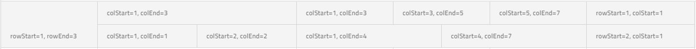

# {Platform} {ComponentTitle} Multi-row Layout

Multi-row Layout extends the rendering capabilities of the `{ComponentName}`. The feature allows splitting a single data record into multiple visible rows.

## {Platform} Multi-row Layout Example

<code-view style="height:755px"
           data-demos-base-url="{environment:dvDemosBaseUrl}"
           iframe-src="{environment:dvDemosBaseUrl}/{ComponentSample}-multi-row-layout-options"
           github-src="{ComponentSample}/multi-row-layout-options"
           alt="{Platform} {ComponentTitle} Multi Row Layout Overview Example">
</code-view>

The declaration of Multi-row Layout is achieved through `ColumnLayout` component. Each `ColumnLayout` component should be considered as a block, containing one or multiple `Column` components. Some of the grid features work on block level (those are listed in the "Feature Integration" section below). For example the virtualization will use the block to determine the virtual chunks, so for better performance split the columns into more `ColumnLayout` blocks if the layout allows it. There should be no columns outside of those blocks and no usage of `ColumnGroup` when configuring a multi-row layout. Multi-row Layout is implemented on top of the [grid layout](https://www.w3.org/TR/css-grid-1/) specification and should conform to its requirements.

The `Column` component exposes four `Input` properties to determine the location and span of each cell:
* `ColStart` - column index from which the field is starting. This property is **mandatory**.
* `RowStart` - row index from which the field is starting. This property is **mandatory**.
* `ColEnd` - column index where the current field should end. The amount of columns between colStart and colEnd will determine the amount of spanning columns to that field. This property is **optional**. If not set defaults to `colStart + 1`.
* `RowEnd` - row index where the current field should end. The amount of rows between rowStart and rowEnd will determine the amount of spanning rows to that field. This property is **optional**. If not set defaults to `rowStart + 1`.


```html
<igx-column-layout>
	<igx-column [rowStart]="1" [colStart]="1" [rowEnd]="3" field="ID"></igx-column>
</igx-column-layout>
<igx-column-layout>
	<igx-column [rowStart]="1" [colStart]="1" [colEnd]="3" field="CompanyName"></igx-column>
	<igx-column [rowStart]="2" [colStart]="1" [colEnd]="2" field="ContactName"></igx-column>
	<igx-column [rowStart]="2" [colStart]="2" [colEnd]="3" field="ContactTitle"></igx-column>
</igx-column-layout>
<igx-column-layout>
	<igx-column [rowStart]="1" [colStart]="1" [colEnd]="3" field="Country"></igx-column>
	<igx-column [rowStart]="1" [colStart]="3" [colEnd]="5" field="Region"></igx-column>
	<igx-column [rowStart]="1" [colStart]="5" [colEnd]="7" field="PostalCode"></igx-column>
	<igx-column [rowStart]="2" [colStart]="1" [colEnd]="4" field="City"></igx-column>
	<igx-column [rowStart]="2" [colStart]="4" [colEnd]="7" field="Address"></igx-column>
</igx-column-layout>
<igx-column-layout>
    <igx-column [rowStart]="1" [colStart]="1" field="Phone"></igx-column>
    <igx-column [rowStart]="2" [colStart]="1" field="Fax"></igx-column>
</igx-column-layout>
```

```razor
<IgbColumnLayout>
    <IgbColumn RowStart="1" RowEnd="3" ColStart="1" Field="ID"></IgbColumn>
</IgbColumnLayout>
<IgbColumnLayout>
    <IgbColumn RowStart="1" ColStart="1" ColEnd="3" Field="CompanyName"></IgbColumn>
    <IgbColumn RowStart="2" ColStart="1" ColEnd="2" Field="ContactName"></IgbColumn>
    <IgbColumn RowStart="2" ColStart="2" ColEnd="3" Field="ContactTitle"></IgbColumn>
</IgbColumnLayout>
<IgbColumnLayout>
    <IgbColumn RowStart="1" ColStart="1" ColEnd="3" Field="Country"></IgbColumn>
    <IgbColumn RowStart="1" ColStart="3" ColEnd="5" Field="Region"></IgbColumn>
    <IgbColumn RowStart="1" ColStart="5" ColEnd="7" Field="PostalCode"></IgbColumn>
    <IgbColumn RowStart="2" ColStart="1" ColEnd="4" Field="City"></IgbColumn>
    <IgbColumn RowStart="2" ColStart="4" ColEnd="7" Field="Address"></IgbColumn>
</IgbColumnLayout>
<IgbColumnLayout>
    <IgbColumn RowStart="1" ColStart="1" Field="Phone"></IgbColumn>
    <IgbColumn RowStart="2" ColStart="1" Field="Fax"></IgbColumn>
</IgbColumnLayout>
```

The result of the above configuration can be seen on the screenshot below:



> [!Note]
> `RowStart` and `ColStart` properties must be set for each `Column` into a `ColumnLayout`. The `ColumnLayout` component is not verifying if the layout is correct and not throwing errors or warnings about that. The developers must make sure that the declaration of their layout is correct and complete, otherwise they may end up in broken layout with misalignments, overlaps and browser inconsistencies.

## Feature Integration

Due to the completly different rendering approach of Multi-row Layout, some of the column features will work only on `ColumnLayout` component. Such features are Column Pinning and Column Hiding. Othes like - Sorting and Grouping will work in the same way - on the `Column` component.

- Filtering - only Excel Style Filtering is supported. Setting `FilterMode` explicitly to `FilterMode.quickFilter` has no effect.
- Paging - works on records, not visual rows.
- Group By - `HideGroupedColumns` option has no effect in Multi-row Layout. The grouped columns are always visible.

The following features are currently **not** supported:

- Column Moving
- Multi-column Headers
- Export to Excel
- Summaries

## Keyboard Navigation

`{ComponentName}` with Multi-Row Layouts provides build-in keyboard navigation.

### Horizontal Navigation

* <kbd>Arrow Left</kbd> or <kbd>Arrow Right</kbd> - move to the adjacent cell on the left/right within the current row unaffected by the column layouts that are defined. If the current cell spans on more than one row, <kbd>Arrow Left</kbd> and <kbd>Arrow Right</kbd> should navigate to the first cell on the left and right with the same `rowStart`, unless you have navigated to some other adjacent cell before. The navigation stores the starting navigation cell and navigates to the cells with the same `rowStart` if possible.
* <kbd>Ctrl</kbd> + <kbd>Arrow Left</kbd> (<kbd>HOME</kbd>) or <kbd>Ctrl</kbd> + <kbd>Arrow Right</kbd> (<kbd>END</kbd>) - navigate to the start or end of the row and select the cell with accordance to the starting navigation cell.


### Vertical Navigation

* <kbd>Arrow Up</kbd> or <kbd>Arrow Down</kbd> - move to the cell above/below in relation to a starting position and is unaffected by the rows. If the current cell spans on more than one column the next active cell will be selected with accordance to the starting navigation cell.
* <kbd>Ctrl</kbd> + Arrow Up</kbd> or <kbd>Ctrl</kbd> + <kbd>Down</kbd> - Navigate and apply focus on the same column on the first or on the last row.
* <kbd>Ctrl</kbd> + <kbd>Home</kbd> or <kbd>Ctrl</kbd> + <kbd>End</kbd> - Navigate to the first row and focus first cell or navigate to the last row and focus the last cell.


> [!Note]
> Navigation through cells which span on multiple rows or columns is done with accordance to the starting navigation cell and will allow returning to the starting cell using the key for the opposite direction. The same approach is used when navigating through group rows.

> [!Note]
> Selection and multi cell selection are working on layout, meaning that when a cell is active, its layout will be selected. Also all features of multiple selection like drag selection are applicable and will work per layout not per cell.

### Custom Keyboard Navigation

The grid allows customizing the default navigation behavior when a certain key is pressed. Actions like `going to the next cell` or `cell below` could be handled easily with the powerful keyboard navigation API:

- `GridKeydown` is exposed. The event will emit `IGridKeydownEventArgs`. This event is available only through the keyboard key combinations mentioned above, for all other key actions you can use `KeyDown` event.
- `NavigateTo` - this method allows you to navigate to a position based on provided `RowIndex` and `VisibleColumnIndex`

The demo below adds additional navigation down/up via the <kbd>Enter</kbd> and <kbd>Shift</kbd> + <kbd>Enter</kbd> keys, similar to the behavior observed in Excel.

### Demo


<code-view style="height:605px"
           data-demos-base-url="{environment:dvDemosBaseUrl}"
           iframe-src="{environment:dvDemosBaseUrl}/{ComponentSample}-keyboard-mrl-navigation"
           github-src="{ComponentSample}/keyboard-mrl-navigation"
           alt="{Platform} {ComponentTitle} Multi Row Layout Navigation Example">
</code-view>

<!-- Angular -->

### Layout Configurator

Sometimes when configuring a column layout it might be a challenge to calculate and set the proper `ColStart` and `ColEnd` or `RowStart` and `RowEnd`. Especially when there are a lot of columns in a single layout. That is why we have created a small configurator, so you can easily do that and have a similar preview of how it would look inside the `{ComponentName}` when applied. You can do the following interactions with it:

* Set number of rows for the whole configuration. All layouts must have the same amount of rows.
* Add/Remove column layouts by clicking the `Add Layout` chip or reordering them by dragging a layout chip left/right.
* Set specific settings for each layout as number of columns and how wide they will be. The setting refer to the currently selected layout.
* Resize column cells in the layout preview so they can span more columns/rows or clear them using the `Delete` button.
* Set columns in the preview by dragging a column chip in the place your will want it to be.
* Add/Remove new columns by using the `Add Column` chip.

* Get template output of the whole configuration ready to by placed inside an `{ComponentName}` or the JSON representation that can also be used and parsed in your template using [`NgForOf`](https://angular.io/api/common/NgForOf) for example.

<!-- end: Angular -->

<!-- Angular -->

By default we have set the same columns as our previous sample, but it can be cleared and configured to match your desired configuration.

<!-- NOTE this sample is differed -->

<code-view style="height:500px"
           data-demos-base-url="{environment:dvDemosBaseUrl}"
           iframe-src="{environment:dvDemosBaseUrl}/{ComponentSample}-multi-row-layout-configuration"
           github-src="{ComponentSample}/multi-row-layout-configuration"
           alt="{Platform} {ComponentTitle} Multi Row Layout Configuration Example">
</code-view>

<!-- end: Angular -->

<!-- Angular -->

## Styling

The `{ComponentName}` allows styling through the [Ignite UI for {Platform} Theme Library](../themes/sass/component-themes.md). The grid's `Theme` exposes a wide variety of properties, which allow the customization of all the features of the grid.

In the below steps, we are going through the steps of customizing the grid's Multi-row Layout styling.

### Importing Global Theme

To begin the customization of the Multi-row Layout feature, you need to import the `Index` file, where all styling functions and mixins are located.

```scss
@use "igniteui-angular/theming" as *;

// IMPORTANT: Prior to Ignite UI for Angular version 13 use:
// @import '~igniteui-angular/lib/core/styles/themes/index';
```

### Defining Custom Theme

Next, create a new theme, that extends the `GridTheme` and accepts the parameters, required to customize the feature layout as desired.

```scss
$custom-theme: grid-theme(
    $cell-active-border-color: #ffcd0f,
    $cell-selected-background: #6f6f6f,
    $row-hover-background: #fde069,
    $row-selected-background: #8d8d8d,
    $header-background: #494949,
    $header-text-color: #fff,
    $sorted-header-icon-color: #ffcd0f,
    $sortable-header-icon-hover-color: #e9bd0d
);
```

### Defining a Custom Color Palette

In the approach, that was described above, the color values were hardcoded. Alternatively, you can achieve greater flexibility, using the `Palette` and `Color` functions.

`Palette` generates a color palette, based on provided primary and secondary colors.

 ```scss
$black-color: #494949;
$yellow-color: #FFCD0F;

$custom-palette: palette(
  $primary: $black-color,
  $secondary: $yellow-color
);
```

After a custom palette has been generated, the `Color` function can be used to obtain different varieties of the primary and the secondary colors.

```scss
$custom-theme: grid-theme(
    $cell-active-border-color: color($custom-palette, "secondary", 500),
    $cell-selected-background: color($custom-palette, "primary", 300),
    $row-hover-background: color($custom-palette, "secondary", 300),
    $row-selected-background: color($custom-palette, "primary", 100),
    $header-background: color($custom-palette, "primary", 500),
    $header-text-color:contrast-color($custom-palette, "primary", 500),
    $sorted-header-icon-color: color($custom-palette, "secondary", 500),
    $sortable-header-icon-hover-color: color($custom-palette, "secondary", 600)
);
```

### Defining Custom Schemas

You can go even further and build flexible structure that has all the benefits of a [**schema**](../themes/sass/schemas.md). The **schema** is the recipe of a theme.

Extend one of the two predefined schemas, that are provided for every component. In our case, we would use `$_light_grid`.

```scss
$custom-grid-schema: extend($_light-grid,(
    cell-active-border-color: (igx-color:('secondary', 500)),
    cell-selected-background: (igx-color:('primary', 300)),
    row-hover-background: (igx-color:('secondary', 300)),
    row-selected-background: (igx-color:('primary', 100)),
    header-background: (igx-color:('primary', 500)),
    header-text-color: (igx-contrast-color:('primary', 500)),
    sorted-header-icon-color: (igx-color:('secondary', 500)),
    sortable-header-icon-hover-color: (igx-color:('secondary', 600))
));
```

In order for the custom schema to be applied, either `Light`, or `Dark` globals has to be extended. The whole process is actually supplying a component with a custom schema and adding it to the respective component theme afterwards.

```scss
$my-custom-schema: extend($light-schema, (
    igx-grid: $custom-grid-schema
));
 $custom-theme: grid-theme(
    $palette: $custom-palette,
    $schema: $my-custom-schema
);
```

### Applying the Custom Theme

The easiest way to apply your theme is with a `sass` `@include` statement in the global styles file:

```scss
@include grid($custom-theme);
```

### Scoped Component Theme

In order for the custom theme do affect only specific component, you can move all of the styles you just defined from the global styles file to the custom component's style file (including the import of the `index` file).

This way, due to {Platform}'s [ViewEncapsulation](https://angular.io/api/core/Component#encapsulation), your styles will be applied only to your custom component.

 >[!NOTE]
 >If the component is using an [`Emulated`](../themes/sass/component-themes.md#表示のカプセル化) ViewEncapsulation, it is necessary to penetrate this encapsulation using `::ng-deep` in order to style the grid.
 >[!NOTE]
 >Wrap the statement inside of a `:host` selector to prevent your styles from affecting elements *outside of* our component:

```scss
:host {
    ::ng-deep {
        @include grid($custom-theme);
    }
}
```

### Demo

<code-view style="height:755px"
           data-demos-base-url="{environment:dvDemosBaseUrl}"
           iframe-src="{environment:dvDemosBaseUrl}/{ComponentSample}-multi-row-layout-styling"
           github-src="{ComponentSample}/multi-row-layout-styling"
           alt="{Platform} {ComponentTitle} Multi Row Layout Styling Example">
</code-view>

>[!NOTE]
>The sample will not be affected by the selected global theme from `Change Theme`.

<!-- end: Angular -->

## API References

* `{ComponentName}`
* `ColumnLayout`
* `Column`

## Additional Resources

* [Virtualization and Performance](virtualization.md)
* [Paging](paging.md)
* [Sorting](sorting.md)
* [Column Resizing](column-resizing.md)
* [Selection](selection.md)

Our community is active and always welcoming to new ideas.

* [Ignite UI for {Platform} **Forums**](https://www.infragistics.com/community/forums/f/ignite-ui-for-{Platform})
* [Ignite UI for {Platform} **GitHub**](https://github.com/IgniteUI/igniteui-{Platform})
