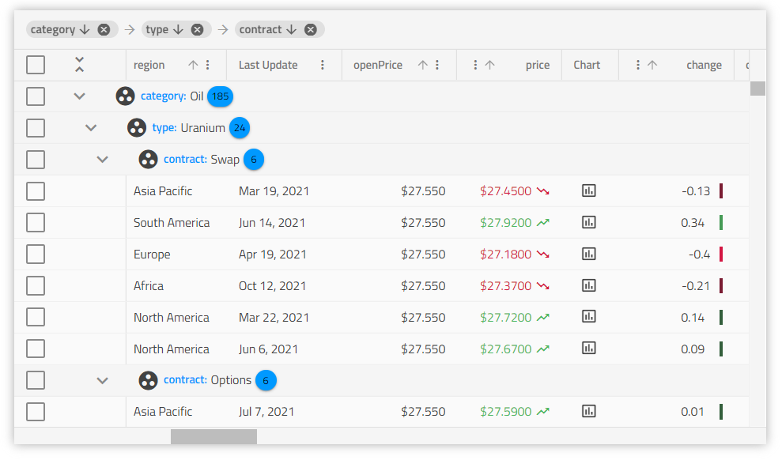

<style>
    .sample-content {
        display: flex;
        flex-flow: row wrap;
        justify-content: center;
    }

    .sample-column {
        display: flex;
        flex-flow: column nowrap;
        flex: 1 0 25%;
        align-content: flex-start;
        min-width: 280px;
    }

    .tabbar-wrapper {
        width: inherit;
        position: relative;
        height: 100%;
        margin: 0 auto;
    }

    .tabbar-wrapper > p {
        padding-right: 20px
    }
</style>

# {Platform} Grid 概要と構成

<div class="sample-content">
    <article class="sample-column">
        <div class="tabbar-wrapper">
            <p>{ProductName} Data Table / Data Grid は、コーディングや構成をほとんど行わずにデータをすばやくバインドして表示できる表形式の {Platform} グリッド コンポーネントです。ツールボックスの {Platform} データ グリッドの機能には、フィルタリング、ソート、テンプレート、行の選択、行のグループ化、行の固定、および移動可能な列が含まれます。</p>
            <p>{Platform} テーブルは、ライブのストリーミング データ用に最適化されており、多数の行または列で無制限のデータ セット サイズを処理できます。</p>
        </div>
    </article>
    <article class="sample-column">
        <div class="tabbar-wrapper">
            <div class="tab-content">
                
            </div>
        </div>
    </article>
</div>

## {Platform} Data Grid の例

この {ProductName} Grid の例では、ユーザーが基本スタイルと Excel スタイルの両方のフィルタリング、ライブ データのソート、およびグリッド集計とセル テンプレートの使用を実行する方法を確認できます。デモには、1 ページあたり 10 項目を表示するように設定されたページングも含まれています。

`sample="/{GridSample}/overview", height="700", alt="{Platform} grid の例"`


<div class="divider--half"></div>

## {ProductName} Data Grid で作業を開始

### 依存関係

{Platform} Data Grid を初期化するには、<!-- Blazor -->{PackageCommon} パッケージ<!-- end: Blazor --><!-- WebComponents -->`{PackageGrids}` パッケージ<!-- end: WebComponents --><!-- React -->`{PackageCommon}` と `{PackageGrids}` パッケージ<!-- end: React -->をインストールする必要があります。

<!-- Blazor -->

IgniteUI.Blazor パッケージの追加については、以下のトピックを参照してください。

- [作業の開始](../general-getting-started-blazor-client.md)
- [NuGet パッケージの追加](../general-nuget-feed.md)

また、グリッドに必要なスタイルを提供するために、アプリケーションの index.html ファイルに次の CSS リンクを含める必要があります:

```razor
<link href="_content/IgniteUI.Blazor/themes/grid/light/bootstrap.css" rel="stylesheet" />
```

以下の名前空間を追加してコントロールの実装を開始できます。

```razor
@using IgniteUI.Blazor.Controls
```
<!-- end: Blazor -->

<!-- Angular, WebComponents -->
```cmd
npm install --save {PackageGrids}
```
<!-- end: Angular, WebComponents -->

<!-- React -->
```cmd
npm install --save {PackageCommon}
npm install --save {PackageGrids}
```
<!-- end: React -->

<!-- Angular, React, WebComponents -->

グリッドを使用するには、次のインポートも含める必要があります。

<!-- WebComponents -->
```typescript
import 'igniteui-webcomponents-grids/grids/combined.js';
```
<!-- end: WebComponents -->

```tsx
import "igniteui-react-grids/grids";
```

対応するスタイルも参照する必要があります。[テーマ](../themes/overview.md)の 1 つにライトモードのオプションまたはダークモードのオプションを選択し、プロジェクト構成に基づいてインポートできます:

<!-- WebComponents -->
```typescript
import 'igniteui-webcomponents-grids/grids/themes/light/bootstrap.css';
```
<!-- end: WebComponents -->

```tsx
import 'igniteui-react-grids/grids/themes/light/bootstrap.css'
```

<!-- WebComponents -->
またはそれをリンクするには:
```typescript
<link rel='stylesheet' href='node_modules/igniteui-webcomponents-grids/grids/themes/light/bootstrap.css'>
```
<!-- end: WebComponents -->

グリッドの外観をカスタマイズする方法の詳細については、[スタイル設定](data-grid.md#{PlatformLower}-grid-スタイル設定の構成) セクションを参照してください。
<!-- end: Angular, React, WebComponents -->

<!-- Angular, React, Blazor -->

### コンポーネント モジュール

`DataGrid` には以下のモジュールが必要です。

```razor
// in Program.cs file

builder.Services.AddIgniteUIBlazor(typeof(IgbGridModule));
```

```typescript
// app.module.ts

import { IgxGridModule } from 'igniteui-angular';
// import { IgxGridModule } from '@infragistics/igniteui-angular'; for licensed package

@NgModule({
    imports: [
        // ...
        IgxGridModule,
        // ...
    ]
})
export class AppModule {}
```

```tsx
import { IgrGridModule } from "igniteui-react-grids";
IgrGridModule.register();
```

<!-- end: Angular, React, Blazor -->


## 使用方法

グリッド パッケージをインポートしたので、基本的な構成と、ローカル データへのバインドから始めていきましょう。

```razor
<IgbGrid Id="grid1" Data="data" AutoGenerate="true"></IgbGrid>
```

```html
<igx-grid #grid1 id="grid1" [data]="localData" [autoGenerate]="true"></igx-grid>
```

```html
<igc-grid id="grid1" auto-generate="true"></igc-grid>
```

```typescript
constructor() {
    let grid1 = document.getElementById("grid1") as IgcGridComponent;
    grid1.data = data;
}
```

```tsx
<IgrGrid id="grid1" data={localData} autoGenerate="true"></IgrGrid>
```

`Id` プロパティは文字列値で、設定されない場合に自動生成生成されるグリッドの一意識別子です。`data` はグリッドをローカル データにバインドします。

`AutoGenerate` プロパティは、データ ソース フィールドに基づいてグリッドの `Column` コンポーネントを自動生成するようにグリッドに指示します。列の適切なデータ型の決定を試みます。それ以外の場合、開発者は列およびデータ ソース フィールドへのマッピングを明示的に定義する必要があります。

<!-- Angular -->

## Bootstrap グリッドの定義

{ProductName} には、Flex に基づくレイアウト システムのような強力なブートストラップ グリッドが含まれています。今日の最新のアプリケーションは、レスポンシブ Web デザインのアプローチに従うことが期待されています。つまり、デバイスのサイズに基づいて、または単にブラウザーのサイズを変更するだけで、HTML 要素のレイアウトを適切に調整できます。ブートストラップ グリッド レイアウトはこれまで最も使用されていたアプローチでしたが、CSS グリッドのような Flex に基づくレイアウト システムは、どのブラウザーでも機能するため、より一般的になりました。{ProductName} ディレクティブにより、コンテンツ / テキストの折り返し、両端揃え、配置など、垂直方向と水平方向のフローが可能になります。{ProductName} は、CSS を使用したレスポンシブ レイアウトをサポートし、サイズ変更時のグリッドの動作に究極の柔軟性を提供します。

<!-- end: Angular -->

## 編集可能な {Platform} グリッド

グリッド編集の各操作にはバッチ操作が含まれます。つまり、API には、編集を単一のサーバー呼び出しにグループ化するオプションがあります。または、グリッドの操作を使用して、グリッドの編集を実行したり、発生した操作を更新したりできます。CRUD 操作を備えた編集グリッドとしての優れた開発者エクスペリエンスに加えて、Angular グリッドには Excel のようなキーボード ナビゲーションが含まれます。一般的なデフォルトのグリッド ナビゲーションに加えて、お客様のニーズを満たすためにナビゲーション オプションを上書きするオプションが含まれています。優れたナビゲーション スキームを備えた編集可能なグリッドは、最新の業務アプリケーションにとって重要であり、Ignite UI グリッドを使用すると簡単になります。

このトピックに続いて、[セル テンプレート](data-grid.md#セル-テンプレート) と[セル編集テンプレート](data-grid.md#セル編集テンプレート) および編集について詳しく学習します。

## グリッドの列構成

`Column` は、グリッドの列コレクションを定義し、**ソート**や**フィルタリング**などの列ごとの機能を有効にするために使用されます。セル、ヘッダー、およびフッター テンプレートも利用できます。

### 列の定義

`AutoGenerate` プロパティを無効にし、マークアップで列コレクションを定義します。

```html
<igx-grid #grid1 [data]="data | async" [autoGenerate]="false" (columnInit)="initColumns($event)"
    (selected)="selectCell($event)" [allowFiltering]="true">
    <igx-column field="Name" [sortable]="true" header=" "></igx-column>
    <igx-column field="AthleteNumber" [sortable]="true" header="Athlete number" [filterable]="false"></igx-column>
    <igx-column field="TrackProgress" header="Track progress" [filterable]="false">
        <ng-template igxCell let-value>
            <igx-linear-bar [stripped]="false" [value]="value" [max]="100"></igx-linear-bar>
        </ng-template>
    </igx-column>
    <igx-paginator [perPage]="6">
    </igx-paginator>
</igx-grid>
```

```html
<igc-grid id="grid1" auto-generate="false" allow-filtering="true">
    <igc-column field="Name" sortable="true" header=" "></igc-column>
    <igc-column field="AthleteNumber" sortable="true" header="Athlete number" filterable="false"></igc-column>
    <igc-column id="trackProgress" field="TrackProgress" header="Track progress" filterable="false"></igc-column>
</igc-grid>
```

```typescript
constructor() {
    var grid1 = this.grid1 = document.getElementById('grid1') as IgcGridComponent;
    grid1.data = this.data;
}
```

```razor
<IgbGrid AutoGenerate=false AllowFiltering=true>
    <IgbColumn Field="Name" Sortable=true />
    <IgbColumn Field="AthleteNumber" Sortable=true Header="Athlete Number" Filterable=false/>
    <IgbColumn Field="TrackProgress" Header="Track Progress" Filterable=false />
</IgbGrid>
```

```tsx
<IgrGrid id="grid1" autoGenerate="false" allowFiltering="true" data={localData}>
    <IgrColumn field="Name" sortable="true"></igc-column>
    <IgrColumn field="AthleteNumber" sortable="true" header="Athlete number" filterable="false"></IgrColumn>
    <IgrColumn id="trackProgress" field="TrackProgress" header="Track progress" filterable="false"></IgrColumn>
</IgrGrid>
```

<!-- Angular -->

グリッドの各列は別のテンプレートを持つことができます。列に `ng-template` Angular グリッド モジュール ディレクティブが必要です。

また、カスタム プロパティや列自体に渡す任意のタイプのデータ コンテキストに使用できる `AdditionalTemplateContext` 入力も公開します。

```html
<igx-column [additionalTemplateContext]="contextObject">
    <ng-template igxCell let-cell="cell" let-props="additionalTemplateContext">
        {{ props.firstProperty }}
    </ng-template>
</igx-column>
```

```typescript
public contextObject = { firstProperty: 'testValue', secondProperty: 'testValue1'};
```

<!-- end: Angular -->

### ヘッダー テンプレート

ヘッダー テンプレートを設定して、列ヘッダーを変更できます。以下のスニペットは、ヘッダー テキストを大文字に書式設定する方法を示しています。

```html
<igx-column field="Name">
    <ng-template igxHeader let-column>
        {{ column.field | uppercase }}
    </ng-template>
</igx-column>
```

```html
<igc-column id="name" field="Name"></igc-column>
```

```typescript
constructor() {
    var name = this.name = document.getElementById('name') as IgcColumnComponent;

    this._bind = () => {
        name.headerTemplate = this.nameHeaderTemplate;
    }

    this._bind();
}

public nameHeaderTemplate = (ctx: IgcColumnTemplateContext) => {
    return html`
        ${this.formatUppercase(ctx.column.field)}
    `;
}

public formatUppercase(value: string) {
    return value.toUpperCase();
}
```

```razor
<IgbColumn Field="Name" HeaderTemplateScript="UpperCaseTemplate" />

//In JavaScript:
igRegisterScript("UpperCaseTemplate", (ctx) => {

    var html = window.igTemplating.html;

    return html`${this.formatUppercase(ctx.column.field)}`;

}, false)

function formatUppercase(value) {
    return value.toUpperCase();
}
```

```tsx
function nameHeaderTemplate(ctx: IgrColumnTemplateContext) {
    return (
    <>
     {formatUppercase(ctx.dataContext.column.field)}
    </>
    );
}

function formatUppercase(value: string) {
    return value.toUpperCase();
}

<IgrGrid id="name" field="Name" headerTemplate={nameHeaderTemplate}></IgrGrid>
```

> **注**:
>グループ化 / 移動機能と一緒にヘッダー テンプレートを使用すると、列ヘッダー領域はドラッグ可能になりヘッダー テンプレートのカスタム要素部分にドラッグ不可としてマークするまでアクセスできません。以下の例をご覧ください。

```html
<igx-column #col field="ProductName" header="Product Name"
    [groupable]="true" [hasSummary]="true">
    <ng-template igxHeader let-col>
        <div class="text">{{col.field}}</div>
        <igx-icon (click)="toggleSummary(col)" [attr.draggable]="false">functions
        </igx-icon>
    </ng-template>
</igx-column>
```

```html
<igc-column id="productName" field="ProductName" header="Product Name" groupable="true" has-summary="true"></igc-column>
```

```typescript
constructor() {
    var productName = this.productName = document.getElementById('productName') as IgcColumnComponent;
    productName.headerTemplate = this.productNameHeaderTemplate;
}

public productNameHeaderTemplate = (ctx: IgcColumnTemplateContext) => {
    return html`
        <div class="text">${ctx.column.field}</div>
        <igc-icon @click="${() => this.toggleSummary(ctx.column)}" name="functions" draggable="false"></igc-icon>
    `;
}

public toggleSummary(column: IgcColumnComponent) {
}
```

```tsx
function productNameHeaderTemplate(ctx: IgrColumnTemplateContext) {
    return (
        <>
            <div class="text">${ctx.dataContext.column.field}</div>
            <IgrIcon onClick={() => toggleSummary(ctx.dataContext.column)} name="functions" draggable="false"></IgrIcon>
        </>
    );
}

<IgrColumn id="productName" field="ProductName" header="Product Name" groupable="true" hasSummary="true" headerTemplate={productNameHeaderTemplate}></IgrColumn>
```

```razor
<IgbColumn Field="ProductName" Header="Product Name" Groupable=true HasSummary=true HeaderTemplateScript="ProductNameHeaderTemplate" />

//In JavaScript:
igRegisterScript("ProductNameHeaderTemplate", (ctx) => {

    var html = window.igTemplating.html;

    return html`
        <div class="text">${ctx.column.field}</div>
        <igc-icon name="functions" draggable="false"></igc-icon>
    `;
}, false)
```

`Draggable` 属性を false に設定して追加しています。

### セル テンプレート

セル テンプレートを設定すると、列内のすべてのセルが変更されます。テンプレートで提供されるコンテキスト オブジェクトは暗示的に提供されたセル値およびセル オブジェクトです。セルのテキストを書式設定できるテンプレートを定義するために使用できます。たとえば、タイトル ケースなどです。

```html
<igx-column field="Name">
    <ng-template igxCell let-value>
        {{ value | titlecase }}
    </ng-template>
</igx-column>
```

```html
<igc-column id="name" field="Name"></igc-column>
```

```typescript
constructor() {
    var name = this.name = document.getElementById('name') as IgcColumnComponent;
    name.bodyTemplate = this.nameCellTemplate;
}

public nameCellTemplate = (ctx: IgcCellTemplateContext) => {
    return html`
        ${this.formatTitleCase(ctx.implicit)}
    `;
}

public formatTitleCase(value: string) {
    return value.toUpperCase();
}
```

```razor
<IgbColumn Field="Name" BodyTemplateScript="NameCellTemplate"/>

//In JavaScript:
igRegisterScript("NameCellTemplate", (ctx) => {
    var html = window.igTemplating.html;

    return html`${this.formatTitleCase(ctx.implicit)}`;
}, false);

function formatTitleCase(value) {
    return value.toUpperCase();
}
```

```tsx
function formatTitleCase(value: string) {
    return value.toUpperCase();
}

function nameCellTemplate(ctx: IgrCellTemplateContext) {
  return (
  <>
   {formatTitleCase(ctx.dataContext.implicit)}
  </>
  );
}

<IgrColumn id="name" field="Name" bodyTemplate={nameCellTemplate}></IgrColumn>
```

上記のスニペットで暗示的に提供されたセル値への参照を取得します。データを表示し、セルの値にカスタム スタイル設定およびパイプ変換を適用する場合に使用します。ただし、`Cell` インスタンスを以下のように使用するとより効果的です。

```html
<igx-grid #grid [data]="data">
    <igx-column dataType="string" field="Name">
        <ng-template igxCell let-cell="cell">
            <!-- Implement row deleting inside the cell template itself -->
            <span tabindex="0" (keydown.delete)="grid.deleteRow(cell.row.index)">{{ cell.value | titlecase }}</span>
        </ng-template>
    </igx-column>
    <igx-column dataType="boolean" field="Subscribtion">
        <ng-template igxCell let-cell="cell">
            <!-- Bind the cell value through the ngModel directive and update the data source when the value is changed in the template -->
            <input type="checkbox" [ngModel]="cell.value" (ngModelChange)="cell.update($event)" />
        </ng-template>
    </igx-column>
<igx-grid>
```

```html
<igc-grid id="grid" auto-generate="false">
    <igc-column id="name" field="Name" data-type="string"></igc-column>
    <igc-column id="subscription" field="Subscription" data-type="boolean"></igc-column>
</igc-grid>
```

```typescript
constructor() {
    var grid = this.grid = document.getElementById('grid') as IgcGridComponent;
    var name = this.name = document.getElementById('name') as IgcColumnComponent;
    var subscription = this.subscription = document.getElementById('subscription') as IgcColumnComponent;
    grid.data = this.data;
    name.bodyTemplate = this.nameCellTemplate;
    subscription.bodyTemplate = this.subscriptionCellTemplate;
}

public nameCellTemplate = (ctx: IgcCellTemplateContext) => {
    return html`
        <span tabindex="0" @keydown="${() => this.deleteRow(ctx.cell.id.rowIndex)}">${this.formatTitleCase(ctx.cell.value)}</span>
    `;
}

public subscriptionCellTemplate = (ctx: IgcCellTemplateContext) => {
    if (ctx.cell.value) {
            return html` <input type="checkbox" checked /> `;
    } else {
            return html` <input type="checkbox"/> `;
    }
}

public deleteRow(rowIndex: number) {
     this.grid.deleteRow(rowIndex);
}

public formatTitleCase(value: string) {
    return value.toUpperCase();
}
```

```tsx
function nameCellTemplate(ctx: IgrCellTemplateContext) {
    return (
        <>
            <span tabindex="0" keydown={() => deleteRow(ctx.dataContext.cell.id.rowIndex)}>
            {formatTitleCase(ctx.dataContext.cell.value)}
            </span>
        </>
    );
}

function subscriptionCellTemplate(ctx: IgrCellTemplateContext) {
    if (ctx.dataContext.cell.value) {
            return (
                <>
                 <input type="checkbox" checked />
                </>
            );
    } else {
            return (
                <>
                 <input type="checkbox"/>
                </>
            );
    }
}

function deleteRow(rowIndex: number) {
    grid.deleteRow(rowIndex);
}

function formatTitleCase(value: string) {
    return value.toUpperCase();
}

<IgrGrid id="grid" autoGenerate="false" data={data}>
    <IgrColumn id="name" field="Name" dataType="string" bodyTemplate={nameCellTemplate}></IgrColumn>
    <IgrColumn id="subscription" field="Subscription" dataType="boolean" bodyTemplate={subscriptionCellTemplate}></IgrColumn>
</IgrGrid>
```

```razor
<IgbGrid Id="grid" AutoGenerate=false>
    <IgbColumn Field="Name" BodyTemplateScript="NameCellTemplate" />
    <IgbColumn Field="Subscription" BodyTemplateScript="SubscriptionCellTemplate" />
</IgbGrid>

//In JavaScript:
igRegisterScript("NameCellTemplate", (ctx) => {
       var html = window.igTemplating.html;
    return html`
        <span tabindex="0" @keyup=${(e) => this.deleteRow(e, ctx.cell.id.rowIndex)}> ${this.formatTitleCase(ctx.cell.value)}</span >
    `;
}, false);

igRegisterScript("SubscriptionCellTemplate", (ctx) => {
    var html = window.igTemplating.html;
     if (ctx.cell.value) {
            return html` <input type="checkbox" checked /> `;
    } else {
            return html` <input type="checkbox"/> `;
    }
}, false);

function deleteRow(e, rowIndex) {
    if (e.code === "Delete") {
        this.grid.deleteRow(rowIndex);
    }
}

function formatTitleCase(value) {
    return value.toUpperCase();
}
```

<!-- Angular -->

`ngModel` を使用して**セル テンプレート**を介してデータを変更する場合、適切な API メソッドを呼び出して、Angular グリッドの基になるデータ コレクションで値が正しく更新されることを確認する必要があります。上記のスニペットでは、`ngModelChange` 呼び出しはグリッドの[編集 API](grid/cell-editing.md#api-を介した編集) を通過し、グリッドの編集パイプラインを通過し、[トランザクション](grid/batch-editing.md) (該当する場合) を適切にトリガーし、[集計](grid/summaries.md)、[選択](grid/selection.md)などの処理を行います。ただし、この `ngModelChange` はユーザーが編集を完了したときだけでなく、セルが変更され、より多くの API  呼び出しが発生します。

<!-- end: Angular -->

> **注**:
> グリッドは、数値、文字列、日付、およびブール列タイプのデフォルトの処理を公開します。例えば、ブール列タイプの場合に列はデフォルトで true/false の代わりに `check` または `close` アイコンを表示します。

<!-- Angular -->

セル内のデータが `[(ngModel)]` でバインドされていて、値の変更が処理されない場合、新しい値は Angular グリッドの基になるデータ ソースで適切に更**されません**。カスタム テンプレートを使用してセルの編集を行う場合は、セルの**セル編集テンプレート**を使用することを強くお勧めします。

<!-- end: Angular -->

適切に実装されると、セル編集テンプレートは、セルの `EditValue` がグリッド[編集イベント サイクル](grid/editing.md#イベントの引数とシーケンス)を正しく渡します。

### セル編集テンプレート

列は、セルが編集モードにある場合に使用されるテンプレートを使用します。その他の列テンプレートと同じように、提供されるコンテキスト オブジェクトはセル値およびセル オブジェクトです。編集モード テンプレートをユーザー アクセス可能にするには、列の `Editable` プロパティを true に設定します。

```html
<igx-column dataType="number" editable="true" field="Price">
    <ng-template igxCellEditor let-cell="cell">
        <label for="price">
            Enter the new price tag
        </label>
        <input name="price" type="number" [(ngModel)]="cell.editValue" />
    </ng-template>
</igx-column>
```

```html
<igc-column id="price" field="Price" data-type="number" editable="true"></igc-column>
```

```typescript
constructor() {
    var price = this.price = document.getElementById('price') as IgcColumnComponent;
    price.inlineEditorTemplate = this.priceCellTemplate;
}

public priceCellTemplate = (ctx: IgcCellTemplateContext) => {
    return html`
        <label>
            Enter the new price tag
        </label>
        <input name="price" type="number" value="${ctx.cell.value}" @change="${() => this.updateValue(ctx.cell.value)}"  />
    `;
}

public updateValue(value: number) {
}
```

```tsx
function priceCellTemplate(ctx: IgrCellTemplateContext) {
    return (
        <>
            <label>
                Enter the new price tag
            </label>
            <input name="price" type="number" value={ctx.dataContext.cell.value} 
                change={() => this.updateValue(ctx.dataContext.cell.value)}/>
        </>
    );
}

function updateValue(value: number) {
}

<IgrColumn id="price" field="Price" dataType="number" editable="true" inlineEditorTemplate={priceCellTemplate}></IgrColumn>
```

```razor
<IgbColumn Field="Price" Editable=true DataType="GridColumnDataType.Number" InlineEditorTemplateScript="PriceCellTemplate" />

//In JavaScript:
igRegisterScript("PriceCellTemplate", (ctx) => {
    var html = window.igTemplating.html;

    return html`
        <label>
            Enter the new price tag
        </label>
        <input name="price" type="number" value="${ctx.cell.value}"
        @change=${(e) => this.updateValue(e, ctx.cell.value)} />
    `;
}, false);

function updateValue(event, value) {
}
```

テンプレートで使用可能なプロパティの詳細については、`Cell` の API を参照してください。

### 列テンプレート API

各列テンプレートが `Column` オブジェクトでコードによって変更可能です。以下のコード例で、ユーザー データの 2 つのテンプレートを宣言しました。TypeScript コードでテンプレートへの参照を取得し、条件に基づいてアプリケーションで列の適切なテンプレートを描画します。

```html
<igx-grid>
    <!-- Column declarations -->
</igx-grid>

<ng-template #normalView let-value>
    <div class="user-details">{{ val }}</div>
    <user-details-component></user-details-component>
</ng-template>

<ng-template #smallView let-value>
    <div class="user-details-small">{{ val }}</div>
</ng-template>
```
<!-- Angular -->
```typescript
@ViewChild("normalView", { read: TemplateRef })
public normalView: TemplateRef<any>;

@ViewChild("smallView", { read: TemplateRef })
public smallView: TemplateRef<any>;

// ...

const column = this.grid.getColumnByName("User");
// Return the appropriate template based on some condition.
// For example saved user settings, viewport size, etc.
column.bodyTemplate = this.smallView;
```
<!-- end: Angular -->
```html
<igc-grid>
    <!-- Column declarations -->
</igc-grid>
```
```typescript
var user = this.user = document.getElementById('user') as IgcColumnComponent;
// Return the appropriate template based on some condition.
// For example saved user settings, viewport size, etc.
user.bodyTemplate = this.smallView;

public normalViewTemplate = (ctx: IgcCellTemplateContext) => {
    return html`
        <div class="user-details">${ ctx.cell.value }</div>
        <user-details-component></user-details-component>
    `;
}

public smallViewTemplate = (ctx: IgcCellTemplateContext) => {
    return html`
        <div class="user-details-small">${ ctx.cell.value }</div>
    `;
}
```

```tsx
<IgrGrid>
    {/* Column declarations */}
</IgrGrid>
```

```tsx
function normalViewTemplate(ctx: IgrCellTemplateContext) {
    return (
        <>
            <div class="user-details">{ ctx.dataContext.cell.value }</div>
            <UserDetailsComponent></UserDetailsComponent>
        </>
    );
}

function smallViewTemplate(ctx: IgrCellTemplateContext) {
    return (
        <>
            <div class="user-details-small">{ ctx.dataContext.cell.value }</div>
        </>
    );
}

const column = grid.getColumnByName("User");
// Return the appropriate template based on some condition.
// For example saved user settings, viewport size, etc.
column.bodyTemplate = smallViewTemplate;
```

```razor
<IgbGrid ColumnInit=OnColumnInit />

@code {
    public void OnColumnInit(IgbColumnComponentEventArgs args)
    {
        IgbColumn column = args.Detail;
        // Return the appropriate template based on some condition.
        // For example saved user settings, viewport size, etc.
        column.BodyTemplateScript = "NormalViewTemplate";
    }
}

//In JavaScript:
igRegisterScript("NormalViewTemplate", (ctx) => {
    var html = window.igTemplating.html;
    return html`
        <div class="user-details">${ctx.cell.value}</div>
        <user-details-component></user-details-component>
    `;
}, false);

igRegisterScript("SmallViewTemplate", (ctx) => {
    var html = window.igTemplating.html;
    return html`
        <div class="user-details-small" style="color: blue">${ctx.cell.value}</div>
    `;
}, false);
```

列プロパティもグリッドで列が初期化されるときに発生される `ColumnInit` イベントのコードで設定できます。

```typescript
public initColumns(column: IgxGridColumn) {
    if (column.field === 'ProductName') {
        column.sortable = true;
        column.editable = true;
    }
}
```
```typescript
public initColumns(column: IgcGridColumn) {
    if (column.field === 'ProductName') {
        column.sortable = true;
        column.editable = true;
    }
}
```

```tsx
function initColumns(grid: IgrGridBaseDirective, args: IgrColumnComponentEventArgs) {
    const column: IgrColumn = args.detail;
    if (column.field === 'ProductName') {
        column.sortable = true;
        column.editable = true;
    }
}
```

```razor
<IgbGrid ColumnInit=OnColumnInit />

@code {
    public void OnColumnInit(IgbColumnComponentEventArgs args)
    {
        IgbColumn column = args.Detail;
        if (column.Field == "ProductName") {
            column.Sortable = true;
            column.Editable = true;
        }
    }
}
```

上記のコードは **ProductName** 列のソートや編集機能を有効にし、対応する機能の UI (編集の入力など) をインスタンス化します。

### カスタム表示形式

書式設定のためのオプションのパラメーターがあります:

- `Format` - 表示される日付 / 時間部分を決定します。デフォルト `'mediumDate'` です (**'MMM d, y'**)。
- `Timezone` - 日付のタイムゾーン オフセット。デフォルトでは、エンドユーザーのローカル システムのタイムゾーンを使用します。
- `DigitsInfo` - 10 進表現オブジェクト。デフォルトの設定は **1.0-3** です。

これらのパラメーターによって表示形式をカスタマイズできるようにするには、`PipeArgs` 入力公開します。`PipeArgs` が設定されている場合、列はそのデータ型の対応するプロパティのみに遵守します。例:
<!-- Angular -->
```typescript
const pipeArgs: IColumnPipeArgs = {
     format: 'longDate',
     timezone: 'UTC',
     digitsInfo: '1.1-2'
}
```
<!-- end: Angular -->

```html
<igx-column field="OrderDate" dataType="date" [pipeArgs]="pipeArgs"></igx-column>
<igx-column field="UnitPrice" dataType="number" [pipeArgs]="pipeArgs"></igx-column>
```

```html
<igc-column id="orderDate" field="OrderDate" data-type="date"></igc-column>
```

```typescript
private _columnPipeArgs: any | null = null;
    public get columnPipeArgs(): any {
        if (this._columnPipeArgs == null)
        {
            var columnPipeArgs: any = {};
            columnPipeArgs.format = "longDate";
            columnPipeArgs.timezone = "UTC";
            columnPipeArgs.digitsInfo = "1.2-2"
            this._columnPipeArgs = columnPipeArgs;
        }
        return this._columnPipeArgs;
    }

constructor() {
    var orderDate = this.orderDate = document.getElementById('orderDate') as IgcColumnComponent;
    orderDate.pipeArgs = this.columnPipeArgs;
}
```

```tsx
const columnPipeArgs = {
    format: "longDate",
    timezone: "UTC",
    digitsInfo: "1.2-2"
};

<IgrColumn field="OrderDate" dataType="date" pipeArgs={columnPipeArgs}></IgrColumn>
```

```razor
<IgbColumn Field="OrderDate"
           DataType=GridColumnDataType.Date
           PipeArgs=@(new IgbColumnPipeArgs() { Timezone="UTC+0", DigitsInfo="1.2-2", Format = "longDate" }) />

<IgbColumn Field="UnitPrice"
           DataType=GridColumnDataType.Date
           PipeArgs=@(new IgbColumnPipeArgs() { Timezone="UTC+0", DigitsInfo="1.2-2", Format = "longDate" }) />
```

`OrderDate` 列は `Format` および `Timezone` プロパティのみに遵守しますが、`UnitPrice` は `DigitsInfo` のみに遵守します。

すべての利用可能な列データ型は、公式の[列タイプ トピック](grid/column-types.md#デフォルトのテンプレート)にあります。

<!-- Angular, WebComponents, React -->

## グリッド データの構造

`Grid` は**フラット データ**とネストされた **POJO (Plain old Java objects)** を処理します。描画に固有のデータ構造はフォームにあります。

```typescript
const OBJECT_ARRAY = [{
        ObjectKey1: value1,
        ObjectKey2: value2,
        // ...
        ObjectKeyN: valueN
    },
    // ...
  }];

const POJO = [{
        ObjectKey1: value1,
        ObjectKey2: value2,
        // ...
        ObjectKeyN: {
          ObjectKeyN1: value1,
          ObjectKeyN2: value2,
          // ...
          ObjectKeyNM: valueNM,
        }
    },
    // ...
  }];
```

>**警告**:
>**キー値に配列を含まないでください。**

>`AutoGenerate` 列を使用する場合、**データ キーが同一である必要があります**。

<!-- end: Angular, WebComponents, React -->

<!-- Angular, WebComponents, React -->
## グリッドのデータ バインディング

はじめにリモート データ サービスにバインドするためにグリッドを変更します。大規模なアプリケーション レベルでは一般的なシナリオです。

<!-- WebComponents -->
これを行うには、JSON 応答を受信して指定された URL からデータを取得し、それをグリッドのデータ ソースとして使用されるグリッドの `data` プロパティに割り当てます。

```html
<igc-grid id="grid1"></igc-grid>
```

```typescript
public fetchData(url: string): void {
    fetch(url)
      .then(response => response.json())
      .then(data => this.onDataLoaded(data));
}
public onDataLoaded(jsonData: any[]) {
    var grid1 = document.getElementById("grid1") as IgcGridComponent;
    grid1.data = jsonData;
}
```

<!-- end:WebComponents -->

<!-- React -->
これを行うには、JSON 応答を受信して指定された URL からデータを取得し、それをグリッドのデータ ソースとして使用されるグリッドの `data` プロパティに割り当てます。

```tsx
<IgrGrid ref={gridRef}></IgrGrid>
```

```tsx
function fetchData(url: string): void {
    fetch(url)
      .then(response => response.json())
      .then(data => onDataLoaded(data));
}
function onDataLoaded(jsonData: any[]) {
    gridRef.current.data = jsonData;
  }
```

<!-- end:React -->

<!-- Angular -->

すべてのデータ取得に関連するロジックを別のデータ サービスに分割することがベスト プラクティスであるため、サーバーからデータの取得を処理するサービスを作成します。

サービスを別のファイルで実装します。

```typescript
// northwind.service.ts

import { Injectable } from '@angular/core';
import { HttpClient } from '@angular/common/http';
import { Observable } from 'rxjs/Observable';
import { of } from 'rxjs/observable/of';
import { catchError, map } from 'rxjs/operators';
```

各 {Platform} サービス定義で[必須要素](https://angular.io/guide/dependency-injection)である `Injectable` デコレータをインポートします。`HttpClient` はバックエンド サービスに接続する機能を提供します。グリッド コンポーネントにサブスクライブする結果である `Observable` を返します。

**注** Angular 5 の前では `HttpClient` が `@angular/http` にあり、名前は `Http` でした。

レコードの配列を含む JSON レスポンスを受け取るため、監視可能な要素に返されるデータの型を指定するために適切なインターフェイスを定義します。タイプ チェックを行うことにより、後で発生する可能性のある問題を防止できます。

```typescript
// northwind.service.ts

export interface NorthwindRecord {
    ProductID: number;
    ProductName: string;
    SupplierID: number;
    CategoryID: number;
    QuantityPerUnit: string;
    UnitPrice: number;
    UnitsInStock: number;
    UnitsOnOrder: number;
    ReorderLevel: number;
    Discontinued: boolean;
    CategoryName: string;
}
```

サービスは `Observable<NorthwindRecord[]>` を返す `FetchData` の単一のメソッドを含みます。要求が任意の理由 (サーバーが利用不可、ネットワーク エラーなど) により失敗した場合、`HttpClient` はエラーを返します。`CatchError` 演算子を使用して失敗した Observable を傍受してエラーをエラー ハンドラーへ渡します。エラー ハンドラーはエラーをログして値を返します。

```typescript
// northwind.service.ts

@Injectable()
export class NorthwindService {
    private url = 'http://services.odata.org/V4/Northwind/Northwind.svc/Alphabetical_list_of_products';

    constructor(private http: HttpClient) {}

    public fetchData(): Observable<NorthwindRecord[]> {
        return this.http
            .get(this.url)
            .pipe(
                map(response => response['value']),
                catchError(
                    this.errorHandler('Error loading Northwind data', [])
                )
            );
    }

    private errorHandler<T>(message: string, result: T) {
        return (error: any): Observable<any> => {
            console.error(`${message}: ${error.message}`);
            return of(result as T);
        };
    }
}
```

`HttpClientModule` および作成したサービスをアプリケーションのモジュールにインポートし、サービスをプロバイダーとして登録します。

```typescript
// app.module.ts

import { HttpClientModule } from '@angular/common/http';
import { NorthwindService } from './northwind.service';

@NgModule({
    imports: [
        HttpClientModule
    ],
    providers: [
        NorthwindService
    ]
})
export class AppModule {}
```

サービスを実装した後、コンポーネントのコンストラクターにインジェクトしてデータを取得するために使用します。`ngOnInit` ライフサイクル フックに最初の要求を追加します。

**注:** 以下のコードでは、サービスに加入する前に _records_ プロパティを空の配列に設定しています。Http 要求は非同期です。完了するまで _records_ プロパティは _undefined_ で、グリッドをプロパティにバインドするときにエラーが発生されます。デフォルト値に初期化するか、`BehaviorSubject` を使用します。

```typescript
// my.component.ts

@Component({

})
export class MyComponent implements OnInit {

    public records: NorthwindRecord[];

    constructor(private northwindService: NorthwindService) {}

    ngOnInit() {
        this.records = [];
        this.northwindService.fetchData().subscribe((records) => this.records = records);
    }
}
```

コンポーネントのテンプレートのコード:

```html
    <igx-grid [data]="records">
        <igx-column field="ProductId"></igx-column>
        <!-- rest of the column definitions -->
    </igx-grid>
```
<!-- end: Angular -->

**注**: リモート データにバインドする場合、グリッドの `AutoGenerate` プロパティは使用しないことをお勧めします。データを検証して適切な列を生成するためにデータが利用可能である必要があります。リモート サービスの応答が完了するまでデータが利用できないため、グリッドはエラーを発生します。リモート サービスへバインド時に `AutoGenerate` を使用する機能は今後追加予定です。


<!-- end: Angular, WebComponents, React -->
## 複雑なデータ バインディング

`Grid` は、データ レコード内のプロパティのパスを介した複合オブジェクト (1 レベルより深いネストを含む) へのバインドをサポートします。

次のデータ モデルを見てください。
```typescript
interface AminoAcid {
    name: string;
    abbreviation: {
        short: string;
        long: string;
    }
    weight: {
        molecular: number;
        residue: number;
    },
    formula: {
        molecular: string;
        residue: string;
    }
}
```

```razor
public class AminoAcid
{
    public string Name { get; set; }
    public AminoAbbreviation Abbreviation { get; set; }
    public AminoWeight Weight { get; set; }
}

public class AminoAbbreviation
{
    public string Short { get; set; }
    public string Long { get; set; }
}

public class AminoWeight
{
    public double Molecular { get; set; }
    public double Residue { get; set; }
}
```

たとえば、グリッド内の特定のアミノ酸の重みを表示するには、次のスニペットで十分です。

```html
<igx-column field="weight.molecular"></igx-column>
<igx-column field="weight.residue"></igx-column>
```

```html
<igc-column field="weight.molecular"></igc-column>
<igc-column field="weight.residue"></igc-column>
```

```tsx
<IgrColumn field="weight.molecular"></IgrColumn>
<IgrColumn field="weight.residue"></IgrColumn>
```

```razor
<IgbColumn Field="Weight.Molecular" />
<IgbColumn Field="Weight.Residue" />
```

<!-- Angular -->

詳しくは、以下のサンプルを参照してください。このバインディングのタイプは、グリッドに期待されるすべてのデフォルト機能をサポートします。
つまり、追加の構成を行わなくても、すべてのソートおよびフィルタリング操作がそのまま使用できます。トランザクションの有無に関係なく、グループ化と編集の操作、およびバインドされた列のセルをテンプレート化する機能についても同様です。

>**警告**:
>グリッドは、`PrimaryKey`、`ForeignKey`、および `ChildKey` プロパティのこの種のバインディングをサポート**していません**。

<!-- NOTE this sample is differed -->

`sample="/{GridSample}/binding-nested-data-2", height="460", alt="{Platform} {GridTitle} ネストされたデータのバインディング 2"`

<!-- end: Angular -->

`Grid` で複雑なデータをバインドまたは複合データ (複数の列から) を可視化する別の方法は、列にカスタム ボディ テンプレートを使用することです。通常、以下のことができます。

- ネストされたデータを含むセルの `value` を使用します。

<!-- Angular -->

- `row.data` にアクセスするためにテンプレートの `cell` オブジェクトを使用します。それから、セルから任意の値 (`cell.row.data[field]` や `cell.row.data[field][nestedField]` など) を取得します。それをテンプレートに挿入します。

<!-- end: Angular -->

<!-- WebComponents -->

- テンプレート内の `cell` オブジェクトを使用し、そこから `ctx.cell.id.rowIndex` または `ctx.cell.id.rowID` にアクセスして、グリッドの API 経由で行を取得します。そこから任意の値を取得し、テンプレートに補間します。

<!-- end: WebComponents -->

<!-- React -->

- テンプレート内の `cell` オブジェクトを使用し、そこから `ctx.dataContext.cell.id.rowIndex` または `ctx.dataContext.cell.id.rowID` にアクセスして、グリッドの API 経由で行を取得します。そこから任意の値を取得し、テンプレート内で補間します。

<!-- end: React -->

<!-- Angular -->

```html
<igx-column field="abbreviation.long" header="Long">
    <ng-template igxCell let-cell="cell">
        <div>
            <div>
                {{ cell.value }}
                {{ cell.row.data['name'] }}
                {{ cell.row.data['weight']['molecular'] }}
            </div>
        </div>
    </ng-template>
</igx-column>
```

<!-- end: Angular -->
<!-- WebComponents -->
```html
<igc-column id="abbreviationLong" field="abbreviation.long"></igc-column>
```

```typescript
constructor() {
    var grid = (this.grid = document.getElementById("grid") as IgcGridComponent);
    var abbreviationLong = this.abbreviationLong = document.getElementById('abbreviationLong') as IgcColumnComponent;
    abbreviationLong.bodyTemplate = this.abbreviationLongCellTemplate;
}

public abbreviationLongCellTemplate = (ctx: IgcCellTemplateContext) => {
    return html`
        <div>
            <div>
                ${ ctx.cell.value }
                    ${this.getName(ctx.cell.id.rowIndex)} 
                    ${this.getWeight(ctx.cell.id.rowIndex)}
            </div>
        </div>
    `;
}

public getName(rowIndex: number) {
    return this.grid.getRowByIndex(rowIndex).data["Name"];
}
public getWeight(rowIndex: number) {
    return this.grid.getRowByIndex(rowIndex).data["weight"]["molecular"];
}
```
<!-- end: WebComponents -->


```tsx
function getName(rowIndex: number) {
    return grid.getRowByIndex(rowIndex).data["Name"];
}
function getWeight(rowIndex: number) {
    return grid.getRowByIndex(rowIndex).data["weight"]["molecular"];
}

function abbreviationLongCellTemplate(ctx: IgrCellTemplateContext) {
    return (
        <>
            <div>
            <div>
                { ctx.dataContext.cell.value }
                    {getName(ctx.dataContext.cell.id.rowIndex)} 
                    {getWeight(ctx.dataContext.cell.id.rowIndex)}
            </div>
        </div>
        </>
    )
}

<IgrColumn id="abbreviationLong" field="abbreviation.long" bodyTemplate={abbreviationLongCellTemplate}></IgrColumn>
```

```razor
<IgbColumn Field="Abbreviation.Long" BodyTemplateScript="AbbreviationLongCellTemplate"/>

//In JavaScript:
igRegisterScript("AbbreviationLongCellTemplate", (ctx) => {
    var html = window.igTemplating.html;
    return html`
        <div>
            <div>
                ${ctx.cell.value}
                ${this.GetName(ctx.cell.id.rowIndex)}
                ${this.GetWeight(ctx.cell.id.rowIndex)}
            </div>
        </div>
    `;
}, false);

function GetName(rowIndex) {
    return this.grid.getRowByIndex(rowIndex).data["Name"];

}

function GetWeight(rowIndex) {
    return this.grid.getRowByIndex(rowIndex).data["Weight"]["Molecular"];
}
```

本文テンプレートを使用して複雑なデータを表示する方法の例を次に示します。以下は使用するデータです。

```typescript
export const EMPLOYEE_DATA = [
    {
        Age: 55,
        Employees: [
            {
                Age: 43,
                HireDate: new Date(2011, 6, 3),
                ID: 3,
                Name: "Michael Burke",
                Title: "Senior Software Developer"
            },
            {
                Age: 29,
                HireDate: new Date(2009, 6, 19),
                ID: 2,
                Name: "Thomas Anderson",
                Title: "Senior Software Developer"
            },
            {
                Age: 31,
                HireDate: new Date(2014, 8, 18),
                ID: 11,
                Name: "Monica Reyes",
                Title: "Software Development Team Lead"
            },
            {
                Age: 35,
                HireDate: new Date(2015, 9, 17),
                ID: 6,
                Name: "Roland Mendel",
                Title: "Senior Software Developer"
            }],
        HireDate: new Date(2008, 3, 20),
        ID: 1,
        Name: "John Winchester",
        Title: "Development Manager"
    }
]
```

```razor
public class EmployeesNestedData : List<EmployeesNestedDataItem>
{
    public EmployeesNestedData()
    {
        this.Add(new EmployeesNestedDataItem()
        {
            Age = 55,
            Employees = new List<EmployeesNestedDataItem_EmployeesItem>()
            {
                new EmployeesNestedDataItem_EmployeesItem()
                {
                    Age = 43,
                    Salary = 70000,
                    Productivity = 80,
                    City = @"Hamburg",
                    Country = @"Germany",
                    Phone = @"609-444-555",
                    HireDate = @"2011, 6, 3",
                    ID = 3,
                    Name = @"Michael Burke",
                    Title = @"Senior Software Developer"
                },
                new EmployeesNestedDataItem_EmployeesItem()
                {
                    Age = 29,
                    Salary = 60000,
                    Productivity = 80,
                    City = @"Munich",
                    Country = @"Germany",
                    Phone = @"609-333-444",
                    HireDate = @"2009, 6, 19",
                    ID = 2,
                    Name = @"Thomas Anderson",
                    Title = @"Senior Software Developer"
                },
                new EmployeesNestedDataItem_EmployeesItem()
                {
                    Age = 31,
                    Salary = 90000,
                    Productivity = 80,
                    City = @"Warasw",
                    Country = @"Poland",
                    Phone = @"609-222-205",
                    HireDate = @"2014, 8, 18",
                    ID = 11,
                    Name = @"Monica Reyes",
                    Title = @"Software Development Team Lead"
                },
                new EmployeesNestedDataItem_EmployeesItem()
                {
                    Age = 35,
                    Salary = 70000,
                    Productivity = 70,
                    City = @"Koln",
                    Country = @"Germany",
                    Phone = @"609-502-525",
                    HireDate = @"2015, 9, 17",
                    ID = 6,
                    Name = @"Roland Mendel",
                    Title = @"Senior Software Developer"
                }}
            });
        }
    }
}
```

ネスト データをレンダリングする列のカスタム テンプレート。

```html
 <igx-column field="Employees" header="Employees" [cellClasses]="{ expand: true }" width="40%">
        <ng-template #nestedDataTemp igxCell let-people let-cell="cell">
            <div class="employees-container">
                <igx-expansion-panel *ngFor="let person of people">
                    <igx-expansion-panel-header iconPosition="right">
                        <igx-expansion-panel-description>
                            {{ person.Name }}
                        </igx-expansion-panel-description>
                    </igx-expansion-panel-header>
                    <igx-expansion-panel-body>
                        <div class="description">
                            <igx-input-group (keydown)="stop($event)" displayDensity="compact">
                                <label igxLabel for="title">Title</label>
                                <input type="text" name="title" igxInput [(ngModel)]="person.Title" style="text-overflow: ellipsis;" />
                            </igx-input-group>
                            <igx-input-group (keydown)="stop($event)" displayDensity="compact" style="width: 15%;">
                                <label igxLabel for="age">Age</label>
                                <input type="number" name="age" igxInput [(ngModel)]="person.Age" />
                            </igx-input-group>
                        </div>
                    </igx-expansion-panel-body>
                </igx-expansion-panel>
            </div>
        </ng-template>
 </igx-column>
```

```html
<igc-column id="employees" field="Employees" header="Employees" width="40%"></igc-column>
```

```typescript
constructor() {
    var employees = this.employees = document.getElementById('employees') as IgcColumnComponent;
    employees.bodyTemplate = this.addressCellTemplate;
}

public addressCellTemplate = (ctx: IgcCellTemplateContext) => {
    return html`
    <igc-expansion-panel>
            <div slot="title" style="font-size: 1.1em; font-weight: bold; margin-top: 1rem; margin-bottom: 0.25rem;">
            ${ctx.cell.value[0].Name}
            </div>
            <div class="description">
                <div style="display: flex; align-items: center;">
                    <div for="title" style="width: 2rem; margin: 0rem;">Title</div>
                    <input id='Title' type="text" name="title" value="${ctx.cell.value[0].Title}" style="text-overflow: ellipsis;" />
                </div>
                <div style="display: flex; align-items: center;">
                    <div for="age" style="width: 2rem; margin: 0rem;">Age</div>
                    <input id='Age' type="text" name="title" value="${ctx.cell.value[0].Age}" style="text-overflow: ellipsis;" />
                </div>
            </div>
        </igc-expansion-panel>
    `;
}
```

```tsx
function addressCellTemplate(ctx: IgrCellTemplateContext) {
    return (
        <>
            <IgrExpansionPanel>
                <div slot="title" style={{font-size: '1.1em'; font-weight: 'bold'; margin-top: '1rem'; margin-bottom: '0.25rem'}}>
                {ctx.dataContext.cell.value[0].Name}
                </div>
                <div className="description">
                    <div style={{display: 'flex'; align-items: 'center'}}>
                        <div for="title" style={{width: '2rem'; margin: '0rem'}}>Title</div>
                        <input id='Title' type="text" name="title" value="${ctx.dataContext.cell.value[0].Title}" style={{text-overflow: 'ellipsis'}} />
                    </div>
                    <div style={{display: 'flex'; align-items: 'center'}}>
                        <div for="age" style={{width: '2rem'; margin: '0rem'}}>Age</div>
                        <input id='Age' type="text" name="title" value="${ctx.dataContext.cell.value[0].Age}" style={{text-overflow: 'ellipsis'}} />
                    </div>
                </div>
            </IgrExpansionPanel>
        </>
    )
}

<IgrColumn field="Employees" header="Employees" width="40%" bodyTemplate={addressCellTemplate}></IgrColumn>
```

```razor
<IgbColumn Header="Employees" Field="Employees" BodyTemplateScript="WebGridNestedDataCellTemplate" />

//In JavaScript:
igRegisterScript("WebGridNestedDataCellTemplate", (ctx) => {
    var html = window.igTemplating.html;
    window.keyUpHandler = function() {
        ctx.cell.row.data[window.event.target.id] = window.event.target.value;
    }
    const people = ctx.cell.value;
    if (people != null) {
        if (people.length === 0) return html``;
        const person = people[0];
        return html`
    <igc-expansion-panel>
        <h3 slot="title">
        ${person.Name}
        </h3>
        <div class="description">
            <div>
                <label for="title">Title</label>
                <input id='Title' type="text" name="title" value="${person.Title}" style="text-overflow: ellipsis;" />
            </div>
            <div>
                <label for="age">Age</label>
                <input id='Age' type="text" name="title" value="${person.Age}" style="text-overflow: ellipsis;" />
            </div>
        </div>
    </igc-expansion-panel>
        `;
    }
}, false);
```

以下は、この設定の結果です。


`sample="/{GridSample}/binding-nested-data-1", height="460", alt="{Platform} {GridTitle} ネストされたデータのバインディング 1"`


### フラット データの操作の概要

フラット データ バインディングのアプローチは既に説明したものと似ていますが、**セル値**の代わりに、`GridRow` の `Data` プロパティを使用します。

{Platform} グリッドはデータ レコードを**レンダリング**、**操作**、**保存する**ためのコンポーネントのため、**すべてのデータ レコード**へアクセスすることで、それを処理する方法をカスタマイズすることができます。それには、`data` プロパティを使用します。

以下は使用するデータです。

```typescript
export const DATA: any[] = [
    {
        Address: "Obere Str. 57",
        City: "Berlin",
        CompanyName: "Alfreds Futterkiste",
        ContactName: "Maria Anders",
        ContactTitle: "Sales Representative",
        Country: "Germany",
        Fax: "030-0076545",
        ID: "ALFKI",
        Phone: "030-0074321",
        PostalCode: "12209",
        Region: null
    }
]
```

```razor
public class CustomersData : List<CustomersDataItem>
{
    public CustomersData()
    {
        this.Add(new CustomersDataItem()
        {
            ID = "ALFKI",
            CompanyName = "Alfreds Futterkiste",
            ContactName = "Maria Anders",
            ContactTitle = "Sales Representative",
            Address = "Obere Str. 57",
            City = "Berlin",
            Region = "East",
            PostalCode = "12209",
            Country = "Germany",
            Phone = "030-0074321",
            Fax = "030-0076545"
        });
    }
}
```

カスタム テンプレート:

```html
<igx-column field="Address" header="Address" width="25%" editable="true">
    <ng-template #compositeTemp igxCell let-cell="cell">
        <div class="address-container">
        <!-- In the Address column combine the Country, City and PostCode values of the corresponding data record -->
            <span><strong>Country:</strong> {{cell.row.data.Country}}</span>
            <br/>
            <span><strong>City:</strong> {{cell.row.data.City}}</span>
            <br/>
            <span><strong>Postal Code:</strong> {{cell.row.data.PostalCode}}</span>
        </div>
    </ng-template>
</igx-column>
```

```html
<igc-column id="address" field="Address" header="Address" width="25%" editable="true"></igc-column>
```

```typescript
constructor() {
    var address = this.address = document.getElementById('address') as IgcColumnComponent;
    address.bodyTemplate = this.addressCellTemplate;
}

public addressCellTemplate = (ctx: IgcCellTemplateContext) => {
    return html`
        <div class="address-container">
        <!-- In the Address column combine the Country, City and PostCode values of the corresponding data record -->
            <span><strong>Country:</strong> ${this.getCountry(ctx.cell.id.rowIndex)}</span>
            <br/>
            <span><strong>City:</strong> ${this.getCity(ctx.cell.id.rowIndex)}</span>
            <br/>
            <span><strong>Postal Code:</strong> ${this.getPostalCode(ctx.cell.id.rowIndex)}</span>
        </div>
    `;
}

public getCountry(rowIndex: number) {
    return this.grid.getRowByIndex(rowIndex).data["Country"];
}

public getCity(rowIndex: number) {
     return this.grid.getRowByIndex(rowIndex).data["City"];
}

public getPostalCode(rowIndex: number) {
     return this.grid.getRowByIndex(rowIndex).data["PostalCode"];
}
```

```tsx
function getCountry(rowIndex: number) {
    return grid.getRowByIndex(rowIndex).data["Country"];
}

function getCity(rowIndex: number) {
     return grid.getRowByIndex(rowIndex).data["City"];
}

function getPostalCode(rowIndex: number) {
     return grid.getRowByIndex(rowIndex).data["PostalCode"];
}

function addressCellTemplate(ctx: IgrCellTemplateContext) {
    return (
        <>
            <div className="address-container">
            // In the Address column combine the Country, City and PostCode values of the corresponding data record
                <span><strong>Country:</strong> {getCountry(ctx.dataContext.cell.id.rowIndex)}</span>
                <br/>
                <span><strong>City:</strong> {getCity(ctx.dataContext.cell.id.rowIndex)}</span>
                <br/>
                <span><strong>Postal Code:</strong> {getPostalCode(ctx.dataContext.cell.id.rowIndex)}</span>
            </div>
        </>
    );
}

<IgrColumn field="Address" header="Address" width="25%" editable="true" bodyTemplate={addressCellTemplate}></IgrColumn>
```

```razor
<IgbColumn Header="Address" Field="Address"
           Editable="true"
           BodyTemplateScript="AddressCellTemplate" />

//In JavaScript:
igRegisterScript("AddressCellTemplate", (ctx) => {
    var html = window.igTemplating.html;
    return html`<div class="address-container">
    <div class="country-city">
        <span><strong>Country:</strong> ${ctx.cell.row.data.Country}</span>
        <br>
        <span><strong>City:</strong> ${ctx.cell.row.data.City}</span>
    </div>
    <div class="phone-pscode">
        <span><strong>Postal Code:</strong> ${ctx.cell.row.data.PostalCode}</span>
        <br>
        <span><strong>Phone:</strong> ${ctx.cell.row.data.Phone}</span>
    </div>
    <br />
</div>`;
}, false);
```

上記で定義したテンプレートでは編集操作ができないため、エディター テンプレートが必要であることに注意してください。

```html
<igx-column>
    <ng-template  igxCellEditor let-cell="cell">
            <div class="address-container">
            <span>
                <strong>Country:</strong> {{cell.row.data.Country}}
                <igx-input-group width="100%">
                        <input igxInput [(ngModel)]="cell.row.data.Country" />
                </igx-input-group>
            </span>
                <br/>
                <span><strong>City:</strong> {{cell.row.data.City}}</span>
                <igx-input-group width="100%">
                        <input igxInput [(ngModel)]="cell.row.data.City" />
                </igx-input-group>
                <br/>
                <span><strong>Postal Code:</strong> {{cell.row.data.PostalCode}}</span>
                <igx-input-group width="100%">
                        <input igxInput [(ngModel)]="cell.row.data.PostalCode" />
                </igx-input-group>
                <br/>
            </div>
    </ng-template>
</igx-column>
```

```html
<igc-column id="address" field="Address" data-type="number" width="25%" editable="true"></igc-column>
```

```typescript
constructor() {
    var address = this.address = document.getElementById('address') as IgcColumnComponent;
    address.inlineEditorTemplate = this.webGridCompositeAddressEditCellTemplate;
}

public webGridCompositeAddressEditCellTemplate = (ctx: IgcCellTemplateContext) => {
    var cell = ctx.cell as any;
    if (cell === undefined || cell.row === undefined || cell.row.data === undefined) {
        return html``
    }

    function keyUpHandler(event: any, ctx: IgcCellTemplateContext) {
        var cell = ctx.cell as any;
        if (cell !== undefined && cell.row !== undefined && cell.row.data !== undefined) {
            cell.row.data[event.target.id] = event.target.value;
        }
        }

    return html`<div class="address-container--edit" style="display: inline-grid">
            <div>
                <span><strong>Country:</strong></span>
                <input id='Country' @keyup=${(e: any) => keyUpHandler(e, ctx)} value="${cell.row.data.Country}"></input>
                <br>
                <span><strong>City:</strong></span>
                <input id='City' @keyup=${(e: any) => keyUpHandler(e, ctx)} value="${cell.row.data.City}"></input>
            </div>
            <div>
                <span><strong>Postal Code:</strong></span>
                <input id='PostalCode' @keyup=${(e: any) => keyUpHandler(e, ctx)} value="${cell.row.data.PostalCode}"></input>
                <br>
                <span><strong>Selected:</strong></span>
                <input id='Phone' @keyup=${(e: any) => keyUpHandler(e, ctx)} value="${cell.row.data.Phone}"></input>
            </div>
            <br>
        </div>`;
}
```

```tsx
function webGridCompositeAddressEditCellTemplate(ctx: IgrCellTemplateContext) {
    var cell = ctx.dataContext.cell as any;
    if (cell === undefined || cell.row === undefined || cell.row.data === undefined) {
        return (<></>)
    }

    function keyUpHandler(event: any, ctx: IgrCellTemplateContext) {
        var cell = ctx.dataContext.cell as any;
        if (cell !== undefined && cell.row !== undefined && cell.row.data !== undefined) {
            cell.row.data[event.target.id] = event.target.value;
        }
    }

    return (
        <>
            <div className="address-container--edit" style={{display: 'inline-grid'}}>
            <div>
                <span><strong>Country:</strong></span>
                <input id='Country' keyup={(e: any) => keyUpHandler(e, ctx)} value={cell.dataContext.row.data.Country}></input>
                <br>
                <span><strong>City:</strong></span>
                <input id='City' keyup={(e: any) => keyUpHandler(e, ctx)} value={cell.dataContext.row.data.City}></input>
            </div>
            <div>
                <span><strong>Postal Code:</strong></span>
                <input id='PostalCode' keyup={(e: any) => keyUpHandler(e, ctx)} value={cell.dataContext.row.data.PostalCode}></input>
                <br>
                <span><strong>Selected:</strong></span>
                <input id='Phone' keyup={(e: any) => keyUpHandler(e, ctx)} value={cell.dataContext.row.data.Phone}></input>
            </div>
            <br>
        </div>
        </>
    );
}

<IgrColumn field="Address" dataType="number" width="25%" editable="true" inlineEditorTemplate={webGridCompositeAddressEditCellTemplate}></IgrColumn>
```

```razor
<IgbColumn Header="Address" Field="Address"
           Editable="true"
           InlineEditorTemplateScript="AddressEditCellTemplate" />

//In JavaScript:
igRegisterScript("AddressEditCellTemplate", (ctx) => {
    var html = window.igTemplating.html;
    window.keyUpHandler = function() {
        ctx.cell.row.data[window.event.target.id] = window.event.target.value;
    }

    return html`<div class="address-container--edit">
    <div>
        <span><strong>Country:</strong></span>
        <input id='Country' onkeyup='keyUpHandler()' value="${ctx.cell.row.data.Country}"></input>
        <br>
        <span><strong>City:</strong></span>
        <input id='City' onkeyup='keyUpHandler()' value="${ctx.cell.row.data.City}"></input>
    </div>
    <div>
        <span><strong>Postal Code:</strong></span>
        <input id='PostalCode' onkeyup='keyUpHandler()' value="${ctx.cell.row.data.PostalCode}"></input>
        <br>
        <span><strong>Selected:</strong></span>
        <input id='Phone' onkeyup='keyUpHandler()' value="${ctx.cell.row.data.Phone}"></input>
    </div>
    <br>
</div>`;
}, false);
```

### フラット データの操作の例

前のセクションのコード スニペットを使用すると、次の `Grid` の例になります。

`sample="/{GridSample}/binding-composite-data", height="550", alt="{Platform} {GridTitle} 複合データ バインディング"`


## キーボード ナビゲーション

`Grid` のキーボード ナビゲーションは、さまざまなキーボード操作をユーザーに提供します。アクセシビリティが向上し、内部の要素 (セル、行、列ヘッダー、ツールバー、フッターなど) を直感的にナビゲートできます。

<!-- Angular -->

詳細については、これらのリソースを参照してください。

 - [Grid キーボード ナビゲーション](grid/keyboard-navigation.md)
 - [TreeGrid キーボード ナビゲーション](tree-grid/keyboard-navigation.md)
 - [Hierarchical Grid キーボード ナビゲーション](hierarchical-grid/keyboard-navigation.md)
 - [ブログ (英語)](https://www.infragistics.com/community/blogs/b/engineering/posts/grid-keyboard-navigation-accessibility) - Improving Usability, Accessibility and ARIA Compliance with Grid keyboard navigation

 <!-- end: Angular -->

<!-- Angular -->

## 状態保持

新しい組み込み済みの [GridState](state-persistence.md) ディレクティブ を使用することで、パーシステンス フレームワークの実装がより簡単になりました。

<!-- end: Angular -->

<!-- The sizing topic is still not available thus the Sizing section is commented out. -->
<!-- ## Sizing

See the [Grid Sizing](sizing.md) topic. -->


<!-- Angular -->

## パフォーマンス (試験中)

`Grid` のデザインでは、Angular で導入されたイベント結合機能を利用できます。この機能は、インタラクションとレスポンシブの点で **20%** のパフォーマンスを向上します。この機能は、`bootstrapModule` メソッドで `ngZoneEventCoalescing` と `ngZoneRunCoalescing` プロパティを **true** に設定するだけでアプリケーション レベルで有効にできます。

```typescript
platformBrowserDynamic()
  .bootstrapModule(AppModule, { ngZoneEventCoalescing: true, ngZoneRunCoalescing: true })
  .catch(err => console.error(err));
```

> [!Note]
> これは `IgxGridComponent` の試験中の機能です。これは、グリッドで予期しない動作が発生する可能性があることを意味します。このような動作が発生した場合は、[Github]({GithubLink}/discussions) ページでお問い合わせください。

> [!Note]
> 有効にすると、`IgxGridComponent` に関連しない Angular アプリケーションの他の部分に影響します。

<!-- end: Angular -->

## {Platform} Grid スタイル設定の構成
> **注**:
> グリッドは **css グリッド レイアウト**を使用しますが、これは**プレフィックスなしでは IE ではサポートされていません**。その結果、適切に描画されません。

<!-- WebComponents, Blazor, React -->
定義済みのテーマに加えて、利用可能な [CSS プロパティ](theming.md)のいくつかを設定することで、グリッドをさらにカスタマイズできます。

<!-- WebComponents -->
```html
<igc-grid class="grid"></igc-grid>
```
<!-- end: WebComponents -->

```tsx
<IgrGrid className="grid"></IgrGrid>
```

```razor
 <IgbGrid Class="grid"></IgbGrid>
```

ヘッダーの背景とテキストの色を変更したい場合は、最初にグリッドのクラスを設定する必要があります:

```css
.grid {
    --header-background: #494949;
    --header-text-color: #FFF;
}
```

<!-- end: WebComponents, Blazor, React -->

<!--  Angular -->
[**Angular**](https://angular.io/) では、[Autoprefixer](https://www.npmjs.com/package/autoprefixer) プラグインのおかげで、ほとんどのスタイルに暗黙的にプレフィックスが付けられます。

ただし、**グリッド レイアウト**にプレフィックスを付けるには、[Autoprefixer](https://www.npmjs.com/package/autoprefixer) **グリッド プロパティ** を ```autoprefixer grid:on``` コメントで有効にする必要があります。

作業を容易にするために、`src/styles.scss` ファイルにコメントを適用してください。

 ```scss
// src/styles.scss
@use "igniteui-angular/theming" as *;

// IMPORTANT: Prior to Ignite UI for Angular version 13 use:
// @import '~igniteui-angular/lib/core/styles/themes/index';
@include core();
/* autoprefixer grid:on */
@include theme($default-palette);
 ```
<!-- end: Angular -->

## 既知の問題と制限

|制限|説明|
|--- |--- |
|列幅は `percentage` および `px` で設定されます。|列に `%` と `px` を組み合わせて使用することはできません。|
|`number` 型の列をフィルターする場合|フィルター入力に入力された値が `number` と異なる場合、キャストが正しくないため `NaN` が返されます。|
|グリッドの `width` が列幅に依存しない | すべての列の `width` でグリッド自体のスパンは決定しません。親コンテナーのディメンションまたは定義したグリッドの `width` で決定されます。|
|親コンテナーでネストされた Grid | グリッドの `width` を設定せずに定義済みのディメンションで親コンテナーに配置した場合、グリッドがコンテナーに合わせてスパンします。|
|グリッドの `OnPush` ChangeDetectionStrategy | `ChangeDetectionStrategy.OnPush` を処理し、カスタム表示されたときにグリッドに発生した変更について通知します。|
| 列には設定可能な最小幅があります。`displayDensity` オプションに基づき、<br/>"compact": 56px <br/> "cosy": 64px <br/> "comfortable": 80px があります。 | 許容される最小幅未満に設定した場合、描画される要素に影響はありません。`displayDensity` に対応する許容される最小幅で描画します。水平方向の仮想化は予期しない動作を招く場合があるためサポートしていません。
| ビューに描画されていないセル高さは行の高さに影響しません。 | 仮想化のため、セルの高さを変更するビューにないカスタム テンプレートの列は行の高さに影響しません。関連する列がビューにスクロールされるときのみ行の高さに影響します。

## API リファレンス

* `Grid`
* `Column`
* `Cell`
* `CellTemplateContext`
* `GridRow`
* `GridToolbar`
* `Paginator`

<!-- Angular -->

## テーマの依存関係

* **Icon Theme**
* **InputGroup Theme**
* **Chip Theme**
* **Ripple Theme**
* **Button Theme**
* **Overlay Theme**
* **DropDown Theme**
* **Calendar Theme**
* **SnackBar Theme**
* **Badge Theme**

## チュートリアル ビデオ

{Platform} `Grid` の作成について詳しくは、このビデオ チュートリアルをご覧ください:

> [!Video https://www.youtube.com/embed/Xv_fQVQ8fmM]

<!-- end: Angular -->

## その他のリソース

<!-- Angular -->

* [Grid サイズ変更](grid/sizing.md)
* [仮想化とパフォーマンス](grid/virtualization.md)
* [ページング](grid/paging.md)
* [フィルタリング](grid/filtering.md)
* [ソート](grid/sorting.md)
* [集計](grid/summaries.md)
* [列の移動](grid/column-moving.md)
* [列のピン固定](grid/column-pinning.md)
* [列のサイズ変更](grid/column-resizing.md)
* [選択](grid/selection.md)
* [列のデータ型](grid/column-types.md#デフォルトのテンプレート)
<!-- * [Grid で CRUD 操作を構築する](../general/how-to/how-to-perform-crud.md) -->

<!-- end: Angular -->

<!-- Blazor -->

* [Grid サイズ変更](grid/sizing.md)
* [仮想化とパフォーマンス](grid/virtualization.md)
* [ページング](grid/paging.md)
* [フィルタリング](grid/filtering.md)
* [ソート](grid/sorting.md)
* [集計](grid/summaries.md)
* [列の移動](grid/column-moving.md)
* [列のピン固定](grid/column-pinning.md)
* [列のサイズ変更](grid/column-resizing.md)
* [選択](grid/selection.md)
* [列のデータ型](grid/column-types.md#デフォルトのテンプレート)

<!-- end: Blazor -->

コミュニティに参加して新しいアイデアをご提案ください。

* [{ProductName} **フォーラム (英語)**]({ForumsLink})
* [{ProductName} **GitHub (英語)**]({GithubLink})
