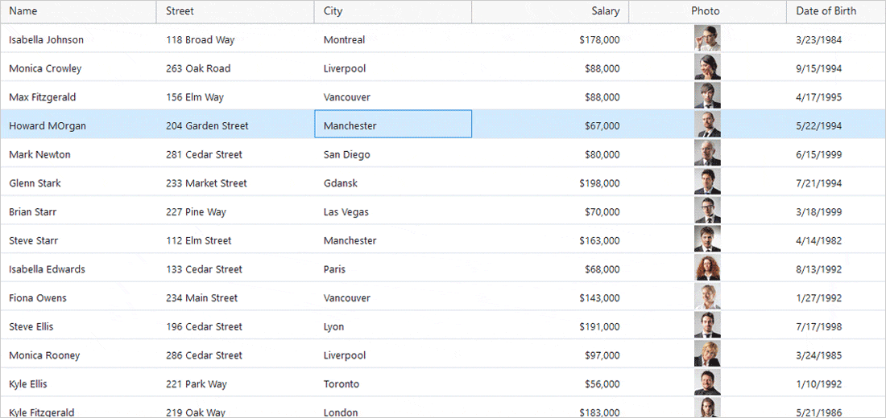
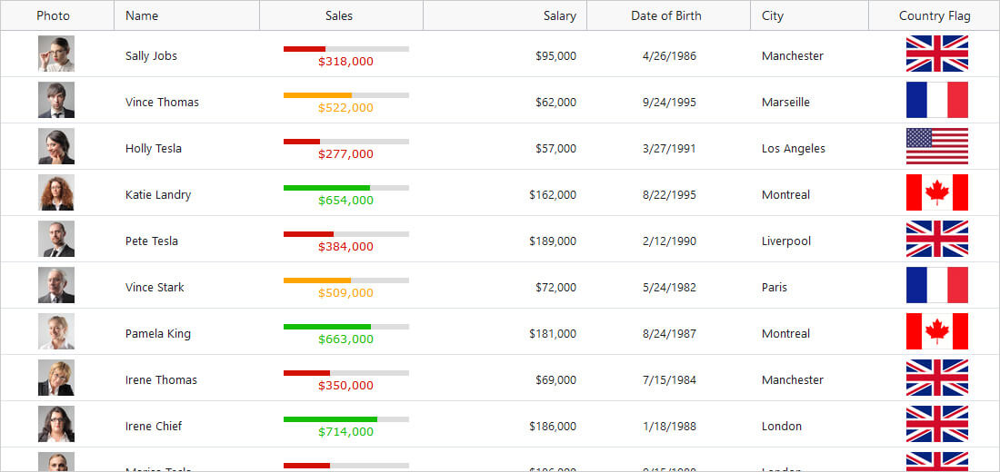
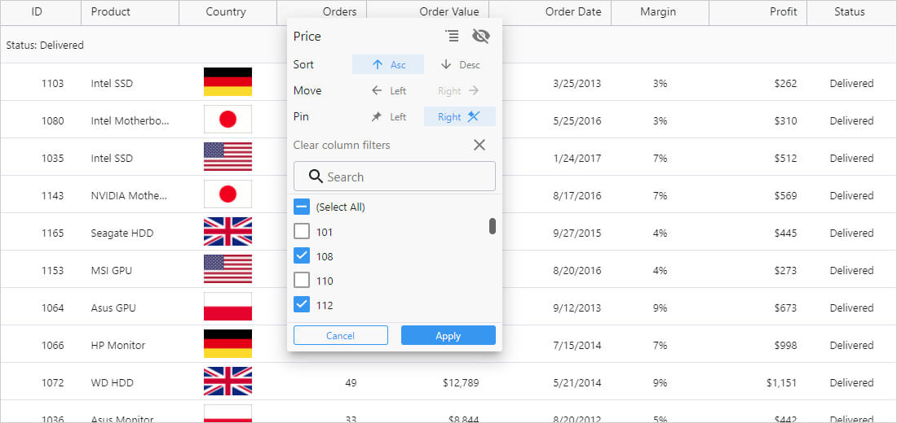
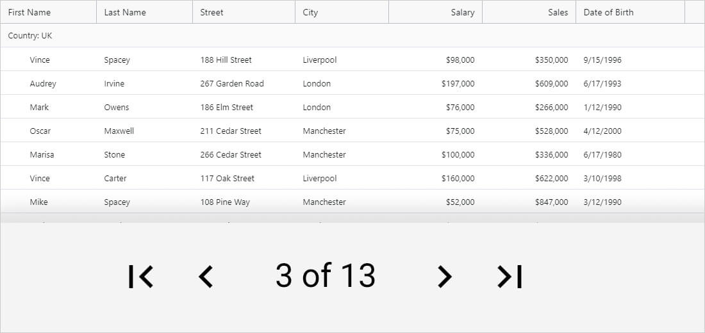

    

# 高速 $Platform$ データ グリッド

<!-- React -->

Angular データ グリッド/データ テーブルは、一連の行と列で表データを表示するために使用されるコンポーネントです。テーブルとも呼ばれるデータ グリッドは、Microsoft Excel などの一般的なソフトウェアでデスクトップの世界でよく知られています。グリッドはデスクトップ プラットフォームで長い間利用されてきますが、最近 $Platform$ UI などの Web アプリ UI の一部になりました。最新のグリッドは複雑で、データ バインディング、編集、Excel のようなフィルタリング、カスタム並べ替え、グループ化、行の並べ替え、行と列の固定、行の集計、Excel、CSV、PDF 形式のエクスポートなど、さまざまな機能および機能が含まれる場合があります。

<!--end: React -->

<!-- WebComponents -->

$Platform$ データ グリッドは $Platform$ データ テーブルとも呼ばれ、データを一連の行と列としてバインドおよび表示できるようにするデータ視覚化コンポーネントです。これらは、Web アプリケーションのユーザー インターフェイスの世界ではやや新しいものですが、デスクトップ プラットフォームでは、Microsoft Excel など、さまざまな形式でかなり長い間利用されてきました。これらのグリッドとテーブルは通常、セルと行の選択、フィルタリング、編集、行と列の非表示、列の集計、検索、データをタイプ固有の列に表示する機能など、非常に複雑な機能を備えています。

<!-- end: WebComponents -->

<!-- Blazor -->

$Platform$ データ テーブルは、より一般的に $Platform$ データ グリッドとして知られており、バインドされたデータを一連の行と列として視覚化できるようにするコンポーネントです。これらのデータ グリッドは、WPF や Windowsフォームなどのデスクトップ関連のプラットフォームでかなり長い間利用されてきましたが、Web アプリケーションの開発に利用できるようになったのはごく最近のことです。最新の Web アプリケーションは、データ バインド、セルと行の選択、セルおよび行の編集とエラーの検証、列集計、インタラクティブな Outlook スタイルのグループ化、Microsoft Excel スタイルのフィルタリング、数百万のレコードのロードを可能にする行と列の仮想化などの豊富な機能を備えたテーブルとデータ グリッドを使用します。

<!-- end: Blazor -->

<!-- WebComponents -->

## Web コンポーネントの概要

Web コンポーネントは、既存の Web 標準に準拠した Web ベースの API のライブラリであり、Web アプリケーションやページで使用する再利用可能なカスタム HTML オブジェクトとタグを作成できます。これらのコンポーネントは、Javascript ライブラリまたは HTML を利用するフレームワークで動作する最新の Web アプリケーション内で使用できます。

<!-- end: WebComponents -->

## $Platform$ Grid 例

この $Platform$ グリッドの例では、検索およびフィルタリング、列のソート、サイズ変更、ピン固定と非表示、行のグループ化、グリッド集計、水平および垂直方向のスクロール、セルに組み込まれたリニア プログレス バー インジケーター コンポーネントとスパークライン コンポーネントを含むセル スタイリングなどのグリッドの機能を使用して、ユーザーがデータのビューをカスタマイズする方法を確認できます。

<code-view style="height: 435px"
           data-demos-base-url="{environment:dvDemosBaseUrl}"
           iframe-src="{environment:dvDemosBaseUrl}/grids/data-grid-overview"
           alt="$Platform$ Grid 例" >
</code-view>

このサンプルが気に入りましたか? 完全な $Platform$ ツールキットにアクセスして、すばやく独自のアプリの作成を開始します。<a href="{environment:infragisticsBaseUrl}/products/$ProductSpinal$/download">無料でダウンロードできます。</a>

## $Platform$ Data Grid の利点

$Platform$ データ グリッドは、大量のデータをすばやく保存してソートされる必要がある場合に重要です。これには、大量の高速データ頻繁を使用する財務サービス、銀行および保険などの業界が含まれます。これらの企業の成功は、データ グリッドの機能とパフォーマンスに依存します。たとえば、在庫をマイクロ秒単位で決定する場合、データグ リッドが遅延時間やちらつきのない状態で実行する必要があります。

## $Platform$ Data Grid 機能

$ProductName$ のデータ グリッドは、大量のリアルタイム データのみにとどまるものではありません。これは機能豊富な $Platform$ グリッドであり、ごくわずかなコードだけでは実現できない機能を提供します。
この例は、データ グリッドの主な機能のいくつかを示しています:

<ul id="features-list">
<li>数百万のレコードをロードできる[仮想化された行と列](data-grid-live-data.md)</li>

<li>セル、行、および一括更新オプションを使用した[インライン編集](data-grid-cell-editing.md)</li>

<li>[Excel スタイル フィルタリング](data-grid-column-filtering.md)と [Excel キーボード ナビゲーション](data-grid-cell-activation.md)機能</li>

<li>インタラクティブな [Outlook スタイルのようなグループ化](data-grid-row-grouping.md)</li>

<li>グリッド セルまたは列のデータに基づいた[列集計](data-grid-column-summaries.md)</li>

<!-- React, WebComponents -->
<li>Excel へのエクスポート ([データ可視化](..\excel-library-working-with-charts.md)を含む)</li>
<!-- end: React, WebComponents -->

<li>単一および複数選択の[セルと行の選択](data-grid-cell-selection.md)</li>

<li>モバイル アプリケーション開発の完全なタッチ操作サポート</li>
</ul>

### 高速 $Platform$ データ グリッド例

Demo

<code-view style="height: 435px"
           data-demos-base-url="{environment:dvDemosBaseUrl}"
           iframe-src="{environment:dvDemosBaseUrl}/grids/data-grid-type-marketing-table"  >
</code-view>

### データの仮想化とパフォーマンス

データの仮想化とパフォーマンス

<!-- React -->

データ グリッドの列と行レベルの仮想化により、$Platform$ グリッド内の無制限の行と列をシームレスにスクロールします。ローカルまたはリモートのデータ ソースのサポートにより、データがどこにあっても最高のパフォーマンスを得ることができます。ユーザーは Excel のようなスクロールを体験し、エンタープライズ スピード (ラグ、画面のちらつき、視覚的な遅延) なしで、パフォーマンスを損なうことなく最高のユーザー エクスペリエンス (UX) を提供します。

<!--end: React -->

<!-- WebComponents -->

$Platform$ データ グリッドは、パフォーマンスを高速かつ流動的に保つと同時に、無限の数のレコードをプロットする機能を提供します。これは、メモリ フットプリントに表示されているセルと行のみを残すという、組み込みの積極的な行と列の仮想化技術によって行われます。エンド ユーザーは、Microsoft Excel のようなスクロールで、ラグや視覚的な遅延、または画面のちらつきがなく、可能な限り最高のユーザー エクスペリエンスを得ることができます。

<!-- end: WebComponents -->

<!-- Blazor -->

$ProductName$ データ グリッド コンポーネントには、グリッドの行とセルの仮想化が組み込まれています。つまり、メモリに保持される行とセルは、データ ソースがローカルであるかリモートであるかに関係なく、現在表示されているものだけです。これにより、何百万ものレコードをグリッドにプロットする場合でも、垂直および水平スクロールでExcel のようにシームレスで視覚的な遅延や画面のちらつきのない、最高のパフォーマンスが得られます。

<!-- end: Blazor -->

    <h4 class="h2" style="text-align: center; font-weight: 700; margin-top: 0;" >すばやく簡単に $Platform$ テーブルをカスタマイズ、構築および実装</h4>
    

    
$ProductName$ データ グリッドは、データの無制限の行と列を処理できると同時に、カスタム テンプレートとリアルタイムのデータ更新へのアクセスを提供します。簡単なテーマ設定とブランディングのための直感的な API を備えており、最小限のコードでデータにすばやくバインドできます。

    

        

            <a class="cta-btn no-external-icon ui-btn--sm" href="{environment:infragisticsBaseUrl}/resources/sample-applications">サンプルの表示</a>
        

    

    

### $Platform$ Grid セルおよび行選択

<!-- React -->

    

    

        $Platform$ Grid セルおよび行選択
        
$Platform$ データグリッドには、SingleCell、SingleRow、MultipleCell、MultipleRow、RangeCell などのモードを含む、セルおよび行レベルごとのマウスおよび[タッチ操作選択](data-grid-cell-selection.md)のすべてのオプションが含まれています。

    

<!--end: React -->

<!-- WebComponents -->

    

    

        $Platform$ Grid セルおよび行選択
        
$Platform$ データ グリッドには、セルと行の両方に対して[マウスおよびタッチ操作選択](data-grid-cell-selection.md)を構成する機能があります。単一または複数のセルと行を選択でき、範囲選択を使用する機能も利用できます。

    

<!-- end: WebComponents -->

<!-- Blazor -->

    

    

        $Platform$ Grid セルおよび行選択
        
$ProductName$ データ グリッド コンポーネントには、ユーザーによるマウスとタッチスクリーン操作の両方を使用して[行とセルを選択する](data-grid-cell-selection.md)オプションが含まれています。セルと行の選択で使用できるモードには、MultipleCell、MultipleRow、SingleCell、SingleRow、および RangeCell があります。

    

<!-- end: Blazor -->

### $Platform$ Grid フィルタリング

<!-- React -->

    

        
    

    

        $Platform$ Grid フィルタリング
        
$Platform$ データ グリッドには、フィルタリングされる列のデータ型に基づいた[列フィルタリング](data-grid-column-filtering.md)が含まれています。たとえば、列が DateTime フィールドの場合、Last Month、This Quarter、Next Week などのフィルターを使用できます。

    

<!--end: React -->

<!-- WebComponents -->

    

        
    

    

        $Platform$ Grid フィルタリング
        
ユーザーは、$Platform$ データ グリッドのデータ型に基づいて[列をフィルタリングする](data-grid-column-filtering.md)ことができます。たとえば、列が数値型プロパティである場合、Greater Than、Less Than、Equal To などのフィルタリング オプションを使用できます。

    

<!-- end: WebComponents -->

<!-- Blazor -->

    

        
    

    

        $Platform$ Grid フィルタリング
        
$ProductName$ データ グリッドを使用すると、ユーザーは、フィルターが適用されるデータ型に基づいて[列をフィルタリング](data-grid-column-filtering.md)できます。たとえば、列がデータ 項目の文字列型プロパティである場合、Contains、Starts With、EndsWith などのフィルタリング オプションを使用できます。

    

<!-- end: Blazor -->

### $Platform$ Grid 列移動

<!-- React -->

    

    

        $Platform$ Grid 列移動
        
[列の順序](data-grid-column-moving.md)の再配置は、$Platform$ データ グリッドでクリックアンドドラッグするのと同じくらい簡単です。完全なアニメーション エンジンも含まれているため、このインタラクションの UX を制御できます。

    

<!--end: React -->

<!-- WebComponents -->

    

    

        $Platform$ Grid 列移動
        
ユーザーは、列ヘッダーをクリックしてドラッグするだけで、$Platform$ データ グリッドに表示される列の[順序を変更](data-grid-column-moving.md)できます。この列の動作に組み込みのアニメーションを使用するオプションも含まれています。

    

<!-- end: WebComponents -->

<!-- Blazor -->

    

    

        $Platform$ Grid 列移動
        
$Platform$ データ グリッドには、列をクリックおよびドラッグして[列を並べ替えて再配置する](data-grid-column-moving.md)機能が組み込まれています。列のドラッグによる移動をアニメーション化する機能を使用して、アプリケーションのユーザー エクスペリエンスをより細かく制御できます。

    

<!-- end: Blazor -->

### $Platform$ Grid 列ピン固定

<!-- React -->

    

    

        $Platform$ Grid 列ピン固定
        
$Platform$ データグリッドの左右の[列ピン固定](data-grid-column-pinning.md)を使用すると、ユーザーは 1 つの列または複数の任意の順序でロックできるため、水平方向にスクロールしながら列の位置を維持できます。

    

<!--end: React -->

<!-- WebComponents -->

    

    

        $Platform$ Grid 列ピン固定
        
$Platform$ データグリッドの左右の[列ピン固定](data-grid-column-pinning.md)を使用すると、ユーザーは 1 つの列または複数の列を任意の順序でロックできるため、水平方向にスクロールしながら列の位置を維持できます。

    

<!-- end: WebComponents -->

<!-- Blazor -->

    

    

        $Platform$ Grid 列ピン固定
        
$Platform$ データ グリッド コンポーネントには左側または右側に[列を固定する](data-grid-column-pinning.md)機能があります。列が固定またはピン固定されると、ユーザーがグリッドを水平方向にスクロールしている間、列はその位置を維持します。

    

<!-- end: Blazor -->

### $Platform$ Grid 列サイズ変更

<!-- React -->

    

    

        $Platform$ Grid 列サイズ変更
        
$Platform$ データグリッドは、[列のサイズ変更](data-grid-column-resizing.md)機能をサポートし、テーブル内の他の列に関して、データ グリッド列の表示方法を柔軟に変更できるようにします。

    

<!--end: React -->

<!-- WebComponents -->

    

    

        $Platform$ Grid 列サイズ変更
        
$ProductName$ データ グリッドは、列の境界線をクリックおよびドラッグして[列のサイズを変更する]機能をユーザーに提供します。オプションで、列のサイズ変更をアニメーション化するアニメーション エンジンもあります。

    

<!-- end: WebComponents -->

<!-- Blazor -->

    

    

        $Platform$ Grid 列サイズ変更
        
$Platform$ データグリッドを使用すると、ユーザーはグリッドにある[列のサイズを変更](data-grid-column-resizing.md)できます。データ テーブルは、サイズ変更操作がすぐに実行されるように、またはドラッグが解放されるまで延期されるように、ユーザーがサイズ変更モードを構成できる機能を備えています。

    

<!-- end: Blazor -->

### $Platform$ Grid 列ソート

<!-- React -->

    

    

        $Platform$ Grid 列ソート
        
$Platform$ データ グリッドは、単一、複数、またはトリステート列のソート構成で、昇順および降順の[列ソート](data-grid-column-sorting.md)をサポートします。ソートは、ヘッダーをクリックするか、列オプションのドロップダウンを使用してトリガーされます。

    

<!--end: React -->

<!-- WebComponents -->

    

    

        $Platform$ Grid 列ソート
        
[列データのソート](data-grid-column-sorting.md)を昇順または降順で実行する機能は、$Platform$ データ グリッドで利用できます。ユーザーは、単一、複数、またはトリステートのソート構成でソートすることができ、ヘッダーをクリックするとソートがデフォルトでトリガーされます。

    

<!-- end: WebComponents -->

<!-- Blazor -->

    

    

        $Platform$ Grid 列ソート
        
プロジェクト用の $Platform$ ソート可能グリッドをお探しですか? $ProductName$ データ グリッド コンポーネントには、[列データをソートする](data-grid-column-sorting.md)機能が組み込まれており、単一、複数、またはトリステートのソートの構成を利用できます。デフォルトでは、グリッド内の特定の列をソートするには、列ヘッダーをクリックしますが、列オプション ダイアログを使用してソートすることもできます。

    

<!-- end: Blazor -->

### $Platform$ Grid 列集計

<!-- React -->

    

    

        $Platform$ Grid 列集計
        
$Platform$ データ グリッドは、データ グリッドのフッター領域またはグループ ヘッダー[列集計](data-grid-column-summaries.md)をサポートします。これは、Count、Sum、Min、Max、Avg などの値を表示するのに最適です。

    

<!--end: React -->

<!-- WebComponents -->

    

    

        $Platform$ Grid 列集計
        
[列集計](data-grid-column-summaries.md) は、$Platform$ データ グリッドのフッター領域に表示でき、グループ ヘッダーにも表示するように構成可能なオプションもあります。これは、他の集計オプションの中でも、数値データの Sum、Minimum、および Maximum を表示するのに役立ちます。

    

<!-- end: WebComponents -->

<!-- Blazor -->

    

    

        $Platform$ Grid 列集計
        
ユーザーは、$Platform$ データ グリッド コンポーネントで[列集計](data-grid-column-summaries.md)を適用することができます。これらの集計には、数値データの Sum、Minimum、Maximum などを表示する機能があり、グリッドのフッターまたはグループ ヘッダーに表示するように構成できます。

    

<!-- end: Blazor -->

### $Platform$ Grid 列タイプ

<!-- React -->

    

    

        $Platform$ Grid 列タイプ
        
$Platform$ データ グリッドは、さまざまな列タイプに加えて、テンプレート[列タイプ](data-grid-column-types.md)とスパークライン テンプレート タイプをサポートしており、グリッド内のデータの表示方法を完全に柔軟に設定できます。

    

<!--end: React -->

<!-- WebComponents -->

    

    

        $Platform$ Grid 列タイプ
        
$Platform$ データ グリッドには、データ ソースで使用される多様なデータ型に固有のさまざまな[列タイプ](data-grid-column-types.md)があります。さらに、テンプレート列を使用すると、その列のセル内にほぼすべてのものを配置することが可能で、ユーザーは UI を完全に柔軟に変更できます。

    

<!-- end: WebComponents -->

<!-- Blazor -->

    

    

        $Platform$ Grid 列タイプ
        
$ProductName$ データ グリッドを使用すると、ユーザーはさまざまなデータ型固有の[列タイプ](data-grid-column-types.md)を利用して、データを最も効果的に表示できます。データがもう少し複雑な場合は、追加のテンプレート列があり、グリッドのデータ ソースの特定の部分を表示するための独自のセル コンテンツを定義できます。

    

<!-- end: Blazor -->

### $Platform$ グリッドの列アニメーション

<!-- React -->

    

    

        $Platform$ Grid 列アニメーション
        
$Platform$ データ グリッドは、列の非表示や列の移動などのイベント時に[列のアニメーション](data-grid-column-animation.md)をサポートします。$Platform$ データ グリッドで列アニメーションが設定されている場合、対応するアニメーションはその列のすべてのセルに対して発生します。

    

<!--end: React -->

<!-- WebComponents -->

    

    

        $Platform$ Grid 列アニメーション
        
$ProductName$ データ グリッド コンポーネントには、ユーザーが実行できるさまざまなアクションに応じて[列ヘッダーとセルをアニメーション化する](data-grid-column-animation.md)機能が組み込まれています。たとえば、列の追加、非表示、移動アクションなどに使用できるさまざまなアニメーションがあります。

    

<!-- end: WebComponents -->

<!-- Blazor -->

    

    

        $Platform$ Grid 列アニメーション
        
$Platform$ データ グリッドは、列の非表示や列の移動などのイベント時に[列アニメーション](data-grid-column-animation.md)をサポートします。$Platform$ データグリッドで列アニメーションが設定されている場合、対応するアニメーションはその列のすべてのセルに対して発生します。

    

<!-- end: Blazor -->

### $Platform$ Grid 列オプション ダイアログ

<!-- React -->

    

    

        $Platform$ Grid 列オプション ダイアログ
        
$Platform$ データ グリッドは、各列ヘッダに表示される UI による列のグループ化、非表示、移動、固定、フィルター、および並べ替えの機能をサポートします。[列オプション](data-grid-column-options.md)は、列ホバーの Kebab メニューを介して、すべての列でデフォルトでオンになっています。

    

<!--end: React -->

<!-- WebComponents -->

    

    

        $Platform$ Grid 列オプション ダイアログ
        
Kebab メニューは、$ProductName$ データ グリッドの列ヘッダーで使用できます。クリックすると、その列の[オプション ダイアログ](data-grid-column-options.md)が開きます。このダイアログを使用すると、ユーザーは、そのダイアログの対象列をグループ化、ソート、非表示、移動、固定、およびフィルタリングできます。

    

<!-- end: WebComponents -->

<!-- Blazor -->

    

    

        $Platform$ Grid 列オプション ダイアログ
        
$Platform$ データ グリッドの各列は、同じ場所 ([列オプション ダイアログ](data-grid-column-options.md)) からソート、グループ化、非表示、移動、および固定できます。グリッドの各列ヘッダーには、マウスをホバーすると Kebab メニューが表示され、クリックするとこのダイアログが表示されます。

    

<!-- end: Blazor -->

### $Platform$ 列と行の Outlook スタイルのグループ化

<!-- React -->

    

    

        $Platform$ Grid 列と行の Outlook スタイルのグループ化
        
$Platform$ データ グリッドを使用すると、行を「固定ヘッダー」[行グループにまとめる](data-grid-row-grouping.md)ことができます。Microsoft Outlook の Group By 機能と同様に、ユーザーは独自の基準に基づいてデータを視覚的にグループ化する簡単な方法があります。

    

<!--end: React -->

<!-- WebComponents -->

    

    

        $Platform$ Grid 列と行の Outlook スタイルのグループ化
        
$ProductName$ データ グリッドを使用すると、行を「固定ヘッダー」[行グループにまとめる](data-grid-row-grouping.md)ことができます。 ユーザーは、Microsoft Outlook スタイルの方法で、類似したデータ エントリを持つ列でグループ化することにより、類似したデータ項目を視覚化できます。

    

<!-- end: WebComponents -->

<!-- Blazor -->

    

    

        $Platform$ Grid 列と行の Outlook スタイルのグループ化
        
$Platform$ データ グリッド コンポーネントには、Microsoft Outlook でグループが視覚化される方法に影響を受けた[列をグループ化する](data-grid-row-grouping.md)機能が含まれています。グリッド内の複数の列をグループ化して、複数のグループ ヘッダーで表示するか、すべてを 1 つにまとめることもできます。

    

<!-- end: Blazor -->

<!-- React -->

### $Platform$ Grid ページング

    

    

    

        $Platform$ Grid Paging
        
$Platform$ データ グリッド [ページング コンポーネント](data-grid-row-paging.md)は、簡単なナビゲーション UI を使用して、データの配列を取り込み、そのデータの一部をページとして出力するように設計されています。

    

<!-- end: React -->

### $Platform$ Grid 行ピン固定

<!-- React -->

    

    

        $Platform$ Grid 行ピン固定
        
$Platform$ データ グリッドを使用すると、データ グリッドの上部に[行をピン固定](data-grid-row-pinning.md)できます。行をピン固定するとその行がグリッドの最上部に複製され、薄い灰色の背景で固定されたままになり、実際の (または元の) 行は低い不透明度で描画され、ユーザーにこれは特別な行であることをわかりやすくします。

    

<!--end: React -->

<!-- WebComponents -->

    

    

        $Platform$ Grid 行ピン固定
        
ユーザーは、$Platform$ Data Grid の上部に[行をピン固定](data-grid-row-pinning.md)できます。行がピン固定されると、グリッドの一番上にコピーされ、ユーザーが垂直にスクロールする間、カスタマイズ可能な背景でその位置にロックされたままになります。コピーされた元の行は元の位置に表示されますが、不透明度は低くなります。

    

<!-- end: WebComponents -->

<!-- Blazor -->

    

    

        $Platform$ Grid 行ピン固定
        
$ProductName$ Data Grid コンポーネントには、[行をピン固定](data-grid-row-pinning.md) をグリッドの最上部に組み込み、ヘッダーの下に表示する組み込みの機能があります。これらの行は、ユーザーがグリッドを垂直方向にスクロールするときに、固定解除されるまで垂直にあります。

    

<!-- end: Blazor -->

### $Platform$ Grid キーボード ナビゲーション

<!-- React -->

    

    

        $Platform$ Grid キーボード ナビゲーション
        
$Platform$ データ グリッドは、Excel のような広範な[キーボード ナビゲーション](data-grid-cell-activation.md)をサポートします。上、下、右、左、タブ、および Enter キーを使用して、$Platform$ データ グリッドで Excel のようなキーボード ナビゲーションを有効にして、アクセシビリティ コンプライアンスを確保し、使いやすさを向上させます。マウスまたはキーボードを使用して単一または複数の行の選択を切り替えて、行全体を選択または選択解除できます。

    

<!--end: React -->

<!-- WebComponents -->

    

    

        $Platform$ Grid キーボード ナビゲーション
        
ユーザーは左矢印、右矢印、上矢印、下矢印、Enter、および Tab キーを使用して、$Platform$ データ グリッドで Excel のような[キーボード ナビゲーション](data-grid-cell-activation.md)を実行できます。これにより、グリッドのエンドユーザー操作が向上し、グリッド全体でよりアクセスしやすい編集が可能になります。

    

<!-- end: WebComponents -->

<!-- Blazor -->

    

    

        $Platform$ Grid キーボード ナビゲーション
        
$Platform$ Data Grid コンポーネントを使用すると、Microsoft Excel と同じように動作する[キーボード ナビゲーション](data-grid-cell-activation.md)を有効にできます。ユーザーのキーボードの矢印、Tab および Enter キーを使用すると、ナビゲーションを考慮してアクセシビリティと使いやすさが向上します。

    

<!-- end: Blazor -->

## $Platform$ Grid 機能

<!-- React -->

<ul>
    <li>[グリッド編集](data-grid-cell-editing.md)</li>
    <li>[セル選択](data-grid-cell-selection.md)</li>
    <li>[セル テンプレート](data-grid-column-types.md#template-column)</li>
    <li>[列フィルタリング](data-grid-column-filtering.md)</li>
    <li>[列の非表示](data-grid-column-chooser.md)</li>
    <li>[列移動](data-grid-column-moving.md)</li>
    <li>[列の集計](data-grid-column-summaries.md)</li>
    <li>[カスタム ツールバー](data-grid-column-chooser.md#toolbars-column-chooser-ui)</li>
    <li>[ピン固定列](data-grid-column-pinning.md)</li>
</ul>
<ul>
    <li>[グリッド ページング](data-grid-row-paging.md)</li>
    <li>[グリッドのソート](data-grid-column-sorting.md)</li>
    <li>[リアルタイム/ライブ データ](data-grid-live-data.md)</li>
    <li>[リモート データのロードオンデマンド](data-grid-remote-data.md)</li>
    <li>[サイズ変更可能な列](data-grid-column-resizing.md)</li>
    <li>[行のグループ化](data-grid-row-grouping.md)</li>
    <li>[行選択](data-grid-cell-selection.md)</li>
    <li>[仮想化とパフォーマンス](data-grid-performance.md)</li>
</ul>

<!-- end: React -->

<!-- WebComponents -->

<ul>
    <li>[グリッド編集](data-grid-cell-editing.md)</li>
    <li>[セル選択](data-grid-cell-selection.md)</li>
    <li>[セル テンプレート](data-grid-column-types.md#template-column)</li>
    <li>[列フィルタリング](data-grid-column-filtering.md)</li>
    <li>[列の非表示](data-grid-column-chooser.md)</li>
    <li>[列移動](data-grid-column-moving.md)</li>
    <li>[列の集計](data-grid-column-summaries.md)</li>
    <li>[カスタム ツールバー](data-grid-column-chooser.md#toolbars-column-chooser-ui)</li>
</ul>
<ul>
    <li>[ピン固定列](data-grid-column-pinning.md)</li>
    <li>[グリッドのソート](data-grid-column-sorting.md)</li>
    <li>[リアルタイム/ライブ データ](data-grid-live-data.md)</li>
    <li>[リモート データのロードオンデマンド](data-grid-remote-data.md)</li>
    <li>[サイズ変更可能な列](data-grid-column-resizing.md)</li>
    <li>[行のグループ化](data-grid-row-grouping.md)</li>
    <li>[行選択](data-grid-cell-selection.md)</li>
    <li>[仮想化とパフォーマンス](data-grid-performance.md)</li>
</ul>

<!-- end: WebComponents -->

<!-- Blazor -->

<ul>
    <li>[グリッド編集](data-grid-cell-editing.md)</li>
    <li>[セル選択](data-grid-cell-selection.md)</li>
    <li>[セル テンプレート](data-grid-column-types.md#template-column)</li>
    <li>[列フィルタリング](data-grid-column-filtering.md)</li>
    <li>[列非表示](data-grid-column-chooser.md)</li>
    <li>[列移動](data-grid-column-moving.md)</li>
    <li>[列集計](data-grid-column-summaries.md)</li>
    <li>[カスタム ツールバー](data-grid-column-chooser.md#toolbars-column-chooser-ui)</li>
</ul>
<ul>
    <li>[ピン固定列](data-grid-column-pinning.md)</li>
    <li>[グリッドのソート](data-grid-column-sorting.md)</li>
    <li>[リアルタイム/ライブ データ](data-grid-live-data.md)</li>
    <li>[サイズ変更可能な列](data-grid-column-resizing.md)</li>
    <li>[行のグループ化](data-grid-row-grouping.md)</li>
    <li>[行選択](data-grid-cell-selection.md)</li>
    <li>[仮想化とパフォーマンス](data-grid-performance.md)</li>
</ul>

<!-- end: Blazor -->

    <h4 class="h2" style="font-weight: 700; margin-top: 0;">高速 $Platform$ Grid のダウンロード</h4>
    

    <a class="cta-btn no-external-icon ui-btn--sm" href="{environment:infragisticsBaseUrl}/products/ignite-ui-$Platform$/download">ダウンロード</a>
     
    30 日間無償お試し版。クレジット カードは不要です。
    

    

    

        <h2>$ProductName$ サポートされるブラウザー</h2>
    

   $Platform$ Data Grid は、すべての最新の Web ブラウザーでサポートされます。

        <ul>
            <li>Chrome</li>
            <li>Edge / Edge Chromium</li>
            <li>Firefox</li>
            <li>Safari</li>
            <li>ポリフィルを使用した Internet Explorer 11</li>
        </ul>
    

    

    

            <h2>$ProductName$ サポート オプション</h2>
    

Infragistics の $Platform$ 製品の受賞歴のあるサポートにアクセスするための複数のオプションがあります。

        <ul>
            <li><a class="no-external-icon" href="{environment:infragisticsBaseUrl}/support/$ProductSpinal$-help">$Platform$ サポート ホーム ページ</a>をご覧ください。</li>
            <li>$Platform$ [ドキュメント](..\general-getting-started.md)を読み、$Platform$ サンプルを試してください。</li>
            <li>最新の情報は、<a class="no-external-icon" href="http://infragistics.com/community/blogs/tags/Ignite UI for $Platform$">$Platform$ ブログをご覧ください。</a> </li>
            <li>アカウントにサインインした後、<a class="no-external-icon" href="{environment:infragisticsBaseUrl}/my-account/support-activity">サポート ケースを送信します。</a> </li>
            <li>$Platform$ <a class="no-external-icon" href="{environment:infragisticsBaseUrl}/resources/sample-applications">参照アプリケーションをお試しください。</a></li>
        </ul>
    

## $ProductName$ 試用ライセンスおよび商用

$ProductName$ は、サブスクリプション モデルで利用可能な商用ライセンス製品です。$ProductName$ 製品は、<a class="no-external-icon" href="{environment:infragisticsBaseUrl}/free-downloads">30 日間トライアル版を無料でお試しいただけます</a>。試用期間が終了したら、弊社 Web サイトから<a class="no-external-icon" href="{environment:infragisticsBaseUrl}/how-to-buy/product-pricing">ライセンスを購入するか</a>、<a class="no-external-icon" href="{environment:infragisticsBaseUrl}/about-us/contact-us">お住まいの地域の営業担当者にお問い合わせください</a>。

## FAQ

<!-- React, WebComponents -->

    

        
Infragistics $ProductName$ Data Grid を選択する理由とはなんですか？

        

        

            <ul>
                <li>数百万のレコードをロードできる[仮想化された行と列](data-grid-live-data.md)</li>
                <li>セル、行、および一括更新オプションを使用した[インライン編集](data-grid-cell-editing.md)</li>
                <li>[Excel スタイル フィルタリング](data-grid-column-filtering.md)と [Excel キーボード ナビゲーション](data-grid-cell-activation.md)機能</li>
                <li>インタラクティブな [Outlook スタイルのようなグループ化](data-grid-row-grouping.md)</li>
                <li>グリッド セルまたは列のデータに基づいた[列集計](data-grid-column-summaries.md)</li>
                <li>Excel へのエクスポート ([データ可視化](..\excel-library-working-with-charts.md)を含む)</li>
                <li>単一選択および複数選択の[セルと行の選択](data-grid-cell-selection.md)</li>
                <li>モバイル アプリケーション開発の完全なタッチ サポート</li>
            </ul>
        

    

    

    
Infragistics $ProductName$ Data Grid の価格について教えてください。

    

    

$ProductName$ コンポーネントは、Ignite UI バンドルの一部として含まれています。

$ProductName$ は、サブスクリプション モデルで利用可能な商用ライセンス製品です。このサブスクリプションには、$Platform$ グリッド、$Platform$ チャート、その他の $Platform$ UI コントロールが含まれます。

価格の詳細については、<a class="no-external-icon" href="{environment:infragisticsBaseUrl}/how-to-buy/product-pricing">価格ページを参照してください。</a>

複数のプラットフォームでアプリケーションを開発する場合、WPF や Windows Forms などのデスクトップ プラットフォーム、Angular、Web コンポーネント、ASP.NET MVC、ASP.NET Core のすべての最新 Web ツールセットを含む完全なアプリ開発パッケージ Infragistics Ultimate を検討してください。
    

    

    

        
Infragistics $ProductName$ Data Grid コントロールを個別に購入できますか？

        

        

        $Platform$ Data Grid を個別に購入することはできません。これは <a class="no-external-icon" href="{environment:infragisticsBaseUrl}/products/ignite-ui">Ignite UI 製品バンドル</a>の一部です。Ignite UI 製品バンドルは、Angular、ASP.NET MVC、Web コンポーネント、ASP.NET Blazor などのすべての Web プラットフォームに対して、何百ものコントロール、コンポーネント、およびデータの視覚化を提供します。
        

    

    

        
Infragistics $ProductName$ Data Grid コントロールを個別に購入できますか？

        

        

        $Platform$ Data Grid の使用を開始するには、[作業の開始ガイド](..\general-getting-started.md)の手順を実行してください。<a class="no-external-icon" href="{environment:infragisticsBaseUrl}/resources/sample-applications">サンプル アプリケーション</a>のライブラリも用意しています。サンプル ライブラリは、$Platform$ 開発のベスト プラクティス ガイドです。
        

    

<!-- end: React, WebComponents -->

<!-- Blazor -->

    

        
Infragistics $ProductName$ Data Grid を選択する理由とはなんですか？

        

        

            <ul>
                <li>数百万のレコードをロードできる[仮想化された行と列](data-grid-live-data.md)</li>
                <li>セル、行、および一括更新オプションを使用した[インライン編集](data-grid-cell-editing.md)</li>
                <li>[Excel スタイル フィルタリング](data-grid-column-filtering.md)と [Excel キーボード ナビゲーション](data-grid-cell-activation.md)機能</li>
                <li>インタラクティブな [Outlook スタイルのようなグループ化](data-grid-row-grouping.md)</li>
                <li>グリッド セルまたは列のデータに基づいた[列集計](data-grid-column-summaries.md)</li>
                <li>単一選択および複数選択の[セルと行の選択](data-grid-cell-selection.md)</li>
                <li>モバイル アプリケーション開発の完全なタッチ サポート</li>
            </ul>
        

    

    

    
Infragistics $ProductName$ Data Grid の価格について教えてください。

    

    

$ProductName$ コンポーネントは、Ignite UI バンドルの一部として含まれています。 

$ProductName$ は、サブスクリプション モデルで利用可能な商用ライセンス製品です。このサブスクリプションには、$Platform$ グリッド、$Platform$ チャート、その他の $Platform$ UI コントロールが含まれます。

価格の詳細については、<a class="no-external-icon" href="{environment:infragisticsBaseUrl}/how-to-buy/product-pricing">価格ページを参照してください。</a>

複数のプラットフォームでアプリケーションを開発する場合、WPF や Windows Forms などのデスクトップ プラットフォーム、Angular、Web コンポーネント、ASP.NET MVC、ASP.NET Core のすべての最新 Web ツールセットを含む完全なアプリ開発パッケージ Infragistics Ultimate を検討してください。
    

    

    

        
Infragistics $ProductName$ Data Grid コントロールを個別に購入できますか？

        

        

        $Platform$ Data Grid を個別に購入することはできません。これは <a class="no-external-icon" href="{environment:infragisticsBaseUrl}/products/$ProductSpinal$">Ignite UI 製品バンドル</a>の一部です。Ignite UI 製品バンドルは、Angular、ASP.NET MVC、Web コンポーネント、ASP.NET Blazor などのすべての Web プラットフォームに対して、何百ものコントロール、コンポーネント、およびデータの視覚化を提供します。
        

    

    

        
Infragistics $ProductName$ Data Grid コントロールを個別に購入できますか？

        

        

        $Platform$ Data Grid の使用を開始するには、[作業の開始ガイド](..\general-getting-started.md)の手順を実行してください。<a class="no-external-icon" href="{environment:infragisticsBaseUrl}/resources/sample-applications">サンプル アプリケーション</a>のライブラリも用意しています。サンプル ライブラリは、$Platform$ 開発のベスト プラクティス ガイドです。
        

    

<!-- end: Blazor -->

