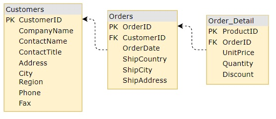

# Hierarchical Grid ロードオンデマンド

Ignite UI for {Platform} `HierarchicalGrid` は、要求するサーバーからのデータを最低限にすることによりすばやく描画できます。このため、ユーザーがビューで結果を確認でき、表示データをインタラクティブに操作できます。初期時にグリッドのデータのみが取得されて描画され、ユーザーが子グリッドを含む行を拡張した後のみ、特定の子グリッドのデータを取得します。このメカニズムは、ロードオンデマンドであらゆるリモートデータとの設定が簡単にできます。

このトピックは、既に利用可能なリモート oData v4 サービスと通信してリモート サービス プロバイダーを作成し、ロードオンデマンドを設定する方法を説明します。以下は、デモと作成手順を示します。

## {Platform} Hierarchical Grid ロードオンデマンドの例

`sample="/{HierarchicalGridSample}/data-performance-virtualization", height="700", alt="{Platform} Hierarchical Grid ロードオンデマンドの例"`

### リモート サービス プロバイダー

はじめにサービス プロバイダーを準備して階層グリッドに必要なデータを取得します。

#### 基本データの取得

<!-- Angular -->
ブラウザーが提供する XMLHttpRequest インターフェイス を使用した HTTP プロトコルでバックエンドサービスと通信します。簡易的なクライアント HTTP API を提供する Angular の [`HttpClient`](https://angular.io/api/common/http/HttpClient) モジュールを使用してより簡単に行うことができます。データを取得にはサービスのシンプルなメソッドが必要となります。

```typescript
public getData(dataState): Observable<any[]> {
    return this.http.get(this.buildUrl(dataState)).pipe(
        map(response => response['value']),
    );
}
```

`this.http` は、`HttpCLient` モジュールの参照となり、`buildUrl()` は取得したデータに基づいて url を生成するメソッドになります。実行された非同期のため、返信をマップして結果値のみ取得し、Observable を返します。それにより後でサブスクライブし、アプリケーションで処理を進めてグリッドへ渡すことができます。
<!-- end: Angular -->

<!-- WebComponents, React -->
ブラウザーが提供する [`fetch()`](https://developer.mozilla.org/en-US/docs/Web/API/fetch) グローバル関数を使用した HTTP プロトコルでバックエンドサービスと通信します。データを取得にはサービスのシンプルなメソッドが必要となります。

```ts
function getData(dataState) {
    return fetch(buildUrl(dataState))
        .then((result) => result.json())
        .then((data) => data['value']);
}
```

`buildUrl()` は取得したデータに基づいて url を生成するメソッドになります。実行された非同期のため、返信をマップして結果値のみ取得し、Promise を返します。それにより後でサブスクライブし、アプリケーションで処理を進めてグリッドへ渡すことができます。
<!-- end: WebComponents, React -->

<!-- Blazor -->
ブラウザーが提供する [`fetch()`](https://developer.mozilla.org/ja-JP/docs/Web/API/fetch) グローバル関数を使用した HTTP プロトコルでバックエンドサービスと通信します。データを取得にはサービスのシンプルなメソッドが必要となります。

```razor
function getData(dataState) {
    return fetch(buildUrl(dataState))
        .then((result) => result.json())
        .then((data) => data['value']);
}
```

`buildUrl()` は取得したデータに基づいて url を生成するメソッドになります。実行された非同期のため、返信をマップして結果値のみ取得し、Promise を返します。それにより後でサブスクライブし、アプリケーションで処理を進めてグリッドへ渡すことができます。
<!-- end: Blazor -->

#### 要求 URL のビルド

次に GET 要求の URL をビルドする方法を定義します。メイン グリッドのデータを取得できますが含まれる子グリッドのデータも取得できます。ルート レベルに[こちら](https://services.odata.org/V4/Northwind/Northwind.svc/)の `Customers` データを使用し、それ以外のレベルには `Order` と `Order_Details` を使用します。このモデルはアプリケーションごとに異なりますが、ここでは以下を使用します。



はじめに必要となるのはグリッドのデータ、親業のプライマリキーとその一意の ID をどこから取得するかを決定するテーブルの `key` が必要です。

<!-- Angular -->
インターフェイス `IDataState` でこれらすべてを定義します。例:

```typescript
export interface IDataState {
    key: string;
    parentID: any;
    parentKey: string;
    rootLevel: boolean;
}

//...
public buildUrl(dataState: IDataState): string {
    let qS = "";
    if (dataState) {
        qS += `${dataState.key}?`;

        if (!dataState.rootLevel) {
            if (typeof dataState.parentID === "string") {
                qS += `$filter=${dataState.parentKey} eq '${dataState.parentID}'`;
            } else {
                qS += `$filter=${dataState.parentKey} eq ${dataState.parentID}`;
            }
        }
    }
    return `${this.url}${qS}`;
}
//...
```
<!-- end: Angular -->

<!-- WebComponents, React -->
これらすべてを `dataState` オブジェクトで定義します。例:

```ts
const dataState: {
    key: string;
    parentID: any;
    parentKey: string;
    rootLevel: boolean;
} = {
    //...
};

function buildUrl(dataState: any) {
    let qS = "";
    if (dataState) {
        qS += `${dataState.key}?`;

        if (!dataState.rootLevel) {
            if (typeof dataState.parentID === "string") {
                qS += `$filter=${dataState.parentKey} eq '${dataState.parentID}'`;
            } else {
                qS += `$filter=${dataState.parentKey} eq ${dataState.parentID}`;
            }
        }
    }
    return `${URL}${qS}`;
}
```
<!-- end: WebComponents, React -->

<!-- Blazor -->
これらすべてを `dataState` オブジェクトで定義します。例:

```razor
const dataState: {
    key: string;
    parentID: any;
    parentKey: string;
    rootLevel: boolean;
} = {
    //...
};

function buildUrl(dataState) {
    let qS = "";
    if (dataState) {
        qS += `${dataState.key}?`;

        if (!dataState.rootLevel) {
            if (typeof dataState.parentID === "string") {
                qS += `$filter=${dataState.parentKey} eq '${dataState.parentID}'`;
            } else {
                qS += `$filter=${dataState.parentKey} eq ${dataState.parentID}`;
            }
        }
    }
    return `${URL}${qS}`;
}
```
<!-- end: Blazor -->

#### 結果

<!-- Angular -->
最後に `remote-lod.service.ts` は以下のようになります。

```typescript
import { HttpClient } from '@angular/common/http';
import { Injectable } from '@angular/core';
import { Observable } from 'rxjs';
import { map } from 'rxjs/operators';

export interface IDataState {
    key: string;
    parentID: any;
    parentKey: string;
    rootLevel: boolean;
}

@Injectable()
export class RemoteLoDService {
    url = `https://services.odata.org/V4/Northwind/Northwind.svc/`;

    constructor(private http: HttpClient) { }

    public getData(dataState: IDataState): Observable<any[]> {
        return this.http.get(this.buildUrl(dataState)).pipe(
            map((response) => response['value'])
        );
    }

    public buildUrl(dataState: IDataState): string {
        let qS = "";
        if (dataState) {
            qS += `${dataState.key}?`;

            if (!dataState.rootLevel) {
                if (typeof dataState.parentID === "string") {
                    qS += `$filter=${dataState.parentKey} eq '${dataState.parentID}'`;
                } else {
                    qS += `$filter=${dataState.parentKey} eq ${dataState.parentID}`;
                }
            }
        }
        return `${this.url}${qS}`;
    }
}
```
<!-- end: Angular -->

<!-- WebComponents, React -->
最後に、リモート サービスは以下のようになります。

```ts
const URL = `https://services.odata.org/V4/Northwind/Northwind.svc/`;

export function getData(dataState?: any): any {
    return fetch(buildUrl(dataState))
        .then((result) => result.json())
        .then((data) => data["value"]);
}

function buildUrl(dataState: any) {
    let qS = "";
    if (dataState) {
        qS += `${dataState.key}?`;

        if (!dataState.rootLevel) {
            if (typeof dataState.parentID === "string") {
                qS += `$filter=${dataState.parentKey} eq '${dataState.parentID}'`;
            } else {
                qS += `$filter=${dataState.parentKey} eq ${dataState.parentID}`;
            }
        }
    }
    return `${URL}${qS}`;
}
```
<!-- end: WebComponents, React -->

<!-- Blazor -->
最後に、リモート サービスは以下のようになります。

```razor
const URL = `https://services.odata.org/V4/Northwind/Northwind.svc/`;

function getData(dataState): any {
    return fetch(buildUrl(dataState))
        .then((result) => result.json())
        .then((data) => data["value"]);
}

function buildUrl(dataState) {
    let qS = "";
    if (dataState) {
        qS += `${dataState.key}?`;

        if (!dataState.rootLevel) {
            if (typeof dataState.parentID === "string") {
                qS += `$filter=${dataState.parentKey} eq '${dataState.parentID}'`;
            } else {
                qS += `$filter=${dataState.parentKey} eq ${dataState.parentID}`;
            }
        }
    }
    return `${URL}${qS}`;
}
```
<!-- end: Blazor -->

### 階層グリッドの`設定

次に階層グリッドを設定してリモート サービス プロバイダーに接続します。

#### テンプレートの地祇

最初に階層グリッド テンプレートを必要な階層レベルで定義します。customers のルート グリッド `PrimaryKey` は最初のレベルの orders の `CustomerID` です。`OrderID` と各 order 詳細の `ProductID` です。各データベース テーブルとキーで初期テンプレートを定義します。

<!-- Angular -->
```html
<igx-hierarchical-grid #hGrid [primaryKey]="'CustomerID'" [autoGenerate]="false" [height]="'600px'" [width]="'100%'">
    <igx-column field="CustomerID" [hidden]="true"></igx-column>
    <igx-column field="CompanyName"></igx-column>
    <igx-column field="ContactName"></igx-column>
    <igx-column field="ContactTitle"></igx-column>
    <igx-column field="Country"></igx-column>
    <igx-column field="Phone"></igx-column>
    <igx-row-island [key]="'Orders'" [primaryKey]="'OrderID'" [autoGenerate]="false" >
        <igx-column field="OrderID" [hidden]="true"></igx-column>
        <igx-column field="ShipCountry"></igx-column>
        <igx-column field="ShipCity"></igx-column>
        <igx-column field="ShipAddress"></igx-column>
        <igx-column field="OrderDate"></igx-column>
        <igx-row-island [key]="'Order_Details'" [primaryKey]="'ProductID'" [autoGenerate]="false" >
            <igx-column field="ProductID" [hidden]="true"></igx-column>
            <igx-column field="Quantity"></igx-column>
            <igx-column field="UnitPrice"></igx-column>
            <igx-column field="Discount"></igx-column>
        </igx-row-island>
    </igx-row-island>
</igx-hierarchical-grid>
```
<!-- end: Angular -->

<!-- WebComponents -->
```html
<igc-hierarchical-grid id="hGrid" primary-key="CustomerID" height="600px">
    <igc-column field="CustomerID" hidden="true"></igc-column>
    <igc-column field="CompanyName" header="Company Name"></igc-column>
    <igc-column field="ContactName" header="Contact Name"></igc-column>
    <igc-column field="ContactTitle" header="Contact Title"></igc-column>
    <igc-column field="Country"></igc-column>
    <igc-column field="Phone"></igc-column>
    <igc-row-island child-data-key="Orders" primary-key="OrderID">
      <igc-column field="OrderID" hidden="true"></igc-column>
      <igc-column field="ShipCountry" header="Ship Country"></igc-column>
      <igc-column field="ShipCity" header="Ship City"></igc-column>
      <igc-column field="ShipAddress" header="Ship Address"></igc-column>
      <igc-column field="OrderDate" header="Order Date" data-type="date"></igc-column>
      <igc-row-island child-data-key="Order_Details" primary-key="ProductID">
        <igc-column field="ProductID" hidden="true"></igc-column>
        <igc-column field="Quantity"></igc-column>
        <igc-column field="UnitPrice" header="Unit Price"></igc-column>
        <igc-column field="Discount"></igc-column>
      </igc-row-island>
    </igc-row-island>
</igc-hierarchical-grid>
```
<!-- end: WebComponents -->

<!-- React -->
```tsx
<IgrHierarchicalGrid ref={hierarchicalGrid} primaryKey="CustomerID" height="600px">
    <IgrColumn field="CustomerID" hidden={true}></IgrColumn>
    <IgrColumn field="CompanyName" header="Company Name"></IgrColumn>
    <IgrColumn field="ContactName" header="Contact Name"></IgrColumn>
    <IgrColumn field="ContactTitle" header="Contact Title"></IgrColumn>
    <IgrColumn field="Country"></IgrColumn>
    <IgrColumn field="Phone"></IgrColumn>
    <IgrRowIsland childDataKey="Orders" primaryKey="OrderID">
      <IgrColumn field="OrderID" hidden={true}></IgrColumn>
      <IgrColumn field="ShipCountry" header="Ship Country"></IgrColumn>
      <IgrColumn field="ShipCity" header="Ship City"></IgrColumn>
      <IgrColumn field="ShipAddress" header="Ship Address"></IgrColumn>
      <IgrColumn field="OrderDate" header="Order Date" dataType="date"></IgrColumn>
      <IgrRowIsland childDataKey="Order_Details" primaryKey="ProductID">
        <IgrColumn field="ProductID" hidden={true}></IgrColumn>
        <IgrColumn field="Quantity"></IgrColumn>
        <IgrColumn field="UnitPrice" header="Unit Price"></IgrColumn>
        <IgrColumn field="Discount"></IgrColumn>
      </IgrRowIsland>
    </IgrRowIsland>
</IgrHierarchicalGrid>
```
<!-- end: React -->

<!-- Blazor -->
```razor
<IgbHierarchicalGrid Id="hGrid" PrimaryKey="CustomerID" Height="600px">
    <IgbColumn Field="CustomerID" Hidden="true"></IgbColumn>
    <IgbColumn Field="CompanyName" Header="Company Name"></IgbColumn>
    <IgbColumn Field="ContactName" Header="Contact Name"></IgbColumn>
    <IgbColumn Field="ContactTitle" Header="Contact Title"></IgbColumn>
    <IgbColumn Field="Country"></IgbColumn>
    <IgbColumn Field="Phone"></IgbColumn>
    <IgbRowIsland ChildDataKey="Orders" PrimaryKey="OrderID">
        <IgbColumn Field="OrderID" Hidden="true"></IgbColumn>
        <IgbColumn Field="ShipCountry" Header="Ship Country"></IgbColumn>
        <IgbColumn Field="ShipCity" Header="Ship City"></IgbColumn>
        <IgbColumn Field="ShipAddress" Header="Ship Address"></IgbColumn>
        <IgbColumn Field="OrderDate" Header="Order Date" DataType="GridColumnDataType.Date"></IgbColumn>
        <IgbRowIsland ChildDataKey="Order_Details" PrimaryKey="ProductID">
            <IgbColumn Field="ProductID" Hidden="true"></IgbColumn>
            <IgbColumn Field="Quantity"></IgbColumn>
            <IgbColumn Field="UnitPrice" Header="Unit Price"></IgbColumn>
            <IgbColumn Field="Discount"></IgbColumn>
        </IgbRowIsland>
    </IgbRowIsland>
</IgbHierarchicalGrid>
```
<!-- end: Blazor -->

ルート レベル階層グリッドと最終的にはその子のデータがテンプレートに必要となります。

<!-- Angular -->
`#hGrid` 参照が使用できるため、コードでサービスからデータ取得後にルート グリッドのデータを簡単に設定できます。
<!-- end: Angular -->

<!-- WebComponents -->
`id="hGrid"` 参照が使用できるため、コードでサービスからデータ取得後にルート グリッドのデータを簡単に設定できます。
<!-- end: WebComponents -->

<!-- React -->
`ref={hierarchicalGrid}` 参照が使用できるため、コードでサービスからデータ取得後にルート グリッドのデータを簡単に設定できます。
<!-- end: React -->

<!-- Blazor -->
`Id="hGrid"` 参照が使用できるため、コードでサービスからデータ取得後にルート グリッドのデータを簡単に設定できます。
<!-- end: Blazor -->

展開されている子にデータを設定する方法は異なります。行がはじめて展開されたときに新し子 `HierarchicalGrid` が描画がされるため、データを設定するために新しく作成されたグリッドの参照を取得する必要があります。各 `RowIsland` コンポーネントに `GridCreated` イベントがあり、特定の子アイランドに新しい子グリッドが作成されたときに発生します。新しいグリッドの参照を取得するために使用でき、サービスからデータを要求して適用します。

サービスをビルドしているためルートレベルの場合に情報のみが必要なため、すべてのアイランドに 1 メソッドを使用できます。このすべての情報には、イベント引数から直接またはイベントをトリガーする行アイランドからアクセスできます。 

<!-- Angular, WebComponents, React -->
`gridCreated` を使用するメソッドに名前を付けます。
<!-- end: Angular, WebComponents, React -->

<!-- Blazor -->
`OnGridCreated` を使用するメソッドに名前を付けます。
<!-- end: Blazor -->

<!-- Angular, WebComponents -->
`GridCreated` イベントは `parentID` プロパティ、`owner` として行アイランドへの参照、新しい子 `grid` プロパティを提供するため、最初の引数として渡されます。親行の `primaryKey` についての情報はありませんが、バインドした行アイランドに基づいて 2 番目の引数として簡単に渡すことができます。 
<!-- end: Angular, WebComponents -->

<!-- React -->
`GridCreated` イベントは行アイランド、`parentID` プロパティ、および新しい子グリッド プロパティへの参照を提供するため、これは最初と 2 番目の引数として渡されます。親行の `primaryKey` についての情報はありませんが、バインドした行アイランドに基づいて 2 番目の引数として簡単に渡すことができます。
<!-- end: React -->

<!-- Blazor -->
`GridCreated` イベントは `parentID` プロパティ、`owner` として行アイランドへの参照、新しい子 `grid` プロパティを提供するため、最初の引数として渡されます。親行の `primaryKey` についての情報しかありませんが、行アイランドの `ChildDataKey` に基づいてそれを簡単に判断できます。
<!-- end: Blazor -->

変更を加えたテンプレート ファイルは以下のようになります。

<!-- Angular -->
```html
<igx-hierarchical-grid #hGrid [primaryKey]="'CustomerID'" [autoGenerate]="false" [height]="'600px'" [width]="'100%'">
    <igx-column field="CustomerID" [hidden]="true"></igx-column>
    <igx-column field="CompanyName"></igx-column>
    <igx-column field="ContactName"></igx-column>
    <igx-column field="ContactTitle"></igx-column>
    <igx-column field="Country"></igx-column>
    <igx-column field="Phone"></igx-column>
    <igx-row-island [key]="'Orders'" [primaryKey]="'OrderID'" [autoGenerate]="false" (gridCreated)="gridCreated($event, 'CustomerID')">
        <igx-column field="OrderID" [hidden]="true"></igx-column>
        <igx-column field="ShipCountry"></igx-column>
        <igx-column field="ShipCity"></igx-column>
        <igx-column field="ShipAddress"></igx-column>
        <igx-column field="OrderDate"></igx-column>
        <igx-row-island [key]="'Order_Details'" [primaryKey]="'ProductID'" [autoGenerate]="false" (gridCreated)="gridCreated($event, 'OrderID')">
            <igx-column field="ProductID" [hidden]="true"></igx-column>
            <igx-column field="Quantity"></igx-column>
            <igx-column field="UnitPrice"></igx-column>
            <igx-column field="Discount"></igx-column>
        </igx-row-island>
    </igx-row-island>
</igx-hierarchical-grid>
```
<!-- end: Angular -->

<!-- WebComponents -->
```html
<igc-hierarchical-grid id="hGrid" primary-key="CustomerID" height="600px">
    <igc-column field="CustomerID" hidden="true"></igc-column>
    <igc-column field="CompanyName" header="Company Name"></igc-column>
    <igc-column field="ContactName" header="Contact Name"></igc-column>
    <igc-column field="ContactTitle" header="Contact Title"></igc-column>
    <igc-column field="Country"></igc-column>
    <igc-column field="Phone"></igc-column>
    <igc-row-island id="ordersRowIsland" child-data-key="Orders" primary-key="OrderID">
      <igc-column field="OrderID" hidden="true"></igc-column>
      <igc-column field="ShipCountry" header="Ship Country"></igc-column>
      <igc-column field="ShipCity" header="Ship City"></igc-column>
      <igc-column field="ShipAddress" header="Ship Address"></igc-column>
      <igc-column field="OrderDate" header="Order Date" data-type="date"></igc-column>
      <igc-row-island id="orderDetailsRowIsland" child-data-key="Order_Details" primary-key="ProductID">
        <igc-column field="ProductID" hidden="true"></igc-column>
        <igc-column field="Quantity"></igc-column>
        <igc-column field="UnitPrice" header="Unit Price"></igc-column>
        <igc-column field="Discount"></igc-column>
      </igc-row-island>
    </igc-row-island>
</igc-hierarchical-grid>
```
```ts
constructor() {
    const ordersRowIsland = document.getElementById("ordersRowIsland");
    const orderDetailsRowIsland = document.getElementById("orderDetailsRowIsland");

    ordersRowIsland.addEventListener("gridCreated", (event: any) => {
        this.gridCreated(event, "CustomerID");
    });

    orderDetailsRowIsland.addEventListener("gridCreated", (event: any) => {
        this.gridCreated(event, "OrderID");
    });
}
```
<!-- end: WebComponents -->

<!-- React -->
```tsx
<IgrHierarchicalGrid ref={hierarchicalGrid} primaryKey="CustomerID" height="600px">
    <IgrColumn field="CustomerID" hidden={true}></IgrColumn>
    <IgrColumn field="CompanyName" header="Company Name"></IgrColumn>
    <IgrColumn field="ContactName" header="Contact Name"></IgrColumn>
    <IgrColumn field="ContactTitle" header="Contact Title"></IgrColumn>
    <IgrColumn field="Country"></IgrColumn>
    <IgrColumn field="Phone"></IgrColumn>
    <IgrRowIsland
        childDataKey="Orders"
        primaryKey="OrderID"
        gridCreated={(
          rowIsland: IgrRowIsland,
          e: IgrGridCreatedEventArgs
        ) => gridCreated(rowIsland, e, "CustomerID")}
    >
        <IgrColumn field="OrderID" hidden={true}></IgrColumn>
        <IgrColumn field="ShipCountry" header="Ship Country"></IgrColumn>
        <IgrColumn field="ShipCity" header="Ship City"></IgrColumn>
        <IgrColumn field="ShipAddress" header="Ship Address"></IgrColumn>
        <IgrColumn field="OrderDate" header="Order Date" dataType="date"></IgrColumn>
        <IgrRowIsland
            childDataKey="Order_Details"
            primaryKey="ProductID"
            gridCreated={(
              rowIsland: IgrRowIsland,
              e: IgrGridCreatedEventArgs
            ) => gridCreated(rowIsland, e, "OrderID")}
        >
            <IgrColumn field="ProductID" hidden={true}></IgrColumn>
            <IgrColumn field="Quantity"></IgrColumn>
            <IgrColumn field="UnitPrice" header="Unit Price"></IgrColumn>
            <IgrColumn field="Discount"></IgrColumn>
        </IgrRowIsland>
    </IgrRowIsland>
</IgrHierarchicalGrid>
```
<!-- end: React -->

<!-- Blazor -->
```razor
<IgbHierarchicalGrid Id="hGrid" PrimaryKey="CustomerID" Height="600px">
    <IgbColumn Field="CustomerID" Hidden="true"></IgbColumn>
    <IgbColumn Field="CompanyName" Header="Company Name"></IgbColumn>
    <IgbColumn Field="ContactName" Header="Contact Name"></IgbColumn>
    <IgbColumn Field="ContactTitle" Header="Contact Title"></IgbColumn>
    <IgbColumn Field="Country"></IgbColumn>
    <IgbColumn Field="Phone"></IgbColumn>
    <IgbRowIsland ChildDataKey="Orders" PrimaryKey="OrderID" GridCreatedScript="OnGridCreated">
        <IgbColumn Field="OrderID" Hidden="true"></IgbColumn>
        <IgbColumn Field="ShipCountry" Header="Ship Country"></IgbColumn>
        <IgbColumn Field="ShipCity" Header="Ship City"></IgbColumn>
        <IgbColumn Field="ShipAddress" Header="Ship Address"></IgbColumn>
        <IgbColumn Field="OrderDate" Header="Order Date" DataType="GridColumnDataType.Date"></IgbColumn>
        <IgbRowIsland ChildDataKey="Order_Details" PrimaryKey="ProductID" GridCreatedScript="OnGridCreated">
            <IgbColumn Field="ProductID" Hidden="true"></IgbColumn>
            <IgbColumn Field="Quantity"></IgbColumn>
            <IgbColumn Field="UnitPrice" Header="Unit Price"></IgbColumn>
            <IgbColumn Field="Discount"></IgbColumn>
        </IgbRowIsland>
    </IgbRowIsland>
</IgbHierarchicalGrid>
```
<!-- end: Blazor -->

#### サービスへ接続

最後の手順の 1 つとして、以前作成したサービスに階層グリッドを接続することです。

<!-- Angular -->
`Injectable` として定義するため、プロバイダーとしてアプリケーションへ渡すことができます。`ViewChild` クエリをデータに設定してルートグリッドへの参照も取得します。

```typescript
@Component({
    providers: [RemoteLoDService],
    selector: "app-hierarchical-grid-lod",
    styleUrls: ["./hierarchical-grid-lod.component.scss"],
    templateUrl: "./hierarchical-grid-lod.component.html"
})
export class HierarchicalGridLoDSampleComponent {
    @ViewChild("hGrid")
    public hGrid: IgxHierarchicalGridComponent;

    constructor(private remoteService: RemoteLoDService) { }
}
```

グリッドがサービスのデータを要求して割り当てる前に描画されることを確認するために、ライフサイクル フックを使用します。親がないため、`rootLevel` は **true** でそのキーのみをサービスの `getData` へ渡すことができます。サブスクライブする必要のある observable を返します。

```typescript
public ngAfterViewInit() {
    this.remoteService.getData({ parentID: null, rootLevel: true, key: "Customers" }).subscribe((data) => {
        this.hGrid.data = data;
        this.hGrid.cdr.detectChanges();
    });
}
```
<!-- end: Angular -->

<!-- WebComponents -->
ルート グリッドへの参照を取得して、そのデータを設定します。親がないため、`rootLevel` は **true** でそのキーのみをサービスの `getData` へ渡すことができます。サブスクライブする必要のある Promise を返します。

```ts
constructor() {
    const hierarchicalGrid = document.getElementById("hGrid") as IgcHierarchicalGridComponent;

    getData({ parentID: null, rootLevel: true, key: "Customers" }).then((data: any) => {
        hierarchicalGrid.data = data;
        hierarchicalGrid.markForCheck();
    });
}
```
<!-- end: WebComponents -->

<!-- React -->
`useRef` React フックを介してルート グリッドへの参照を取得し、そのデータを設定します。

```tsx
const hierarchicalGrid = useRef<IgrHierarchicalGrid>(null);
```

グリッドがサービスのデータを要求して割り当てる前に描画されることを確認するために、`useEffect` React フックを使用します。親がないため、`rootLevel` は **true** でそのキーのみをサービスの `getData` へ渡すことができます。サブスクライブする必要のある Promise を返します。

```tsx
useEffect(() => {
    getData({ parentID: null, rootLevel: true, key: "Customers" }).then(
      (data: any) => {
        hierarchicalGrid.current.data = data;
        hierarchicalGrid.current.markForCheck();
      }
    );
}, []);
```
<!-- end: React -->

<!-- Blazor -->
ルート グリッドへの参照を取得して、そのデータを設定します。グリッドがサービスのデータを要求して割り当てる前に描画されることを確認するために、`Rendered` イベントを使用します。親がないため、`rootLevel` は **true** でそのキーのみをサービスの `getData` へ渡すことができます。サブスクライブする必要のある Promise を返します。

```razor
igRegisterScript("OnGridRendered", () => {
    const grid = document.getElementById("hGrid");

    getData({ parentID: null, rootLevel: true, key: "Customers" }).then(
        (data) => {
            grid.data = data;
            grid.markForCheck();
        });
}, false)
```
<!-- end: Blazor -->

<!-- Angular, WebComponents, React -->
次に作成した新しい子グリッドのデータを要求する `gridCreated` メソッドを作成する必要があります。
<!-- end: Angular, WebComponents, React -->

<!-- Blazor -->
次に作成した新しい子グリッドのデータを要求する `OnGridCreated` メソッドを作成する必要があります。
<!-- end: Blazor -->

ルート レベル グリッド データの取得と同様に、ここでは`parentID` や `parentKey` などの情報を渡す必要があります。`rootLevel` はいずれの子も **false** です。

<!-- Angular -->
```typescript
public gridCreated(event: IGridCreatedEventArgs, _parentKey: string) {
    const dataState = {
        key: event.owner.key,
        parentID: event.parentID,
        parentKey: _parentKey,
        rootLevel: false
    };
    this.remoteService.getData(dataState).subscribe(
        (data) => {
            event.grid.data = data;
            event.grid.cdr.detectChanges();
        }
    );
}
```
<!-- end: Angular -->

<!-- WebComponents -->
```ts
public gridCreated(event: CustomEvent<IgcGridCreatedEventArgs>, _parentKey: string) {
    const context = event.detail;
    const dataState = {
        key: context.owner.childDataKey,
        parentID: context.parentID,
        parentKey: _parentKey,
        rootLevel: false
    };

    getData(dataState).then((data: any[]) => {
        context.grid.data = data;
        context.grid.markForCheck();
    });
}
```
<!-- end: WebComponents -->

<!-- React -->
```tsx
function gridCreated(rowIsland: IgrRowIsland, event: IgrGridCreatedEventArgs, _parentKey: string) {
    const context = event.detail;
    const dataState = {
        key: rowIsland.childDataKey,
        parentID: context.parentID,
        parentKey: _parentKey,
        rootLevel: false,
    };

    getData(dataState).then((data: any[]) => {
        context.grid.data = data;
        context.grid.markForCheck();
    });
}
```
<!-- end: React -->

<!-- Blazor -->
```razor
igRegisterScript("OnGridCreated", (args) => {
    const context = args.detail;
    const _parentKey = context.owner.childDataKey === "Orders" ? "CustomerID" : "OrderID";
    const dataState = {
        key: context.owner.childDataKey,
        parentID: context.parentID,
        parentKey: _parentKey,
        rootLevel: false,
    };

    getData(dataState).then((data) => {
        context.grid.data = data;
        context.grid.markForCheck();
    });
}, false)
```
<!-- end: Blazor -->

これにより、アプリケーションの設定はほぼ完了です。最後の手順は、空グリッドを表示する代わりにユーザーにデータがまだ読み込み中であることを通知してユーザー エクスペリエンスを向上します。`HierarchicalGrid` は、グリッドが空のときに表示できるインジケーターの読み込みサポートします。新しいデータが取得されると読み込みインジケーターが非表示となりデータが描画されます。 

#### 読み込み通知の設定

`HierarchicalGrid` は、`IsLoading` プロパティを **true** に設定して読み込みインジケーターを表示できます。データが読み込まれるまでルートグリッドにあらかじめ設定しますが、新しい子グリッドを作成する際にも必要です。テンプレートで常に **true** に設定できますが、**false** に設定してサービスが空配列を返した場合は非表示にしてデータのないグリッドを表示できます。

以下は構成の最終バージョンです。

<!-- Angular -->
```typescript
import { AfterViewInit, Component, ViewChild } from "@angular/core";
import {
    IGridCreatedEventArgs,
    IgxHierarchicalGridComponent,
    IgxRowIslandComponent
} from "igniteui-angular";
import { RemoteLoDService } from "../services/remote-lod.service";

@Component({
    providers: [RemoteLoDService],
    selector: "app-hierarchical-grid-lod",
    styleUrls: ["./hierarchical-grid-lod.component.scss"],
    templateUrl: "./hierarchical-grid-lod.component.html"
})
export class HierarchicalGridLoDSampleComponent implements AfterViewInit {
    @ViewChild("hGrid")
    public hGrid: IgxHierarchicalGridComponent;

    constructor(private remoteService: RemoteLoDService) { }

    public ngAfterViewInit() {
        this.hGrid.isLoading = true;
        this.remoteService.getData({ parentID: null, rootLevel: true, key: "Customers" }).subscribe((data) => {
            this.hGrid.isLoading = false;
            this.hGrid.data = data;
            this.hGrid.cdr.detectChanges();
        });
    }

    public gridCreated(event: IGridCreatedEventArgs, _parentKey: string) {
        const dataState = {
            key: event.owner.key,
            parentID: event.parentID,
            parentKey: _parentKey,
            rootLevel: false
        };
        event.grid.isLoading = true;
        this.remoteService.getData(dataState).subscribe(
            (data) => {
                event.grid.isLoading = false;
                event.grid.data = data;
                event.grid.cdr.detectChanges();
            }
        );
    }
}
```
<!-- end: Angular -->

<!-- WebComponents -->
```ts
constructor() {
    const hierarchicalGrid = document.getElementById("hGrid") as IgcHierarchicalGridComponent;
    const ordersRowIsland = document.getElementById("ordersRowIsland");
    const orderDetailsRowIsland = document.getElementById("orderDetailsRowIsland");

    ordersRowIsland.addEventListener("gridCreated", (event: any) => {
        this.gridCreated(event, "CustomerID");
    });

    orderDetailsRowIsland.addEventListener("gridCreated", (event: any) => {
        this.gridCreated(event, "OrderID");
    });

    hierarchicalGrid.isLoading = true;

    getData({ parentID: null, rootLevel: true, key: "Customers" }).then((data: any) => {
        hierarchicalGrid.isLoading = false;
        hierarchicalGrid.data = data;
        hierarchicalGrid.markForCheck();
    });
}

public gridCreated(event: CustomEvent<IgcGridCreatedEventArgs>, _parentKey: string) {
    const context = event.detail;
    const dataState = {
        key: context.owner.childDataKey,
        parentID: context.parentID,
        parentKey: _parentKey,
        rootLevel: false
    };

    context.grid.isLoading = true;

    getData(dataState).then((data: any[]) => {
        context.grid.isLoading = false;
        context.grid.data = data;
        context.grid.markForCheck();
    });
}
```
<!-- end: WebComponents -->

<!-- React -->
```tsx
const hierarchicalGrid = useRef<IgrHierarchicalGrid>(null);

useEffect(() => {
    hierarchicalGrid.current.isLoading = true;
    
    getData({ parentID: null, rootLevel: true, key: "Customers" }).then(
      (data: any) => {
        hierarchicalGrid.current.isLoading = false;
        hierarchicalGrid.current.data = data;
        hierarchicalGrid.current.markForCheck();
    }
  );
}, []);

function gridCreated(rowIsland: IgrRowIsland, event: IgrGridCreatedEventArgs, _parentKey: string) {
    const context = event.detail;
    const dataState = {
        key: rowIsland.childDataKey,
        parentID: context.parentID,
        parentKey: _parentKey,
        rootLevel: false,
    };
    
    context.grid.isLoading = true;
    
    getData(dataState).then((data: any[]) => {
        context.grid.isLoading = false;
        context.grid.data = data;
        context.grid.markForCheck();
    });
}
```
<!-- end: React -->

<!-- Blazor -->
```razor
igRegisterScript("OnGridRendered", () => {
    const grid = document.getElementById("hGrid");

    grid.isLoading = true;

    getData({ parentID: null, rootLevel: true, key: "Customers" }).then(
        (data) => {
            grid.isLoading = false;
            grid.data = data;
            grid.markForCheck();
        });
}, false)

igRegisterScript("OnGridCreated", (args) => {
    const context = args.detail;
    const _parentKey = context.owner.childDataKey === "Orders" ? "CustomerID" : "OrderID";
    const dataState = {
        key: context.owner.childDataKey,
        parentID: context.parentID,
        parentKey: _parentKey,
        rootLevel: false,
    };

    context.grid.isLoading = true;

    getData(dataState).then((data) => {
        context.grid.isLoading = false;
        context.grid.data = data;
        context.grid.markForCheck();
    });
}, false)
```
<!-- end: Blazor -->

### API リファレンス

* `HierarchicalGrid`
* `RowIsland`

### その他のリソース

* [Hierarchical Grid コンポーネント](overview.md)

コミュニティに参加して新しいアイデアをご提案ください。

* [{ProductName} **フォーラム (英語)**]({ForumsLink})
* [{ProductName} **GitHub (英語)**]({GithubLink})