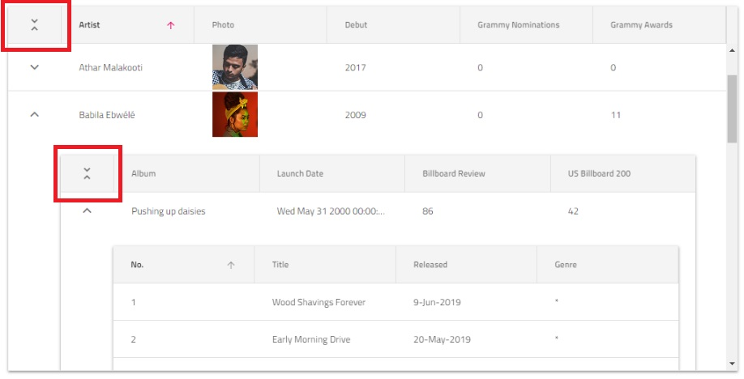

# Hierarchical Data Grid (階層データ グリッド) の概要と構成

{ProductName} 階層データ グリッドは、階層表形式データの表示と操作に使用されます。最小限のコードでデータをすばやくバインドするか、さまざまなイベントを使用してさまざまな動作をカスタマイズします。このコンポーネントは、データ選択、Excel スタイル フィルタリング、ソート、ページング、テンプレート化、列の移動、列のピン固定、Excel および CSV へのエクスポートなどの豊富な機能セットを提供します。階層グリッドは、Flat Grid コンポーネントをベースとして構築されており、親グリッドの行の展開/縮小、詳細な情報が必要な場合に対応する子グリッドを表示する機能を拡張しました。

## {Platform} 階層データ グリッドの例

この {Platform} グリッドの例では、ユーザーがデータの階層セットを視覚化し、セル テンプレートを使用して他の視覚的コンポーネントを追加する方法を確認できます。

`sample="/{HierarchicalGridSample}/overview", height="700", alt="{Platform} Hierarchical Grid の例"`

## {ProductName} 階層グリッドを使用した作業の開始

### 依存関係

{Platform} 階層グリッドを初期化するには、{ProductName} パッケージをインストールする必要があります。

<!-- Blazor -->

IgniteUI.Blazor パッケージの追加については、以下のトピックを参照してください。

- [作業の開始](../../general-getting-started-blazor-client.md)
- [NuGet パッケージの追加](../../general-nuget-feed.md)

また、 階層グリッドに必要なスタイルを提供するために、アプリケーションの index.html ファイルに次の CSS リンクを含める必要があります:

```razor
<link href="_content/IgniteUI.Blazor/themes/grid/light/bootstrap.css" rel="stylesheet" />
```

以下の名前空間を追加してコントロールの実装を開始できます。

```razor
@using IgniteUI.Blazor.Controls
```

<!-- end: Blazor -->

<!-- Angular, React, WebComponents -->

{Platform} 階層グリッドのパッケージをインストールするときは、core パッケージもインストールする必要があります。

```cmd
npm install --save {PackageCore}
npm install --save {PackageGrids}
npm install --save {PackageInputs}
npm install --save {PackageLayouts}
```

グリッドを使用するには、次のインポートも含める必要があります。

<!-- WebComponents -->
```typescript
import 'igniteui-webcomponents-grids/grids/combined.js';
```
<!-- end: WebComponents -->

```tsx
import "igniteui-react-grids/grids";
```

対応するスタイルも参照する必要があります。[テーマ](../../themes/overview.md)の 1 つにライトモードのオプションまたはダークモードのオプションを選択し、プロジェクト構成に基づいてインポートできます:

<!-- WebComponents -->
```typescript
import 'igniteui-webcomponents-grids/grids/themes/light/bootstrap.css';
```
<!-- end: WebComponents -->

```tsx
import 'igniteui-react-grids/grids/themes/light/bootstrap.css'
```

<!-- WebComponents -->
またはそれをリンクするには:
```typescript
<link rel='stylesheet' href='node_modules/igniteui-webcomponents-grids/grids/themes/light/bootstrap.css'>
```
<!-- end: WebComponents -->
階層グリッドの外観をカスタマイズする方法の詳細については、[スタイル設定](overview.md#スタイル設定)セクションを参照してください。

<!-- end: Angular, React, WebComponents -->

<!-- Angular, Blazor -->
### コンポーネント モジュール

```razor
// in Program.cs file

builder.Services.AddIgniteUIBlazor(typeof(IgbhierarchicalGridModule));
```

```typescript
// app.module.ts

import { IgxhierarchicalGridModule } from 'igniteui-angular';
// import { IgxhierarchicalGridModule } from '@infragistics/igniteui-angular'; for licensed package

@NgModule({
    imports: [
        // ...
        IgxhierarchicalGridModule,
        // ...
    ]
})
export class AppModule {}
```

<!-- end: Angular, Blazor -->

## {Platform} 階層データ グリッドの使用

### データ バインディング

*{HierarchicalGridSelector}* は、{GridSelector} から派生し、ほとんどの機能を共有します。主要な違いは階層で複数レベルを定義できることです。*{RowIslandSelector}* と呼ばれる *{HierarchicalGridSelector}* の定義内の個別のタグで設定されます。*{RowIslandSelector}* コンポーネントは、特定レベルの各子グリッドの設定を定義します。レベルごとの複数行アイランドがサポートされます。
階層グリッドで 2 通りのデータ バインドがサポートされます。

### 階層データの使用

アプリケーションが階層データ全体をオブジェクトの子配列を参照するオブジェクトの配列として読み込む場合、階層グリッドを設定して読み込み、自動的にバインドすることができます。以下はプロパティ構造の階層データソースのプロパティの例です。

```ts
export const singers = [{
    "Artist": "Naomí Yepes",
    "Photo": "assets/images/hgrid/naomi.png",
    "Debut": "2011",
    "Grammy Nominations": 6,
    "Grammy Awards": 0,
    "Tours": [{
        "Tour": "Faithful Tour",
        "Started on": "Sep-12",
        "Location": "Worldwide",
        "Headliner": "NO",
        "Toured by": "Naomí Yepes"
    }],
    "Albums": [{
        "Album": "Dream Driven",
        "Launch Date": new Date("August 25, 2014"),
        "Billboard Review": "81",
        "US Billboard 200": "1",
        "Artist": "Naomí Yepes",
        "Songs": [{
            "No.": "1",
            "Title": "Intro",
            "Released": "*",
            "Genre": "*",
            "Album": "Dream Driven"
        }]
    }]
}];
```
```razor
public class SingersData : List<SingersDataItem>
{
    public SingersData()
    {
        this.Add(new SingersDataItem()
        {
            Artist = "Naomí Yepes",
            Photo = "assets/images/hgrid/naomi.png",
            Debut = "2011",
            GrammyNomination = 6,
            GrammyAwards = 0,
            Tours = new List<ToursItem>() {
            new ToursItem() {
                Tour = "Faithful Tour",
                StartedOn = new DateTime(),
                Location = "Worldwide",
                Headliner = "NO",
                TouredBy = "Naomí Yepes"
            }
           },
            Albums = new List<AlbumItem>() {
            new AlbumItem() {
                Album = "Dream Driven",
                LaunchDate = new DateTime(),
                BillboardReview= "81",
                Artist = "Naomí Yepes",
                Songs = new List<SongItem>() {
                    new SongItem() {
                        Number = "1",
                        Title="Intro",
                        Released = "*",
                        Genre = "Rock",
                        Album ="Dream Driven"
                    }
                }
            }
           }
        });
    }
}
```
各 *{RowIslandSelector}* は、子データを保持するプロパティのキーを指定します。

```html
<igx-hierarchical-grid #hierarchicalGrid [data]="singers" [autoGenerate]="true">
    <igx-row-island [key]="'Albums'" [autoGenerate]="true">
        <igx-row-island [key]="'Songs'" [autoGenerate]="true">
        </igx-row-island>
    </igx-row-island>
    <igx-row-island [key]="'Tours'" [autoGenerate]="true">
    </igx-row-island>
</igx-hierarchical-grid>
```

```html
<igc-hierarchical-grid auto-generate="true">
    <igc-row-island child-data-key="Albums" auto-generate="true">
        <igc-row-island child-data-key="Songs" auto-generate="true">
        </igc-row-island>
    </igc-row-island>
    <igc-row-island child-data-key="Tours" auto-generate="true">
    </igc-row-island>
</igc-hierarchical-grid>
```

```tsx
<IgrHierarchicalGrid data={singers} autoGenerate="true">
    <IgrRowIsland childDataKey="Albums" autoGenerate="true">
        <IgrRowIsland childDataKey="Songs" autoGenerate="true">
        </IgrRowIsland>
    </IgrRowIsland>
    <IgrRowIsland childDataKey="Tours" autoGenerate="true">
    </IgrRowIsland>
</IgrHierarchicalGrid>
```

```razor
<IgbHierarchicalGrid Data="SingersData" AutoGenerate="true">
    <IgbRowIsland ChildDataKey="Tours" AutoGenerate="true"></IgbRowIsland>
    <IgbRowIsland ChildDataKey="Albums"AutoGenerate="true">
        <IgbRowIsland ChildDataKey="Songs" AutoGenerate="true"></IgbRowIsland>
    </IgbRowIsland>
</IgbHierarchicalGrid>
```
> [!NOTE]
> `data` の代わりにユーザーは、データを自動的に設定するめの読み込みに {HierarchicalGridSelector} が必要な `childDataKey` のみ設定します。

### ロードオンデマンドの使用

ほとんどのアプリケーションがはじめに最小限のデータを読み込むようでざいんされているため、結果的に読み込み時間が短くなります。このような場合、{HierarchicalGridSelector} を設定してユーザーが作成したサービスでデータのオンデマンド フィードを可能にします。

<!-- Angular -->
```html
<!-- hierarchicalGridSample.component.html -->

<igx-hierarchical-grid #hGrid [primaryKey]="'customerId'" [autoGenerate]="true" [height]="'600px'" [width]="'100%'">
    <igx-row-island [key]="'Orders'" [primaryKey]="'orderId'" [autoGenerate]="true"  (gridCreated)="gridCreated($event, 'Customers')">
        <igx-row-island [key]="'Details'" [primaryKey]="'productId'" [autoGenerate]="true" (gridCreated)="gridCreated($event, 'Orders')">
        </igx-row-island>
    </igx-row-island>
</igx-hierarchical-grid>
```

```typescript
//  hierarchicalGridSample.component.ts

@Component({...})
export class HierarchicalGridLoDSampleComponent implements AfterViewInit {
    @ViewChild("hGrid")
    public hGrid: IgxHierarchicalGridComponent;

    constructor(private remoteService: RemoteLoDService) { }

    public ngAfterViewInit() {
        this.hGrid.isLoading = true;
        this.remoteService.getData({ parentID: null, rootLevel: true, key: "Customers" }).subscribe((data) => {
            this.hGrid.isLoading = false;
            this.hGrid.data = data;
            this.hGrid.cdr.detectChanges();
        });
    }

    public gridCreated(event: IGridCreatedEventArgs, _parentKey: string) {
        const dataState = {
            key: event.owner.key,
            parentID: event.parentID,
            parentKey: _parentKey,
            rootLevel: false
        };
        event.grid.isLoading = true;
        this.remoteService.getData(dataState).subscribe(
            (data) => {
                event.grid.isLoading = false;
                event.grid.data = data;
                event.grid.cdr.detectChanges();
            }
        );
    }
}
```

```typescript
// remote-load-on-demand.service.ts

@Injectable()
export class RemoteLoDService {
    public url = `https://data-northwind.indigo.design/`;

    constructor(private http: HttpClient) { }

    public getData(dataState: any): Observable<any[]> {
        return this.http.get(this.buildUrl(dataState)).pipe(
            map((response) => response)
        );
    }

    public buildUrl(dataState) {
        let qS = "";
        if (dataState) {
            if (dataState.rootLevel) {
                qS += `${dataState.key}`;
            } else {
                qS += `${dataState.parentKey}/${dataState.parentID}/${dataState.key}`;
            }
        }
        return `${this.url}${qS}`;
    }
}
```
<!-- end: Angular -->

<!-- WebComponents -->
```html
<igc-hierarchical-grid id="hGrid" primary-key="customerId" auto-generate="true" height="600px" width="100%">
    <igc-row-island id="ordersRowIsland" child-data-key="Orders" primary-key="orderId" auto-generate="true">
        <igc-row-island id="orderDetailsRowIsland" child-data-key="Details" primary-key="productId" auto-generate="true"></igc-row-island>
    </igc-row-island>
</igc-hierarchical-grid>
```

```ts
import { getData } from "./remoteService";

export class HierarchicalGridLoadOnDemand {
    constructor() {
        const hierarchicalGrid = document.getElementById("hGrid") as IgcHierarchicalGridComponent;
        const ordersRowIsland = document.getElementById("ordersRowIsland");
        const orderDetailsRowIsland = document.getElementById("orderDetailsRowIsland");

        ordersRowIsland.addEventListener("gridCreated", (event: any) => {
            this.gridCreated(event, "Customers");
        });
        orderDetailsRowIsland.addEventListener("gridCreated", (event: any) => {
            this.gridCreated(event, "Orders");
        });

        hierarchicalGrid.isLoading = true;

        getData({ parentID: null, rootLevel: true, key: "Customers" }).then((data: any) => {
            hierarchicalGrid.isLoading = false;
            hierarchicalGrid.data = data;
            hierarchicalGrid.markForCheck();
        });
    }

    public gridCreated(event: CustomEvent<IgcGridCreatedEventArgs>, _parentKey: string) {
        const context = event.detail;
        const dataState = {
            key: context.owner.childDataKey,
            parentID: context.parentID,
            parentKey: _parentKey,
            rootLevel: false
        };
        context.grid.isLoading = true;
        getData(dataState).then((data: any[]) => {
            context.grid.isLoading = false;
            context.grid.data = data;
            context.grid.markForCheck();
        });
    }
}
```
<!-- end: WebComponents -->

```tsx
import { getData } from "./remoteService";

export default function Sample() {
  const hierarchicalGrid = useRef<IgrHierarchicalGrid>(null);

  function gridCreated(
    rowIsland: IgrRowIsland,
    event: IgrGridCreatedEventArgs,
    _parentKey: string
  ) {
    const context = event.detail;
    const dataState = {
      key: rowIsland.childDataKey,
      parentID: context.parentID,
      parentKey: _parentKey,
      rootLevel: false,
    };
    context.grid.isLoading = true;
    getData(dataState).then((data: any[]) => {
      context.grid.isLoading = false;
      context.grid.data = data;
      context.grid.markForCheck();
    });
  }

  useEffect(() => {
    hierarchicalGrid.current.isLoading = true;
    getData({ parentID: null, rootLevel: true, key: "Customers" }).then(
      (data: any) => {
        hierarchicalGrid.current.isLoading = false;
        hierarchicalGrid.current.data = data;
        hierarchicalGrid.current.markForCheck();
      }
    );
  }, []);

  return (
    <IgrHierarchicalGrid
        ref={hierarchicalGrid}
        primaryKey="customerId"
        autoGenerate="true"
        height="600px"
        width="100%"
    >
        <IgrRowIsland
        childDataKey="Orders"
        primaryKey="orderId"
        autoGenerate="true"
        gridCreated={(
            rowIsland: IgrRowIsland,
            e: IgrGridCreatedEventArgs
        ) => gridCreated(rowIsland, e, "Customers")}
        >
        <IgrRowIsland
            childDataKey="Details"
            primaryKey="productId"
            autoGenerate="true"
            gridCreated={(
            rowIsland: IgrRowIsland,
            e: IgrGridCreatedEventArgs
            ) => gridCreated(rowIsland, e, "Orders")}
        ></IgrRowIsland>
        </IgrRowIsland>
    </IgrHierarchicalGrid>
  );
}
```

<!-- WebComponents, React -->
```ts
const URL = `https://data-northwind.indigo.design/`;

export function getData(dataState: any): any {
    return fetch(buildUrl(dataState))
        .then((result) => result.json());
}

function buildUrl(dataState: any) {
    let qS = "";
    if (dataState) {
        if (dataState.rootLevel) {
            qS += `${dataState.key}`;
        } else {
            qS += `${dataState.parentKey}/${dataState.parentID}/${dataState.key}`;
        }
    }
    return `${URL}${qS}`;
}
```
<!-- end: WebComponents, React -->

```razor
<IgbHierarchicalGrid Id="hGrid" AutoGenerate="true" PrimaryKey="customerId" Height="600px"
    RenderedScript="OnGridRendered">
    <IgbRowIsland ChildDataKey="Orders" PrimaryKey="orderId" AutoGenerate="true" GridCreatedScript="OnGridCreated">
        <IgbRowIsland ChildDataKey="Details" PrimaryKey="productId" AutoGenerate="true" GridCreatedScript="OnGridCreated"></IgbRowIsland>
    </IgbRowIsland>
</IgbHierarchicalGrid>

In JavaScript
igRegisterScript("OnGridRendered", () => {
    const grid = document.getElementsByTagName("igc-hierarchical-grid")[0];
    grid.isLoading = true;
    getData({ parentID: null, rootLevel: true, key: "Customers" }).then(
        (data) => {
            grid.isLoading = false;
            grid.data = data;
            grid.markForCheck();
        });
}, false)

igRegisterScript("OnGridCreated", (args) => {
    const context = args.detail;
    const _parentKey = context.owner.childDataKey === "Orders" ? "Customers" : "Orders";
    const dataState = {
        key: context.owner.childDataKey,
        parentID: context.parentID,
        parentKey: _parentKey,
        rootLevel: false,
      };
      context.grid.isLoading = true;
      getData(dataState).then((data) => {
        context.grid.isLoading = false;
        context.grid.data = data;
        context.grid.markForCheck();
      });
}, false)

const DATA_URL = `https://data-northwind.indigo.design/`;

function getData(dataState) {
    return fetch(buildUrl(dataState))
        .then((result) => result.json());
}

function buildUrl(dataState) {
    let qS = "";
    if (dataState) {
        if (dataState.rootLevel) {
            qS += `${dataState.key}`;
        } else {
            qS += `${dataState.parentKey}/${dataState.parentID}/${dataState.key}`;
        }
    }
    return `${DATA_URL}${qS}`;
}
```

## 行展開インジケーターの表示/非表示

行がその展開前に子を持つかどうかについての情報を提供する方法がある場合は、`HasChildrenKey` 入力プロパティを使用できます。このようにして、展開インジケータを表示するかどうかを示すデータオブジェクトからブール値プロパティを提供できます。

```html
<igx-hierarchical-grid #grid [data]="data" primaryKey="ID" hasChildrenKey="hasChildren">
</igx-hierarchical-grid>
```

```html
<igc-hierarchical-grid data="data" primary-key="ID" has-children-key="hasChildren">
</igc-hierarchical-grid>
```

```tsx
<IgrHierarchicalGrid data={data} primaryKey="ID" hasChildrenKey="hasChildren">
</IgrHierarchicalGrid>
```

```razor
<IgbHierarchicalGrid Data="data" PrimaryKey="ID" HasChildrenKey="hasChildren">
</IgbHierarchicalGrid>
```

`HasChildrenKey` プロパティを設定する必要はありません。指定しなかった場合は、各行に展開インジケーターが表示されます。

さらに、ヘッダーのすべて展開/縮小インジケーターを表示/非表示にする場合は、`ShowExpandAll` プロパティを使用できます。
この UI は、パフォーマンス上の理由からデフォルトで無効になっているため、データが大きいグリッドやロードオンデマンドのグリッドで有効にすることはお勧めしません。

## 機能

グリッド機能を有効にして {RowIslandSelector} マークアップを介して設定し、作成された各グリッドに適用されます。ランタイムに行アイランド インスタンスでオプションを変更すると生成した各グリッドで変更されます。

```html
<igx-hierarchical-grid [data]="localData" [autoGenerate]="false"
    [allowFiltering]='true' [height]="'600px'" [width]="'800px'" #hGrid>
    <igx-column field="ID" [pinned]="true" [filterable]='true'></igx-column>
    <igx-column-group header="Information">
        <igx-column field="ChildLevels"></igx-column>
        <igx-column field="ProductName" hasSummary='true'></igx-column>
    </igx-column-group>
    <igx-row-island [key]="'childData'" [autoGenerate]="false" [rowSelection]="'multiple'" #layout1>
        <igx-column field="ID" [hasSummary]='true' [dataType]="'number'"></igx-column>
        <igx-column-group header="Information2">
            <igx-column field="ChildLevels"></igx-column>
            <igx-column field="ProductName"></igx-column>
        </igx-column-group>
        <igx-paginator *igxPaginator [perPage]="5"></igx-paginator>
    </igx-row-island>
    <igx-paginator>
    </igx-paginator>
</igx-hierarchical-grid>
```

```html
<igc-hierarchical-grid data="localData" auto-generate="false"
    allow-filtering='true' height="600px" width="800px">
    <igc-column field="ID" pinned="true" filterable="true"></igc-column>
    <igc-column-group header="Information">
        <igc-column field="ChildLevels"></igc-column>
        <igc-column field="ProductName" has-summary="true"></igc-column>
    </igc-column-group>
    <igc-row-island child-data-key="childData" auto-generate="false" row-selection="multiple">
        <igc-column field="ID" has-summary="true" data-type="number"></igc-column>
        <igc-column-group header="Information2">
            <igc-column field="ChildLevels"></igc-column>
            <igc-column field="ProductName"></igc-column>
        </igc-column-group>
        <igc-paginator per-page="5"></igc-paginator>
    </igc-row-island>
    <igc-paginator>
    </igc-paginator>
</igc-hierarchical-grid>
```

```tsx
<IgrHierarchicalGrid data={localData} autoGenerate="false"
    allowFiltering='true' height="600px" width="800px">
    <IgrColumn field="ID" pinned="true" filterable="true"></IgrColumn>
    <IgrColumnGroup header="Information">
        <IgrColumn field="ChildLevels"></IgrColumn>
        <IgrColumn field="ProductName" hasSummary="true"></IgrColumn>
    </IgrColumnGroup>
    <IgrRowIsland childDataKey="childData" autoGenerate="false" rowSelection="multiple">
        <IgrColumn field="ID" hasSummary="true" dataType="number"></IgrColumn>
        <IgrColumnGroup header="Information2">
            <IgrColumn field="ChildLevels"></IgrColumn>
            <IgrColumn field="ProductName"></IgrColumn>
        </IgrColumnGroup>
        <IgrPaginator perPage={5}></IgrPaginator>
    <IgrRowIsland>
    <IgrPaginator></IgrPaginator>
</IgrHierarchicalGrid>
```

```razor
<IgbHierarchicalGrid Data="localData" AutoGenerate="false"
    AllowFiltering="true" Height="600px" Width="800px">
    <IgbColumn Field="ID" Pinned="true" Filterable="true"></IgbColumn>
    <IgbColumnGroup Header="Information">
        <IgbColumn Field="ChildLevels"></IgbColumn>
        <IgbColumn Field="ProductName" HasSummary="true"></IgbColumn>
    </IgbColumnGroup>
    <IgbRowIsland ChildDataKey="childData" AutoGenerate="false" RowSelection="GridSelectionMode.Multiple">
        <IgbColumn Field="ID" HasSummary="true" DataType="number"></IgbColumn>
        <IgbColumnGroup Header="Information2">
            <IgbColumn Field="ChildLevels"></IgbColumn>
            <IgbColumn Field="ProductName"></IgbColumn>
        </IgbColumnGroup>
        <IgbPaginator PerPage="5"></IgbPaginator>
    <IgbRowIsland>
    <IgbPaginator></IgbPaginator>
</IgbHierarchicalGrid>
```

以下のグリッド機能はグリッド レベルごとに動作するため、各グリッド インスタンスが残りのグリッドとは別に管理します。

- ソート
- フィルタリング
- ページング
- 複数列ヘッダー
- 非表示
- ピン固定
- 移動
- 集計
- 検索

選択とナビゲーション機能は、{HierarchicalGridTitle} 全体でグローバルに作用します。

- 選択
    選択は、選択したセルを異なる 2 つの子グリッドで同時に表示することを許可しません。
- ナビゲーション
    up/down へ移動するときに next/prev 要素が子グリッドの場合、ナビゲーションが関連子グリッド内で継続され、関連セルが選択済みにマークされ、フォーカスされます。子セルが現在の表示ビューポート以外にある場合にビューへスクロールされるため、選択したセルが常に表示されます。

## 「すべて縮小」 ボタン

左上の角にある [すべて縮小] ボタンを押して階層グリッドで展開されてる行を縮小できます。更に他のグリッドを含む各子グリッドと階層グリッドにも同様のボタンがあり、階層の特定のグリッドのみ縮小することができます。



<!-- TODO: uncomment when sizing topic is ready -->
<!-- ## サイズ変更

「[階層グリッドのサイズ変更](sizing.md)」トピックを確認してください。 -->

<!-- Angular -->
## CRUD 操作

> [!NOTE]
> フラットな Data Grid と行アイランドの各インスタンスの重要な違いは、同じトランザクション サービス インスタンスがあり、同じトランザクション ログを蓄積する点です。CRUD 機能を有効にするには、`IgxHierarchicalTransactionServiceFactory` を注入する必要があります。

CRUD API メソッドの呼び出しは,各グリッド インスタンスで可能です。

「[igxGrid で CRUD 操作を構築する](../general/how-to/how-to-perform-crud.md)」トピックを確認してください。
<!-- end: Angular -->

<!-- Angular -->
## スタイル設定
igxHierarchicalGrid を使用すると、[Ignite UI for Angular Theme ライブラリ](../themes/sass/component-themes.md) でスタイルを設定できます。[theme]({environment:sassApiUrl}/index.html#function-grid-theme) は、グリッドのすべての機能をカスタマイズできるさまざまなプロパティを公開します。

以下の手順では、igxHierarchicalGrid スタイルをカスタマイズする手順を実行しています。

### グローバル テーマのインポート
階層グリッドのカスタマイズは、すべてのスタイリング機能と mixins が配置されている `index` ファイルをインポートする必要があります。

```scss
@import '~igniteui-angular/lib/core/styles/themes/index'
```

### カスタム テーマの定義
次に、[`grid-theme`]({environment:sassApiUrl}/index.html#function-grid-theme) を拡張し、必要に応じて階層グリッドをカスタマイズするために必要なパラメーターを受け取る新しいテーマを作成します。

 >[!NOTE]
 >特定の `sass` 階層グリッド機能はありません。


```scss
$custom-theme: grid-theme(
  $cell-active-border-color: #ffcd0f,
  $cell-selected-background: #6f6f6f,
  $row-hover-background: #f8e495,
  $row-selected-background: #8d8d8d,
  $header-background: #494949,
  $header-text-color: #fff,
  $expand-icon-color: #ffcd0f,
  $expand-icon-hover-color: #e0b710,
  $resize-line-color: #ffcd0f,
  $row-highlight: #ffcd0f
);
```

### カスタム カラー パレットの定義
上記で説明したアプローチでは、色の値がハード コーディングされていました。または、[`igx-palette`]({environment:sassApiUrl}/index.html#function-igx-palette) および [`igx-color`]({environment:sassApiUrl}/index.html#function-igx-color) 関数を使用して、柔軟性を高めることができます。
`igx-palette` は指定した一次色と二次色に基づいてカラーパレットを生成します。

 ```scss
$black-color: #494949;
$yellow-color: #FFCD0F;

$custom-palette: palette(
  $primary: $black-color,
  $secondary: $yellow-color
);
```
カスタム パレットが生成された後、`igx-color` 関数を使用して、さまざまな種類の原色と二次色を取得できます。
```scss
$custom-theme: grid-theme(
    $cell-active-border-color: (igx-color($custom-palette, "secondary", 500)),
    $cell-selected-background: (igx-color($custom-palette, "primary", 300)),
    $row-hover-background: (igx-color($custom-palette, "secondary", 100)),
    $row-selected-background: (igx-color($custom-palette, "primary", 100)),
    $header-background: (igx-color($custom-palette, "primary", 500)),
    $header-text-color: (igx-contrast-color($custom-palette, "primary", 500)),
    $expand-icon-color: (igx-color($custom-palette, "secondary", 500)),
    $expand-icon-hover-color: (igx-color($custom-palette, "secondary", 600)),
    $resize-line-color: (igx-color($custom-palette, "secondary", 500)),
    $row-highlight: (igx-color($custom-palette, "secondary", 500))
);
```

### カスタム スキーマの定義
[**schema**](../themes/sass/schemas.md) のすべての利点を備えた柔軟な構造を構築できます。**schema** はテーマを作成させるための方法です。
すべてのコンポーネントに提供される 2 つの事前定義されたスキーマのいずれかを拡張します。この場合、`$_light_grid` を使用します。
```scss
$custom-grid-schema: extend($_light-grid,(
    cell-active-border-color: (igx-color:('secondary', 500)),
    cell-selected-background: (igx-color:('primary', 300)),
    row-hover-background: (igx-color:('secondary', 100)),
    row-selected-background: (igx-color:('primary', 100)),
    header-background: (igx-color:('primary', 500)),
    header-text-color: (igx-contrast-color:('primary', 500)),
    expand-icon-color: (igx-color:('secondary', 500)),
    expand-icon-hover-color: (igx-color:('secondary', 600)),
    resize-line-color: (igx-color:('secondary', 500)),
    row-highlight: (igx-color:('secondary', 500))
));
```
カスタム スキーマを適用するには、`light` グローバルまたは `dark` グローバルを拡張する必要があります。プロセス全体が実際にコンポーネントにカスタム スキーマを提供し、その後、それぞれのコンポーネントテーマに追加します。
```scss
$my-custom-schema: extend($light-schema, (
    igx-grid: $custom-grid-schema
));

$custom-theme: grid-theme(
    $palette: $custom-palette,
    $schema: $my-custom-schema
);
```

### カスタム テーマの適用
テーマを適用する最も簡単な方法は、グローバル スタイル ファイルに `sass` `@include` ステートメントを使用することです。

```scss
@include grid($custom-theme);
```

### スコープ コンポーネント テーマ

カスタム テーマが特定のコンポーネントのみに影響するように、定義したすべてのスタイルをグローバル スタイル ファイルからカスタム コンポーネントのスタイルファイルに移動できます (`index` ファイルのインポートを含む)。

このように、Angular の [ViewEncapsulation](https://angular.io/api/core/Component#encapsulation) により、スタイルはカスタム コンポーネントにのみ適用されます。

 >[!NOTE]
 >コンポーネントが [`Emulated`](../themes/sass/component-themes.md#表示のカプセル化) ViewEncapsulation を使用している場合、グリッドのスタイルを設定するには、`::ng-deep` を使用してこのカプセル化を解除する必要があります。
 >[!NOTE]
 >ステートメントがコンポーネントの外にある要素に影響を与えないよう、ステートメントを `:host` セレクター内にラップします。

```scss
:host {
    ::ng-deep {
        @include grid($custom-theme);
    }
}
```

### サンプル

<code-view style="height:505px"
           no-theming
           data-demos-base-url="{environment:demosBaseUrl}"
           iframe-src="{environment:demosBaseUrl}/hierarchical-grid/hierarchical-grid-styling" >
</code-view>

>[!NOTE]
>サンプルは、`テーマの変更`で選択したグローバル テーマの影響を受けません。
<!-- end: Angular -->


<!-- WebComponents, Blazor, React -->
## スタイル設定
定義済みのテーマに加えて、利用可能な [CSS プロパティ](../theming.md)のいくつかを設定することで、グリッドをさらにカスタマイズできます。ヘッダーの背景とテキストの色を変更したい場合は、最初にグリッドのクラスを設定する必要があります:

<!-- WebComponents -->
```html
<igc-hierarchical-grid class="grid"></igc-hierarchical-grid>
```
<!-- end: WebComponents -->

```tsx
<IgrHierarchicalGrid className="grid"></IgrHierarchicalGrid>
```

```razor
 <IgbHierarchicalGrid Class="grid"></IgbHierarchicalGrid>
```

次に、そのクラスの `--header-background` および `--header-text-color` CSS プロパティを設定します:

```css
.grid {
    --header-background: #494949;
    --header-text-color: #FFF;
}
```
### サンプル
`sample="/{HierarchicalGridSample}/hierarchical-grid-styling", height="700", alt="{Platform} Hierarchical Grid スタイル設定の例"`

<!-- end: WebComponents, Blazor, React -->

## 既知の制限

|制限|説明|
|--- |--- |
|グループ化|グループ化機能は、階層グリッドでサポートされません。|

## API リファレンス

* `HierarchicalGrid`
* `RowIsland`
* `Grid`
* `Column`
* `Cell`

<!-- TODO: uncomment when all of the topics are ready -->
<!-- ## その他のリソース

* [グリッドのサイズ設定](sizing.md)
* [仮想化とパフォーマンス](virtualization.md)
* [ページング](paging.md)
* [フィルタリング](filtering.md)
* [ソート](sorting.md)
* [集計](summaries.md)
* [列移動](column-moving.md)
* [列のピン固定](column-pinning.md)
* [列のサイズ変更](column-resizing.md)
* [選択](selection.md) -->

コミュニティに参加して新しいアイデアをご提案ください。

* [{ProductName} **フォーラム (英語)**]({ForumsLink})
* [{ProductName} **GitHub (英語)**]({GithubLink})