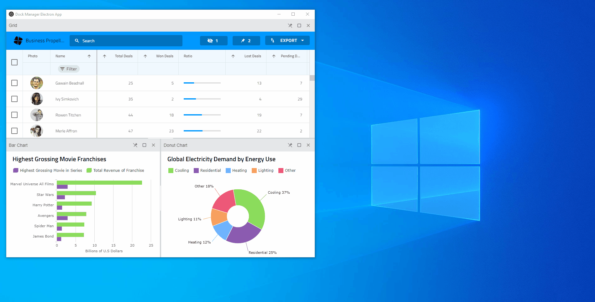

# $Platform$ ドック マネージャー デスクトップ統合

インフラジスティックスの $Platform$ ドック マネージャー コンポーネントは、複数ウィンドウの [Electron](https://www.electronjs.org/) デスクトップ アプリケーションで、各ウィンドウのレイアウトを管理したり、新しいウィンドウを作成するためにウィンドウの外側にペインをドラッグしたり、あるウィンドウから別のウィンドウにペインをドラッグアンドドロップしたりできます。このようなアプリケーションのサンプル実装は、次のリポジトリ https://github.com/IgniteUI/dock-manager-electron-app にあります。

<!-- TODO: Add a gif of the application and a link to download the exe -->


## 実装

このアプリケーションの実装の最も重要な部分を見ていきましょう。

### プロジェクト構造

[Electron Forge](https://www.electronforge.io/) CLI ツールとその [Typescript + Webpack](https://www.electronforge.io/templates/typescript-+-webpack-template) テンプレートを使用して、Electron アプリケーションを作成しました。Electron には、メインとレンダラーの 2 種類のプロセスがあります。
- メイン プロセスは、**BrowserWindow** インスタンスを作成することによって Web ページを作成します。各 **BrowserWindow** インスタンスは、レンダラー プロセスで Web ページを実行します。
- レンダラー プロセスは、対応する Web ページのみを管理します。

**index.ts** スクリプトは、メイン プロセスを実行する Electron アプリケーションのエントリ ポイントを指定します。アプリケーションのコードのほとんどは、レンダラー プロセスで実行される **renderer.ts** ファイル内にあります。**index.html** は、Web ページのコンテンツを表します。Web ページのスタイルは、**index.css** ファイルでホストされます。

### ドック マネージャーのセットアップ

ドック マネージャー パッケージをインストールした後、**renderer.ts** ファイルの **defineCustomElements()** を使用してドック マネージャー コンポーネントを登録しました。これにより、**index.html** ファイルに **<igc-dockmanager>** を追加できます。

ドック マネージャー ペインのコンテンツには、さまざまな URL をホストする **iframe** 要素を使用しました。この場合、これらの URL は [Ignite UI for Angular](https://jp.infragistics.com/products/ignite-ui-angular) のサンプルを指しています。**iframe** 要素は自己完結型であるため、あるウィンドウから別のウィンドウに簡単に移動できます。

### ドラッグ アンド ドロップ

ブラウザー/アプリケーション ウィンドウの外側でのペインのドラッグをサポートするために、ブラウザー内のフローティング ペインを作成する組み込みのドラッグアンドドロップを、[HTML ドラッグアンドドロップ API](https://developer.mozilla.org/ja/docs/Web/API/HTML_Drag_and_Drop_API) に基づくカスタム実装に置き換えました。ヘッダー要素が DOM に接続されたときに発生する [`paneHeaderConnected`](https://www.infragistics.com/products/ignite-ui/dock-manager/docs/typescript/latest/interfaces/igcdockmanagereventmap.html#paneheaderconnected) イベントと [`tabHeaderConnected`](https://www.infragistics.com/products/ignite-ui/dock-manager/docs/typescript/latest/interfaces/igcdockmanagereventmap.html#tabheaderconnected) イベントにサブスクライブしました。ヘッダー要素が接続されると、組み込みの [`dragService`](https://www.infragistics.com/products/ignite-ui/dock-manager/docs/typescript/latest/interfaces/igcpaneheaderelement.html#dragservice) をリセットし、`dragstart` および `dragend` イベント リスナーをアタッチします。

```ts
const paneHeaderConnected = (event: CustomEvent<IgcPaneHeaderConnectionEventArgs>) => {
    const element = event.detail.element;
    element.dragService.destroy();
    element.dragService = null;
    element.draggable = true;
    element.ondragstart = ev => {
        paneHeaderDragStart(event.detail.pane, ev);
    };
    element.ondragend = ev => {
        paneHeaderDragEnd(ev);
    };
}

dockManager.addEventListener('paneHeaderConnected', paneHeaderConnected);
```


`panelHeaderDragStart` 関数で、ドック マネージャー コンポーネントの [`draggedPane`](https://www.infragistics.com/products/ignite-ui/dock-manager/docs/typescript/latest/interfaces/igcdockmanagercomponent.html#draggedpane) プロパティを設定し、ドラッグ操作が開始されたことを通知します。

```ts
const paneHeaderDragStart = async (pane: IgcContentPane, event: DragEvent) => {
    event.dataTransfer.dropEffect = 'move';
    dockManager.draggedPane = pane;
    // ...
}
```

`document` 要素の `dragover` と `drop` イベントにサブスクライブしました。`dragover` リスナーでは、[`dropPosition`](https://www.infragistics.com/products/ignite-ui/dock-manager/docs/typescript/latest/interfaces/igcdockmanagercomponent.html#dropposition) プロパティを設定することにより、マウスがその上にドラッグされたことをドック マネージャーに通知します。これにより、ドック マネージャーはドッキング インジケーターを表示します。

```ts
const handleDocumentDragOver = (event: DragEvent) => {
    event.preventDefault();
    event.dataTransfer.dropEffect = 'move';
    dockManager.dropPosition = {
      x: event.clientX,
      y: event.clientY
    };
}

document.addEventListener('dragover', handleDocumentDragOver);
document.addEventListener('drop', handleDocumentDrop);
```

`panelHeaderDragEnd` 関数では、ペインがブラウザー/アプリケーション ウィンドウの外にドロップされたかどうかを検出し、`droppedOutOfWindow` 関数を呼び出します。

```ts
const paneHeaderDragEnd = async (event: DragEvent) => {
    event.preventDefault();
    // ...

    // dropped outside of the browser
    if (event.dataTransfer.dropEffect === 'none') {
        await droppedOutOfWindow(event);
    }
    // ...
}
```

ペイン ヘッダーがドキュメント内にドロップされると、[`dropPane`](https://www.infragistics.com/products/ignite-ui/dock-manager/docs/typescript/latest/interfaces/igcdockmanagercomponent.html#droppane) メソッドが呼び出され、ドラッグされたペインがドロップされたことをドック マネージャーに通知します。ペインがドッキング インジケーターにドロップされた場合、メソッドは **true** を返します。ペインがドラッグ元と同じウィンドウにドロップされた場合、ペインは自動的に新しい位置にドッキングされます。ただし、別のウィンドウにドロップされた場合は、`droppedInAnotherWindow` 関数を呼び出します。この関数は、最初にソースのドック マネージャーからペインを削除してから、新しいペインに追加します。

```ts
const handleDocumentDrop = async (event: DragEvent) => {
    const contentId = (dockManager.draggedPane as IgcContentPane).contentId;

    const docked = await dockManager.dropPane();

    if (docked) {
        const contentElement = dockManager.querySelector('[slot=' + contentId + ']');

        // if the content element is missing from the current dock manager it means it comes from another window
        if (!contentElement) {
            await droppedInAnotherWindow();
        }
    }
}
```

ペインが現在のウィンドウから削除されたら、`draggedPane` をドック マネージャー コンポーネントから削除し、レイアウトを更新する必要があります。

```ts
const draggedPane = dockManager.draggedPane as IgcContentPane;
await dockManager.removePane(draggedPane);
dockManager.layout = { ...dockManager.layout };
```

次に、ペインのコンテンツ要素を新しいウィンドウに移動する必要があります。この目的のために、[`document.adoptNode()`](https://developer.mozilla.org/ja/docs/Web/API/Document/adoptNode) メソッドを使用します。これにより、コンテンツ要素ノードを新しいドキュメントに転送し、最後に、新しいドック マネージャー コンポーネントの子として追加できます。

```ts
const contentElement = dockManager.querySelector('[slot=' + draggedPane.contentId + ']');
const newDocument = childWindow.document;
const newDockManager = newDocument.getElementById('dockManager') as IgcDockManagerComponent;
const adoptedNode = newDocument.adoptNode(contentElement);
newDockManager.appendChild(adoptedNode);
```

### ウィンドウ管理

ネイティブの [`window.open()`](https://developer.mozilla.org/ja-JP/docs/Web/API/Window/open) メソッドを使用して、レンダラー プロセスで新しいウィンドウを開きます。**index.ts** に `BrowserWindow` を作成するときに、`nativeWindowOpen` オプションを **true** に設定します。これにより、子 `Window` オブジェクトとその `document` に直接アクセスできます。この Electron [トピック](https://www.electronjs.org/docs/api/window-open)で、レンダラー プロセスからウィンドウを開く方法について詳しく読むことができます。`nativeWindowOpen` オプションはまだ実験段階であることに注意してください。

```ts
mainWindow = new BrowserWindow({
    height: 800,
    width: 1000,
    webPreferences: {
        nativeWindowOpen: true
    }
});
```

このアプリケーションでは、メイン ウィンドウ (`IMainDockManagerWindow`) または子ウィンドウ (`IChildDockManagerWindow`) のいずれかである `IDockManagerWindow` タイプを実装しました。メイン ウィンドウは、アプリケーションの起動時に作成されるウィンドウです。すべての子ウィンドウへの参照が含まれています。子ウィンドウは、ペインがウィンドウからドロップされ、アプリケーションのメイン ウィンドウへの参照がある場合に作成されます。

完全なソース コードについては、[リポジトリ](https://github.com/IgniteUI/dock-manager-electron-app)のクローンを作成してください。

 ## API メンバー

 - `BrowserWindow`
 - [`DockManager`]({environment:infragisticsBaseUrl}/products/ignite-ui/dock-manager/docs/typescript/latest/classes/igcdockmanagercomponent.html)
 - `IDockManagerWindow`
 - `Window`