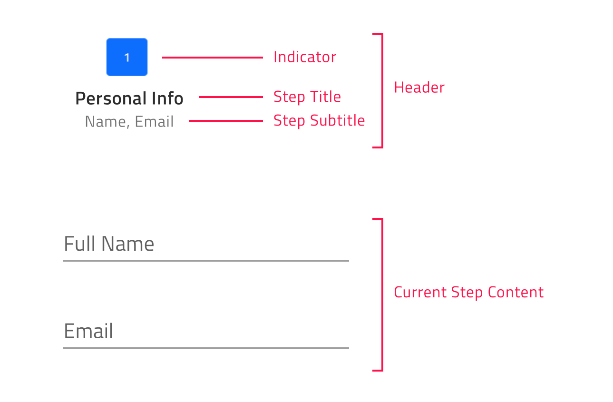

# {Platform} Stepper (ステッパー) の概要
{Platform} ステッパー コンポーネントは、ウィザードのようなワークフローを提供し、番号付きのステップの進行状況を示すために使用されます。これにより、開発者は長いコンテンツを一連の論理的なステップに分割できるため、エンド ユーザーはプロセス全体をより簡単にナビゲートできます。{Platform} ステッパーは、垂直または水平な線で表示されます。{Platform} ステッパーには、ステップの検証、スタイル設定、向き、キーボード ナビゲーションなどの複数の機能があります。

## {Platform} ステッパーの例

次の {ProductName} ステッパーの例は、動作中のコンポーネントを示しています。これは、エンドユーザーが注文の詳細を構成するために通過しなければならないプロセスを、いくつかの連続したステップに従って視覚化します。

`sample="/layouts/stepper/linear", height="430", alt="{Platform} リニア ステッパーの例"`

<div class="divider--half"></div>

## {Platform} ステッパーを使用した作業の開始

<!-- WebComponents -->

まず、次のコマンドを実行して {ProductName} をインストールする必要があります:

```cmd
npm install {PackageWebComponents}
```

`Stepper` を使用する前に、次のように登録する必要があります:

```ts
import { defineComponents, IgcStepperComponent } from 'igniteui-webcomponents';

defineComponents(IgcStepperComponent);
```

{ProductName} の完全な概要については、[作業の開始](../general-getting-started.md)トピックを参照してください。

<!-- end: WebComponents -->

<!-- React -->

まず、次のコマンドを実行して、対応する {ProductName} npm パッケージをインストールする必要があります:

```cmd
npm install igniteui-react
```

次に、以下のように、`Stepper` とそれに必要な CSS をインポートし、そのモジュールを登録する必要があります:

```tsx
import { IgrStepperModule, IgrStepper, IgrStep } from 'igniteui-react';
import 'igniteui-webcomponents/themes/light/bootstrap.css';
IgrStepperModule.register();
```

<!-- end: React -->
```razor
// in Program.cs file

builder.Services.AddIgniteUIBlazor(
    typeof(IgbStepperModule)
);
```

<!-- Blazor -->

また、追加の CSS ファイルをリンクして、スタイルを `Stepper` コンポーネントに適用する必要があります。以下は、**Blazor WebAssembly** プロジェクトの **wwwroot/index.html** ファイルまたは **Blazor Server** プロジェクトの **Pages/_Host.cshtml**フ ァイルに配置する必要があります:

```razor
<link href="_content/IgniteUI.Blazor/themes/light/bootstrap.css" rel="stylesheet" />
```

<!-- end: Blazor -->

これで、{Platform} `Stepper` とそのパネルの基本構成から始めることができます。

## {Platform} ステッパーの使用方法
`Step` は、`Stepper` に属するすべてのステップの表現です。ステップは `Step.Invalid`、`Step.Active`、`Step.Optional`、`Step.Disabled`、`Step.Complete` プロパティを提供し、ビジネス要件に応じてステップの状態を構成できます。

### {Platform} ステッパーの宣言
ステップは、以下の方法のいずれかを使用して宣言できます。
- データセットの繰り返し

```html
<igc-stepper>
    ${stepsData.map((step) => html`
    <igc-step .disabled=${step.disabled}>
        <div slot="indicator">
            <igc-icon .iconName=${step.indicator}></igc-icon>
        </div>

        <p slot="title">${step.title}</p>
    </igc-step>
    `
</igc-stepper>
```

```razor
<IgbStepper>
    @foreach (var item in this.StepsData)
    {
        <IgbStep Disabled="@item.Disabled">
          <p slot="title">@item.Title</p>
        </IgbStep>
    }
</IgbStepper>
```

```tsx
<IgrStepper>
    {this.StepsData.map(item => 
        <IgrStep key={item.title} disabled={item.disabled}>
            <p slot="title">{item.title}</p>
        </IgrStep>
    }
</IgrStepper>
```

- 静的ステップの作成

```html
<igc-stepper>
    <igc-step>
       <p slot="title">Step 1</p>
    </igc-step>
    <igc-step>
       <p slot="title">Step 2</p>
    </igc-step>
</igc-stepper>
```

```razor
<IgbStepper>
    <IgbStep>
       <p slot="title">Step 1</p>
    </IgbStep>
     <IgbStep>
       <p slot="title">Step 2</p>
    </IgbStep>
</IgbStepper>
```

```tsx
<IgrStepper>
    <IgrStep>
       <p slot="title">Step 1</p>
    </IgrStep>
     <IgrStep>
       <p slot="title">Step 2</p>
    </IgrStep>
</IgrStepper>
```

各ステップで、`Indicator`、`Title`、および `Subtitle` スロットを使用してインジケーター、タイトル、およびサブタイトルを構成できます。

> [!Note]
> `Default` の `Step` スロットは、ステップのコンテンツを描画します。

```html
<igc-stepper>
    <igc-step>
       <igc-icon slot="indicator" iconName="home"></igc-icon>
       <p slot="title">Home</p>
       <p slot="subtitle">Home Sub Title</p>
       <div>
          Step Content
       </div>
    </igc-step>
</igc-stepper>
```

```razor
<IgbStepper>
    <IgbStep>
       <IgbIcon slot="indicator" IconName="home" Collection="material" />
       <p slot="title">Home</p>
       <p slot="subtitle">Home Sub Title</p>
       <div>
          Step Content
          ...
       </div>
    </IgbStep>
</IgbStepper>
```

```tsx
<IgrStepper>
    <IgrStep>
        <IgrIcon slot="indicator" name="home" collection="material" />
        <p slot="title">Home</p>
        <p slot="subtitle">Home Sub Title</p>
        <div>
            Step Content
            ...
        </div>
    </IgrStep>
</IgrStepper>
```



### {Platform} ステッパーの向きの変更
公開された `Orientation` プロパティでステッパーの向きをカスタマイズできます。**horizontal** (デフォルト値) また **vertical** に設定できます。

**水平方向の {Platform} ステッパー**

`Stepper` の orientation プロパティのデフォルト値は *horizontal* です。
{Platform} ステッパーが水平方向の場合、ステップのコンテンツをステップのヘッダーの上または下に表示するかどうかを決定できます。これは、`Stepper` の `ContentTop` ブール型プロパティを設定することで実現できます。デフォルト値は *false* です。有効な場合、ステップのコンテンツはステップのヘッダーの上に表示されます。


**垂直方向の {Platform} ステッパー**

水平レイアウトから垂直レイアウトに簡単に切り替えることができます。デフォルトの方向を変更するには、`Orientation` プロパティを *vertical* に設定します。

以下のサンプルは、実行時にステッパーの向きとタイトルの位置を変更する方法を示しています。

`sample="/layouts/stepper/orientation", height="528", alt="{Platform} ステッパー方向の例"`


<div class="divider--half"></div>

### ステップ状態
{Platform} `Stepper` は 5 つのステップ状態をサポートし、それぞれがデフォルトで異なるスタイルを適用します。
- **active** - ステップが現在表示されているかどうかを決定します。設計上、ユーザーが明示的にステップの active 属性を *true* に設定しない場合、最初の有効なステップがアクティブになります。
- **disabled** - ステップが操作可能かどうかを決定します。デフォルトでは、ステップの disabled 属性は *false* に設定されています。
- **invalid** - ステップが有効かどうかを決定します。その値に基づいて、ユーザーがリニア ステッパー モードで前に進むことができるかどうかが決定されます。デフォルト値は *false* です。
- **optional** - デフォルトで、ステップの optional 属性は *false* に設定されます。リニア ステッパーのステップの有効性が必要ない場合、オプションの属性を有効にして、ステップの有効性とは関係なく前進できます。
- **complete** - デフォルトでは、ステップの complete 属性は *false* を返します。ユーザーは、complete 属性を必要に応じて設定することにより、このデフォルトの complete 動作をオーバーライドできます。ステップが complete (完了済み) としてマークされると、ステップ ヘッダーのスタイルがデフォルトで変更されるだけでなく、完了したステップと次のステップの間の進捗線のスタイルも変更されます。

### リニア {Platform} ステッパー

{Platform} `Stepper` は、`Linear` プロパティを使用してステップ フローを設定できます。デフォルトで、linear は *false* に設定され、ユーザーは `Stepper` で無効にされていないステップを選択できます。


```html
<igc-stepper linear="true">
    <igc-step>
       <p slot="title">Step 1</p>
    </igc-step>
    <igc-step>
       <p slot="title">Step 2</p>
    </igc-step>
</igc-stepper>
```

```razor
<IgbStepper Linear="true">
    <IgbStep>
       <p slot="title">Step 1</p>
    </IgbStep>
     <IgbStep>
       <p slot="title">Step 2</p>
    </IgbStep>
</IgbStepper>
```

```tsx
<IgrStepper linear="true">
    <IgrStep>
       <p slot="title">Step 1</p>
    </IgrStep>
     <IgrStep>
       <p slot="title">Step 2</p>
    </IgrStep>
</IgrStepper>
```

linear プロパティが *true* に設定されている場合、ステッパーは次のステップに進む前に現在のオプションではないステップを有効にする必要があります。

現在のオプションではないステップが有効でない場合、現在のステップを検証するまで次のステップに進むことができません。

> [!Note]
> オプションのステップの有効性は考慮されません。

### ステップ操作

`Stepper` は、ステップ操作に以下の API メソッドを提供します。
- **navigateTo** – 指定したインデックスでステップをアクティブ化します。
- **next** - 次の無効化されていないステップをアクティブ化します。
- **prev** – 前の無効化されていないステップをアクティブ化します。
- **reset** – ステッパーを初期状態にリセットします。

> [!Note]
> reset メソッドは、ステッパーを初期状態にリセットします。つまり、最初のステップをアクティブにします。reset メソッドはステップの内容をクリアしません。これは手動で行う必要があります。

### ステップのカスタマイズ

{ProductName} ステッパーでは、タイトル、インジケーターなどのさまざまなオプションを構成できます。

これは、`Stepper` の `StepType` プロパティで実現できます。プロパティは以下の値を含みます:
- Full (フル、デフォルト値)
- Indicator (インジケーター)
- Title (タイトル)

**Full (フル)**

タイトルとサブタイトルが定義されている場合、この設定ではインジケーターとタイトルの両方が描画されます。

また、ユーザーはステップのタイトルの位置を定義できるため、ステップ インジケーターの前、後、上、または下に配置できます。
ユーザーは `TitlePosition` プロパティを使用してタイトル位置を構成できます。プロパティは以下の値を含みます:
- undefined (デフォルト値)
- end
- start
- bottom
- top

{Platform} `Stepper` が水平方向で、タイトルの位置が**定義されていない**場合、タイトルはインジケーターの**下**に表示されます。

向きが垂直に設定され、タイトルの位置が**定義されていない**場合、タイトルはインジケーターの**後**に表示されます。

> [!Note]
> **titlePosition** プロパティは、ステッパーの stepType プロパティが *full* に設定されている場合に**のみ**適用できます。

**Indicator (インジケーター)**

ステップのインジケーターのみを表示する場合は、stepType オプションを *indicator* に設定します。

ステップ インジケーターはすべてのコンテンツをサポートしますが、サイズが常に **24 ピクセル**になるという制限があります。この点に注意して、ステップ インジケーターとして `Icon` または `Avatar` を使用することをお勧めします。

**Title (タイトル)**

ステップのタイトルのみを表示する場合は、stepType オプションを *title* に設定します。

このように、サブタイトルが定義されている場合、それらもステップ タイトルの下に描画されます。

> [!Note]
> このコンテナーは、サイズ制限なしで要件に応じて再テンプレート化できます。たとえば、サイズが 24 ピクセルより大きいインジケーターを中に追加できます。

以下のサンプルは公開されたすべてのステップ タイプと変更方法を示しています。

`sample="/layouts/stepper/steptypes", height="300", alt="{Platform} ステップ タイプの例"`

<div class="divider--half"></div>

<!-- WebComponents, React -->
### Stepper のアニメーション

{Platform} の `Stepper` のアニメーションにより、エンドユーザーは、定義されたステップを操作しているときに美しいユーザー操作体験を得ることができます。使用可能なアニメーション オプションは、ステッパーの向きによって異なります。

ステッパーが水平方向の場合、デフォルトでは `slide` アニメーションを使用するように設定されています。その他に `fade` アニメーションもサポートされます。アニメーションは、`HorizontalAnimation` 入力を介して構成されます。

垂直方向のレイアウトでは、アニメーション タイプは `VerticalAnimation` プロパティを使用して定義できます。デフォルトでは、その値は `grow` に設定されており、ユーザーはそれを `fade` に設定することもできます。

両方のアニメーション タイプ入力に `none` を設定すると、ステッパー アニメーションが無効になります。

`Stepper` コンポーネントを使用すると、ステップ間の遷移にかかる時間を設定することもできます。これは、数値を受け取る `animationDuration` プロパティで設定でき、いずれのレイアウト方向でも共通の設定です。デフォルト値は 320ms に設定されています。

`sample="/layouts/stepper/animations", height="600", alt="{Platform} Stepper アニメーションの例"`

<div class="divider--half"></div>
<!-- end: WebComponents, React -->

## キーボード ナビゲーション

{ProductName} ステッパーは、さまざまなキーボード操作をエンドユーザーに提供します。この機能はデフォルトで有効になっており、エンドユーザーは簡単にステップを移動できます。
{Platform} `Stepper` ナビゲーションは [W3 アクセシビリティ標準](https://www.w3.org/WAI/ARIA/apg/patterns/tabpanel/)に準拠しており、便利に使用できます。

**キーの組み合わせ**

 - <kbd>Tab</kbd> - 次の移動可能な要素にフォーカスを移動します。
 - <kbd>Shift</kbd> + <kbd>Tab</kbd> - 前移動可能な要素にフォーカスを移動します。
 - <kbd>↓</kbd> - ステッパーが**垂直方向**の場合、次のアクセス可能なステップのヘッダーにフォーカスを移動します。
 - <kbd>↑</kbd> - ステッパーが**垂直方向**の場合、前のアクセス可能なステップのヘッダーにフォーカスを移動します。
 - <kbd>←</kbd> - 両方の方向で前のアクセス可能なステップのヘッダーにフォーカスを移動します。
 - <kbd>→</kbd> - 両方の方向で次にアクセス可能なステップのヘッダーにフォーカスを移動します。
 - <kbd>Home</kbd> - ステッパーの最初の有効なステップのヘッダーにフォーカスを移動します。
 - <kbd>End</kbd> - ステッパーの最後の有効なステップのヘッダーにフォーカスを移動します。
 - <kbd>Enter</kbd> / <kbd>Space</kbd> - 現在フォーカスされているステップをアクティブ化します。

## スタイル設定

以下にリストされている公開された CSS パーツのいくつかを使用して、`Step` の外観を変更できます:

| 部分名 | 説明 |
| ---------|------------ |
| `header-container` | ステップのヘッダーとそのセパレーターのラッパー。|
| `disabled` | 使用不可な状態を示します。ヘッダー コンテナーに適用されます。|
| `complete-start` | 現在のステップの完了状態を示します。ヘッダー コンテナーに適用されます。|
| `complete-end` | 前のステップの完了状態を示します。ヘッダー コンテナーに適用されます。|
| `optional` | オプションの状態を示します。ヘッダー コンテナーに適用されます。|
| `invalid` | オプションの状態を示します。ヘッダー コンテナーに適用されます。|
| `top` | タイトルがインジケーターの上にあることを示します。ヘッダー コンテナーに適用されます。|
| `bottom` | タイトルがインジケーターの下にあることを示します。ヘッダー コンテナーに適用されます。|
| `start` | タイトルがインジケーターの前にあることを示します。ヘッダー コンテナーに適用されます。|
| `end` | タイトルがインジケーターの後にあることを示します。ヘッダー コンテナーに適用されます。|
| `header` | ステップのインジケーターとテキストのラッパー。|
| `indicator` | Tステップのインジケーター。|
| `text` | ステップのタイトルとサブタイトルのラッパー。|
| `empty` | ステップにタイトルとサブタイトルが提供されていないことを示します。テキストに適用されます。|
| `title` | ステップのタイトル。|
| `subtitle` | ステップのサブタイトル。|
| `body` | ステップのコンテンツのラッパー。|
| `content` | ステップのコンテンツ。|

これらの CSS パーツを使用して、次のように `Stepper` コンポーネントの外観をカスタマイズできます:

```css
igc-step::part(title) {
    background: #351e65;
}

igc-step::part(subtitle) {
    background: #5f4691;
}
```

<div class="divider--half"></div>

## API リファレンス

* `Stepper`
* `Step`
* `Avatar`
* `Icon`


## その他のリソース

* [{ProductName} **フォーラム (英語)**]({ForumsLink})
* [{ProductName} **GitHub (英語)**]({GithubLink})
