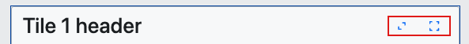

# {Platform} Tile Manager (タイル マネージャー) の概要

{ProductName} Tile Manager コンポーネントを使用すると、コンテンツを個々のタイルに表示できます。ユーザーはタイルを並べ替えたりサイズを変更したりして操作できるため、好みに応じてコンテンツのレイアウトや外観を自由にカスタマイズできます。この柔軟性により、パーソナライズされた効率的なコンテンツの表示と管理が可能になり、ユーザー エクスペリエンスが向上します。

## {Platform} Tile Manager の例

次の {ProductName} タイル マネージャーの例では、コンポーネントの動作を示しています。

`sample="/layouts/tile-manager/overview", height="752", scrollable, alt="{Platform} Tile Manager の例"`

> [!Warning] iframe の権限ポリシーにより、この例のフルスクリーン ボタンは、右上隅の Expand to fullscreen (フルスクリーンに展開) ボタンをクリックしてスタンドアロン モードで例を開いた場合にのみ機能します。

## 使用方法

`TileManager` は、最大化状態または通常状態でのタイルの配置を管理する基本的なタイル レイアウト動作を提供します。タイルはそれぞれ独立してサイズを設定でき、複雑なレイアウトを構築できます。エンドユーザーはドラッグ アンド ドロップによる直感的な操作で柔軟にタイルを並べ替えることが可能です。

タイル マネージャーでは、使用できる 2 つのコンポーネントが提供されます。
- `Tile` - このコンポーネントは、タイル マネージャー内に表示される個々のタイルを表します。
- `TileManager` - これはすべてのタイル コンポーネントを含むメイン コンポーネントであり、タイル レイアウト全体のコンテナーとして機能します。

### 作業の開始

<!-- WebComponents -->
Tile Manager の使用を開始するには、最初に次のコマンドを実行して Ignite UI for Web Components をインストールする必要があります。

<!-- WebComponents -->

```cmd
npm install {PackageWebComponents}
```
<!-- end: WebComponents -->

<!-- React -->
Tile Manager の使用を開始するには、最初に次のコマンドを実行して {ProductName} をインストールする必要があります。

```cmd
npm install igniteui-react
```

<!-- end: React -->

Tile Manager を使用する前に、次のようにインポートする必要があります:

<!-- WebComponents -->
```ts
import { defineComponents, IgcTileManagerComponent } from 'igniteui-webcomponents';

defineComponents(IgcTileManagerComponent);
```
<!-- end: WebComponents -->

<!-- React -->
```tsx
import { IgrTile, IgrTileManager } from 'igniteui-react';
import 'igniteui-webcomponents/themes/light/bootstrap.css';
```
<!-- end: React -->

<!-- Blazor -->
```razor
// in Program.cs file

builder.Services.AddIgniteUIBlazor(typeof(IgbTileManagerModule));
```

また、`TileManager` コンポーネントにスタイルを適用するために、追加の CSS ファイルをリンクする必要があります。以下は、**Blazor WebAssembly** プロジェクトの **wwwroot/index.html** ファイルまたは **Blazor Server** プロジェクトの **Pages/_Host.cshtml** ファイルに配置する必要があります:

```razor
<link href="_content/IgniteUI.Blazor/themes/light/bootstrap.css" rel="stylesheet" />
```
<!-- end: Blazor -->

これで、{Platform} Tile Manager の基本構成から始めることができます。

<!-- WebComponents -->
```html
<igc-tile-manager>
  <igc-tile>
    <p>Tile 1</p>
  </igc-tile>
  <igc-tile>
    <p>Tile 2</p>
  </igc-tile>
  <igc-tile>
    <p>Tile 3</p>
  </igc-tile>
</igc-tile-manager>
```
<!-- end: WebComponents -->
<!-- Blazor -->
```razor
<IgbTileManager>
  <IgbTile>
    <p>Tile 1</p>
  </IgbTile>
  <IgbTile>
    <p>Tile 2</p>
  </IgbTile>
  <IgbTile>
    <p>Tile 3</p>
  </IgbTile>
</IgbTileManager>
```
<!-- end: Blazor -->

<!-- React -->
```tsx
  <IgrTileManager>
    <IgrTile>
      <p>Tile 1</p>
    </IgrTile>
    <IgrTile>
      <p>Tile 2</p>
    </IgrTile>
    <IgrTile>
      <p>Tile 3</p>
    </IgrTile>
  </IgrTileManager>
```
<!-- end: React -->

{ProductName} の完全な概要については、[作業の開始](../general-getting-started.md)トピックを参照してください。

## レイアウト

### 列および行

タイル マネージャーのグリッド列の数を指定できます。これを行うには、`ColumnCount` プロパティを必要な列数に設定するだけです。数値が 1 未満の場合、またはプロパティが設定されていない場合、タイル マネージャーは収まる限り多くの列を作成します。各列の幅は少なくとも 200 ピクセルで、使用可能なスペースを均等に共有するように拡張されます。ビューポートのサイズが変更されると、タイルもスペースを最大限に活用するために再配置されます。

<!-- WebComponents -->
```html
<igc-tile-manager column-count="2">
  <igc-tile>
    <span slot="title">Tile 1 header</span>
    <p>Tile 1 Content</p>
  </igc-tile>
  <igc-tile>
    <span slot="title">Tile 2 header</span>
    <p>Tile 2 Content</p>
  </igc-tile>
  <igc-tile>
    <span slot="title">Tile 3 header</span>
    <p>Tile 3 Content</p>
  </igc-tile>
  ...
</igc-tile-manager>
```
<!-- end: WebComponents -->

<!-- React -->
```tsx
<IgrTileManager columnCount={2}>
  <IgrTile>
    <span slot="title">Tile 1 header</span>
    <p>Tile 1 Content</p>
  </IgrTile>
  <IgrTile>
    <span slot="title">Tile 2 header</span>
    <p>Tile 2 Content</p>
  </IgrTile>
  <IgrTile>
    <span slot="title">Tile 3 header</span>
    <p>Tile 3 Content</p>
  </IgrTile>
  ...
</IgrTileManager>
```
<!-- end: React -->

<!-- Blazor -->
```razor
<IgbTileManager ColumnCount="2">
  <IgbTile>
    <span slot="title">Tile 1 header</span>
    <p>Tile 1 Content</p>
  </IgbTile>
  <IgbTile>
    <span slot="title">Tile 2 header</span>
    <p>Tile 2 Content</p>
  </IgbTile>
  <IgbTile>
    <span slot="title">Tile 3 header</span>
    <p>Tile 3 Content</p>
  </IgbTile>
  ...
</IgbTileManager>
```
<!-- end: Blazor -->
このコード スニペットでは、タイル マネージャー内の 3 つのタイルが 2 行 2 列に配置されます。

### ギャップ

タイル マネージャーで使用できるもう 1 つのプロパティは、タイル間のスペースを定義する `Gap` プロパティです。`Gap` プロパティの値は、数値と長さの単位 (例: px、rem、em など) を組み合わせた形式で指定する必要があります。この値は、タイル間の水平ギャップ (幅) と垂直ギャップ (高さ) の両方に適用されます。

<!-- WebComponents -->
```html
<igc-tile-manager gap="20px">
  <igc-tile>
    <span slot="title">Tile 1 header</span>
    <p>Tile 1 Content</p>
  </igc-tile>
  <igc-tile>
    <span slot="title">Tile 2 header</span>
    <p>Tile 2 Content</p>
  </igc-tile>
  ...
</igc-tile-manager>
```
<!-- end: WebComponents -->
<!-- React -->
```tsx
<IgrTileManager gap="20px">
  <IgrTile>
    <span slot="title">Tile 1 header</span>
    <p>Tile 1 Content</p>
  </IgrTile>
  <IgrTile>
    <span slot="title">Tile 2 header</span>
    <p>Tile 2 Content</p>
  </IgrTile>
  ...
</IgrTileManager>
```
<!-- end: React -->
<!-- Blazor -->
```razor
<IgbTileManager Gap="20px">
  <IgbTile>
    <span slot="title">Tile 1 header</span>
    <p>Tile 1 Content</p>
  </IgbTile>
  <IgbTile>
    <span slot="title">Tile 2 header</span>
    <p>Tile 2 Content</p>
  </IgbTile>
  ...
</IgbTileManager>
```
<!-- end: Blazor -->
### 最小幅および最小高さ

タイル マネージャーには、列の最小幅 (`MinColumnWidth`) と行の最小高さ (`MinRowHeight`) を設定するためのプロパティもあります。ギャップ (gap) プロパティと同様に、これらのプロパティの値も数値に長さの単位を付けた形式で指定する必要があります。これらの値は、タイル マネージャー内のすべての列の最小幅とすべての行の最小高さを定義します。

<!-- WebComponents -->
```html
<igc-tile-manager min-column-width="200px" min-row-height="150px">
  <igc-tile>
    <span slot="title">Tile 1 header</span>
    <p>Tile 1 Content</p>
  </igc-tile>
  <igc-tile>
    <span slot="title">Tile 2 header</span>
    <p>Tile 2 Content</p>
  </igc-tile>
  ...
</igc-tile-manager>
```
<!-- end: WebComponents -->

<!-- React -->
```tsx
<IgrTileManager minColumnWidth="200px" minRowHeight="150px">
  <IgrTile>
    <span slot="title">Tile 1 header</span>
    <p>Tile 1 Content</p>
  </IgrTile>
  <IgrTile>
    <span slot="title">Tile 2 header</span>
    <p>Tile 2 Content</p>
  </IgrTile>
  ...
</IgrTileManager>
```
<!-- end: React -->

<!-- Blazor -->
```razor
<IgbTileManager MinColumnWidth="200px" MinRowHeight="150px">
  <IgbTile>
    <span slot="title">Tile 1 header</span>
    <p>Tile 1 Content</p>
  </IgbTile>
  <IgbTile>
    <span slot="title">Tile 2 header</span>
    <p>Tile 2 Content</p>
  </IgbTile>
  ...
</IgbTileManager>
```
<!-- end: Blazor -->

### 例

`sample="/layouts/tile-manager/columngap", height="631", alt="{Platform} Tile Manager の列の例"`

## Tile コンポーネント

Tile コンポーネントには、タイルごとに個別に設定できるプロパティがあります。これらのプロパティには以下のようなものがあります。

- `ColSpan` プロパティは、レイアウト内でタイルが何列にまたがるかを指定し、タイルの水平サイズを制御できるようにします。
- `RowSpan` プロパティは、タイルが垂直方向にまたがる行数を指定し、レイアウト内でタイルの高さを調整します。
- `ColStart` プロパティは、タイルが配置される開始列を指定します。
- `RowStart` プロパティは、タイルが配置される開始行を指定します。
- `DisableFullscreen` プロパティは、デフォルトの全画面表示アクション ボタンを非表示にします。
- `DisableMaximize` プロパティは、デフォルトの最大化トグルアクション ボタンを非表示にします。
- `DisableResize` プロパティは、ユーザーによるタイルのサイズ変更を禁止します。

<!-- WebComponents -->
```html
<igc-tile-manager>
  <igc-tile col-span="2" disable-resize>
    <span slot="title">Tile 1 header</span>
    <p>Tile 1 Content</p>
  </igc-tile>
  <igc-tile>
    <span slot="title">Tile 2 header</span>
    <p>Tile 2 Content</p>
  </igc-tile>
  ...
</igc-tile-manager>
```
<!-- end: WebComponents -->
<!-- React -->
```tsx
<IgrTileManager>
  <IgrTile colSpan={2} disableResize={true}>
    <span slot="title">Tile 1 header</span>
    <p>Tile 1 Content</p>
  </IgrTile>
  <IgrTile>
    <span slot="title">Tile 2 header</span>
    <p>Tile 2 Content</p>
  </IgrTile>
  ...
</IgrTileManager>
```
<!-- end: React -->
<!-- Blazor -->
```razor
<IgbTileManager>
  <IgbTile ColSpan="2" DisableResize="true">
    <span slot="title">Tile 1 header</span>
    <p>Tile 1 Content</p>
  </IgbTile>
  <IgbTile>
    <span slot="title">Tile 2 header</span>
    <p>Tile 2 Content</p>
  </IgbTile>
  ...
</IgbTileManager>
```
<!-- end: Blazor -->

Tile コンポーネントは、使用できるいくつかのスロットも公開します。

| スロット名 | 説明 |
| ---------|------------ |
| `title` | タイル ヘッダーのコンテンツ。 |
| `fullscreen-action` | デフォルトの全画面表示アクション コンテンツを上書きします。 |
| `maximize-action` | デフォルトの最大化アクションのコンテンツを上書きします。 |
| `actions` | デフォルトのアクションの後にレンダリングされるカスタム コンテンツ。 |
| `side-adorner` | デフォルトの水平リサイズ ハンドルを上書きします。 |
| `corner-adorner` | デフォルトの対角リサイズ ハンドルを上書きします。 |
| `bottom-adorner` | デフォルトの垂直リサイズ ハンドルを上書きします。 |


### ヘッダー セクションのアクション

デフォルトでは、ヘッダー セクションには 2 つのアクション ボタンが含まれます。

- `maximize` ボタンを使用すると、タイルのコンテンツがタイル マネージャーの幅全体に拡大され、コンテンツの表示範囲が広がります。
- `fullscreen` ボタンを使用すると、タイルがユーザーのブラウザでフルスクリーン モードで開きます。



2 つのボタンのうち 1 つだけを表示する場合は、`DisableMaximize` または `DisableFullscreen` プロパティのいずれかを設定できます。外観をカスタマイズするには、最大化ボタンの場合は `maximize-action` スロットを使用し、全画面ボタンの場合は `fullscreen-action` スロットを使用します。

<!-- WebComponents -->
```html
<igc-tile-manager>
  <igc-tile disable-fullscreen>
    <igc-icon-button slot="maximize-actions" name="north_east" collection="material">
    </igc-icon-button>
    <p>Tile 1 Content</p>
  </igc-tile>
</igc-tile-manager>
```
<!-- end: WebComponents -->
<!-- React -->
```tsx
<IgrTileManager>
  <IgrTile disableFullscreen={true}>
    <IgrIconButton slot="maximize-actions" name="north_east" collection="material">
    </IgrIconButton>
    <p>Tile 1 Content</p>
  </IgrTile>
</IgrTileManager>
```
<!-- end: React -->
<!-- Blazor -->
```razor
<IgbTileManager>
  <IgbTile DisableFullscreen="true">
    <IgbIconButton slot="maximize-actions" IconName="north_east" Collection="material">
    </IgbIconButton>
    <p>Tile 1 Content</p>
  </IgbTile>
</IgbTileManager>
```
<!-- end: Blazor -->

両方のアクション ボタンを無効にしたり、好みに応じてカスタム ボタンを作成したりすることもできます。

`sample="/layouts/tile-manager/actions", height="700", alt="{Platform} Tile Manager アクションの例"`

この例では、Ignite UI Icon Button コンポーネントを使用してカスタム アクション ボタンを作成しました。

## サイズ変更

タイル マネージャーでのサイズ変更は、3 つの異なるリサイズ ハンドルを使用してタイルのサイズを変更できる機能です。

- **サイド リサイズ ハンドル**: 列の範囲を変更して幅を調整します。
- **ボトム リサイズ ハンドル**: 行の範囲を変更して高さを調整します。
- **コーナー リサイズ ハンドル**: 幅と高さを同時に調整します。

スムーズなサイズ変更を実現するために、タイルの大きさを直接変更するのではなく、ゴースト要素が使用されます。この要素は元のタイルの上に表示され、サイズ変更の開始時に現在のサイズで表示され、ユーザーがリサイズ ハンドルのいずれかをドラッグするとリアルタイムで更新されます。

> [!Note] ゴースト要素が利用可能なグリッド スペースを超える場合、グリッドの制限内で可能な最大範囲に自動的に調整されます。

タイルのサイズが変更されると、タイル マネージャーは自動的に再配置し、空きスペースが最小限になるようにします。そのため、タイルを拡大すると隣接するタイルが新しい位置に押し出され、縮小すると隙間ができ、他のタイルが動的に埋められる可能性があります。これにより、タイル マネージャーはタイルが重なることなく可能な限りコンパクトに保たれ、すべての動きが定義されたグリッド構造内にとどまります。

`ResizeMode` プロパティを使用して、タイル マネージャーでサイズ変更を適用する方法を制御できます。`none`、`hover`、または `always` に設定でき、リサイズ ハンドルがいつ表示されるかを決定します。デフォルト値は `none` であり、タイルのサイズを変更できません。

<!-- WebComponents -->
```html
<igc-tile-manager resize-mode='hover'>
  <igc-tile>
    <p>Tile 1</p>
  </igc-tile>
  <igc-tile>
    <p>Tile 2</p>
  </igc-tile>
</igc-tile-manager>
```
<!-- end: WebComponents -->
<!-- React -->
```tsx
<IgrTileManager resizeMode="hover">
  <IgrTile>
    <p>Tile 1</p>
  </IgrTile>
  <IgrTile>
    <p>Tile 2</p>
  </IgrTile>
</IgrTileManager>
```
<!-- end: React -->
<!-- Blazor -->
```razor
<IgbTileManager ResizeMode="TileManagerResizeMode.Hover">
  <IgbTile>
    <p>Tile 1</p>
  </IgbTile>
  <IgbTile>
    <p>Tile 2</p>
  </IgbTile>
</IgbTileManager>
```
<!-- end: Blazor -->

以下の例で 3 つの状態の違いを確認できます。

`sample="/layouts/tile-manager/resize", height="522", alt="{Platform} Tile Manager サイズ変更の例"`

### スナッピング

タイルはグリッド全体の単位でサイズ変更されるため、列または行単位でのみ拡大・縮小できます。ゴースト要素は、サイズ拡大時に半分を超えると次の列または行にスナップし、縮小時に半分を下回ると前の列または行にスナップします。これはすべてのサイズ変更ハンドル (ボトム、サイド、コーナー) に適用され、タイルが常にグリッドに揃うようになります。

グリッドの間隔も考慮され、サイズ変更時もレイアウトの一貫性が保たれます。

### 制限

サイズ変更プロセスにはいくつかの制約と制限があります。

- タイルは、定義された最小幅または高さ (`MinColumnWidth`、`MinRowHeight`) より小さくサイズ変更することはできません。
- タイルはグリッド内で利用可能な最大の水平スペースを超えることはできません。

## 並べ替え

ドラッグ アンド ドロップ機能を使用して、タイル マネージャーでタイルの順序を変更できます。デフォルトでは、タイルはドラッグできません。この機能を有効にするには、タイル マネージャーの `DragMode` プロパティを `tile` または `tile-header` に設定します。

- `tile` オプションを使用すると、個々のタイルの任意の場所をクリックして押したままにすると、ドラッグを開始できます。
- `tile-header` オプションを使用すると、タイルのヘッダー セクションをクリックして押したままにするだけで、ドラッグ プロセスを開始できます。

> [!Note] タイルが最大化または全画面表示の状態では、タイルをドラッグすることはできません。

サイズ変更と同様に、ドラッグ アンド ドロップ プロセスを開始すると、取得したタイルの下にゴースト要素が表示されます。タイルをドラッグすると、ゴースト要素も一緒に移動し、他のタイルの順序がリアルタイムで動的に変更されます。これにより、タイルをドロップしたときにタイルのグリッドがどのように表示されるかをプレビューできます。

<!-- WebComponents -->
```html
<igc-tile-manager drag-mode="tile-header">
  <igc-tile>
    <span slot="title">Tile 1 header</span>
    <p>Tile 1 Content</p>
  </igc-tile>
  <igc-tile>
    <span slot="title">Tile 2 header</span>
    <p>Tile 2 Content</p>
  </igc-tile>
</igc-tile-manager>
```
<!-- end: WebComponents -->
<!-- React -->
```tsx
<IgrTileManager dragMode="tile-header">
  <IgrTile>
    <span slot="title">Tile 1 header</span>
    <p>Tile 1 Content</p>
  </IgrTile>
  <IgrTile>
    <span slot="title">Tile 2 header</span>
    <p>Tile 2 Content</p>
  </IgrTile>
</IgrTileManager>
```
<!-- end: React -->
<!-- Blazor -->
```razor
<IgbTileManager DragMode="TileManagerDragMode.TileHeader">
  <IgbTile>
    <span slot="title">Tile 1 header</span>
    <p>Tile 1 Content</p>
  </IgbTile>
  <IgbTile>
    <span slot="title">Tile 2 header</span>
    <p>Tile 2 Content</p>
  </IgbTile>
</IgbTileManager>
```
<!-- end: Blazor -->

`sample="/layouts/tile-manager/dragndrop", height="522", alt="{Platform} Tile Manager ドラッグ アンド ドロップの例"`

## シリアル化

タイル マネージャーは、タイルのレイアウトの管理に役立つメソッドを提供します。

- `SaveLayout` メソッドを使用すると、タイル マネージャー内のタイルの現在の配置を保存できます。このメソッドは、すべてのタイルの現在の順序、サイズ、位置を保存するため、後で同じ構成を正確に復元できます。
- `LoadLayout` メソッドを使用すると、以前に保存したレイアウトを読み込むことができます。呼び出されると、タイルの順序、サイズ、位置など、レイアウトが保存されたときの状態にタイルが正確に復元されます。

`sample="/layouts/tile-manager/layout", height="527", alt="{Platform} Tile Manager レイアウトの例"`

## スタイル設定

`TileManager` と `Tile` の 2 つのコンポーネントの外観をカスタマイズすることもできます。
`TileManager` は、Tile Manager のベース ラッパーのスタイル設定に使用できる CSS プロパティ `base` のみを公開します。
`Tile` は、使用できるいくつかの CSS プロパティを公開します。

| パーツ名 | 説明 |
| ---------|------------ |
| `base` | デフォルトの垂直のリサイズ ハンドルを上書きします。 |
| `header` | タイトルとアクション パーツを含むタイルのヘッダー コンテナー。 |
| `title` | タイトルのコンテナー。 |
| `actions` | アクションのコンテナー。 |
| `content-container` | タイルのデフォルト スロットをラップするコンテナー。 |
| `trigger-side` | 水平リサイズ ハンドル。 |
| `trigger` | 対角リサイズ ハンドル。 |
| `trigger-bottom` | 垂直リサイズ ハンドル。 |

これらの CSS パーツを使用すると、次のように 2 つのコンポーネントの外観をカスタマイズできます。

```css
igc-tile-manager::part(base) {
  background-color: var(--ig-surface-900);
}

igc-tile::part(content-container) {
  color: var(--ig-secondary-200);
}

igc-tile::part(header) {
  background-color: var(--ig-gray-300);
}

igc-tile::part(title) {
  color: var(--ig-primary-400);
}

igc-tile:nth-child(n+2)::part(trigger-side),
igc-tile:nth-child(n+2)::part(trigger-bottom) {
  background-color: var(--ig-success-500);
}

igc-tile:nth-child(n+2)::part(trigger) {
  background-color: var(--ig-error-500);
}
```

また、`side-adorner`、`corner-adorner`、`bottom-adorner` スロットを使用して、リサイズ ハンドルのアイコンをカスタムのアイコンに変更することもできます。例:

<!-- WebComponents -->
```html
<igc-tile>
  <igc-icon slot="side-adorner" class="side" name="indicator"></igc-icon>
  <igc-icon slot="corner-adorner" class="corner" name="indicator"></igc-icon>
  <igc-icon slot="bottom-adorner" class="bottom" name="indicator"></igc-icon>
  <span slot="title">Tile header</span>
</igc-tile>
```
<!-- end: WebComponents -->
<!-- React -->
```tsx
<IgrTile>
  <IgrIcon slot="side-adorner" className="side" name="indicator"></IgrIcon>
  <IgrIcon slot="corner-adorner" className="corner" name="indicator"></IgrIcon>
  <IgrIcon slot="bottom-adorner" className="bottom" name="indicator"></IgrIcon>
  <span slot="title">Tile header</span>
</IgrTile>
```
<!-- end: React -->
<!-- Blazor -->
```razor
<IgbTile>
  <IgbIcon slot="side-adorner" Class="side" IconName="indicator"></IgbIcon>
  <IgbIcon slot="corner-adorner" Class="corner" IconName="indicator"></IgbIcon>
  <IgbIcon slot="bottom-adorner" Class="bottom" IconName="indicator"></IgbIcon>
  <span slot="title">Tile header</span>
</IgbTile>
```
<!-- end: Blazor -->

`sample="/layouts/tile-manager/styling", height="481", alt="{Platform} Tile Manager スタイル設定の例"`

## API リファレンス

- `TileManager`
- `Tile`
- [スタイル設定 & テーマ](../themes/overview.md)

## その他のリソース

- [{ProductName} **フォーラム (英語)**]({ForumsLink})
- [{ProductName} **GitHub (英語)**]({GithubLink})

