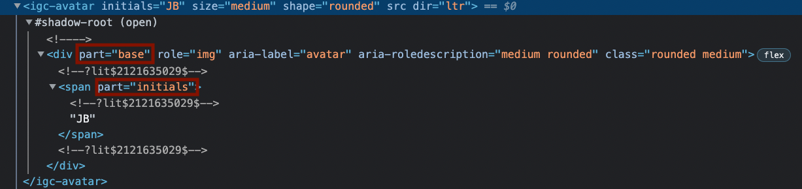

# {ProductName} のコンポーネント スタイルのカスタマイズ

{ProductName} コンポーネントを使用すると、ユーザーは [CSS 変数](https://developer.mozilla.org/en-US/docs/Web/CSS/Using_CSS_custom_properties)と [CSS パーツ](https://developer.mozilla.org/en-US/docs/Web/CSS/::part)を公開することで、スタイル シートのさまざまな部分を変更できます。

## CSS パーツ

このドキュメントの前のセクションで説明したとおり、色、シャドウ、タイポグラフィ、丸み、サイズ、間隔など、コンポーネントのテーマのさまざまな部分をカスタマイズする方法とは別に、各コンポーネントの特定の部分をターゲットにすることによってスタイル シートの特定のセクションを上書きすることもできます。すべてのコンポーネントは、コンポーネント用に内部的に定義された既存のスタイルを追加またはオーバーライドできるさまざまな CSS パーツを公開します。

コンポーネントが公開する部分は、各コンポーネントの API ドキュメントで確認できます。それとも、選択したブラウザーの「インスペクター」インターフェイスを使用していつでも見つけることができます。
たとえば、アバターが公開しているパーツを見つけたい場合は、ブラウザーでコンポーネントを右クリックし、(Chrome の場合) [検証] をクリックします。これにより、Web インスペクターが開き、エレメント エクスプローラー タブにカスタム エレメント マークアップが表示されます。以下のスクリーンショットのようなものが表示されるはずです。



`Avatar` は、アバターのタイプに応じて、`base`、`icon`、`image`、`initials` の 4 つの部分を公開することに気付くでしょう。これらのパーツを使用すると、スコープ内で定義されたスタイルを上書きできます。

したがって、イニシャルの色をパレットの原色に変更したい場合は、次のように `base` または `initials` の色プロパティを上書きできます:

```css
igc-avatar::part(base) {
    color: hsl(var(--ig-primary-500));
}
```

同じアプローチを使用して、 `base` パーツまたは他のコンポーネントの他のパーツのプロパティを変更または追加できます。

## CSS 変数

別のアプローチは、コンポーネントのスタイリングのさまざまな部分を担当する CSS 変数を変更することです。便利なことに、アバターは既存のパレットの変数を使用してイニシャルのスタイルを設定します。詳しく調べると、色変数が `--ig-gray-800` であることがわかります。アバターのスコープでこの変数の値を変更すると、イニシャルの色も変更できます。

```css
igc-avatar {
    --ig-gray-800: 212deg, 72%, 48%;
}
```

`--ig-gray-800` 変数の値を書き換えると、color プロパティを明示的に上書きすることなく、前の例と同じことが行われます。このアプローチは機能しますが、色のプロパティを単独で調べると、色がどこから来ているのかを追跡するのが少し混乱する可能性があります。そのため、base パーツの color プロパティを上書きすることをお勧めします。


## まとめ

CSS パーツと CSS 変数について学び、ドキュメントに記載されている他の方法と組み合わせることで、すべてのコンポーネントの外観を好みに合わせて調整できるようになります。

## API メンバー

 - `ConfigureTheme`